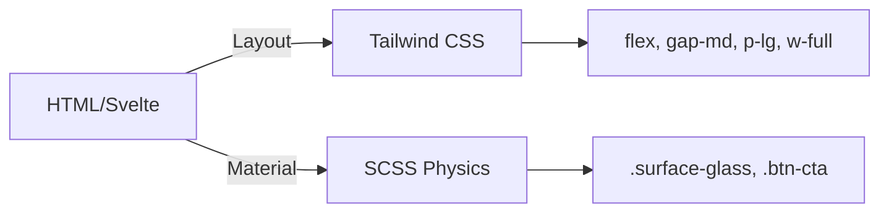
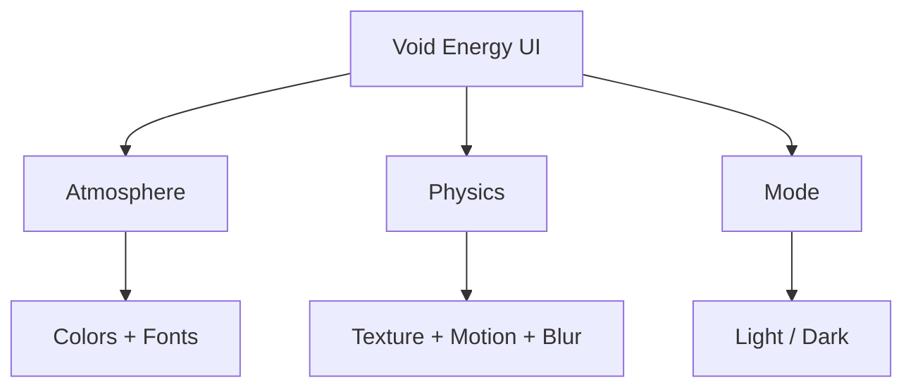

# 📘 Void Energy UI — Developer Cheat Sheet

> **Quick Reference Guide** for developers working with the Void Energy UI design system.

---

## Table of Contents

1. [Architectural Constitution](#1-architectural-constitution)
2. [The Triad (Context Engine)](#2-the-triad-context-engine)
3. [Responsive & Spacing (Density Engine)](#3-responsive--spacing-density-engine)
4. [Component Catalog](#4-component-catalog)
5. [Mixin Reference](#5-mixin-reference)
6. [Quick Patterns (Copy-Paste)](#6-quick-patterns-copy-paste)

---

## 1. Architectural Constitution

### The Hybrid Protocol (Separation of Concerns)

The Void Energy UI separates **Layout** (Geometry) from **Material** (Physics).



#### Rules

| Layer        | Technology | Responsibility            | Examples                                             |
| ------------ | ---------- | ------------------------- | ---------------------------------------------------- |
| **Layout**   | Tailwind   | Geometry, Spacing, Sizing | `flex`, `gap-md`, `p-lg`, `w-full`                   |
| **Material** | SCSS       | Visuals, Physics, States  | `.surface-glass`, `.btn-cta`, `@include glass-float` |

#### ✅ Correct Usage

```svelte
<!-- Layout = Tailwind, Material = SCSS -->
<div class="flex flex-col gap-md p-lg surface-glass">
  <h2 class="text-main">Title</h2>
</div>
```

#### ❌ Incorrect Usage

```scss
/* NEVER put layout rules in SCSS */
.surface-glass {
  width: 300px; /* ❌ Layout bleed */
  margin-bottom: 20px; /* ❌ Layout bleed */
  @include glass-float; /* ✅ OK */
}
```

```svelte
<!-- NEVER put physics rules in inline styles or Tailwind -->
<div style="box-shadow: 0 4px 12px rgba(0,0,0,0.5)">  <!-- ❌ Physics bleed -->
```

---

### The Token Law (No Magic Numbers)

All values must use semantic tokens from [design-tokens.ts](src/config/design-tokens.ts).

#### ✅ Correct Usage

```svelte
<div class="gap-md p-lg">
  <!-- Semantic spacing -->
  <p class="text-main">Content</p>
  <!-- Semantic color -->
</div>
```

```scss
.custom-component {
  padding: var(--space-lg);
  color: var(--text-main);
  border-radius: var(--radius-md);
}
```

#### ❌ Incorrect Usage

```svelte
<div class="gap-[20px] p-[32px]">  <!-- ❌ Magic numbers -->
```

```scss
.custom-component {
  padding: 32px; /* ❌ Magic number */
  color: #ffffff; /* ❌ Hardcoded color */
  border-radius: 8px; /* ❌ Magic number */
}
```

---

### The State Protocol (DOM-Driven State)

State lives in **attributes**, not classes. This ensures CSS transitions trigger correctly via the Physics Engine.

#### ✅ Correct Usage

```svelte
<button data-state="open" aria-pressed="true">Toggle</button>
```

```scss
.dropdown {
  opacity: 0;

  &[data-state='open'] {
    /* ✅ State via attribute */
    opacity: 1;
  }
}
```

#### ❌ Incorrect Usage

```svelte
<button class="active is-open">Toggle</button> <!-- ❌ State via class -->
```

```scss
.dropdown.show {
  /* ❌ State via class */
  opacity: 1;
}
```

---

## 2. The Triad (Context Engine)

The UI is a material that reacts to three environmental variables set on `<html>`.



### 1. Atmosphere (The Soul) — `data-atmosphere`

Defines: **Color Palettes** and **Font Families**

| Atmosphere   | Mood                | Fonts          | Primary Color     |
| ------------ | ------------------- | -------------- | ----------------- |
| `void`       | Tech / Sci-Fi       | Hanken Grotesk | Cyan (#33e2e6)    |
| `onyx`       | Stealth / Cinema    | Inter          | White (#ffffff)   |
| `terminal`   | Retro / Hacker      | Courier Prime  | Amber (#f5c518)   |
| `crimson`    | Horror / Aggressive | Merriweather   | Red (#ff6b6b)     |
| `overgrowth` | Nature / Organic    | Lora           | Green (#39ff14)   |
| `velvet`     | Romance / Soft      | Caveat         | Pink (#ff80a0)    |
| `solar`      | Royal / Gold        | Cinzel         | Gold (#ffaa00)    |
| `nebula`     | Synthwave / Mystery | Exo 2          | Magenta (#d946ef) |
| `paper`      | Light / Print       | PT Serif       | Navy (#2c3e50)    |
| `laboratory` | Clinical / Science  | Open Sans      | Blue (#005bb5)    |
| `playground` | Fun / Kids          | Comic Neue     | Pink (#ff4081)    |
| `focus`      | Distraction Free    | Inter          | Black (#000000)   |

**Usage:**

```html
<html data-atmosphere="void"></html>
```

---

### 2. Physics (The Laws) — `data-physics`

Defines: **Motion**, **Blur**, **Texture**

| Physics | Blur | Borders   | Motion                      | Use Cases                |
| ------- | ---- | --------- | --------------------------- | ------------------------ |
| `glass` | 12px | 1px Glow  | Organic (0.3s cubic-bezier) | Premium UI, Modern Apps  |
| `flat`  | 0px  | 1px Solid | Clean (0.2s ease-out)       | Professional, Accessible |
| `retro` | 0px  | 2px Hard  | Instant (0s steps)          | Retro Games, Terminals   |

**Usage:**

```html
<html data-physics="glass"></html>
```

---

### 3. Mode (The Polarity) — `data-mode`

Defines: **Luminosity** and **Contrast** handling

| Mode    | Background  | Text       |
| ------- | ----------- | ---------- |
| `dark`  | Dark tones  | Light text |
| `light` | Light tones | Dark text  |

**Usage:**

```html
<html data-mode="dark"></html>
```

---

### ⚠️ The Law of Immutability (Physics Constraints)

The Void Engine enforces these rules to prevent broken UI states:

| Constraint                         | Correction              | Reason                                     |
| ---------------------------------- | ----------------------- | ------------------------------------------ |
| `physics="glass"` + `mode="light"` | Forces `physics="flat"` | Glass glows require darkness to be visible |
| `physics="retro"` + `mode="light"` | Forces `mode="dark"`    | CRT phosphor effects require black canvas  |

See [THEME-GUIDE.md](./THEME-GUIDE.md) for details.

---

## 3. Responsive & Spacing (Density Engine)

### A. Breakpoints (Layout Only)

Mobile-first approach with 6 breakpoints.

| Prefix          | Min Width | Target Devices   |
| --------------- | --------- | ---------------- |
| `mobile`        | 0px       | Phones           |
| `tablet`        | 768px     | Tablets          |
| `small-desktop` | 1024px    | Laptops          |
| `large-desktop` | 1440px    | Desktops         |
| `full-hd`       | 1920px    | Full HD displays |
| `quad-hd`       | 2560px    | 4K displays      |

**Usage:**

```svelte
<div class="flex-col tablet:flex-row large-desktop:gap-xl">
  <!-- Stacks on mobile, rows on tablet+ -->
</div>
```

---

### B. Spacing Scale (Harmonic & Dense)

All spacing is dynamic and scales based on user density preference (0.75x - 1.25x).

| Token | Base Size (1x) | Formula | Use Cases                   |
| ----- | -------------- | ------- | --------------------------- |
| `xs`  | 8px            | 0.5rem  | Icon gaps, tight padding    |
| `sm`  | 16px           | 1rem    | Button padding, small gaps  |
| `md`  | 24px           | 1.5rem  | Card padding, standard gaps |
| `lg`  | 32px           | 2rem    | Section padding, large gaps |
| `xl`  | 48px           | 3rem    | Page margins, hero spacing  |
| `2xl` | 64px           | 4rem    | Section dividers            |
| `3xl` | 96px           | 6rem    | Layout spacing              |
| `4xl` | 128px          | 8rem    | Hero sections               |
| `5xl` | 160px          | 10rem   | Mega spacing                |

**Usage:**

```svelte
<div class="gap-md p-lg my-xl">
  <!-- Tailwind utilities -->
  <p>Content</p>
</div>
```

```scss
.custom {
  padding: var(--space-lg); /* SCSS variable */
  gap: var(--space-md);
}
```

---

## 4. Component Catalog

### A. Surfaces (The Skin)

Base surface classes for applying physics.

#### `.surface-glass`

**Description:** Static floating glass (Cards, containers)
**Physics:** Blur, subtle shadow, border glow
**Interactive:** No hover effects

**Usage:**

```svelte
<div class="surface-glass p-lg">
  <p>Static card content</p>
</div>
```

---

#### `.surface-glass-action`

**Description:** Interactive glass (Clickable cards, buttons)
**Physics:** Blur, shadow, border glow
**Interactive:** Lifts on hover, border brightens

**Usage:**

```svelte
<a href="/detail" class="surface-glass-action p-md">
  <h3>Click Me</h3>
</a>
```

---

#### `.surface-sunk`

**Description:** Recessed depth (Inputs, wells, sidebars)
**Physics:** Inset shadow, carved appearance
**Interactive:** Focus ring on `:focus-visible`

**Usage:**

```svelte
<input class="surface-sunk p-sm" type="text" />
```

---

#### `.surface-void`

**Description:** Opaque canvas (Modals, masking overlays)
**Physics:** Solid background, no blur
**Interactive:** None

**Usage:**

```svelte
<div class="surface-void">
  <p>Opaque background</p>
</div>
```

---

### B. Composites (Skin + Bone)

Preset components with built-in layout and physics.

#### `.btn` / `.btn-cta`

**Description:** Interactive buttons with physics states
**`.btn`:** Standard button
**`.btn-cta`:** Call-to-action with rotating gradient border (Gemini Laser)

**Usage:**

```svelte
<button class="btn">Standard Button</button>
<button class="btn-cta">Call to Action</button>
```

---

#### `.dropzone`

**Description:** Dashed sunk surface for file inputs
**Physics:** Dashed border, recessed appearance
**Interactive:** Border brightens on hover

**Usage:**

```svelte
<div class="dropzone flex-center">
  <p>Drop files here</p>
</div>
```

---

#### `.chip`

**Description:** Data chips (Premium, System, Success variants)
**Variants:** `.chip-premium`, `.chip-system`, `.chip-success`

**Usage:**

```svelte
<span class="chip chip-premium">Premium</span>
<span class="chip chip-system">System</span>
<span class="chip chip-success">Active</span>
```

---

### C. Overlays (The Ether)

Floating UI elements with special positioning.

#### `.void-tooltip`

**Description:** Headless floating capsule (Use with Floating UI)
**Physics:** Small surface, high z-index
**Positioning:** Managed by Floating UI library

**Usage:**

```svelte
<div class="void-tooltip" role="tooltip">Tooltip content</div>
```

See [tooltip.ts](src/actions/tooltip.ts) for Svelte action.

---

#### `.toast-message`

**Description:** Notification capsule (Success, Error, Info)
**Variants:** `.toast-success`, `.toast-error`, `.toast-info`
**Physics:** Slides in from edge, auto-dismisses

**Usage:**

```svelte
<div class="toast-message toast-success">
  <p>Success!</p>
</div>
```

See [toast.svelte.ts](src/stores/toast.svelte.ts) for state management.

---

#### `dialog[data-size="..."]`

**Description:** Native modal with materialize animation
**Sizes:** `sm`, `md`, `lg`, `xl`
**Physics:** Fade + scale animation

**Usage:**

```html
<dialog data-size="md" data-state="closed">
  <div class="flex flex-col gap-lg p-xl">
    <h2>Modal Title</h2>
    <p>Modal content</p>
    <button class="btn-cta">Confirm</button>
  </div>
</dialog>
```

See [modal-manager.svelte.ts](src/lib/modal-manager.svelte.ts) for programmatic control.

---

## 5. Mixin Reference

### Surface Mixins

#### `@include glass-float($interactive: false)`

**Purpose:** Floating surface physics (Cards, Modals)
**Context:** Positive Z-Index, floats above the void
**Parameter:** `$interactive` — Set to `true` for clickable elements (lifts on hover)

**Features:**

- Background with blur (if supported)
- Border with physics-driven color
- Box shadow (floats or lifts)
- Smooth transitions

**Usage:**

```scss
.my-card {
  @include glass-float(); // Static card
}

.my-button {
  @include glass-float(true); // Interactive (hover lift)
}
```

---

#### `@include glass-sunk`

**Purpose:** Recessed surface physics (Inputs, Wells)
**Context:** Negative Z-Index, carved into the canvas
**Auto-features:** Focus ring on `:focus-visible`

**Features:**

- Background with sink color
- Inset shadow
- Border color from theme
- Focus state with energy-primary

**Usage:**

```scss
.my-input {
  @include glass-sunk;
}
```

---

#### `@include gemini-laser`

**Purpose:** Rotating gradient border (CTA buttons)
**Visual:** Creates animated rainbow border via `::before` pseudo-element

**Features:**

- Animated conic gradient
- Rotation on hover
- Works with transparent backgrounds

**Usage:**

```scss
.btn-cta {
  @include gemini-laser;
}
```

---

#### `@include text-truncate($lines)`

**Purpose:** Clamp text to N lines with ellipsis
**Parameter:** `$lines` — Number of visible lines

**Usage:**

```scss
.card-description {
  @include text-truncate(3); // Max 3 lines
}
```

---

### State Mixins

#### `@include state-active { ... }`

**Targets:** `[aria-pressed="true"]`, `[data-state="active"]`
**Use for:** Toggle buttons, active tabs

**Usage:**

```scss
.my-toggle {
  background: var(--bg-surface);

  @include state-active {
    background: var(--energy-primary);
  }
}
```

---

#### `@include state-open { ... }`

**Targets:** `[data-state="open"]`
**Use for:** Dropdowns, accordions, expanded panels

**Usage:**

```scss
.my-dropdown {
  opacity: 0;
  max-height: 0;

  @include state-open {
    opacity: 1;
    max-height: 500px;
  }
}
```

---

### Typography Mixins

#### `@include typography('scale-name')`

**Scales:** `caption`, `small`, `body`, `h5`, `h4`, `h3`, `h2`, `h1`
**Auto-applies:** font-size (fluid with clamp), line-height, font-weight

**Usage:**

```scss
h2 {
  @include typography('h2');
}

.small-text {
  @include typography('caption');
}
```

---

## 6. Quick Patterns (Copy-Paste)

### A. Standard Page Layout

```svelte
<div class="container flex flex-col gap-md">
  <h1>Page Title</h1>
  <p>Content...</p>
</div>
```

---

### B. Static Glass Card

```svelte
<div class="surface-glass flex flex-col gap-md p-lg">
  <h2 class="text-main">Card Title</h2>
  <p class="text-dim">Description text here.</p>
</div>
```

---

### C. Interactive Glass Card (Clickable)

```svelte
<a href="/detail" class="surface-glass-action flex flex-col gap-sm p-md">
  <h3 class="text-main">Click Me</h3>
  <span class="text-mute">Hover for lift effect</span>
</a>
```

---

### D. Form Input (Sunk Surface)

```svelte
<input
  type="text"
  class="w-full p-sm surface-sunk text-main"
  placeholder="Enter text..."
/>
```

---

### E. CTA Button with Laser Border

```svelte
<button class="btn-cta px-lg py-md">
  <span>Take Action</span>
</button>
```

---

### F. Modal Dialog

```html
<dialog data-size="md" data-state="closed">
  <div class="flex flex-col gap-lg p-xl">
    <h2>Modal Title</h2>
    <p>Content here</p>
    <div class="flex gap-md">
      <button class="btn">Cancel</button>
      <button class="btn-cta">Confirm</button>
    </div>
  </div>
</dialog>
```

---

### G. Truncated Text Card

```svelte
<div class="surface-glass p-md flex flex-col gap-sm">
  <h4 class="text-main">Article Title</h4>
  <p class="text-dim truncate-3-lines">
    Long description that will be clamped to 3 lines with an ellipsis at the
    end...
  </p>
</div>
```

```scss
.truncate-3-lines {
  @include text-truncate(3);
}
```

---

### H. Toast Notification (Programmatic)

```typescript
import { toast } from '$lib/stores/toast.svelte';

// Basic toasts (auto-dismiss after 4s)
toast.show('Operation completed!', 'success');
toast.show('Something went wrong.', 'error');
toast.show('FYI: System update available.', 'info');
toast.show('Careful here!', 'warning');

// Loading toast with controller (persists until resolved)
const loader = toast.loading('Processing...');
loader.update('Step 2 of 3...'); // Update message
loader.success('Done!'); // Transition to success
// or: loader.error('Failed!');
// or: loader.close();                  // Close without transition

// Promise wrapper (automatic loading → success/error)
await toast.promise(fetchData(), {
  loading: 'Fetching data...',
  success: 'Data loaded!',
  error: 'Failed to load data',
});

// With dynamic messages
await toast.promise(saveItems(items), {
  loading: 'Saving...',
  success: (result) => `Saved ${result.count} items`,
  error: (err) => `Error: ${err.message}`,
});
```

---

### I. Grid Layout with Responsive Columns

```svelte
<div
  class="grid grid-cols-1 tablet:grid-cols-2 large-desktop:grid-cols-3 gap-md"
>
  <div class="surface-glass p-md">Item 1</div>
  <div class="surface-glass p-md">Item 2</div>
  <div class="surface-glass p-md">Item 3</div>
</div>
```

---

## 📚 Related Documentation

- **[THEME-GUIDE.md](./THEME-GUIDE.md)** — How to create custom themes
- **[CONTRIBUTING.md](./CONTRIBUTING.md)** — Contribution guidelines
- **[README.md](./README.md)** — Project overview and architecture

---

## 🛠️ Source Files

- **Tokens:** [src/config/design-tokens.ts](src/config/design-tokens.ts)
- **Global Styles:** [src/styles/global.scss](src/styles/global.scss)
- **Mixins:** [src/styles/abstracts/\_mixins.scss](src/styles/abstracts/_mixins.scss)
- **Components:** [src/styles/components/](src/styles/components/)
