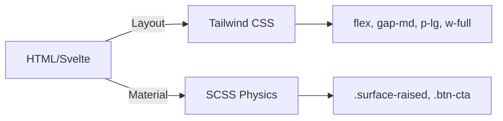
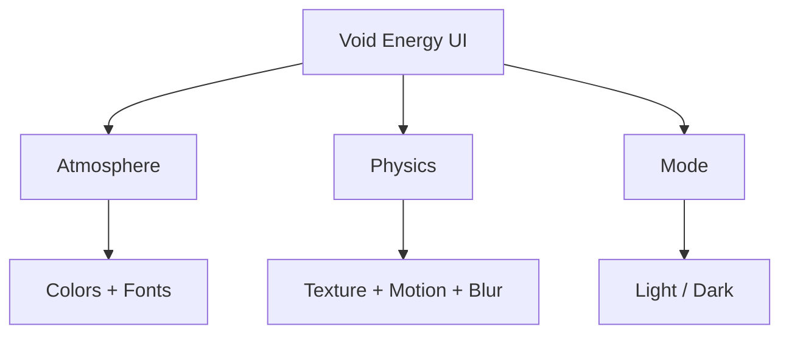

# 📘 Void Energy UI — Developer Cheat Sheet

> **Quick Reference Guide** for developers working with the Void Energy UI design system.

---

## Table of Contents

1. [Architectural Constitution](#1-architectural-constitution)
2. [The Triad (Context Engine)](#2-the-triad-context-engine)
3. [Responsive & Spacing (Density Engine)](#3-responsive--spacing-density-engine)
   - [Base Inline Text Semantics](#d-base-inline-text-semantics)
   - [Base Prose & Lists](#e-base-prose--lists)
   - [Base Tables](#f-base-tables)
   - [Form Element Enhancements](#g-form-element-enhancements)
   - [Media & Interactive Elements](#h-media--interactive-elements)
   - [Global Treatments](#i-global-treatments)
   - [Container Queries](#j-container-queries)
4. [Component Catalog](#4-component-catalog)
   - [Coverage Model](#coverage-model)
   - [Surfaces](#a-surfaces-the-skin)
   - [Composites](#b-composites-skin--bone)
   - [Overlays](#c-overlays-the-ether)
   - [Gestures](#d-gestures)
   - [Icons](#e-icons)
   - [Effects](#f-effects)
   - [Narrative Effects](#narrative-effects-post-reveal-text-animations)
   - [State Patterns](#g-state-patterns)
   - [Charts & Data Visualization](#h-charts--data-visualization)
5. [Mixin Reference](#5-mixin-reference)
6. [Quick Patterns (Copy-Paste)](#6-quick-patterns-copy-paste)
7. [Svelte Actions](#7-svelte-actions)
8. [Timing Utilities](#8-timing-utilities)
9. [Svelte Transitions](#9-svelte-transitions)

---

## 1. Architectural Constitution

### The Hybrid Protocol (Separation of Concerns)

The Void Energy UI separates **Composition Layout** from **Material + Shipped Primitive Geometry**.


```mermaid
graph LR
    A[HTML/Svelte] -->|Layout| B[Tailwind CSS]
    A -->|Material| C[SCSS Physics]
    B --> D["flex, gap-md, p-lg, w-full"]
    C --> E[".surface-raised, .btn-cta"]
```

#### Rules

| Layer        | Technology | Responsibility            | Examples                                             |
| ------------ | ---------- | ------------------------- | ---------------------------------------------------- |
| **Layout**   | Tailwind   | Page composition, spacing, responsive structure, consumer-side geometry | `flex`, `gap-md`, `p-lg`, `w-full` |
| **Material** | SCSS       | Visuals, physics, states, token-driven primitive-internal geometry | `.surface-raised`, `.btn-cta`, `@include surface-raised` |

#### Allowed Exceptions

- SCSS may include token-driven geometry when that geometry is part of the shipped primitive behavior and prevents repeated utility boilerplate in every consumer.
- Valid examples: native button/input baselines, primitive-internal alignment, token-driven modal sizing.
- Invalid examples: one-off page sections, arbitrary layout wrappers, raw geometry values that bypass tokens.

#### ✅ Correct Usage

```svelte
<!-- Composition = Tailwind, shipped primitive material/geometry = SCSS -->
<div class="flex flex-col gap-md p-lg surface-raised">
  <h2 class="text-main">Title</h2>
</div>
```

#### ❌ Incorrect Usage

```scss
/* NEVER put arbitrary page/layout rules in SCSS */
.surface-raised {
  width: 300px; /* ❌ Arbitrary layout bleed */
  margin-bottom: 20px; /* ❌ Arbitrary layout bleed */
  @include surface-raised; /* ✅ OK */
}
```

```svelte
<!-- NEVER put physics rules in inline styles or Tailwind -->
<div style="box-shadow: 0 4px 12px rgba(0,0,0,0.5)">  <!-- ❌ Physics bleed -->
```

---

### The Token Law (No Magic Numbers)

All values must use semantic tokens from [design-tokens.ts](src/config/design-tokens.ts).

#### ✅ Correct Usage

```svelte
<div class="gap-md p-lg">
  <!-- Semantic spacing -->
  <p class="text-main">Content</p>
  <!-- Semantic color -->
</div>
```

```scss
.custom-component {
  padding: var(--space-lg);
  color: var(--text-main);
  border-radius: var(--radius-base);
}
```

#### ❌ Incorrect Usage

```svelte
<div class="gap-[20px] p-[32px]">  <!-- ❌ Magic numbers -->
```

```scss
.custom-component {
  padding: 32px; /* ❌ Magic number */
  color: #ffffff; /* ❌ Hardcoded color */
  border-radius: 8px; /* ❌ Magic number */
}
```

---

### The State Protocol (DOM-Driven State)

State lives in **attributes**, not classes. This ensures CSS transitions trigger correctly via the Physics Engine.

#### ✅ Correct Usage

```svelte
<button data-state="open" aria-pressed="true">Toggle</button>
```

```scss
.dropdown {
  opacity: 0;

  &[data-state='open'] {
    /* ✅ State via attribute */
    opacity: 1;
  }
}
```

#### ❌ Incorrect Usage

```svelte
<button class="active is-open">Toggle</button> <!-- ❌ State via class -->
```

```scss
.dropdown.show {
  /* ❌ State via class */
  opacity: 1;
}
```

---

## 2. The Triad (Context Engine)

The UI is a material that reacts to three environmental variables set on `<html>`.


```mermaid
graph TD
    A[Void Energy UI] --> B[Atmosphere]
    A --> C[Physics]
    A --> D[Mode]
    B --> E[Colors + Fonts]
    C --> F[Texture + Motion + Blur]
    D --> G[Light / Dark]
```

### 1. Atmosphere (The Soul) — `data-atmosphere`

Defines: **Color Palettes** and **Font Families**

| Atmosphere   | Mood                | Fonts          | Primary Color     |
| ------------ | ------------------- | -------------- | ----------------- |
| `void`       | Tech / Sci-Fi       | Hanken Grotesk | Cyan (#33e2e6)    |
| `onyx`       | Stealth / Cinema    | Inter          | White (#ffffff)   |
| `terminal`   | Retro / Hacker      | Courier Prime  | Amber (#f5c518)   |
| `crimson`    | Horror / Aggressive | Merriweather   | Red (#ff6b6b)     |
| `overgrowth` | Nature / Organic    | Lora           | Green (#39ff14)   |
| `velvet`     | Romance / Soft      | Caveat         | Pink (#ff80a0)    |
| `solar`      | Royal / Gold        | Cinzel         | Gold (#ffaa00)    |
| `nebula`     | Synthwave / Mystery | Exo 2          | Magenta (#d946ef) |
| `paper`      | Light / Print       | PT Serif       | Navy (#2c3e50)    |
| `laboratory` | Clinical / Science  | Open Sans      | Blue (#005bb5)    |
| `playground` | Fun / Kids          | Comic Neue     | Pink (#ff4081)    |
| `focus`      | Distraction Free    | Inter          | Black (#000000)   |

**Usage:**

```html
<html data-atmosphere="void"></html>
```

---

### 2. Physics (The Laws) — `data-physics`

Defines: **Motion**, **Blur**, **Texture**

| Physics | Blur | Borders   | Motion                      | Use Cases                |
| ------- | ---- | --------- | --------------------------- | ------------------------ |
| `glass` | 20px | 1px Glow  | Organic (0.3s cubic-bezier) | Premium UI, Modern Apps  |
| `flat`  | 0px  | 1px Solid | Clean (0.2s ease-out)       | Professional, Accessible |
| `retro` | 0px  | 2px Hard  | Instant (0s steps)          | Retro Games, Terminals   |

**Usage:**

```html
<html data-physics="glass"></html>
```

---

### 3. Mode (The Polarity) — `data-mode`

Defines: **Luminosity** and **Contrast** handling

| Mode    | Background  | Text       |
| ------- | ----------- | ---------- |
| `dark`  | Dark tones  | Light text |
| `light` | Light tones | Dark text  |

**Usage:**

```html
<html data-mode="dark"></html>
```

---

### ⚠️ The Law of Immutability (Physics Constraints)

The Void Engine enforces these rules to prevent broken UI states:

| Constraint                         | Correction              | Reason                                     |
| ---------------------------------- | ----------------------- | ------------------------------------------ |
| `physics="glass"` + `mode="light"` | Forces `physics="flat"` | Glass glows require darkness to be visible |
| `physics="retro"` + `mode="light"` | Forces `mode="dark"`    | CRT phosphor effects require black canvas  |

See [THEME-GUIDE.md](./THEME-GUIDE.md) for details.

---

### Browser Chrome Integration — `<meta name="theme-color">`

The browser's address bar and system chrome automatically tint to match the active atmosphere. The color is resolved via `resolveThemeColor()` in `void-boot.js`: it checks `palette['bg-canvas']` first (runtime themes with full palettes), then falls back to the `canvas` field (built-in static registry entries in [void-registry.json](src/config/void-registry.json)).

**How it works:**
1. **SSR** — `Layout.astro` renders a static `<meta name="theme-color" content="#010020">` (the `void` default)
2. **Hydration** — The bootloader (`void-boot.js`) immediately updates the meta tag to match the resolved theme
3. **Runtime** — `VoidEngine._applyAtmosphere()` updates reactive state synchronously, then paints the DOM via View Transitions (or immediately if unsupported)

No manual intervention needed. Built-in themes use their `canvas` registry field; custom runtime themes that include a `bg-canvas` palette entry also get theme-color support automatically.

---

## 3. Responsive & Spacing (Density Engine)

### A. Breakpoints (Layout Only)

Mobile-first approach with 6 breakpoints.

| Prefix          | Min Width | Target Devices   |
| --------------- | --------- | ---------------- |
| `mobile`        | 0px       | Phones           |
| `tablet`        | 768px     | Tablets          |
| `small-desktop` | 1024px    | Laptops          |
| `large-desktop` | 1440px    | Desktops         |
| `full-hd`       | 1920px    | Full HD displays |
| `quad-hd`       | 2560px    | 4K displays      |

**Usage:**

```svelte
<div class="flex-col tablet:flex-row large-desktop:gap-xl">
  <!-- Stacks on mobile, rows on tablet+ -->
</div>
```

---

### B. Spacing Scale (Harmonic & Dense)

All spacing is dynamic and scales based on user density preference (0.75x - 1.25x).

| Token | Base Size (1x) | Formula | Use Cases                   |
| ----- | -------------- | ------- | --------------------------- |
| `xs`  | 8px            | 0.5rem  | Icon gaps, tight padding    |
| `sm`  | 16px           | 1rem    | Button padding, small gaps  |
| `md`  | 24px           | 1.5rem  | Card padding, standard gaps |
| `lg`  | 32px           | 2rem    | Section padding, large gaps |
| `xl`  | 48px           | 3rem    | Page margins, hero spacing  |
| `2xl` | 64px           | 4rem    | Section dividers            |
| `3xl` | 96px           | 6rem    | Layout spacing              |
| `4xl` | 128px          | 8rem    | Hero sections               |
| `5xl` | 160px          | 10rem   | Mega spacing                |

**Usage:**

```svelte
<div class="gap-md p-lg my-xl">
  <!-- Tailwind utilities -->
  <p>Content</p>
</div>
```

```scss
.custom {
  padding: var(--space-lg); /* SCSS variable */
  gap: var(--space-md);
}
```

---

### B.1. Spacing Philosophy & Mathematical Reasoning

#### Why 4px as the Base Unit?

The Void Energy UI uses **4px (0.25rem)** as the foundational unit for all spacing calculations.

**Technical Justification:**

1. **Pixel-Perfect Rendering**
   - All modern displays render in whole pixels
   - 4px aligns perfectly with pixel grids, preventing subpixel antialiasing artifacts
   - Ensures crisp edges on all components across all screen densities

2. **WCAG Compliance**
   - Minimum touch target size: 44px (WCAG 2.1 Level AAA)
   - 44px ÷ 4px = 11 (perfect divisibility, no fractional pixels)
   - All interactive elements built from this base meet accessibility standards

3. **Mathematical Harmony**
   - 4 = 2² (powers of 2 create natural visual rhythm)
   - Enables proportional scaling without rounding errors
   - Aligns with CSS rem system (1rem = 16px = 4 × 4px)

4. **Industry Standard**
   - Used by Material Design (8px grid, but often subdivides to 4px)
   - iOS Human Interface Guidelines (4pt base for spacing)
   - Tailwind CSS (0.25rem = 4px base unit)

---

#### The Dual-Speed Progression

Our spacing scale uses **two different progression strategies** for different use cases:

**🎯 Component Level (xs → lg): Tight Progression**

```
xs:   8px  (×2)  ← Minimal gap
sm:   16px (×4)  ← Doubles from xs
md:   24px (×6)  ← +8px step (optimal card padding)
lg:   32px (×8)  ← Doubles from sm (section padding)
```

**Why tight progression?**

- Fine-grained control for UI components (buttons, cards, inputs)
- Small 8px increments allow precise visual tuning
- Prevents "spacing jumps" that feel unnatural in compact layouts

**📐 Layout Level (xl → 5xl): Accelerated Progression**

```
lg:   32px  (×8)   ← Foundation
xl:   48px  (×12)  ← Golden Ratio jump (32 × 1.5)
2xl:  64px  (×16)  ← Double lg (visual "block")
3xl:  96px  (×24)  ← Triple lg (layout spacing)
4xl:  128px (×32)  ← Quadruple lg (hero sections)
5xl:  160px (×40)  ← Quintuple lg (mega spacing)
```

**Why accelerated progression?**

- Large whitespace areas benefit from dramatic jumps
- Creates clear visual hierarchy between sections
- Prevents too many similar spacing values (reduces decision fatigue)

---

#### The "Magic Numbers" Explained

Each spacing value was chosen for specific ergonomic and mathematical reasons:

| Token   | Value | Why This Exact Number?                                                                                                                                               |
| ------- | ----- | -------------------------------------------------------------------------------------------------------------------------------------------------------------------- |
| **xs**  | 8px   | **Minimum comfortable gap** - Smallest spacing that feels intentional, not cramped. Used for icon gaps, chip spacing, tight padding.                                 |
| **sm**  | 16px  | **Industry standard** - 1rem (default font-size). Universal button padding in Material Design, Bootstrap, Tailwind. Most familiar value to developers.               |
| **md**  | 24px  | **Optimal card padding** - 1.5rem. Most popular card padding value across all design systems (Material, Ant Design, Chakra UI). Balances density and breathing room. |
| **lg**  | 32px  | **Typographic baseline** - 2rem. Divisible by 16px (standard font-size). Creates strong visual sections. Foundation for larger spacing values.                       |
| **xl**  | 48px  | **Golden Ratio step** - 32 × 1.5 ≈ 48 (3rem). Classic "large step" in typography. Creates harmonious jump from lg without feeling too aggressive.                    |
| **2xl** | 64px  | **Visual block unit** - 32 × 2 (4rem). Natural doubling from lg. Perfect for section dividers, major layout boundaries.                                              |
| **3xl** | 96px  | **Layout rhythm** - 32 × 3 (6rem). Matches typographic modular scales. Used for separating distinct page sections.                                                   |
| **4xl** | 128px | **Hero spacing** - 32 × 4 (8rem). Dramatic spacing for landing pages, hero sections. Creates strong visual impact.                                                   |
| **5xl** | 160px | **Mega whitespace** - 32 × 5 (10rem). Largest spacing value for expansive hero areas, full-bleed sections.                                                           |

---

#### Density Engine: Dynamic Scaling

All spacing values **multiply by a density factor** to respect user preferences:

```scss
// Implementation in /src/styles/base/_reset.scss
:root {
  --unit: 0.25rem; // 4px base
  --density: 1; // Default (user-configurable: 0.75 / 1 / 1.25)

  // Example: md spacing
  --space-md: calc(6 * var(--unit) * var(--density, 1));
  //               ↑     ↑            ↑
  //            24px   4px         scaling factor
}
```

**Density Factors:**

| Setting                | Factor | md Example | Use Case                                         |
| ---------------------- | ------ | ---------- | ------------------------------------------------ |
| **High** (Compact)     | 0.75x  | 18px       | Power users, dense information displays          |
| **Standard** (Default) | 1x     | 24px       | Balanced spacing for most users                  |
| **Low** (Relaxed)      | 1.25x  | 30px       | Accessibility, motor disabilities, large screens |

**Accessibility Benefits:**

- ✅ **Motor disabilities**: Larger spacing = easier touch/click targets
- ✅ **Visual disabilities**: More breathing room improves scannability
- ✅ **Cognitive disabilities**: Consistent spacing reduces cognitive load

**Implementation:**

- User sets preference via UI (`voidEngine.setDensity('low')`)
- CSS variable `--density` updates globally
- All components automatically reflow (no code changes needed)
- Proportions remain consistent (ratio between xs/sm/md/lg stays identical)

---

### C. Safe Area Insets (Edge-to-Edge Viewport)

Modern devices with notches, dynamic islands, and gesture navigation bars render content behind system UI. The layout uses `viewport-fit=cover` and exposes browser-provided safe area insets as CSS custom properties.

**Source:** [src/styles/base/\_reset.scss](src/styles/base/_reset.scss) (`:root` block)

#### Tokens

| Token | Source | Fallback | Description |
| --- | --- | --- | --- |
| `--safe-top` | `env(safe-area-inset-top)` | `0px` | Status bar / Dynamic Island |
| `--safe-bottom` | `env(safe-area-inset-bottom)` | `0px` | Home indicator / gesture bar |
| `--safe-left` | `env(safe-area-inset-left)` | `0px` | Landscape notch (left) |
| `--safe-right` | `env(safe-area-inset-right)` | `0px` | Landscape notch (right) |

On non-notched devices, all values resolve to `0px` — zero visual impact.

#### Built-in Integration

These components already account for safe areas (no manual work needed):

| Component | Safe Area Handling |
| --- | --- |
| **Nav bar** (`.nav-bar`) | Desktop (≥ 1024px): extends glass surface under status bar via `--safe-top`. Touch (< 1024px): floating island offset by `--safe-top`; landscape-aware inset via `--safe-left`/`--safe-right` |
| **Bottom nav** (`.bottom-nav`) | Offsets above home indicator via `--safe-bottom`; landscape-aware width via `--safe-left`/`--safe-right` |
| **Nav menu** (`.nav-menu`) | Padding respects `--safe-right` (and `--safe-left` on mobile) |
| **Toasts** (`.toast-region`) | Top offset includes `--safe-top`; width avoids landscape notch |
| **Full-size dialogs** (`dialog[data-size="full"]`) | Dimensions account for all four safe area insets |
| **Page sidebar toggle** (`.page-sidebar-toggle-bar`) | Touch (< 1024px): fixed-positioned at the same Y as `.nav-island` corner pills (`top: calc(--safe-top + --space-xs)`); spans the width between corner pills, gap-aware via `--space-xs` and `max(--space-lg, --safe-left/right)`. Desktop (≥ 1024px): in-flow row inside `.page-sidebar-header`. |
| **Breadcrumbs** (`.breadcrumbs`) | Desktop (≥ 1024px): fixed below nav-bar; `top` includes `--safe-top`; hidden offset includes `--nav-height + --safe-top`. Touch (< 1024px): `display: none` — bottom nav and page-sidebar toggle already cover location signaling. |
| **Body** | `padding-top` includes `--safe-top` (+ `--breadcrumbs-height` when breadcrumbs present — automatically zeroed on touch via the `--breadcrumbs-height: 0px` override in `_reset.scss`); `padding-bottom` uses `--bottom-nav-clearance` on touch (< 1024px) |

#### Usage in Custom Components

Use the safe area tokens when positioning fixed/absolute elements near screen edges:

```scss
.my-fixed-footer {
  position: fixed;
  bottom: calc(var(--space-sm) + var(--safe-bottom));
  // Use max() to pick the larger of design spacing vs safe area:
  padding-left: max(var(--space-lg), var(--safe-left));
  padding-right: max(var(--space-lg), var(--safe-right));
}
```

---

#### Alignment with Tailwind CSS

Our spacing scale is **100% compatible** with Tailwind CSS:

| Void Energy         | Tailwind          | Value | Notes                   |
| ------------------- | ----------------- | ----- | ----------------------- |
| `gap-xs` / `p-xs`   | `gap-2` / `p-2`   | 8px   | Tailwind's `2` = 0.5rem |
| `gap-sm` / `p-sm`   | `gap-4` / `p-4`   | 16px  | Tailwind's `4` = 1rem   |
| `gap-md` / `p-md`   | `gap-6` / `p-6`   | 24px  | Tailwind's `6` = 1.5rem |
| `gap-lg` / `p-lg`   | `gap-8` / `p-8`   | 32px  | Tailwind's `8` = 2rem   |
| `gap-xl` / `p-xl`   | `gap-12` / `p-12` | 48px  | Tailwind's `12` = 3rem  |
| `gap-2xl` / `p-2xl` | `gap-16` / `p-16` | 64px  | Tailwind's `16` = 4rem  |
| `gap-3xl` / `p-3xl` | `gap-24` / `p-24` | 96px  | Tailwind's `24` = 6rem  |

**Why this alignment matters:**

- ✅ Developers familiar with Tailwind can transfer knowledge instantly
- ✅ Easy integration with Tailwind utilities (we use Tailwind for layout)
- ✅ Large ecosystem of examples, tutorials, and best practices
- ✅ Reduces learning curve for new contributors

---

#### Quick Reference: When to Use Each Value

| Spacing          | Common Use Cases                                          | Visual Weight    |
| ---------------- | --------------------------------------------------------- | ---------------- |
| **xs** (8px)     | Icon gaps, chip spacing, tight list items, compact tables | Minimal          |
| **sm** (16px)    | Button padding, input padding, small card gaps            | Light            |
| **md** (24px)    | Card padding, modal padding, standard gaps                | Medium (Default) |
| **lg** (32px)    | Section padding, container padding, large gaps            | Strong           |
| **xl** (48px)    | Page margins, hero padding, dramatic gaps                 | Very Strong      |
| **2xl** (64px)   | Section dividers, major layout boundaries                 | Dramatic         |
| **3xl+** (96px+) | Hero sections, landing pages, full-bleed content          | Mega             |

---

#### Examples

**Compact Button (sm padding):**

```svelte
<button class="btn p-sm">Click Me</button>
<!-- 16px padding = comfortable but not wasteful -->
```

**Standard Card (md padding):**

```svelte
<div class="surface-raised p-md">
  <h3>Card Title</h3>
  <p>Card content with optimal 24px breathing room.</p>
</div>
```

**Hero Section (xl+ padding):**

```svelte
<section class="py-4xl px-xl">
  <h1>Welcome to Void Energy</h1>
  <!-- Vertical: 128px, Horizontal: 48px = Dramatic impact -->
</section>
```

---

**📚 Related Documentation:**

- **Implementation**: [/src/styles/base/\_reset.scss:9-79](./src/styles/base/_reset.scss) (Density Engine)
- **Token Definitions**: [/src/config/design-tokens.ts:20-66](./src/config/design-tokens.ts) (Spacing scale)
- **Tailwind Integration**: [src/styles/tailwind-theme.css](./src/styles/tailwind-theme.css) (v4 `@theme` bridge, spacing utilities, namespace resets)

---

### D. Base Inline Text Semantics

Base styling for native HTML inline elements. These render correctly anywhere — inside `<p>`, `<li>`, `<td>`, `<blockquote>`, etc. — with zero classes required.

**Source:** [src/styles/base/\_typography.scss](src/styles/base/_typography.scss) (section 7)

| Element | Visual Treatment | Physics Differentiation |
| --- | --- | --- |
| `<mark>` | Energy-colored highlight, tight inline padding | Glass: alpha'd glow. Light: softer tint. Retro: inverted (energy bg + canvas text) |
| `<del>`, `<s>` | Line-through, muted color | None |
| `<ins>` | Success-colored underline, dim text | Underline thickness scales with `--physics-border-width` |
| `<sub>`, `<sup>` | 0.75em, positioned relative — does NOT disrupt parent line-height | None |
| `<abbr title="...">` | Dotted underline, `cursor: help` | None |
| `<q>` | Italic, energy-secondary quote marks via `::before`/`::after` | None |
| `<cite>` | Italic, muted color | None |
| `<dfn>` | Italic, semibold, main color | None |
| `<code>` | Monospace, recessed surface (`--bg-sunk`), tight padding | Light: darker bg fallback |
| `<kbd>` | Monospace, raised key cap surface, 3D bottom border | Retro: flat uniform border |
| `<samp>` | Monospace, dim color, no surface | None |
| `<var>` | Monospace, italic, energy-primary color | None |

**Usage:** Just write semantic HTML — no classes needed.

```html
<p>This is <mark>highlighted</mark> and <del>deleted</del> and <ins>inserted</ins>
and H<sub>2</sub>O and E=mc<sup>2</sup> and <abbr title="Cascading Style Sheets">CSS</abbr>
and <q>quoted</q> and <cite>Moby Dick</cite> and the <dfn>definition</dfn>.</p>
```

---

### E. Base Prose & Lists

Block-level prose elements and an opt-in `.prose` scope class for list markers.

**Source:** [src/styles/base/\_prose.scss](src/styles/base/_prose.scss)

#### `<blockquote>` — Statement Quotation

Physics-differentiated left border treatment. Uses logical properties (`border-inline-start`) for RTL support.

| Physics | Visual |
| --- | --- |
| **Glass** | Energy-primary left border + inset glow box-shadow |
| **Flat** | Solid energy-primary left border |
| **Retro** | Double border, thicker width |
| **Light mode** | Adds faint energy-primary background tint |

**Nesting:** Nested blockquotes drop to `--energy-secondary` border color.
**Attribution:** `<footer>` or `<cite>` direct children render as em-dash-prefixed muted attribution lines.

```html
<blockquote>
  <p>Design is not just what it looks like. Design is how it works.</p>
  <footer>Steve Jobs</footer>
</blockquote>
```

#### `<figure>` / `<figcaption>` — Media Wrapper

`<figure>` resets browser margin. `<figcaption>` renders as small, muted, italic caption text.

```html
<figure>
  
  <figcaption>Figure 1: High-level system overview</figcaption>
</figure>
```

#### `<address>` — Contact Information

Removes browser italic default. Uses `--text-dim` color.

#### `.prose` — Opt-in Rich Text Container

Enables list markers and definition list formatting inside a scoped wrapper. Required because the global reset strips `list-style: none` from all `<ul>`/`<ol>` (protecting nav menus and component lists).

**Complements `.legal-content`** (legal-specific counters) — `.prose` is general-purpose for blogs, markdown, and user content.

**List marker progression:**

| List Type | Level 1 | Level 2 | Level 3 | Retro Override |
| --- | --- | --- | --- | --- |
| `<ul>` | disc | circle | square | `- ` → `> ` → `* ` |
| `<ol>` | decimal | lower-alpha | lower-roman | *(same)* |

**Marker color:** `--energy-primary` for all list types. `<ol>` markers also get `--font-weight-semibold`.

**Definition lists** (`<dl>`/`<dt>`/`<dd>`): `<dt>` renders semibold in `--text-main`, `<dd>` indented in `--text-dim`.

**Usage:**

```html
<div class="prose">
  <ul>
    <li>First item</li>
    <li>Second item
      <ul>
        <li>Nested item</li>
      </ul>
    </li>
  </ul>

  <ol>
    <li>Step one</li>
    <li>Step two</li>
  </ol>

  <dl>
    <dt>Term</dt>
    <dd>Definition of the term</dd>
  </dl>
</div>
```

#### `.prose-untrusted` — UGC Quarantine Container

Defensive scope for foreign HTML the application does not author: rich-text-editor output, embedded third-party blocks, markdown rendered from user input. Pairs with `.prose` (trusted) — use `.prose-untrusted` for content the app does **not** control.

**Scope guarantees:**

| Concern | Defense |
| --- | --- |
| Inheritable property leak (font, color, line-height) | Re-anchored at the scope root to `--font-body`, `--text-dim`, `--line-height-body` |
| Layout break-out (foreign out-of-flow content perturbing ancestor layout) | `contain: layout style` + `isolation: isolate` |
| Oversized media (`` / `<video>` / `<iframe>` / `<svg>`) | `max-width: 100% !important; height: auto !important` |
| Runaway tables | `display: block; max-width: 100%; overflow-x: auto` (all `!important`) |
| Long unbroken strings (URLs, hashes) | `overflow-wrap: anywhere; word-break: break-word` |
| Foreign `!important` in unlayered `<style>` tags | Beaten by our layered `!important` (cascade-layer priority) |
| Stripped list markers (foreign HTML expects them) | Restored: `<ul>` disc, `<ol>` decimal, native indent |

**What it does NOT do:**

- **No HTML sanitization.** Strip `<script>`, `<style>`, event handlers, and dangerous URL schemes via DOMPurify or trusted-types **before** rendering inside this scope.
- **No defense against inline `style="…"`** on foreign elements. The CSS specificity hierarchy explicitly grants inline styles priority — that is by design. Sanitize attributes the application does not need.
- **No content transformation.** No filtering, tinting, desaturation, or pixel modification. The scope wraps and selects; it never touches pixels.

**Usage:**

```svelte
<script>
  import DOMPurify from 'isomorphic-dompurify';
  let { userHtml }: { userHtml: string } = $props();
</script>

<div class="prose-untrusted">
  {@html DOMPurify.sanitize(userHtml)}
</div>
```

**HCM (High Contrast Mode):** `<mark>` maps to `Highlight`/`HighlightText`, `<blockquote>` border maps to `ButtonText`.

---

### F. Base Tables

Base styling for native `<table>` elements. No classes required — a raw table looks designed out of the box.

**Source:** [src/styles/base/\_tables.scss](src/styles/base/_tables.scss)

| Element | Visual Treatment |
| --- | --- |
| `<table>` | Full-width, collapsed borders, `tabular-nums`, small font |
| `<caption>` | Bottom-aligned, italic, muted caption (mirrors `<figcaption>`) |
| `<thead> <th>` | Uppercase label convention (caption size, semibold, letter-spaced), double-weight energy-secondary bottom border |
| `<th>`, `<td>` | Density-aware padding, start-aligned, bottom border |
| `<tfoot>` | Medium weight, double-weight top border, no bottom border |
| `<tbody> <tr>` | Hover highlight (gated behind `@media (hover: hover)`) |

**Physics:**

| Physics | Visual |
| --- | --- |
| **Glass** | 8% energy-primary hover glow on rows |
| **Flat** | 5% energy-primary hover tint, clean borders |
| **Retro** | Full grid borders (all four sides on every cell), 15% hover highlight, energy-secondary header background |

**Opt-in classes:**

| Class | Purpose |
| --- | --- |
| `.table-striped` | Alternating even-row backgrounds on `<tbody>` |
| `.table-responsive` | Horizontal scroll wrapper with styled scrollbar |

**Usage:**

```html
<div class="table-responsive">
  <table>
    <caption>Monthly revenue by region</caption>
    <thead>
      <tr><th>Region</th><th>Q1</th><th>Q2</th><th>Q3</th></tr>
    </thead>
    <tbody>
      <tr><td>North</td><td>$12,400</td><td>$15,200</td><td>$14,800</td></tr>
      <tr><td>South</td><td>$9,800</td><td>$11,100</td><td>$10,500</td></tr>
    </tbody>
    <tfoot>
      <tr><td>Total</td><td>$22,200</td><td>$26,300</td><td>$25,300</td></tr>
    </tfoot>
  </table>
</div>
```

---

### G. Form Element Enhancements

Physics-aware enhancements for native form elements. These build on top of the existing input/checkbox/radio styling in [\_inputs.scss](src/styles/components/_inputs.scss).

#### Checkbox & Radio — Physics Enhancement

Native `appearance: auto` is preserved. Physics adds subtle differentiation on top of `accent-color`.

| Physics | Visual |
| --- | --- |
| **Glass** | `drop-shadow` glow on `:checked` state, subtle glow on hover |
| **Flat** | `accent-color` only (no additional treatment) |
| **Retro** | `scale(1.15)` — chunkier controls |

#### Fieldset & Legend — Focus Enhancement

| State | Visual |
| --- | --- |
| Default | Physics border, density-aware padding |
| `:focus-within` | Border turns `--energy-primary`, legend text turns `--energy-primary` |
| `:focus-within` (glass) | Adds outer glow ring |
| Retro | Double-width border for grouping emphasis |

#### `<progress>` — Custom Styled Progress Bar

**Source:** [src/styles/components/\_inputs.scss](src/styles/components/_inputs.scss) (section 11)

Fully custom-styled via `::-webkit-progress-bar`, `::-webkit-progress-value`, `::-moz-progress-bar`. Pill-shaped with `--radius-full`, density-scaled height.

| State | Visual |
| --- | --- |
| Determinate | Energy-primary fill bar, smooth width transition |
| Indeterminate (`<progress>` without `value`) | Shimmer animation across track |

| Physics | Visual |
| --- | --- |
| **Glass** | Glowing fill bar (`box-shadow`) |
| **Flat** | Solid fill, clean edges |
| **Retro** | Squared (no radius), taller, stepped shimmer animation |
| **Light** | Darker track for visibility |

```html
<!-- Determinate -->
<progress value="65" max="100"></progress>

<!-- Indeterminate -->
<progress></progress>
```

#### `<meter>` — Value Meter with Semantic Ranges

**Source:** [src/styles/components/\_inputs.scss](src/styles/components/_inputs.scss) (section 12)

Same dimensions as `<progress>` for consistency. Three semantic color ranges driven by the browser's `low`/`high`/`optimum` attribute logic:

| Range | Color Token |
| --- | --- |
| Optimum | `--color-success` (green) |
| Sub-optimum | `--color-premium` (amber/gold) |
| Danger | `--color-error` (red) |

Physics differentiation matches `<progress>` (glass glow, retro squared, light darker track).

```html
<meter min="0" max="100" low="25" high="75" optimum="80" value="90"></meter>
<meter min="0" max="100" low="25" high="75" optimum="80" value="50"></meter>
<meter min="0" max="100" low="25" high="75" optimum="80" value="10"></meter>
```

#### `<output>` — Computed Value Display

**Source:** [src/styles/components/\_inputs.scss](src/styles/components/_inputs.scss) (section 13)

Styled as a data pill — monospace font, `tabular-nums`, energy-tinted background, pill shape.

| Physics | Visual |
| --- | --- |
| **Glass/Flat** | Energy-primary text, alpha'd energy background pill |
| **Light** | Softer tint, main text color |
| **Retro** | Squared border, transparent background |

```html
<form oninput="result.value = parseInt(a.value) + parseInt(b.value)">
  <input type="range" id="a" value="50"> +
  <input type="number" id="b" value="25"> =
  <output name="result" for="a b">75</output>
</form>
```

#### Date & Time Inputs — Native Pickers

**Source:** [src/styles/components/\_inputs.scss](src/styles/components/_inputs.scss) (section 7)

SCSS-only styling for `<input type="date">`, `<input type="time">`, and `<input type="datetime-local">`. The OS-level calendar/clock popup cannot be styled, but the in-field segments and trigger icon are themed.

| Feature | Treatment |
| --- | --- |
| Picker icon | Browser-native icon, colored via `color-scheme` (dark/light) |
| Segment text | `--font-body`, `--text-main` color |
| Segment focus | Energy-primary alpha'd background highlight |
| Separators | `--text-mute` color |

| Physics | Visual |
| --- | --- |
| **Glass/Flat** | Standard themed segments |
| **Retro** | Squared segment focus (no border-radius) |
| **Light** | `color-scheme: light` auto-adjusts icon color |

```html
<input type="date" />
<input type="time" />
<input type="datetime-local" />
```

No wrapper component needed — use `<FormField>` for label/hint/error wiring.

#### Color Input — Native Swatch

**Source:** [src/styles/components/\_inputs.scss](src/styles/components/_inputs.scss) (section 8)

SCSS-only styling for `<input type="color">`. Strips browser chrome and renders a clean swatch with physics-aware borders.

| Physics | Visual |
| --- | --- |
| **Glass/Flat** | Rounded swatch, 40% alpha border |
| **Retro** | Squared swatch (no border-radius) |
| **Light** | Stronger border (60% alpha) for visibility |

```html
<input type="color" value="#ff5733" />
```

For hex value display and label/hint/error parity, use the `<ColorField>` composite instead.

---

### H. Media & Interactive Elements

Base defaults for media and interactive HTML elements.

**Source:** [src/styles/base/\_reset.scss](src/styles/base/_reset.scss)

| Element | Treatment |
| --- | --- |
| `` | Block, responsive (`max-width: 100%; height: auto`), sunk background, italic alt text fallback |
| `<picture>`, `<video>` | Block, responsive, sunk background |
| `<audio>` | Block, full-width, `accent-color` matches energy-primary |
| `<iframe>` | Block, responsive, physics border + radius, sunk background |
| `<canvas>` | Block, responsive |
| `[popover]` | UA reset (margin, padding, border, inset cleared). Class-based popovers add their own physics on top. |

**The `` alt text trick:** When an image fails to load, `font-style: italic` + `font-size: var(--font-size-small)` + `color: var(--text-mute)` makes the alt text visually distinct from surrounding content.

**Aspect ratios:** Use Tailwind's built-in `aspect-video` (16/9) and `aspect-square` (1/1) utilities. No SCSS duplicates.

---

### I. Global Treatments

System-wide visual treatments applied at the base layer. These are not components — they're global CSS rules that affect all content.

**Source:** [src/styles/base/\_reset.scss](src/styles/base/_reset.scss), [src/styles/base/\_print.scss](src/styles/base/_print.scss), [src/styles/abstracts/\_mixins.scss](src/styles/abstracts/_mixins.scss)

#### `::selection` — Text Selection Highlight

Highlighted text uses the theme's energy-primary color at 25% opacity with `--text-main` for contrast. Adapts across all 12 themes automatically via `color-mix()`.

```scss
::selection {
  background: alpha(var(--energy-primary), 25%);
  color: var(--text-main);
}
```

- **Forced colors:** Overridden to `Highlight` / `HighlightText` in `_accessibility.scss`.
- **Works in both modes:** Dark themes get tinted selection over dark canvas; light themes get tinted selection over light canvas.

#### Scrollbars — Physics-Differentiated (`@include laser-scrollbar`)

Custom scrollbar styling adapts per physics preset. Applied to `html` and reusable via `@include laser-scrollbar` on any scroll container.

| Physics | Thumb | Track | Hover | Edges |
| --- | --- | --- | --- | --- |
| **Glass** | `--energy-secondary` at 50% opacity | Transparent | `--energy-primary` at 75% + glow | Rounded (`--radius-full`) |
| **Flat** | `--energy-secondary` solid | `--bg-sunk` | `--energy-primary` solid | Rounded (`--radius-full`) |
| **Retro** | `--energy-primary` solid | `--bg-sunk` with border | `--energy-secondary` solid | Square (0 radius), double-width |

- **Forced colors:** Defers to `ButtonText` / `Canvas` system colors.
- **Firefox:** `scrollbar-width: thin` (glass/flat) or `auto` (retro); `scrollbar-color` for thumb/track.

#### `@media print` — Print Stylesheet

Comprehensive print optimization. All rules scoped inside `@media print` — zero screen impact.

**Source:** [src/styles/base/\_print.scss](src/styles/base/_print.scss)

| Section | What it does |
| --- | --- |
| Canvas reset | White background, black text, removes all shadows/filters/backdrop-filters |
| Hide chrome | Hides nav, breadcrumbs, sidebar, toasts, dialogs, popovers, pull-indicator, skip-link |
| Typography | Black headings, orphans/widows control, `break-after: avoid` on headings |
| Code blocks | Light gray background (#f5f5f5), 1pt border, pre-wrap |
| Links | External links show href in parentheses via `::after`; internal `#` links don't |
| Media | Hides video/audio/iframe/canvas; images max-width 100% |
| Tables | Collapse borders, repeat `thead` on each page, avoid row breaks |
| Page breaks | Prevents breaks inside images, figures, blockquotes, pre, tables |
| Preserved elements | `<mark>` keeps yellow highlight; `<code>/<kbd>` keeps gray background |

**Testing:** Cmd+P / Ctrl+P → Print Preview. Verify: no nav/sidebar/toast visible, links show URLs, text is black on white.

---

### J. Container Queries

Component-scoped responsive styles based on container width (not viewport width). Infrastructure is ready — no components use container queries yet.

**Source:** [src/styles/tailwind-theme.css](src/styles/tailwind-theme.css) (`--container-*` breakpoint values — container queries are built into Tailwind v4 core, no plugin needed), [src/styles/abstracts/\_mixins.scss](src/styles/abstracts/_mixins.scss) (`container-up` mixin)

#### Container Breakpoints

Smaller than viewport breakpoints by design — components resize before the page does.

| Name | Width | Use Case |
| --- | --- | --- |
| `sm` | 320px | Component minimum (icon grids, narrow chips) |
| `md` | 480px | Small component (basic card layouts) |
| `lg` | 640px | Medium component (two-column form grids) |
| `xl` | 800px | Large component (complex multi-column layouts) |

#### Usage in Tailwind

```svelte
<div class="@container">
  <div class="flex flex-col @md:flex-row gap-md">
    <!-- Switches to row layout when container ≥ 480px -->
  </div>
</div>
```

#### Usage in SCSS

```scss
.my-card {
  container-type: inline-size; // Make this element a container

  .my-card-body {
    @include container-up('md') {
      // Styles applied when .my-card ≥ 480px
    }
  }
}
```

---

## 4. Component Catalog

### Coverage Model

Void Energy is a **native-first** system. Not every common UI pattern is shipped as a dedicated Svelte primitive.

Patterns in this library are delivered in three forms:

| Delivery Mode | What ships | Use when | Examples |
| --- | --- | --- | --- |
| **Reusable Primitive** | A dedicated Svelte component | Behavior is non-trivial, repeated, and worth standardizing | `Dropdown`, `Sidebar`, `Toggle`, `Selector`, `Switcher`, `Tabs`, charts, modals |
| **Native-Styled HTML** | Global styling on semantic elements | The platform already provides the correct semantics and behavior | `<details>`, `<table>`, `<progress>`, `<meter>`, `<audio>`, prose elements |
| **Documented Recipe** | A composition pattern using HTML + Tailwind + existing primitives | The pattern is useful but too app-specific to freeze into a single API | Nav menu, accordion groups via `details[name]`, drawer-like layouts built from `Sidebar` |

**Rule of thumb:** if the browser already provides semantics and the composition stays simple, prefer native HTML over inventing another wrapper component.

The system standardizes shared interaction and accessibility contracts, but deliberately leaves browser-native semantics in place when the platform already provides the right abstraction. A missing wrapper is not, by itself, evidence that a capability is missing from the design system.

### A. Surfaces (The Skin)

Base surface classes for applying physics.

#### `.surface-raised`

**Description:** Static floating surface (Cards, containers)
**Physics:** Blur, subtle shadow, border glow
**Interactive:** No hover effects

**Usage:**

```svelte
<div class="surface-raised p-lg">
  <p>Static card content</p>
</div>
```

---

#### `.surface-raised-action`

**Description:** Interactive floating surface (Clickable cards, buttons)
**Physics:** Blur, shadow, border glow
**Interactive:** Lifts on hover, border brightens

**Usage:**

```svelte
<a href="/detail" class="surface-raised-action p-md">
  <h3>Click Me</h3>
</a>
```

---

#### `.surface-sunk`

**Description:** Recessed depth (Inputs, wells, sidebars)
**Physics:** Inset shadow, carved appearance
**Interactive:** Focus ring on `:focus-visible`

**Usage:**

```svelte
<input class="surface-sunk p-sm" type="text" />
```

---

#### `.surface-spotlight`

**Description:** Raised-within-sunk (Default nested fill inside `surface-sunk`)
**Physics:** Solid `--bg-spotlight` background, thin border
**Interactive:** None

**Usage:**

```svelte
<div class="surface-sunk p-md">
  <div class="surface-spotlight p-md">Highlighted content</div>
</div>
```

---

#### `.surface-void`

**Description:** Sunk-within-sunk (Scroll/overflow containers, masking bars — last-priority surface)
**Physics:** Solid `--bg-canvas` background, thin border
**Interactive:** None

**Usage:**

```svelte
<div class="surface-sunk p-md">
  <div class="surface-void p-md overflow-auto" style="max-height: 10rem;">
    <!-- Scrollable region that recedes further than its parent -->
  </div>
</div>
```

**Canonical surface flow:** `canvas` → `.surface-raised` → `.surface-sunk` → `.surface-spotlight` (default) or `.surface-void` (scroll/overflow).

---

### B. Composites (Skin + Bone)

Preset components with built-in layout and physics.

#### Buttons

**Description:** Interactive buttons with physics-aware states, semantic variants, and composable modifiers.
**Source:** [src/styles/components/\_buttons.scss](src/styles/components/_buttons.scss)

**Variants:**

| Class | Description | Use Case |
| --- | --- | --- |
| `.btn` | Standard surface button (auto-applied to `<button>`) | Default actions |
| `.btn-cta` | Rotating gradient border (Gemini Laser), pill shape | Primary CTA |
| `.btn-premium` | Gold/orange semantic | Premium features, upgrades, warnings/caution |
| `.btn-system` | Purple semantic | System/diagnostic actions |
| `.btn-success` | Green/success semantic | Confirmations, positive actions |
| `.btn-error` | Red/error semantic | Destructive actions (delete, remove, revoke) |
| `.btn-ghost` | Text-only, no surface/border at rest | Secondary/tertiary actions |
| `.btn-void` | Complete style reset | Custom-styled buttons |
| `.btn-icon` | Circular icon-only | Toolbar actions, inline controls |
| `.btn-loud` | Opt-in uppercase + wide tracking + semibold | Assertive actions needing old-style emphasis |

**Usage:**

```svelte
<!-- Standard -->
<button>Default Button</button>
<button class="btn-cta">Call to Action</button>

<!-- Semantic -->
<button class="btn-success">Confirm</button>
<button class="btn-error">Delete</button>
```

---

#### `.btn-ghost`

**Description:** Text-only action button with no background or border at rest. Inherits button-family typography (sentence case, medium weight, small) for visual kinship with other `.btn` variants while staying visually lightweight.
**Use for:** Cancel, Dismiss, Skip, "Learn more", any secondary action paired with a primary button.

**Resting state:** Transparent background, `--text-dim` color
**Hover:** Subtle bg tint (`8%`) + `--energy-primary` color. No lift — ghost stays grounded.
**Physics:**

| Physics | Hover Treatment |
| --- | --- |
| Glass | Background tint only |
| Flat | Background tint only |
| Retro | Underline, no background |

**Semantic composition:** Combine with semantic classes for colored ghosts — the ghost surface treatment overrides the semantic background/border while preserving the semantic color.

**Convention:** Modal dismiss buttons (Close, Cancel) always use `btn-ghost btn-error` — dismissing is a mildly destructive action that warrants subtle red signaling without the weight of a solid `btn-error`.

**Usage:**

```svelte
<!-- Basic ghost -->
<button class="btn-ghost">Cancel</button>

<!-- Paired with primary (most common pattern) -->
<div class="flex gap-md">
  <button class="btn-ghost btn-error">Cancel</button>
  <button class="btn-success">Confirm</button>
</div>

<!-- Semantic ghost (destructive secondary) -->
<button class="btn-ghost btn-error">Delete Account</button>

<!-- Toggle state -->
<button class="btn-ghost" aria-pressed={showAdvanced}>
  Advanced Settings
</button>

<!-- Disabled -->
<button class="btn-ghost" disabled>Unavailable</button>
```

---

#### `<DropZone>` (File Upload)

**Description:** Drag-and-drop file upload with click-to-browse fallback
**Location:** [src/components/ui/DropZone.svelte](src/components/ui/DropZone.svelte)
**CSS Class:** `.dropzone` ([src/styles/components/\_inputs.scss](src/styles/components/_inputs.scss))

**Props:**

| Prop | Type | Default | Description |
| --- | --- | --- | --- |
| `accept` | `string` | `''` | File type filter (`.json,.csv`, `image/*`, `application/pdf`) |
| `maxSize` | `number` | `0` | Maximum file size in bytes (0 = no limit) |
| `multiple` | `boolean` | `false` | Allow multiple file selection |
| `disabled` | `boolean` | `false` | Disable all interaction |
| `onfiles` | `(files: File[]) => void` | — | Callback with validated files |
| `class` | `string` | `''` | Consumer classes on outer `.dropzone` div |

**States:** `idle` → `drag-active` → `has-files`

| State | Visual | Attribute |
| --- | --- | --- |
| **idle** | Dashed border, Upload icon, prompt text | — |
| **drag-active** | Energy-highlighted border/bg, shadow elevation, subtle scale, "Release to upload" | `data-state="active"` |
| **has-files** | FileCheck icon, file count + names | — |

**Usage:**

```svelte
<script lang="ts">
  import DropZone from '@components/ui/DropZone.svelte';
  import { toast } from '@stores/toast.svelte';
</script>

<!-- Basic (any single file) -->
<DropZone
  onfiles={(files) => toast.show(`Uploaded: ${files[0].name}`, 'success')}
/>

<!-- Restricted (type + size) -->
<DropZone
  accept=".json,.csv"
  maxSize={2 * 1024 * 1024}
  onfiles={(files) => toast.show(`Valid: ${files[0].name}`, 'success')}
/>

<!-- Multiple files -->
<DropZone
  multiple
  onfiles={(files) => toast.show(`${files.length} files received`, 'info')}
/>

<!-- Disabled -->
<DropZone disabled />
```

**Architecture Notes:**

| Decision | Rationale |
| --- | --- |
| **Drag counter pattern** | `dragCounter` (number, not boolean) increments on `dragenter`, decrements on `dragleave`. Prevents flicker when dragging over child elements. `drop` resets to 0. |
| **Validation on drop** | Browsers don't enforce `accept` on drag-and-drop (only on file dialog). `validateFiles()` manually checks type and size on drop, reporting failures via toast. |
| **Input value reset** | `input.value = ''` after reading files so re-selecting the same file still triggers `onchange`. |
| **Keyboard access** | Outer `div` has `role="button"` + `tabindex={0}`. Enter/Space programmatically clicks the hidden `<input type="file">`. |
| **No new SCSS** | Reuses existing `.dropzone` physics from `_inputs.scss` — dashed `surface-sunk` border, spring transitions, energy-highlighted active state. |

**Physics:**

- **Glass:** Blur + glow border on drag-over, energy-primary glow
- **Flat:** Subtle shadow, solid border brightens
- **Retro:** Hard dashed border, instant state change

**Icons:** `Upload` (idle) → `FileCheck` (files selected), both from `@lucide/svelte` with `class="icon" data-size="xl"`.

---

#### `<Image>` — Content image with skeleton fallback

**Description:** Thin wrapper around native `` that adds three things — a skeleton fallback during load, a muted icon error state on failure, and an `aspect-ratio` container that prevents layout shift. Lazy loading is on by default. All other native `` attributes (`width`, `height`, `decoding`, `srcset`, `sizes`, `crossorigin`, etc.) are forwarded via spread.
**Location:** [src/components/ui/Image.svelte](src/components/ui/Image.svelte)
**CSS:** `.image` ([src/styles/components/\_image.scss](src/styles/components/_image.scss))

**Props:**

| Prop | Type | Default | Description |
| --- | --- | --- | --- |
| `src` | `string` | — | Image source URL (required) |
| `alt` | `string` | — | Alt text (required — accessibility) |
| `aspectRatio` | `string` | — | CSS aspect-ratio (e.g., `'16 / 9'`, `'1 / 1'`) |
| `lazy` | `boolean` | `true` | Native lazy loading |
| `objectFit` | `'cover' \| 'contain' \| 'fill' \| 'none' \| 'scale-down'` | `'cover'` | How the image fills its wrapper |
| `class` | `string` | `''` | Consumer classes on outer `.image` div |
| `...rest` | `HTMLImgAttributes` | — | Forwarded to `` |

**States** (`data-state` on outer wrapper):

| State | Visual |
| --- | --- |
| `loading` | `<Skeleton variant="card" />` fills the wrapper |
| `loaded` | `` fades in over `--speed-base` |
| `error` | `ImageOff` icon centered, `--text-mute` color |

**Usage:**

```svelte
<script lang="ts">
  import Image from '@components/ui/Image.svelte';
</script>

<!-- Hero -->
<Image src="/hero.jpg" alt="Mountains at dusk" aspectRatio="16 / 9" />

<!-- Square thumbnail -->
<Image src="/thumb.jpg" alt="Product" aspectRatio="1 / 1" />

<!-- Above-the-fold image (skip lazy) -->
<Image src="/banner.jpg" alt="Banner" aspectRatio="21 / 9" lazy={false} />

<!-- Contain instead of cover -->
<Image src="/logo.svg" alt="Logo" aspectRatio="3 / 1" objectFit="contain" />
```

**Naming — Astro `<Image>` collision:**
Astro 5+ ships `<Image>` from `astro:assets` for responsive srcset. Astro's `<Image>` is `.astro`-only — there is no collision in `.svelte` files. If both are needed in a single `.astro` file, alias one:

```ts
import { Image as VoidImage } from '@components/ui/Image.svelte';
```

Use Astro's `<Image>` when responsive srcset / build-time optimization is the priority. Use VE's `<Image>` when skeleton fallback, error state, and aspect-ratio stability are the priority.

**Architecture Notes:**

| Decision | Rationale |
| --- | --- |
| **Native `` core** | The browser owns image decoding, lazy-loading, srcset selection, and accessibility. The wrapper only adds layout, fallback, and error chrome. |
| **Skeleton composition** | Reuses `<Skeleton variant="card" />` instead of duplicating shimmer physics. The skeleton fills the wrapper via absolute positioning. |
| **Aspect-ratio on wrapper, not img** | Setting `aspect-ratio` on the outer div makes the skeleton match the eventual image dimensions, preventing layout shift on load. |
| **`alt` required** | TypeScript enforces it — there is no opt-out for screen readers, including in error state (`role="img" aria-label={alt}`). |
| **`...rest` spread to ``** | Native attributes like `srcset`, `sizes`, `decoding`, `crossorigin`, `referrerpolicy` work without VE knowing about them. |
| **No filters / tints / processing** | Per D33: VE wraps and selects content, never modifies pixels. For physics/mode-aware decorative imagery, see `<AdaptiveImage>` (Phase 0c W3). |

**Physics:** No physics-specific rules — the wrapper inherits `--radius-base` (8px glass/flat, 0 retro), `--bg-sunk` placeholder, and `--ease-flow` fade. Skeleton physics come from the composed `<Skeleton>`.

---

#### `<Avatar>` — User representation (image or initials)

**Description:** Circular user marker. Renders `` when `src` is provided and loads cleanly; otherwise renders initials derived from `name` (first + last initial, max 2 chars, uppercase). On image-load failure, swaps to initials. Optional presence dot anchors bottom-right with semantic color per status.
**Location:** [src/components/ui/Avatar.svelte](src/components/ui/Avatar.svelte)
**CSS:** `.avatar`, `.avatar-initials`, `.avatar-presence` ([src/styles/components/\_avatar.scss](src/styles/components/_avatar.scss))

**Props:**

| Prop | Type | Default | Description |
| --- | --- | --- | --- |
| `src` | `string` | — | Image URL. If absent or fails to load, initials show. |
| `name` | `string` | — | User name (required). Drives initials and accessible name. |
| `size` | `'xs' \| 'sm' \| 'md' \| 'lg' \| 'xl'` | `'md'` | Size scale (24 / 32 / 48 / 64 / 96 px) |
| `presence` | `'online' \| 'busy' \| 'away' \| 'offline'` | — | Optional status dot |
| `class` | `string` | `''` | CSS passthrough |

**Size Scale:**

| `size` | Width / Height | Initials font |
| --- | --- | --- |
| `xs` | `--space-md` (24px) | `--font-size-caption` |
| `sm` | `--space-lg` (32px) | `--font-size-caption` |
| `md` | `--space-xl` (48px) | `--font-size-body` |
| `lg` | `--space-2xl` (64px) | `--font-size-h5` |
| `xl` | `--space-3xl` (96px) | `--font-size-h3` |

**Presence Colors:**

| `presence` | Color token |
| --- | --- |
| `online` | `--color-success` |
| `busy` | `--color-error` |
| `away` | `--color-premium` |
| `offline` | `--text-mute` |

**Usage:**

```svelte
<script lang="ts">
  import Avatar from '@components/ui/Avatar.svelte';
</script>

<!-- Initials only -->
<Avatar name="Jane Doe" />

<!-- With image, large -->
<Avatar src="/jane.jpg" name="Jane Doe" size="lg" />

<!-- With presence indicator -->
<Avatar src="/jane.jpg" name="Jane Doe" presence="online" />

<!-- Status dot only (initials fallback) -->
<Avatar name="Quinn" size="xl" presence="busy" />

<!-- In a list -->
<div class="flex flex-col gap-md">
  {#each members as member}
    <div class="flex items-center gap-sm">
      <Avatar src={member.avatar} name={member.name} size="sm" />
      <span>{member.name}</span>
    </div>
  {/each}
</div>
```

**Architecture Notes:**

| Decision | Rationale |
| --- | --- |
| **Native ``, not composed `<Image>`** | Avatar's load/fallback UX (initials during load, initials on error) differs fundamentally from Image's (skeleton during load, ImageOff icon on error). Direct `` keeps the surface small and matches Native-First protocol. |
| **`name` required** | Single source of truth for initials and accessible name. Eliminates the "alt vs name vs aria-label" footgun. |
| **Initials surface mirrors `.profile-avatar`** | Energy-primary tint + retro/light overrides reuse the proven pattern from ProfileBtn instead of inventing a new fallback look. |
| **`overflow: visible`** | Presence dot intentionally spills past the circle boundary, so the wrapper does not clip it. The image itself is clipped via `border-radius: inherit` on the inner ``. |
| **No filters / tints / pixel processing** | Per D33: VE wraps and selects content, never modifies pixels. |

**Physics:** Initials surface follows `.profile-avatar` per-physics behavior — `alpha(--energy-primary, 15%)` glass/flat dark, `var(--bg-canvas)` retro with solid energy border, `alpha(--energy-primary, 10%)` light. The presence dot uses `--bg-canvas` for its border so it cleanly reads against any backdrop.

---

#### `<Video>` — Embedded video with skeleton fallback

**Description:** Thin wrapper around native `<video>` that adds a skeleton during metadata load, a muted icon on error, and an `aspect-ratio` container so the skeleton has a height before the video reports its dimensions. Native browser controls are on by default. Custom playback chrome is deferred to `<MediaSlider>` bound to a consumer-owned video ref. `<source>` and `<track>` elements pass through as children.
**Location:** [src/components/ui/Video.svelte](src/components/ui/Video.svelte)
**CSS:** `.video` ([src/styles/components/\_video.scss](src/styles/components/_video.scss))

**Props:**

| Prop | Type | Default | Description |
| --- | --- | --- | --- |
| `src` | `string` | — | Video source URL (optional when `<source>` children are supplied) |
| `poster` | `string` | — | Poster image shown until playback starts |
| `controls` | `boolean` | `true` | Native browser controls |
| `preload` | `'none' \| 'metadata' \| 'auto'` | `'metadata'` | How aggressively the browser preloads |
| `aspectRatio` | `string` | `'16 / 9'` | CSS aspect-ratio applied to the wrapper |
| `element` | `HTMLVideoElement \| undefined` | `undefined` | Bindable ref to the inner `<video>` element (for custom controls) |
| `class` | `string` | `''` | Consumer classes on outer `.video` div |
| `children` | `Snippet` | — | `<source>` / `<track>` elements rendered inside `<video>` |
| `...rest` | `HTMLVideoAttributes` | — | Forwarded to `<video>` |

**States** (`data-state` on outer wrapper):

| State | Visual | Trigger |
| --- | --- | --- |
| `loading` | `<Skeleton variant="card" />` fills the wrapper | initial / src change |
| `ready` | `<video>` fades in (poster or first frame visible) | `loadedmetadata` event |
| `error` | `VideoOff` icon centered, `--text-mute` color | `error` event on `<video>` |

**Usage:**

```svelte
<script lang="ts">
  import Video from '@components/ui/Video.svelte';
</script>

<!-- Basic embedded clip with poster -->
<Video src="/clip.mp4" poster="/poster.jpg" />

<!-- Vertical / portrait clip -->
<Video src="/short.mp4" aspectRatio="9 / 16" />

<!-- Background loop (no controls, autoplay-friendly defaults) -->
<Video src="/loop.mp4" controls={false} autoplay muted loop playsinline />

<!-- With captions (accessibility) -->
<Video src="/clip.mp4" poster="/poster.jpg">
  <track kind="captions" src="/captions.vtt" srclang="en" label="English" default />
</Video>

<!-- Multiple sources -->
<Video poster="/poster.jpg" controls>
  <source src="/clip.webm" type="video/webm" />
  <source src="/clip.mp4" type="video/mp4" />
</Video>
```

**Custom controls** — pair with [`<MediaSlider>`](#mediaslider). Capture the inner `<video>` via `bind:element`, and sync MediaSlider state to it through `$effect` blocks:

```svelte
<script lang="ts">
  import Video from '@components/ui/Video.svelte';
  import MediaSlider from '@components/ui/MediaSlider.svelte';

  let videoEl: HTMLVideoElement | undefined = $state();
  let displayVolume = $state(50); // MediaSlider scale: 0–100
  let muted = $state(true);
  let paused = $state(true);

  $effect(() => {
    if (!videoEl) return;
    videoEl.volume = displayVolume / 100;
  });
  $effect(() => {
    if (!videoEl) return;
    videoEl.muted = muted;
  });
  $effect(() => {
    if (!videoEl) return;
    if (paused) videoEl.pause();
    else void videoEl.play().catch(() => (paused = true));
  });

  function replay() {
    if (!videoEl) return;
    videoEl.currentTime = 0;
    paused = false;
  }
</script>

<Video src="/clip.mp4" controls={false} bind:element={videoEl} />
<MediaSlider
  bind:volume={displayVolume}
  bind:muted
  bind:paused
  playback
  replay
  onreplay={replay}
/>
```

**Architecture Notes:**

| Decision | Rationale |
| --- | --- |
| **Default `preload="metadata"`** | `auto` is too aggressive for mobile data; `none` prevents the loading→ready skeleton transition from working. `metadata` loads only enough to know dimensions and duration, which is exactly what the skeleton-to-content swap needs. |
| **Default `controls={true}`** | A `<video>` without `controls` and without autoplay is essentially invisible to users. Consumers explicitly opt out for hero videos and background loops. |
| **Default `aspectRatio="16 / 9"`** | The wrapper needs a height for the skeleton before metadata arrives. 16:9 is the dominant video ratio; consumers override per use case. |
| **`data-state="ready"` (not `"loaded"`)** | The full file isn't loaded after `loadedmetadata` — only enough for the first frame. `ready` is more accurate. |
| **Custom controls deferred to MediaSlider** | A custom playback UI is a separate primitive (already shipped). Video stays a wrapper, not a player. |
| **No filters / tints / pixel processing** | Per D33: VE wraps and selects content, never modifies pixels. |

**Physics:** Inherits `--radius-base` (8px glass/flat, 0 retro), `--bg-sunk` placeholder, and `--ease-flow` opacity fade. Skeleton physics come from the composed `<Skeleton>`.

---

#### `.chip`

**Description:** Data chips (Premium, System, Success variants)
**Variants:** `.chip-premium`, `.chip-system`, `.chip-success`

**Usage:**

```svelte
<span class="chip chip-premium">Premium</span>
<span class="chip chip-system">System</span>
<span class="chip chip-success">Active</span>
```

---

#### `.badge`

**Description:** Non-interactive status pill indicators for lists, tables, and inline use. Lightweight alternative to chips — no hover, no surfaces, caption-sized.
**Source:** `src/styles/components/_badges.scss` (CSS-only, no Svelte component)
**Variants:** `.badge`, `.badge-success`, `.badge-error`, `.badge-premium`, `.badge-system`, `.badge-energy`

| Class | Color | Use Case |
|---|---|---|
| `.badge` | Muted | Neutral (Draft, Inactive, N/A) |
| `.badge-success` | Green | Positive (Active, Complete, Online) |
| `.badge-error` | Red | Negative (Failed, Rejected, Offline) |
| `.badge-premium` | Gold | Warning (Pending, Review, Premium) |
| `.badge-system` | Purple | System (Beta, Internal, Debug) |
| `.badge-energy` | Theme accent | Theme-tinted (v2.1, Custom) |

**Usage:**

```html
<span class="badge">Draft</span>
<span class="badge-success">Active</span>
<span class="badge-error">Failed</span>
<span class="badge-premium">Pending</span>
<span class="badge-system">Beta</span>
```

---

#### `<Toggle>` (Switch)

**Description:** Boolean on/off switch built on a native checkbox. Browser-native keyboard behavior (Space toggles).
**Location:** [src/components/ui/Toggle.svelte](src/components/ui/Toggle.svelte)
**CSS Class:** `.toggle` ([src/styles/components/\_toggle.scss](src/styles/components/_toggle.scss))

**Props:**

| Prop | Type | Default | Description |
| --- | --- | --- | --- |
| `checked` | `boolean` | `$bindable(false)` | Toggle state (bindable) |
| `onchange` | `(checked?: boolean) => void` | — | Callback on state change |
| `label` | `string` | — | Accessible label text |
| `id` | `string` | — | HTML `id` attribute |
| `disabled` | `boolean` | `false` | Disables interaction |
| `class` | `string` | — | Additional CSS classes |
| `size` | `'sm' \| 'md' \| 'lg' \| 'xl' \| '2xl' \| '3xl' \| '4xl'` | — | Size via `data-size` attribute |
| `iconOn` | `string \| Component` | — | ON state icon (optional) |
| `iconOff` | `string \| Component` | `Circle` | OFF state icon (default circle) |
| `hideIcons` | `boolean` | `false` | Hide icons entirely |
| `...rest` | `HTMLInputAttributes` | — | Native checkbox attributes (`name`, `value`, `form`, `required`, `aria-*`, etc.) |

**Usage:**

```svelte
<Toggle bind:checked={enabled} />
<Toggle bind:checked={darkMode} iconOn={Moon} iconOff={Sun} label="Dark Mode" />
<Toggle bind:checked={agreed} name="agree" value="yes" required />
```

---

#### `<SearchField>`

**Description:** Input with animated search icon that rotates on focus.
**Location:** [src/components/ui/SearchField.svelte](src/components/ui/SearchField.svelte)
**CSS Class:** `.field` ([src/styles/components/\_fields.scss](src/styles/components/_fields.scss))

**Props:**

| Prop | Type | Default | Description |
| --- | --- | --- | --- |
| `value` | `string` | `$bindable('')` | Search text (bindable) |
| `id` | `string` | — | HTML `id` attribute |
| `placeholder` | `string` | `'Search...'` | Placeholder text |
| `zoom` | `'in' \| 'out'` | — | Search icon lens variant |
| `autocomplete` | `string` | `'off'` | HTML autocomplete hint |
| `delay` | `number` | — | Debounce `oninput` by this many ms (0 or omitted = no debounce) |
| `onsubmit` | `(value: string) => void` | — | Callback on Enter key (only intercepts native Enter behavior when provided) |
| `oninput` | `(value: string) => void` | — | Callback on keystroke (debounced if `delay` is set) |
| `disabled` | `boolean` | `false` | Disables input |
| `...rest` | `HTMLInputAttributes` | — | Native input attributes (`autofocus`, `role`, `aria-*`, etc.) |

**Usage:**

```svelte
<SearchField bind:value={query} onsubmit={handleSearch} zoom="in" />
<SearchField bind:value={query} oninput={(v) => search(v)} delay={300} />
<SearchField bind:value={query} autofocus role="combobox" aria-label="Commands" />
```

Enter keeps native browser submit/search behavior unless `onsubmit` is provided.

---

#### `<Selector>` (Dropdown Select)

**Description:** Native `<select>` wrapper with label and placeholder.
**Location:** [src/components/ui/Selector.svelte](src/components/ui/Selector.svelte)

**Props:**

| Prop | Type | Default | Description |
| --- | --- | --- | --- |
| `options` | `Array<{ value: string \| number \| null, label: string }>` | *required* | Selection options |
| `value` | `string \| number \| null` | `$bindable()` | Selected value (bindable) |
| `onchange` | `(value: string \| number \| null) => void` | — | Callback on selection |
| `label` | `string` | — | Label text above select |
| `placeholder` | `string` | — | Hidden first option text |
| `disabled` | `boolean` | `false` | Disables select |
| `align` | `'start' \| 'center' \| 'end'` | `'center'` | Flex alignment |
| `...rest` | `HTMLSelectAttributes` | — | Native `<select>` attributes (`name`, `required`, `form`, `aria-*`, etc.) |

**Usage:**

```svelte
<Selector
  label="Font"
  options={[{ value: 'inter', label: 'Inter' }, { value: 'mono', label: 'Courier' }]}
  bind:value={font}
  placeholder="Select..."
/>
```

Native form submission serializes `String(option.value)`, while `bind:value` and `onchange` keep the original typed value.

> **When to use `Selector` vs `Combobox`:** Use `Selector` for simple enumerations where browser-native keyboard behavior and OS-styled options are acceptable. Use `Combobox` when you need client-side filtering, rich option descriptions, a large option list, or optional free-text entry.

---

#### `<Combobox>` (Filterable Select)

**Description:** Input/select hybrid with client-side filtering, keyboard navigation, and optional free-text entry. Backed by the ARIA combobox + listbox pattern.
**Location:** [src/components/ui/Combobox.svelte](src/components/ui/Combobox.svelte)
**CSS:** `.combobox-field`, `.combobox-panel`, `.combobox-option` ([src/styles/components/_combobox.scss](src/styles/components/_combobox.scss))

**Props:**

| Prop | Type | Default | Description |
| --- | --- | --- | --- |
| `options` | `Array<{ value: string \| number \| null, label: string, description?: string, disabled?: boolean }>` | *required* | Filterable options |
| `value` | `string \| number \| null` | `$bindable(null)` | Committed selection (bindable) |
| `open` | `boolean` | `$bindable(false)` | Panel visibility (bindable) |
| `allowCustomValue` | `boolean` | `false` | Commit free text on Enter |
| `clearable` | `boolean` | `false` | Show an × button when a value is selected; clears `value` to `null` and fires `onchange` |
| `name` | `string` | — | Routes to hidden `<input type="hidden">` — **not** the visible input |
| `form` | `string` | — | Hidden input form association |
| `required` | `boolean` | — | Maps to `aria-required` only. Native constraint validation not supported in v1 — use `FormField` error prop |
| `placeholder` | `string` | `'Select...'` | Input placeholder |
| `disabled` | `boolean` | `false` | Disables the combobox |
| `onchange` | `(value: string \| number \| null) => void` | — | Called when a value is committed |
| `oninput` | `(query: string) => void` | — | Called on every keystroke (for async option loading) |
| `class` | `string` | — | Additional classes on the `.field` wrapper |
| `...rest` | `HTMLInputAttributes` | — | Forwards to the visible `<input>` (`autofocus`, `inputmode`, `aria-*`, etc.). `name`, `form`, `required` are intercepted and NOT forwarded. |

**Keyboard:**

| Key | Behavior |
| --- | --- |
| `ArrowDown` / `ArrowUp` | Open panel (if closed); navigate options (skips disabled) |
| `Enter` | Commit active option; commit raw text if `allowCustomValue` and no option is active |
| `Escape` | Close panel + restore committed display value |
| `Tab` | Close panel only — does **not** auto-commit the highlighted option |
| `Home` / `End` | Native caret movement — not intercepted |

**Usage:**

```svelte
<!-- Basic -->
<Combobox
  options={[
    { value: 'fr', label: 'France', description: 'Paris, Lyon' },
    { value: 'de', label: 'Germany' },
    { value: 'jp', label: 'Japan', disabled: true },
  ]}
  bind:value={countryCode}
  placeholder="Search countries..."
/>

<!-- With form submission (committed value goes to hidden input) -->
<Combobox options={countries} bind:value={country} name="country" />

<!-- Free-text entry (allowCustomValue commits raw text on Enter) -->
<Combobox options={suggestions} bind:value={tag} allowCustomValue placeholder="Add a tag..." />

<!-- Clearable (shows × when a value is selected) -->
<Combobox options={countries} bind:value={country} clearable />

<!-- Async filtering -->
<Combobox
  options={asyncResults}
  bind:value={assigneeId}
  oninput={(q) => fetchAssignees(q)}
  placeholder="Search assignees..."
/>
```

**Form interop notes:**
- `name` and `form` route to a hidden `<input type="hidden">`, not the visible text input. The visible input is intentionally unnamed to prevent double form submission.
- Hidden input only renders when `name` is provided **and** `!disabled`.
- `required` maps to `aria-required` only — use `FormField`'s `error` prop for validation feedback.
- FormData serializes `String(option.value)`. `onchange` delivers the original typed value.

**Option anatomy:**
- Options use `btn-ghost` styling — muted text at rest, primary color + subtle tint on hover (same as Cmd+K results).
- The panel width is locked to the trigger input width.
- When the panel is ≥ 280px wide, `description` text appears inline to the right of the label; below 280px it stacks underneath.

**Physics:**
- **Glass:** Options follow `btn-ghost` hover (secondary tint). Keyboard-active row gets an additional inset primary border glow.
- **Flat:** Options follow `btn-ghost` hover (primary tint). Keyboard-active row shown with a subdued primary background.
- **Retro:** Zero border-radius on all option rows. `btn-ghost` hover shows underline. Keyboard-active row inverts: `--energy-primary` background, `--text-main` colored text and check icon.

---

#### `<Switcher>` (Segmented Control)

**Description:** Segmented control built on native radio inputs. Browser-native keyboard behavior (Tab + Arrow keys).
**Location:** [src/components/ui/Switcher.svelte](src/components/ui/Switcher.svelte)

**Props:**

| Prop | Type | Default | Description |
| --- | --- | --- | --- |
| `options` | `Array<{ value: string \| number \| null, label: string, icon?: Component }>` | *required* | Options with optional icons |
| `value` | `string \| number \| null` | `$bindable()` | Selected value (bindable) |
| `onchange` | `(value: string \| number \| null) => void` | — | Callback on selection |
| `label` | `string` | — | Label text |
| `name` | `string` | auto-generated | Native radio group name (set explicitly for meaningful form submission) |
| `required` | `boolean` | `false` | Marks the radio group as required |
| `form` | `string` | — | Associates the radio inputs with a specific `<form>` |
| `disabled` | `boolean` | `false` | Disables all options |
| `id` | `string` | — | `id` on the wrapper (for form/label association) |
| `class` | `string` | `''` | Additional CSS classes on the wrapper |

**Usage:**

```svelte
<Switcher
  options={[
    { value: 'glass', label: 'Glass' },
    { value: 'flat', label: 'Flat' },
    { value: 'retro', label: 'Retro' }
  ]}
  bind:value={physics}
/>
```

Native form submission serializes `String(option.value)`, while `bind:value` and `onchange` keep the original typed value.

---

#### `<Tabs>` (Tabbed Interface)

**Description:** Horizontal tabbed interface with WAI-ARIA tablist/tab/tabpanel semantics. Data-driven with snippet-based panel rendering. A single shared `.tabs-indicator` element slides between active tabs, positioned via JS-measured CSS custom properties (`--_indicator-left`, `--_indicator-width`). The indicator suppresses its transition on first paint to avoid animating from the origin. `.tabs-list` scrolls horizontally (`overflow-x: auto`) when tabs overflow their container.
**Location:** [src/components/ui/Tabs.svelte](src/components/ui/Tabs.svelte)
**CSS:** `.tabs`, `.tabs-list`, `.tabs-trigger`, `.tabs-indicator`, `.tabs-panel` ([src/styles/components/_tabs.scss](src/styles/components/_tabs.scss))
**Note:** `.tabs-trigger` is excluded from global button styles in `_buttons.scss` (`button:not(.btn-void, .btn-icon, .tabs-trigger)`).

**Props:**

| Prop | Type | Default | Description |
| --- | --- | --- | --- |
| `tabs` | `TabItem[]` — `{ id: string, label: string, icon?: string \| Component, disabled?: boolean }` | *required* | Tab definitions |
| `value` | `string` | `$bindable()` | Active tab ID (defaults to first non-disabled tab) |
| `onchange` | `(id: string) => void` | — | Callback when tab changes |
| `panel` | `Snippet<[TabItem]>` | *required* | Render function for panel content |
| `class` | `string` | `''` | Additional CSS classes on root |

**States:**

| State | Attribute | Visual |
| --- | --- | --- |
| Active | `data-state="active"` + `aria-selected="true"` | `--energy-primary` text + sliding indicator |
| Disabled | `disabled` + `aria-disabled="true"` | 40% opacity, `cursor: not-allowed` |

**Keyboard:** Arrow Left/Right moves focus and roving tabindex independently from selection (manual activation). Home/End jumps to first/last enabled tab. Enter/Space activates the focused tab. Tabindex resets to the selected tab on activation. Disabled tabs are skipped. Stale or disabled values are coerced to the first enabled tab.

**Usage:**

```svelte
<Tabs
  tabs={[
    { id: 'general', label: 'General' },
    { id: 'advanced', label: 'Advanced', icon: Settings },
    { id: 'locked', label: 'Locked', disabled: true },
  ]}
  bind:value={activeTab}
>
  {#snippet panel(tab)}
    {#if tab.id === 'general'}
      <p>General content</p>
    {:else if tab.id === 'advanced'}
      <p>Advanced content</p>
    {/if}
  {/snippet}
</Tabs>
```

**Physics:**
- **Glass:** Glowing underline indicator (`box-shadow` glow on `.tabs-indicator`)
- **Flat:** Solid `--energy-primary` underline (bottom of `.tabs-list` border)
- **Retro:** Filled pill background behind the active tab (`.tabs-indicator` becomes a full-height slab with `--bg-surface` background, no border-radius); `.tabs-list` gets a tinted background instead of a bottom border

---

#### `<Pagination>` (Page Navigation)

**Description:** Controlled page navigation with prev/next arrows, optional first/last jump buttons, and a windowed page number display with ellipsis collapse. Responsive: on mobile (< tablet) collapses to a compact "Page X of Y" indicator with prev/next arrows. Only renders when `totalPages > 1`.
**Location:** [src/components/ui/Pagination.svelte](src/components/ui/Pagination.svelte)
**CSS:** `.pagination-btn`, `.pagination-compact`, `.pagination-ellipsis` ([src/styles/components/_pagination.scss](src/styles/components/_pagination.scss))

**Props:**

| Prop | Type | Default | Description |
| --- | --- | --- | --- |
| `currentPage` | `number` | `$bindable(1)` | Active page (1-indexed) |
| `totalPages` | `number` | *required* | Total number of pages |
| `onchange` | `(page: number) => void` | — | Callback when page changes |
| `siblings` | `number` | `1` | Pages visible on each side of current page |
| `showFirstLast` | `boolean` | `true` | Show jump-to-first/last buttons (desktop only) |
| `showPrevNext` | `boolean` | `true` | Show prev/next arrows on desktop (always visible on mobile) |
| `label` | `string` | `'Pagination'` | `aria-label` for the `<nav>` landmark |
| `class` | `string` | `''` | Additional CSS classes on `<nav>` |

**States:**

| State | Attribute | Visual |
| --- | --- | --- |
| Active page | `data-state="active"` + `aria-current="page"` | `--energy-primary` fill + border |
| Disabled | `disabled` | 40% opacity, `cursor: not-allowed` |

**Windowing (desktop):** Always shows first and last page numbers. Shows `siblings` pages on each side of the current page. Ellipsis (`…`) appears when gaps exist between visible ranges. Small `totalPages` shows all pages without ellipsis. Example with `siblings=1`, `currentPage=5`, `totalPages=10`: `[«] [‹] [1] […] [4] [5] [6] […] [10] [›] [»]`

**Mobile (< tablet):** Collapses to `[‹] Page 5 of 10 [›]` — prev/next arrows with a compact page indicator. First/last buttons and windowed page numbers are hidden.

**Usage:**

```svelte
<Pagination bind:currentPage={page} totalPages={20} />
<Pagination bind:currentPage={page} totalPages={50} siblings={2} />
<Pagination bind:currentPage={page} totalPages={15} showFirstLast={false} />
```

**Physics:**
- **Glass:** Glowing `box-shadow` on active page button (`alpha(--energy-primary, 25%)`)
- **Flat:** Solid `--energy-primary` background fill with transparent border
- **Retro:** Inverted terminal style — active page gets `--energy-primary` background with `--bg-canvas` text, hard border, no glow

---

#### `<LoadMore>` — Observer-driven infinite pagination

**Description:** Appends items to a list via `IntersectionObserver` auto-triggering. A manual "Load more" button is always rendered as an intentional fallback alongside auto-load. Set `observer={false}` for button-only mode. The component unmounts entirely when `hasMore` is false.
**Location:** [src/components/ui/LoadMore.svelte](src/components/ui/LoadMore.svelte)
**CSS:** `.load-more`, `.load-more-btn`, `.load-more-sentinel` ([src/styles/components/_pagination.scss](src/styles/components/_pagination.scss))

**Props:**

| Prop | Type | Default | Description |
| --- | --- | --- | --- |
| `loading` | `boolean` | `false` | Whether a load is in progress — disables observer + button |
| `hasMore` | `boolean` | `true` | Whether more items exist — hides component when false |
| `onloadmore` | `() => void` | *required* | Callback to trigger the next batch |
| `rootMargin` | `number` | `0` | Pixel offset for early trigger (IO `rootMargin`) |
| `observer` | `boolean` | `true` | Enable auto-load via `IntersectionObserver`; `false` = button only |
| `label` | `string` | `'Load more'` | Button text and `aria-label` |
| `class` | `string` | `''` | Additional CSS classes on the wrapper |

**Usage:**

```svelte
<!-- Infinite scroll (auto-load + manual button fallback) -->
<LoadMore {loading} {hasMore} onloadmore={fetchNextPage} />

<!-- Early trigger — fires 200px before sentinel is visible -->
<LoadMore {loading} {hasMore} onloadmore={fetchNextPage} rootMargin={200} />

<!-- Button only — no IntersectionObserver -->
<LoadMore {loading} {hasMore} onloadmore={fetchNextPage} observer={false} />
```

**Physics:**
- **Glass:** Pill button with subtle `--energy-secondary` border (20% alpha), dim text; hover lifts to 8% tinted background + 40% border + secondary glow (`box-shadow`); focus-visible adds the same glow alongside the focus ring
- **Flat:** Same hover tint but uses `--energy-primary` in light mode
- **Retro:** Hard `--text-mute` border at rest; hover inverts to `--energy-primary` text + border, transparent background

**Showcase:** [/components → Pagination](src/components/ui-library/PaginationShowcase.svelte)

---

#### `<Tile>` — Landscape story card

**Description:** A 3:2 landscape card for the CoNexus storytelling platform. Shows a cover image (left ~40%), title, author with profile picture, and genre labels (right ~60%). Uses the **stretched link** pattern: the title `<a>` has a `::after` pseudo-element covering the full card, making the entire tile clickable. The author link sits above via `z-index` and remains independently clickable. State marks (resume, complete, replay) hang from the top-center as positioned badges.
**Location:** [src/components/ui/Tile.svelte](src/components/ui/Tile.svelte)
**CSS:** `.tile`, `.tile-image`, `.tile-content`, `.tile-link`, `.tile-author`, `.tile-pfp`, `.tile-genres`, `.tile-mark`, `.tile-gate` ([src/styles/components/_tiles.scss](src/styles/components/_tiles.scss))

**Props:**

| Prop | Type | Default | Description |
| --- | --- | --- | --- |
| `title` | `string` | — | Story title (required unless `loading`) |
| `href` | `string` | — | Story page URL (required unless `loading`) |
| `author` | `{ name, avatar?, href? }` | — | Author info with optional PFP and profile link |
| `genres` | `string[]` | `[]` | Genre labels rendered as comma-separated text |
| `image` | `string` | — | Cover image URL (falls back to sunk surface) |
| `mark` | `'resume' \| 'completed' \| 'replay'` | — | State badge at top-center |
| `gate` | `TileGate[]` | — | Token gate requirements (lock icon + premium styling + tooltip) |
| `loading` | `boolean` | `false` | Renders a shimmer skeleton instead of content |
| `class` | `string` | `''` | Additional CSS classes |

**States:**

| State | Attribute | Visual |
| --- | --- | --- |
| Loading | `data-state="loading"` | Shimmer skeleton matching tile anatomy |
| Resume mark | `data-mark="resume"` | Pennant/bookmark shape in `--energy-primary` |
| Completed mark | `data-mark="completed"` | Flat-top pill in `--bg-spotlight` / `--energy-secondary` |
| Replay mark | `data-mark="replay"` | Flat-top pill in `--energy-secondary` |
| Gated | `data-gated` | Premium border (`--color-premium`), lock badge with tooltip, premium-colored title |

**Token Gating:** The `gate` prop accepts an array of `TileGate` requirements (defined in [src/types/story.d.ts](src/types/story.d.ts)). Gate types: `nft-collection` (any NFT in collection), `nft-id` (specific IDs or range), `fungible` (minimum token balance). The lock badge is a `<button>` with `use:tooltip` showing a human-readable requirement summary (e.g., "Requires CyberApes NFT or 1,000 $VOID"). Multiple gates are joined with "or".

**Responsive widths:** Viewport-based on mobile (with peek of next tile), unit-based on tablet+ (72→80→88 units scaling with `--density`). Add `.tile-fluid` class for 100% width in grid layouts.

**Usage:**

```svelte
<Tile
  title="Machine Rebellion"
  href="/story/123"
  author={{ name: 'Ada Sterling', avatar: '/avatars/user.jpg', href: '/user/456' }}
  genres={['Psychological', 'Sci-Fi']}
  image="/covers/machine-rebellion.jpg"
  mark="resume"
/>

<!-- Loading skeleton -->
<Tile loading />

<!-- Gated tile (NFT-locked) -->
<Tile
  title="Exclusive Story"
  href="/story/789"
  gate={[{ type: 'nft-collection', name: 'CyberApes' }]}
/>

<!-- Fluid width (fills container) -->
<Tile title="Story" href="#" class="tile-fluid" />
```

**Physics:**
- **Glass:** Semi-transparent `surface-raised`, soft shadows, blur backdrop
- **Flat:** Solid surface, subtle shadows, no blur
- **Retro:** Hard borders, pixel shadows, instant transitions; hover highlights border in `--energy-primary`; marks use hard borders with semantic colors instead of filled backgrounds

**Showcase:** [/components → Tiles](src/components/ui-library/TilesShowcase.svelte)

---

#### `<StoryCategory>` — Categorized tile strip

**Description:** A section container with a title, optional tagline, and a horizontal scroll strip for story tiles. The strip provides smooth scrolling with `laser-scrollbar` styling and tile peek-ability on mobile. Supports optional horizontal pagination: an IntersectionObserver sentinel at the end of the strip fires `onloadmore` when scrolled into view, and skeleton tiles are appended while loading.
**Location:** [src/components/ui/StoryCategory.svelte](src/components/ui/StoryCategory.svelte)
**CSS:** `.story-category`, `.story-category-header`, `.story-category-strip`, `.story-category-sentinel` ([src/styles/components/_tiles.scss](src/styles/components/_tiles.scss))

**Props:**

| Prop | Type | Default | Description |
| --- | --- | --- | --- |
| `title` | `string` | *required* | Category heading |
| `tagline` | `string` | — | Short description below the heading |
| `children` | `Snippet` | *required* | Tile elements rendered inside the scroll strip |
| `loading` | `boolean` | `false` | Whether a page is currently loading (appends skeleton tiles) |
| `hasMore` | `boolean` | `false` | Whether more pages are available (enables sentinel observer) |
| `onloadmore` | `() => void` | — | Callback fired when the sentinel enters the scroll viewport |
| `pageSize` | `number` | `4` | Number of skeleton tiles shown while loading |
| `class` | `string` | `''` | Additional CSS classes |

**Usage:**

```svelte
<!-- Basic (no pagination) -->
<StoryCategory title="Hottest right now" tagline="Most played this week.">
  {#each stories as story}
    <Tile title={story.title} href={story.href} ... />
  {/each}
</StoryCategory>

<!-- With pagination -->
<StoryCategory
  title="Hottest right now"
  tagline="Most played this week."
  loading={pageLoading}
  hasMore={hasNextPage}
  onloadmore={fetchNextPage}
>
  {#each visibleStories as story}
    <Tile title={story.title} href={story.href} ... />
  {/each}
</StoryCategory>
```

**Showcase:** [/conexus → Story Categories](packages/dgrs/src/components/CoNexus.svelte)

---

#### Paginated Category Feed (composition pattern)

Two-axis pagination: categories load vertically (page scroll), tiles load horizontally (strip scroll) within each category.

**Ingredients:**
- `<LoadMore>` — vertical IO sentinel (observer-gated until first scroll)
- `<StoryCategory>` — horizontal tile pagination (built-in)
- `<Skeleton>` + `<Tile loading>` — category placeholder while loading
- `FeedItem` union (`'ready' | 'loading'`) — placeholder appears immediately, replaced in-place when resolved. Use real category `id` for stable keyed identity.

**Skeleton category markup:**

```svelte
<div class="story-category" aria-hidden="true">
  <div class="story-category-header">
    <div class="flex flex-col gap-xs flex-1">
      <Skeleton variant="text" width="40%" />
      <Skeleton variant="text" width="60%" />
    </div>
  </div>
  <div class="story-category-strip">
    {#each Array(6) as _, i (i)}
      <Tile loading />
    {/each}
  </div>
</div>
```

**Observer gating** (prevents auto-load on tall viewports before user scrolls):

```svelte
<LoadMore observer={userHasScrolled} class="hidden" ... />
```

**Reference implementation:** [CoNexus.svelte](packages/dgrs/src/components/CoNexus.svelte)

---

#### `<EditField>`

**Description:** Readonly input that unlocks for editing with confirm/reset actions.
**Location:** [src/components/ui/EditField.svelte](src/components/ui/EditField.svelte)
**CSS Class:** `.field`

**Props:**

| Prop | Type | Default | Description |
| --- | --- | --- | --- |
| `value` | `string` | `$bindable('')` | Text value (bindable, updated on confirm) |
| `placeholder` | `string` | `''` | Placeholder text |
| `autocomplete` | `string` | — | HTML autocomplete hint |
| `onconfirm` | `(value: string) => void` | — | Callback with new value on confirm |
| `disabled` | `boolean` | `false` | Disables all interaction |

**States:** idle (readonly + Edit icon) → editing (editable + Undo/Check icons). Enter confirms, Escape resets. Keyboard shortcuts are ignored while in readonly mode to prevent accidental value mutation.

**Usage:**

```svelte
<EditField bind:value={name} placeholder="Agent name..." onconfirm={saveName} />
```

---

#### `<EditTextarea>`

**Description:** Readonly textarea that unlocks for editing with confirm/reset actions. Multi-line variant of EditField.
**Location:** [src/components/ui/EditTextarea.svelte](src/components/ui/EditTextarea.svelte)
**CSS Class:** `.field`

**Props:**

| Prop | Type | Default | Description |
| --- | --- | --- | --- |
| `value` | `string` | `$bindable('')` | Text content (bindable, updated on confirm) |
| `placeholder` | `string` | `''` | Placeholder text |
| `rows` | `number` | `3` | Visible text rows |
| `onconfirm` | `(value: string) => void` | — | Callback with new value on confirm |
| `disabled` | `boolean` | `false` | Disables all interaction |

**States:** idle (readonly + Edit icon at top-right) → editing (editable + Undo/Check at top-right). Ctrl/Cmd+Enter confirms, Escape resets. Keyboard shortcuts are ignored while in readonly mode to prevent accidental value mutation.

**Usage:**

```svelte
<EditTextarea bind:value={notes} placeholder="Notes..." rows={4} onconfirm={save} />
```

---

#### `<PasswordField>`

**Description:** Password input with Eye toggle for show/hide visibility.
**Location:** [src/components/ui/PasswordField.svelte](src/components/ui/PasswordField.svelte)
**CSS Class:** `.field .password-field`

**Props:**

| Prop | Type | Default | Description |
| --- | --- | --- | --- |
| `value` | `string` | `$bindable('')` | Password text (bindable) |
| `id` | `string` | auto-generated | Input element ID (for label association) |
| `placeholder` | `string` | `'Enter password...'` | Placeholder text |
| `autocomplete` | `string` | `'current-password'` | HTML autocomplete hint |
| `disabled` | `boolean` | `false` | Disables input |
| `invalid` | `boolean` | `false` | Maps to `aria-invalid` (for FormField wiring) |
| `describedby` | `string` | — | Maps to `aria-describedby` (for FormField wiring) |
| `...rest` | `HTMLInputAttributes` | — | Native input attributes (`name`, `form`, `required`, `aria-*`, etc.) |

**Usage:**

```svelte
<PasswordField bind:value={password} />

<!-- With FormField wiring -->
<FormField label="Password" error={pv.error} fieldId="pw">
  {#snippet children({ fieldId, descriptionId, invalid })}
    <PasswordField id={fieldId} bind:value={password} {invalid} describedby={descriptionId} />
  {/snippet}
</FormField>
```

---

#### `<PasswordMeter>`

**Description:** Visual password strength indicator using a native `<meter>` bar and a text label. Four strength levels with color-coded feedback. Hidden when password is empty.
**Location:** [src/components/ui/PasswordMeter.svelte](src/components/ui/PasswordMeter.svelte)
**CSS Class:** `.password-meter` ([src/styles/components/\_fields.scss](src/styles/components/_fields.scss))

**Props:**

| Prop | Type | Default | Description |
| --- | --- | --- | --- |
| `password` | `string` | *required* | Password string (controls visibility — hidden when empty) |
| `validation` | `PasswordValidationState` | *required* | Reactive state from `createPasswordValidation()` |
| `class` | `string` | `''` | Additional CSS classes |

**States:**

| State | Attribute | Visual |
| --- | --- | --- |
| Weak | `data-strength="weak"` | Red label |
| Fair | `data-strength="fair"` | Amber label |
| Good | `data-strength="good"` | Green label |
| Strong | `data-strength="strong"` | Green label + glow (glass) / underline (retro) |

**Usage:**

```svelte
const pv = createPasswordValidation(() => password);
<PasswordMeter password={password} validation={pv} />
```

**Physics:**
- **Glass:** Strong level gets green text-shadow glow
- **Flat:** Clean color transitions, no effects
- **Retro:** No text-shadow; strong level gets underline decoration
- **Light:** Uses `-dark` color variants for readability

---

#### `<PasswordChecklist>`

**Description:** Visual list of password requirements with Check/X icons that update reactively. Hidden when password is empty.
**Location:** [src/components/ui/PasswordChecklist.svelte](src/components/ui/PasswordChecklist.svelte)
**CSS Class:** `.password-checklist` ([src/styles/components/\_fields.scss](src/styles/components/_fields.scss))

**Props:**

| Prop | Type | Default | Description |
| --- | --- | --- | --- |
| `password` | `string` | *required* | Password string (controls visibility — hidden when empty) |
| `validation` | `PasswordValidationState` | *required* | Reactive state from `createPasswordValidation()` |
| `class` | `string` | `''` | Additional CSS classes |

**States:**

| State | Attribute | Visual |
| --- | --- | --- |
| Rule met | `data-state="met"` | Green text + Check icon |
| Rule unmet | (default) | Muted text + X icon |

**Usage:**

```svelte
const pv = createPasswordValidation(() => password);
<PasswordChecklist password={password} validation={pv} />
```

**Physics:**
- **Glass:** Met rules get green text-shadow glow
- **Flat:** Clean color transitions, no effects
- **Retro:** No text-shadow
- **Light:** Uses dim text for unmet, `-dark` success for met

---

#### `<CopyField>`

**Description:** Readonly text field with copy-to-clipboard button. Shows checkmark feedback on copy.
**Location:** [src/components/ui/CopyField.svelte](src/components/ui/CopyField.svelte)
**CSS Class:** `.field`

**Props:**

| Prop | Type | Default | Description |
| --- | --- | --- | --- |
| `value` | `string` | *required* | Text to display and copy |

**Usage:**

```svelte
<CopyField value="sk-1234-abcd-5678" />
```

---

#### `<ColorField>`

**Description:** Color picker with swatch preview and hex value display. Wraps a hidden native `<input type="color">` with a clickable display area.
**Location:** [src/components/ui/ColorField.svelte](src/components/ui/ColorField.svelte)
**CSS Class:** `.field .color-field` ([src/styles/components/\_fields.scss](src/styles/components/_fields.scss))

**Props:**

| Prop | Type | Default | Description |
| --- | --- | --- | --- |
| `value` | `string` | `$bindable('#000000')` | Hex color string (bindable) |
| `id` | `string` | auto-generated | ID for the native input |
| `onchange` | `(value: string) => void` | — | Callback when color changes |
| `disabled` | `boolean` | `false` | Disables the picker |
| `invalid` | `boolean` | `false` | Maps to `aria-invalid` (for FormField wiring) |
| `describedby` | `string` | — | Maps to `aria-describedby` (for FormField wiring) |
| `...rest` | `HTMLInputAttributes` | — | Native input attributes |

**Usage:**

```svelte
<ColorField bind:value={color} />

<!-- With FormField -->
<FormField label="Brand Color" fieldId="brand">
  {#snippet children({ fieldId, descriptionId, invalid })}
    <ColorField id={fieldId} describedby={descriptionId} {invalid} bind:value={brandColor} />
  {/snippet}
</FormField>
```

**Physics:**
- **Glass:** Glow on swatch hover
- **Flat:** Standard themed display
- **Retro:** Squared swatch and display (no border-radius)
- **Light:** Stronger swatch border for visibility

---

#### `<GenerateField>`

**Description:** Always-editable text input with a Sparkle icon button for AI text generation. Click Sparkle to trigger an async generation handler; input shows shimmer loading state during generation.
**Location:** [src/components/ui/GenerateField.svelte](src/components/ui/GenerateField.svelte)
**CSS Class:** `.field .generate-field` ([src/styles/components/\_fields.scss](src/styles/components/_fields.scss))

**Props:**

| Prop | Type | Default | Description |
| --- | --- | --- | --- |
| `value` | `string` | `$bindable('')` | Text value (bindable — updated on successful generation) |
| `placeholder` | `string` | `''` | Placeholder text |
| `disabled` | `boolean` | `false` | Disables input and sparkle button |
| `instructions` | `string` | — | Developer-provided prompt context for this field's AI generation |
| `ongenerate` | `(ctx: GenerateContext) => Promise<string>` | *required* | Async handler receiving `{ currentValue, instructions, signal }` |
| `...rest` | `HTMLInputAttributes` | — | Native input attributes (`name`, `form`, `required`, `aria-*`, etc.) |

**States:** idle (editable + Sparkle icon) → generating (disabled + shimmer + LoadingSparkle). Escape aborts generation through a temporary document-level listener, so parent modal/sidebar layers stay open. In-flight generation is also aborted on component teardown via `$effect` cleanup.

**Usage:**

```svelte
<GenerateField
  bind:value={title}
  placeholder="Project title..."
  instructions="Generate a catchy project title"
  ongenerate={generateText}
/>
```

---

#### `<GenerateTextarea>`

**Description:** Always-editable textarea with a Sparkle icon button for AI text generation. Multi-line variant of GenerateField.
**Location:** [src/components/ui/GenerateTextarea.svelte](src/components/ui/GenerateTextarea.svelte)
**CSS Class:** `.field .generate-textarea` ([src/styles/components/\_fields.scss](src/styles/components/_fields.scss))

**Props:**

| Prop | Type | Default | Description |
| --- | --- | --- | --- |
| `value` | `string` | `$bindable('')` | Text content (bindable — updated on successful generation) |
| `placeholder` | `string` | `''` | Placeholder text |
| `rows` | `number` | `3` | Visible text rows |
| `disabled` | `boolean` | `false` | Disables textarea and sparkle button |
| `instructions` | `string` | — | Developer-provided prompt context for this field's AI generation |
| `ongenerate` | `(ctx: GenerateContext) => Promise<string>` | *required* | Async handler receiving `{ currentValue, instructions, signal }` |
| `...rest` | `HTMLTextareaAttributes` | — | Native textarea attributes (`name`, `form`, `required`, `aria-*`, etc.) |

**States:** idle (editable + Sparkle icon at top-right) → generating (disabled + shimmer + LoadingSparkle). Escape aborts generation through a temporary document-level listener, so parent modal/sidebar layers stay open. In-flight generation is also aborted on component teardown via `$effect` cleanup.

**Usage:**

```svelte
<GenerateTextarea
  bind:value={bio}
  placeholder="Tell us about yourself..."
  instructions="Generate a professional bio"
  ongenerate={generateText}
  rows={5}
/>
```

---

#### `<MediaSlider>`

**Description:** Horizontal control bar with mute toggle, volume slider, optional playback (pause/play) toggle, and optional replay button.
**Location:** [src/components/ui/MediaSlider.svelte](src/components/ui/MediaSlider.svelte)
**CSS Class:** `.media-slider` ([src/styles/components/\_fields.scss](src/styles/components/_fields.scss))

**Props:**

| Prop | Type | Default | Description |
| --- | --- | --- | --- |
| `volume` | `number` | `$bindable(50)` | Volume level 0–100 (bindable) |
| `muted` | `boolean` | `$bindable(false)` | Mute state (bindable) |
| `icon` | `'voice' \| 'music'` | `'voice'` | Mute toggle icon |
| `playback` | `boolean` | `false` | Show pause/play toggle |
| `paused` | `boolean` | `$bindable(false)` | Pause state (bindable) |
| `replay` | `boolean` | `false` | Show replay button |
| `onchange` | `(volume: number) => void` | — | Callback on volume change |
| `onmute` | `(muted: boolean) => void` | — | Callback on mute toggle |
| `onpause` | `(paused: boolean) => void` | — | Callback on pause toggle |
| `onreplay` | `() => void` | — | Callback on replay click |
| `disabled` | `boolean` | `false` | Disables all controls |

**Usage:**

```svelte
<MediaSlider bind:volume bind:muted bind:paused icon="voice" playback replay onreplay={replay} />
<MediaSlider bind:volume bind:muted bind:paused icon="music" playback />
```

---

#### `<SliderField>`

**Description:** Range slider with optional preset snap points. When presets are provided, the slider locks to those values — like a visual `<select>`. Without presets, degrades to a plain labeled range input.
**Location:** [src/components/ui/SliderField.svelte](src/components/ui/SliderField.svelte)
**CSS Class:** `.slider-field` ([src/styles/components/\_fields.scss](src/styles/components/_fields.scss))

**Props:**

| Prop | Type | Default | Description |
| --- | --- | --- | --- |
| `value` | `number` | `$bindable(0)` | Slider value (bindable) |
| `presets` | `SliderFieldPreset[]` | `[]` | Snap points (`{ label: string, value: number }`); locks slider to preset values |
| `min` | `number` | `0` | Range minimum |
| `max` | `number` | `100` | Range maximum |
| `step` | `number` | `1` | Range step |
| `label` | `string` | — | Optional label above slider |
| `onchange` | `(value: number) => void` | — | Callback on value change |
| `disabled` | `boolean` | `false` | Disables slider and presets |

**States:**

| State | Attribute | Visual |
| --- | --- | --- |
| Active preset | `data-state="active"` + `aria-pressed="true"` | `--energy-primary` color on label |
| Disabled | `data-disabled` on wrapper | 50% opacity, no interaction |

**Usage:**

```svelte
<script lang="ts">
  import SliderField from '@components/ui/SliderField.svelte';

  let quality = $state(50);
  const presets = [
    { label: 'MIN', value: 0 },
    { label: 'STANDARD', value: 50 },
    { label: 'MAX', value: 100 },
  ];
</script>

<SliderField bind:value={quality} label="Quality" presets={presets} />
<SliderField bind:value={quality} label="Plain Slider" />
```

**Physics:**
- **Glass:** Active preset text-shadow glow with `--energy-primary`
- **Flat:** Color-only highlight on active preset
- **Retro:** Underline on active preset label

---

#### `<SettingsRow>`

**Description:** Layout wrapper pairing a label with controls. Responsive: stacked on mobile, side-by-side on desktop.
**Location:** [src/components/ui/SettingsRow.svelte](src/components/ui/SettingsRow.svelte)

**Props:**

| Prop | Type | Default | Description |
| --- | --- | --- | --- |
| `label` | `string` | *required* | Row label text |
| `children` | `Snippet` | *required* | Control elements |
| `class` | `string` | `''` | Additional CSS classes on the wrapper |

**Usage:**

```svelte
<SettingsRow label="Theme">
  <Switcher options={themes} bind:value={selectedTheme} />
</SettingsRow>
```

---

#### `<FormField>` (Label + Input + Error/Hint)

**Description:** Wrapper component providing consistent label, error message, and hint text wiring around any form input. Manages ARIA associations (`for`, `aria-describedby`, `aria-invalid`) automatically via snippet props. Error messages include an icon and `aria-live="polite"` for screen reader announcements.
**Location:** [src/components/ui/FormField.svelte](src/components/ui/FormField.svelte)
**CSS:** `.form-field-label`, `.form-field-required`, `.form-field-hint`, `.form-field-error` ([src/styles/components/\_fields.scss](src/styles/components/_fields.scss))

**Props:**

| Prop | Type | Default | Description |
| --- | --- | --- | --- |
| `label` | `string?` | — | Label text (if absent, consumer must provide `aria-label` on input) |
| `error` | `string?` | — | Error message (triggers error state when non-empty) |
| `hint` | `string?` | — | Help text shown below input |
| `required` | `boolean` | `false` | Shows `*` indicator on label |
| `fieldId` | `string?` | auto-generated | Explicit ID override for the input |
| `children` | `Snippet<[{ fieldId, descriptionId, invalid }]>` | *required* | Input element(s) receiving ARIA wiring props |
| `class` | `string` | `''` | Additional CSS classes |

**Snippet Props (passed to children):**

| Prop | Type | Description |
| --- | --- | --- |
| `fieldId` | `string` | Use as `id` on the input element |
| `descriptionId` | `string \| undefined` | Use as `aria-describedby` (references hint OR error — never both; error replaces hint when active) |
| `invalid` | `boolean` | Use as `aria-invalid` |

**States:**

| State | Attribute | Visual |
| --- | --- | --- |
| Error | `data-state="error"` | Red error text with CircleAlert icon, emerge/dissolve transition |
| Default | `data-state=""` | Standard label + optional hint text |

**Usage:**

```svelte
<FormField label="Email" error={emailError} required fieldId="email">
  {#snippet children({ fieldId, descriptionId, invalid })}
    <input
      type="email"
      id={fieldId}
      required
      aria-invalid={invalid}
      aria-describedby={descriptionId}
    />
  {/snippet}
</FormField>
```

**Physics:**
- **Glass:** Error text gets a subtle red glow (`text-shadow`)
- **Flat:** Standard error text, no glow
- **Retro:** No glow, instant appear/disappear (no transition)

---

#### `.tile` (Story Card)

**Description:** Story card with image background, gradient overlay, and metadata. Interactive floating surface with hover zoom.
**Source:** [src/styles/components/\_tiles.scss](src/styles/components/_tiles.scss)

**Variants:**

| Class | Description |
| --- | --- |
| `.tile` | Fixed-width story card with 3:2 aspect ratio, density-scaled |
| `.tile-fluid` | Grid-responsive variant (fills column, min-width: 0) |
| `data-state="loading"` | Skeleton state with shimmer animation (use `<Tile loading />`) |
| `data-gated` | Premium tile — `--color-premium` border + title, lock badge at top-right |
| `.tile-gate` | Lock icon badge (`<button>`) with tooltip — `pointer-events: auto`, sits above stretched link |
| `.tiles-collection` | Horizontal scroll container for tiles |

**Usage:**

```svelte
<!-- Horizontal scrolling tile strip -->
<div class="tiles-collection">
  <div class="tile">
    
    <h5>Story Title</h5>
  </div>
</div>

<!-- Grid layout -->
<div class="grid grid-cols-2 tablet:grid-cols-3 gap-md">
  <div class="tile tile-fluid">...</div>
</div>
```

---

#### `.link` (Laser Underline)

**Description:** Animated underline link with energy-primary color and hover-reveal laser line.
**Source:** [src/styles/components/\_anchors.scss](src/styles/components/_anchors.scss)

**Usage:**

```svelte
<a href="/docs" class="link">Read the docs</a>
```

---

#### Nav Menu Pattern (Burger Dropdown)

**Description:** Burger-triggered dropdown menu with scrim overlay, hover control, expandable sections, stagger animation, and Escape-to-close. Disabled in this showcase (only 2 pages) but fully documented inside `Navigation.svelte` as a 9-step recipe ready to uncomment.
**Location:** [src/components/Navigation.svelte](src/components/Navigation.svelte) (commented pattern block)
**CSS:** `.nav-menu`, `.nav-menu-scrim`, `.submenu`, `.subtab` ([src/styles/components/\_navigation.scss](src/styles/components/_navigation.scss))

**Architecture:**

| Class | Purpose |
| --- | --- |
| `.nav-menu` | Fixed overlay panel below navbar, full-width on mobile, min-width on tablet+ |
| `.nav-menu-scrim` | Full-viewport backdrop overlay (canvas-tinted dark, text-tinted light) |
| `.submenu` | Nested flex column for expandable groups, border-left accent |
| `.subtab` | Individual menu item — link or expandable parent |

**Features:**
- **Hover control** — Desktop: hover-open with 300ms close delay. Touch: tap-only (no hover interference)
- **Expandable sections** — Parent items toggle child groups; ChevronRight rotates on expand
- **Component slots** — `MenuItem` union type supports embedding arbitrary components (e.g., ThemesBtn)
- **Stagger animation** — CSS-based entry via `--item-index` custom property (50ms per item)
- **Keyboard** — Escape closes menu, focus returns to burger button

**States:**

| State | Attribute | Element | Visual |
| --- | --- | --- | --- |
| Menu open | `aria-expanded="true"` | Burger button | Burger → X animation |
| Active item | `data-state="active"` | `.subtab` | Energy-primary bg (leaf) or color (expandable) |
| Expanded group | `aria-expanded="true"` | `.subtab.expandable` | ChevronRight rotates 90deg |

**Physics:**
- **Glass:** Backdrop blur on `.nav-menu` panel
- **Flat:** Opaque surface, solid borders
- **Retro:** Same as flat (instant transitions, hard edges)

**How to enable:** Follow the 9-step recipe in `Navigation.svelte` (bottom of `<script>` block). Steps cover imports, types, data, state, functions, burger button markup, and the full dropdown template. All SCSS already exists — no style changes needed.

---

#### Navigation Bar — Desktop Layout

**Description:** At desktop widths (≥ `small-desktop` / 1024px), the nav bar uses a three-zone layout: logo on the left, tabs centered (default), and an action icon on the right. Logo and action icon both render in `text-primary` for visual symmetry — one primary-colored icon at each edge.
**Location:** [src/components/Navigation.svelte](src/components/Navigation.svelte)

**Props:**

| Prop | Type | Default | Description |
| --- | --- | --- | --- |
| `pathname` | `string` | `''` | Current URL pathname; resolves the active tab |
| `breadcrumbs` | `BreadcrumbItem[]` | — | Optional breadcrumb trail rendered below the nav |
| `tabsAlign` | `'center' \| 'start'` | `'center'` | Desktop tab alignment. `'center'` matches modern marketing-site layouts; `'start'` clusters tabs next to the logo (classic app-shell layout) |

**Zones:**

| Zone | Contents | Tailwind |
| --- | --- | --- |
| Left | Logo (always); tabs when `tabsAlign === 'start'` | `flex items-center gap-xs small-desktop:flex-1` |
| Center | Tabs when `tabsAlign === 'center'` | `hidden small-desktop:flex items-center gap-xs` |
| Right | `<ThemesBtn icon size="lg" class="text-primary" />` (or burger when nav-menu enabled) | `flex items-center small-desktop:flex-1 small-desktop:justify-end` |

**Why `small-desktop:flex-1` on side zones?** Equal-share growth on left and right zones perfectly centers the middle zone — no JS, no absolute positioning. Gating with `small-desktop:` keeps the touch floating-island pill content-sized (`justify-between` packs logo and themes button to opposite edges).

**Switching to left-aligned:** Pass `<Navigation tabsAlign="start" />` from your layout. Tabs render inside the left zone alongside the logo; the action icon stays right-aligned.

**Right-zone burger swap:** When the nav-menu pattern is enabled (see "Nav Menu Pattern" recipe above), the burger button replaces ThemesBtn in the right zone, keeping `text-primary` for the same logo-icon symmetry.

---

#### Touch Bottom Nav — Sliding Pill Indicator

**Description:** The touch-screen bottom navigation bar (`.bottom-nav`, visible below `small-desktop:` / < 1024px) uses a sliding pill indicator behind the active tab, following the same pattern as the `<Tabs>` component. The pill slides between tabs on navigation and fades in with a blur-to-clear animation on first paint.
**Location:** [src/components/Navigation.svelte](src/components/Navigation.svelte) (JS positioning logic) + [src/styles/components/\_navigation.scss](src/styles/components/_navigation.scss) (`.bottom-nav-indicator`)

**How it works:**
- JS measures the active tab's position via `getBoundingClientRect()` and sets `--_indicator-left`, `--_indicator-width`, `--_indicator-height` custom properties on the nav container
- A `ResizeObserver` recomputes on layout shifts
- On first paint, the indicator positions instantly (no transition), then animates in via `bottom-nav-materialize` keyframe (fade + blur clear)
- Active tab `background-color` is overridden to `transparent` so the sliding pill is the sole active indicator
- Navlink loading shimmer is suppressed on touch — the pill slide is the navigation feedback

**Physics:**
- **Glass:** `alpha(--energy-secondary, 12%)` fill, full pill rounding
- **Flat:** Same as glass (inherits)
- **Retro:** `alpha(--energy-primary, 15%)` fill
- **Light:** `alpha(--energy-primary, 10%)` fill

---

#### Touch Navigation Islands — Dual Floating UI

**Description:** On touch screens (below `small-desktop:` / < 1024px), the navigation chrome is a system of floating pill-shaped islands — pill-shaped, detached from viewport edges, visually symmetric.

- **Top:** a row of three pills sharing the same Y-axis — logo (left corner), page-sidebar toggle (centered between corners, full-width with `--space-xs` gap on each side), and action button (right corner). The bar between corners is a transparent positioning frame; the surface lives on each pill independently. The middle slot is *contextual* — only present on pages that ship a sidebar toggle. On non-sidebar pages, the middle stays empty (logo and action sit alone in their corners).
- **Bottom:** one centered pill carrying the navigation tabs + sliding indicator.
- **Breadcrumbs:** hidden on touch (`display: none`). Bottom nav already shows the top-level page, and the page-sidebar toggle already shows the active section — a third location indicator is redundant on mobile.

The content area sits between the top and bottom floating surfaces, creating a cohesive "app within a browser" feel.

**Why islands instead of a full-width top bar?**

The conventional mobile top bar is a full-width rectangle fused to the browser chrome — it looks like part of the OS, not the app. Apple's Dynamic Island (2022) normalized detached, floating elements at the top of the viewport. The industry is moving toward floating surfaces, but almost no one has applied this to the navigation bar itself yet.

Void Energy adopts this pattern early — before it becomes the standard. When this design language becomes the norm, VE apps will have been doing it from the start. The bottom navigation was already an island; keeping the top bar as a full-width rectangle created a visual split — one half modern, the other conventional. Both poles now share the same floating language.

**Why two pills on top instead of one?**

The top chrome on touch is *chrome* (brand anchor + a single action), not navigation — the bottom island carries the actual page nav. A single stretched top pill with center tabs hidden on touch leaves a visually empty middle that reads as "something should be here." Splitting the surface into two corner pills makes the chrome role explicit, mirrors the corner-control pattern from Apple Maps, Arc, and most camera apps, and lets each pill feel intentional rather than two lonely items in a long container. The two pills are functionally asymmetric (brand left, action right) but visually symmetric (identical pill geometry, identical `btn-icon` content).

**How it works:**

| Aspect | Top corner pills (`.nav-island`) | Bottom island (`.bottom-nav`) |
| --- | --- | --- |
| Position | `top: calc(--space-xs + --safe-top)` (set on parent `.nav-bar`) | `bottom: calc(--space-xs + --safe-bottom)` |
| Inset | Parent `.nav-bar` uses `left/right: max(--space-lg, --safe-left/right)` | Same formula |
| Width | Parent `.nav-bar` is `width: auto`; pills are content-sized within `justify-between` | Same outer formula |
| Shape | `border-radius: var(--radius-full)` (per pill) | Same |
| Surface | `@include glass-blur` + `surface-raised`-equivalent properties on `.nav-island` | `@include surface-raised` + `@include glass-blur` on `.bottom-nav` |
| Contents | Left: logo (`<a class="btn-icon">`). Right: ThemesBtn / burger / PFP. Both are square `btn-icon` children → circles inside a `radius-full` parent. | Nav tab icons + sliding indicator |

`.nav-bar` on touch is a transparent positioning frame — no `background`, `border`, `box-shadow`, or `backdrop-filter`. The surface migrated to the children. `justify-between` on the bar pushes the two `.nav-island` pills to opposite corners.

**Page sidebar toggle as the middle pill.** On pages that ship a sidebar (e.g., `/components`), the toggle promotes itself to a fixed-positioned middle pill on touch via the same `top: calc(--safe-top + --space-xs)` formula as the corner pills. Its `left` / `right` calc threads past the corner pills with `--space-xs` gap on each side: `left: calc(max(--space-lg, --safe-left) + --space-xs (nav-bar inner padding) + --size-touch-min (corner pill width) + --space-xs (visual gap))`, mirrored on the right. The label inside (active section name) uses `text-truncate(1)` since the available width is ~190–250px on phones. The dropdown that opens beneath sits one `--space-xs` gap below the row at `top: calc(--safe-top + --space-xs + --size-touch-min + --space-xs)`. CSS-only — markup in `Components.svelte` is unchanged.

**Scroll behavior:**
- **Touch (< 1024px):** Top pills are always visible. Hide-on-scroll has no effect (the touch default has no `transform` on the bar at all). The "Fixed navigation" preference toggle is hidden on touch since it's irrelevant.
- **Desktop (≥ 1024px):** Full-width bar with optional hide-on-scroll, unchanged. Horizontal padding is `small-desktop:px-md` so the logo and action don't kiss the screen edges on wide monitors.

**Technical approach:** CSS-only — no JS changes. The SCSS for `.nav-bar` is structured *touch-first*: touch styles are the default, and desktop styles (full-width, `surface-raised`, `glass-blur`, hide-on-scroll transform) are nested behind `@include respond-up(small-desktop)`. This avoids specificity battles where mode/physics overrides (e.g., `@include when-light { box-shadow: --shadow-lift }` from the surface mixin) would otherwise re-apply box-shadow on top of any `box-shadow: none` override inside a touch-only block.

**Logo as `btn-icon`:** The logo wrapper uses `<a class="btn-icon" href="/" aria-label="Home">` rather than `<a class="tab">`. An icon-only link should be `btn-icon` per the system convention (CLAUDE.md §9), and using it here gives perfect symmetry with the right-side icon button — both islands are identical circles.

**Body clearance:** On touch, `body` padding-top accounts for the island offset: `var(--size-touch-min) + var(--space-xs) + var(--safe-top) + var(--space-xs)`.

---

#### `<Breadcrumbs>` — Navigational breadcrumb trail

**Location:** [src/components/ui/Breadcrumbs.svelte](src/components/ui/Breadcrumbs.svelte)
**CSS:** `.breadcrumbs`, `.breadcrumbs-separator`, `.breadcrumbs-link`, `.breadcrumbs-current` ([src/styles/components/\_navigation.scss](src/styles/components/_navigation.scss))

**Props:**

| Prop | Type | Default | Description |
| --- | --- | --- | --- |
| `items` | `BreadcrumbItem[]` | *required* | Trail segments (see `BreadcrumbItem` in `void-ui.d.ts`) |
| `hidden` | `boolean` | `false` | Syncs with nav-bar hide-on-scroll via `data-hidden` |
| `class` | `string` | `''` | Consumer CSS classes |

**Types:**

```typescript
interface BreadcrumbItem {
  label: string;       // Display text
  href?: string;       // Navigation URL (omit for terminal page)
  active?: boolean;    // Marks active peer (switches separator to `/`)
}
```

**Modes:**

| Mode | Separator | Use Case |
| --- | --- | --- |
| Hierarchical (default) | `›` | Home › Section › Page |
| Peer (any item has `active`) | `/` | Users / Stories / Web3 |

**States:**

| State | Attribute | Visual |
| --- | --- | --- |
| Hidden (scroll) | `data-hidden="true"` | Slides off-screen in sync with nav-bar (desktop only — see Touch Visibility below) |

**Touch Visibility:**

Below `small-desktop:` (< 1024px) the breadcrumbs are hidden entirely (`display: none`). Bottom nav already shows the top-level page and the page-sidebar toggle already shows the active section, so a third location indicator is redundant on mobile. The hide is implemented via two coordinated overrides:

- `.breadcrumbs { @include touch-only { display: none; } }` — element doesn't render (a11y tree stays clean).
- `--breadcrumbs-height: 0px` on `:root` inside `@include touch-only` (set in `_reset.scss`) — this single token override automatically collapses body padding-top, `section[id]` scroll-margin-top, and the pull-refresh `--breadcrumbs-offset`. No per-consumer math needed.

**Architecture:**

| Decision | Rationale |
| --- | --- |
| Fixed below nav-bar (desktop) | `position: fixed; top: calc(--nav-height + --safe-top)` — visually unified with nav-bar |
| Hidden on touch | Bottom nav + page-sidebar toggle already cover location signaling; saves vertical real estate on phones |
| Body clearance via SSR | `Layout.astro` sets `data-has-breadcrumbs` on `<body>` at SSR time; CSS adds extra `padding-top` (which automatically collapses on touch via the `--breadcrumbs-height: 0px` override) |
| `--breadcrumbs-height` token | Defined in `_reset.scss` as `calc(--space-md + --space-xs * 2)` on desktop, `0px` on touch — shared by body padding, scroll offsets, and pull-refresh indicator |
| Auto-width on desktop | Full-width mobile, `width: auto` with rounded corner at `tablet+` |

**Usage:**

```svelte
<!-- Pass via Layout.astro (SSR breadcrumbs) -->
<Layout
  breadcrumbs={[
    { label: 'Home', href: '/' },
    { label: 'Components', href: '/components' },
    { label: 'Buttons' },
  ]}
>
  <slot />
</Layout>
```

```svelte
<!-- Peer mode (active item highlighted, `/` separators) -->
<Layout
  breadcrumbs={[
    { label: 'Users', href: '/admin/users' },
    { label: 'Stories', href: '/admin/stories', active: true },
    { label: 'Web3', href: '/admin/web3' },
  ]}
>
  <slot />
</Layout>
```

**Physics:**
- **Glass:** Backdrop blur via `glass-blur` mixin
- **Flat:** Opaque surface, solid bottom border
- **Retro:** Hard border, stepped transition (0.3s)
- **Light:** Floating shadow (`--shadow-float`)

---

#### `<Sidebar>` (Page Navigation / Table of Contents)

**Description:** Scroll-tracking table-of-contents navigation with grouped sections, IntersectionObserver-based active state, hash URL deep linking, scrim overlay, and a responsive layout (fixed dropdown below 1440px, fixed column at 1440px+). Keyboard-accessible (Escape closes mobile dropdown).
**Location:** [src/components/ui/Sidebar.svelte](src/components/ui/Sidebar.svelte)
**CSS:** `.docs-layout`, `.docs-main`, `.page-sidebar-header`, `.page-sidebar-toggle-bar`, `.page-sidebar`, `.page-sidebar-scrim`, `.page-sidebar-label`, `.page-sidebar-item` ([src/styles/components/\_page-sidebar.scss](src/styles/components/_page-sidebar.scss))

**Types:**

```typescript
interface SidebarItem {
  id: string;    // Matches the `id` attribute of the target section element
  label: string; // Display text in the nav
}

interface SidebarSection {
  label?: string;       // Optional uppercase group header
  items: SidebarItem[];
}
```

**Props:**

| Prop | Type | Default | Description |
| --- | --- | --- | --- |
| `sections` | `SidebarSection[]` | *required* | Navigation tree (grouped items) |
| `activeId` | `string` | `$bindable('')` | Currently active section ID (two-way bindable) |
| `open` | `boolean` | `$bindable(false)` | Mobile dropdown visibility (two-way bindable) |
| `trackScroll` | `boolean` | `true` | Enable IntersectionObserver scroll tracking |
| `onclose` | `() => void` | — | Called on Escape — use to return focus to toggle button |
| `class` | `string` | `''` | CSS passthrough to `.page-sidebar` nav element |

**States:**

| State | Attribute | Element | Visual |
| --- | --- | --- | --- |
| Active section | `data-state="active"` + `aria-current="location"` | `.page-sidebar-item` | Energy-primary left border + color + 8% tint bg |
| Dropdown open | `data-state="open"` | `.page-sidebar` | Slides down from toggle bar (mobile only) |
| Toggle open | `data-state="open"` + `aria-expanded="true"` | Toggle `<button>` | ChevronDown rotates 180deg |

**Architecture:**

| Class | Purpose |
| --- | --- |
| `.docs-layout` | `display: block` on mobile / `grid (15rem 1fr)` at `large-desktop+` |
| `.docs-main` | Content column — `min-width: 0` prevents grid blowout |
| `.page-sidebar-header` | Sticky wrapper grouping toggle bar + dropdown so they scroll together |
| `.page-sidebar-toggle-bar` | Mobile-only bar (hidden at `large-desktop+`) containing the toggle button |
| `.page-sidebar-scrim` | Full-viewport backdrop overlay (canvas-tinted dark, text-tinted light); hidden at `large-desktop+` |
| `.page-sidebar` | The `<nav>` — fixed dropdown on mobile, fixed column on desktop |
| `.page-sidebar-label` | Non-clickable section group header (uppercase, muted, caption size) |
| `.page-sidebar-item` | Clickable `<a>` — left border accent on active, energy-primary on hover |

**Use Cases:**
- Documentation pages with long-form content and section anchors (current usage: Component Library)
- API reference pages with endpoint or method sections
- Settings panels with multiple categories
- Tutorial or guide pages with step-by-step sections
- Any page where `scrollIntoView` navigation between `id`-anchored headings improves orientation

**Physics:**
- **Glass:** Mobile dropdown gets `glass-blur` when open; sunk background at rest; desktop scrollbar auto-hides (translucent `--energy-secondary` thumb on hover, `--energy-primary` glow on thumb-hover). Scrim: 80% canvas overlay with materialize/dematerialize transitions
- **Flat/Light:** Mobile dropdown gets `box-shadow: var(--shadow-float)` in light mode; solid borders. Desktop scrollbar: solid `--energy-secondary` thumb with `--bg-sunk` track, rounded edges. Scrim: 50% text-main overlay
- **Retro:** `steps(8)` timing on transform transitions; hard borders. Desktop scrollbar: chunky `--energy-primary` thumb, `--bg-sunk` track with border, square edges, double-width (`scrollbar-width: auto`)

**Usage:**

```svelte
<script lang="ts">
  import { ChevronDown } from '@lucide/svelte';
  import Sidebar from '@components/ui/Sidebar.svelte';

  const sections = [
    {
      label: 'Getting Started',
      items: [
        { id: 'installation', label: 'Installation' },
        { id: 'configuration', label: 'Configuration' },
      ],
    },
    {
      label: 'Components',
      items: [
        { id: 'buttons', label: 'Buttons' },
        { id: 'inputs', label: 'Inputs' },
      ],
    },
  ];

  let activeId = $state('');
  let sidebarOpen = $state(false);
  let toggleBtnRef: HTMLButtonElement | undefined = $state();

  const activeLabel = $derived(
    sections
      .flatMap((s) => s.items)
      .find((item) => item.id === activeId)?.label ?? 'Sections',
  );

  function closeSidebar() {
    sidebarOpen = false;
    toggleBtnRef?.focus(); // Return focus to toggle on Escape
  }
</script>

<div class="docs-layout">
  <div class="page-sidebar-header">
    <!-- Mobile toggle bar (hidden on large-desktop) -->
    <div class="page-sidebar-toggle-bar">
      <button
        bind:this={toggleBtnRef}
        class="btn-ghost w-full"
        type="button"
        aria-expanded={sidebarOpen}
        aria-controls="page-sidebar-nav"
        aria-label={`Page sections: ${activeLabel}`}
        data-state={sidebarOpen ? 'open' : undefined}
        onclick={() => (sidebarOpen = !sidebarOpen)}
      >
        <span class="text-small font-semibold">{activeLabel}</span>
        <ChevronDown class="icon" data-size="sm" />
      </button>
    </div>

    <Sidebar
      {sections}
      bind:activeId
      bind:open={sidebarOpen}
      onclose={closeSidebar}
    />
  </div>

  <!-- Main content — section headings must have matching IDs -->
  <div class="docs-main">
    <div class="container py-2xl flex flex-col gap-2xl">
      <section id="installation">
        <h2>Installation</h2>
        <p>...</p>
      </section>
      <section id="configuration">
        <h2>Configuration</h2>
        <p>...</p>
      </section>
    </div>
  </div>
</div>
```

**Implementation Notes:**

| Decision | Rationale |
| --- | --- |
| Optimistic active state | `activeId` set immediately on click, before scroll completes, to prevent observer flicker |
| `isScrolling` guard | IntersectionObserver updates suppressed during programmatic scroll to avoid incorrect jumps |
| `scrollend` + timeout fallback | `scrollend` event clears the guard; 1200ms `setTimeout` covers Safari < 18 (no `scrollend` support) |
| Scroll abort controller | `scrollController` + `scrollTimeout` cancel any in-flight scroll tracking before starting a new navigation, preventing race conditions on rapid clicks |
| `rootMargin: '-20% 0px -70% 0px'` | Narrow viewport band — a section becomes active when it crosses ~20% from the top |
| Hash URL sync | `hashchange` listener keeps `activeId` in sync with browser back/forward navigation |
| `onclose` callback | Parent returns focus to toggle button after Escape or click — required for keyboard accessibility |
| Viewport-aware `inert` | Below `large-desktop` (overlay mode), closed sidebar gets `aria-hidden="true"` + `inert` to prevent screen-reader and keyboard access. At `large-desktop+` (sticky column), these are never applied — the sidebar is always interactive regardless of `open` prop. Uses `matchMedia('(min-width: 1440px)')` with SSR guard |
| Scrim overlay | `page-sidebar-scrim` covers viewport below mobile dropdown; click-to-dismiss; uses materialize/dematerialize transitions; hidden at `large-desktop+` |
| Shared `{#snippet}` | `sidebarItems()` snippet renders the item list once — no duplication between mobile/desktop |

---

#### `.chip` Variants (Extended)

The chip system includes additional semantic variants beyond the base:

| Class | Color | Use Case |
| --- | --- | --- |
| `.chip` | Energy secondary | Default/neutral chips |
| `.chip-premium` | Gold | Premium features, warnings |
| `.chip-system` | Purple | System indicators |
| `.chip-success` | Green | Positive states |
| `.chip-error` | Red | Error states |

**Modifier:** `.chip-labeled` — Adds a floating label tab above the chip via `data-label` attribute.

```svelte
<span class="chip chip-premium chip-labeled" data-label="Tier">Gold</span>
```

**Disabled:** Both `disabled` attribute and `aria-disabled="true"` are supported. Muted colors, reduced opacity, `cursor: not-allowed`.

---

#### `.badge` Variants (Extended)

Non-interactive status pills — the lightweight counterpart to chips. No hover states, no surfaces, caption-sized. Use for lifecycle states in lists and tables.

| Class | Color | Use Case |
| --- | --- | --- |
| `.badge` | Muted | Neutral (Draft, Inactive, N/A) |
| `.badge-success` | Green | Positive (Active, Complete, Online) |
| `.badge-error` | Red | Negative (Failed, Rejected, Offline) |
| `.badge-premium` | Gold | Warning (Pending, Review, Premium) |
| `.badge-system` | Purple | System (Beta, Internal, Debug) |
| `.badge-energy` | Theme accent | Theme-tinted (v2.1, Custom) |

**Physics:** Glass = tinted pill. Flat/light = lighter tint + darker text. Retro = hard border, no fill, squared.

```html
<!-- Single badge in a list row -->
<div class="flex items-center justify-between gap-md">
  <span>Nexus Gateway</span>
  <span class="badge-success">Online</span>
</div>

<!-- Stacked badges -->
<div class="flex items-center justify-between gap-md">
  <span>Void Renderer</span>
  <div class="flex gap-xs">
    <span class="badge-premium">Deploying</span>
    <span class="badge-system">Beta</span>
  </div>
</div>
```

---

#### `<details>` / `<summary>` (Native Disclosure)

**Description:** Collapsible disclosure widget. Uses the native `<details>` element with animated expand/collapse via `::details-content`. Sunk surface by default (`surface-sunk`); override with `.surface-raised` for standalone use.
**Source:** [src/styles/components/\_inputs.scss](src/styles/components/_inputs.scss) (section 10)

**Surface behavior:**

| Context | Class | Result |
| --- | --- | --- |
| Inside a container (default) | *(none)* | Sunk surface (`surface-sunk` baked in) |
| Standalone on page | `.surface-raised` | Floating raised surface (overrides sunk) |

**Typography:** `font-size: var(--font-size-small)` on `<details>`. `<p>` elements inside inherit this size automatically — no `text-small` class needed.

**States:**

| State | Attribute | Visual |
| --- | --- | --- |
| Open | `[open]` | Border turns `--energy-primary`, summary gets bottom divider, chevron rotates |
| Disabled | `summary[aria-disabled="true"]` | 50% opacity, pointer-events disabled |

**Accordion:** Use the native `name` attribute to create exclusive groups (only one open at a time).

**Usage:**

```svelte
<!-- Basic disclosure (sunk by default) -->
<details>
  <summary>Section Title</summary>
  <div class="p-md">Content here</div>
</details>

<!-- Standalone (glass override) -->
<details class="surface-raised">
  <summary>Expand</summary>
  <p class="p-md">Floating glass container</p>
</details>

<!-- Accordion group (exclusive) -->
<details name="my-group" open>
  <summary>Panel A</summary>
  <div class="p-md">...</div>
</details>
<details name="my-group">
  <summary>Panel B</summary>
  <div class="p-md">...</div>
</details>
```

**Physics:**
- **Glass:** Smooth `block-size` animation (0 → auto), spring easing, blur/glow on surface
- **Flat:** Same animation, opaque background, subtle shadow
- **Retro:** Instant open/close (transitions disabled), hard borders

---

#### `<PortalLoader>` — Animated portal loading scene

**Description:** Layered loading composition with circuit textures, animated SVG circuitry (`LoadingPortal`), and a centered quill icon (`LoadingQuill`). Fixed 2048×1228 aspect ratio with responsive max-width (640px tablet → 768px small-desktop → 900px large-desktop → 1024px full-HD). Uses `role="status"` with visually-hidden text for screen reader announcements. Quill icon is conditionally rendered — only visible during `loading` state. On tablet and up, the label renders `LoadingTextCycler` under the quill during loading.
**Location:** [src/components/ui/PortalLoader.svelte](src/components/ui/PortalLoader.svelte)
**CSS:** `.portal-loader`, `.portal-layer`, `.portal-circuits`, `.shadow-vignette`, `.portal-svg`, `.portal-quill`, `.portal-label` (scoped)

**Props:**

| Prop | Type | Default | Description |
| --- | --- | --- | --- |
| `status` | `'idle' \| 'loading'` | `'loading'` | Controls animation state of inner icons |
| `class` | `string` | `''` | CSS passthrough to root element |

**Layers** (bottom to top):

| Layer | Class | z-index | Content |
| --- | --- | --- | --- |
| Circuit texture | `.portal-circuits` | `z('floor')` | Static `circuits.webp` at 5% opacity |
| Vignette | `.shadow-vignette` | `z('floor')` | Dark vignette overlay at 50% opacity |
| SVG circuitry | `.portal-svg` | `z('decorate')` | `<LoadingPortal>` animated draw-on paths |
| Quill + label | `.portal-quill` | `z('float')` | `<LoadingQuill>` centered during `loading`, with `LoadingTextCycler` label on tablet+ |

**Accessibility:** Container uses `role="status"` with a `<span class="sr-only">Loading</span>` that appears when `status === 'loading'`.

**Label animation:** `.portal-label` pulses opacity (0.6 → 0.9) on a 3s loop (`portal-label-pulse` keyframe). Glass: tinted via `tint(--energy-primary, 50%)`. Retro: `steps(4)` at the same 3s duration. Reduced motion: animation disabled.

**Usage:**

```svelte
<script lang="ts">
  import PortalLoader from '@components/ui/PortalLoader.svelte';
</script>

<PortalLoader />
<PortalLoader status="idle" />
```

**Physics:**
- **Glass:** Quill bloom glow via `drop-shadow`, tinted `--energy-primary`. Label tinted to match
- **Flat:** Clean circuits, no glow, standard opacity
- **Retro:** Atmosphere layers use `mix-blend-mode: normal`, no glow, zero border-radius. Label pulses with `steps(4)`
- **Light:** Vignette hidden, atmosphere layers normalized

---

### C. Overlays (The Ether)

Floating UI elements with special positioning.

#### `<Dropdown>` (Floating Panel)

**Description:** Generic trigger + floating panel container. Uses the Popover API for top-layer positioning and `@floating-ui/dom` for smart placement with `flip()` and `shift()` middleware. Click to open, click outside or Escape to close. Registers with the layer stack for correct Escape precedence when nested with modals or sidebars.
**Location:** [src/components/ui/Dropdown.svelte](src/components/ui/Dropdown.svelte)
**CSS:** `.dropdown`, `.dropdown-trigger`, `.dropdown-panel` ([src/styles/components/\_dropdown.scss](src/styles/components/_dropdown.scss))

**Props:**

| Prop | Type | Default | Description |
| --- | --- | --- | --- |
| `trigger` | `Snippet` | *required* | Content rendered inside the toggle button |
| `children` | `Snippet` | *required* | Panel content (arbitrary markup) |
| `placement` | `Placement` | `'bottom-start'` | Floating UI placement string |
| `offset` | `number` | `DROPDOWN_PANEL_OFFSET_PX` (8) | Pixel gap between trigger and panel |
| `open` | `boolean` | `$bindable(false)` | Open state (two-way bindable) |
| `onchange` | `(open: boolean) => void` | — | Fired when open state changes |
| `label` | `string` | `'Toggle dropdown'` | Accessible label for the trigger button |
| `class` | `string` | `''` | CSS passthrough to `.dropdown` wrapper |
| `triggerClass` | `string` | `''` | CSS passthrough to trigger button (e.g., `'btn-icon'`) |

**States:**

| State | Attribute | Element | Visual |
| --- | --- | --- | --- |
| Closed (default) | `aria-hidden="true"`, `inert` | `.dropdown-panel` | Hidden (`visibility: hidden`, `opacity: 0`, scaled down, blurred, `pointer-events: none`) |
| Open | `data-state="open"` | `.dropdown-panel` | Fully visible, spring transition in |

**Architecture:**

| Class | Purpose |
| --- | --- |
| `.dropdown` | Wrapper — `position: relative; display: inline-flex` |
| `.dropdown-trigger` | Toggle `<button>` — receives `aria-expanded`, `aria-haspopup`, `aria-controls` |
| `.dropdown-panel` | Floating panel — `popover="manual"`, `role="region"`, positioned by `computePosition()` |

**Accessibility:**
- Trigger: `<button>` with `aria-expanded`, `aria-haspopup="true"`, `aria-controls`
- Panel: `role="region"`, `aria-label` matching the trigger label
- Closed panel is fully inert: `aria-hidden="true"`, `inert`, and `visibility: hidden` ensure it is removed from the accessibility tree, tab order, and pointer interaction — even in browsers without Popover API support
- Escape closes and returns focus to trigger (via layer stack)
- Click outside closes (capture-phase document listener)

**Physics:**
- **Glass:** `surface-raised` + `glass-blur`, spring transitions (`--speed-base` + `--ease-spring-gentle`), `--shadow-lift` elevation. Entry: fade + scale(0.95) + translateY(4px) + blur. Exit: reverse
- **Flat/Light:** No blur (`filter: none`), opaque `--bg-spotlight`, solid border (`--physics-border-width`)
- **Retro:** Instant show/hide (`transition: none`, `filter: none`), opaque `--bg-spotlight`, `border-radius: 0`

**Usage:**

```svelte
<script lang="ts">
  import Dropdown from '@components/ui/Dropdown.svelte';
  import { ChevronDown, Settings } from '@lucide/svelte';
</script>

<!-- Basic menu -->
<Dropdown label="Options menu">
  {#snippet trigger()}
    <span class="flex items-center gap-xs">
      Options <ChevronDown class="icon" data-size="sm" />
    </span>
  {/snippet}
  <div class="flex flex-col gap-xs p-md">
    <button class="btn-ghost">Edit</button>
    <button class="btn-ghost">Duplicate</button>
    <button class="btn-ghost btn-error">Delete</button>
  </div>
</Dropdown>

<!-- Icon trigger -->
<Dropdown label="Settings" triggerClass="btn-icon">
  {#snippet trigger()}
    <Settings class="icon" />
  {/snippet}
  <div class="p-md">Settings panel</div>
</Dropdown>

<!-- Controlled state -->
<Dropdown label="Controlled" bind:open={menuOpen} onchange={(v) => console.log(v)}>
  {#snippet trigger()}
    Controlled <ChevronDown class="icon" data-size="sm" />
  {/snippet}
  <div class="p-md">
    <button class="btn-ghost" onclick={() => (menuOpen = false)}>Close</button>
  </div>
</Dropdown>
```

**Implementation Notes:**

| Decision | Rationale |
| --- | --- |
| Popover API (`popover="manual"`) | Top-layer positioning without z-index management. Closed-state fallback (`visibility: hidden`, `inert`, `aria-hidden`) ensures safety when the Popover API is unavailable |
| `@floating-ui/dom` | Smart placement with `flip()` and `shift()` middleware |
| Generation counter | Prevents stale `computePosition` callbacks from applying after close |
| Layer stack integration | Ensures correct Escape dismissal order when nested with modals/sidebars |
| `transitionend` cleanup | Panel hides popover only after CSS exit transition completes (or immediately if duration is 0) |
| `triggerClass` prop | Allows `btn-icon` on trigger for icon-only dropdowns without overriding the base `dropdown-trigger` class |

---

#### `.void-tooltip`

**Description:** Headless floating capsule positioned by Floating UI via the Popover API (top layer, no z-index needed).
**Location:** [src/lib/void-tooltip.ts](src/lib/void-tooltip.ts)
**CSS:** `.void-tooltip` ([src/styles/components/\_tooltips.scss](src/styles/components/_tooltips.scss))

**States:**

| State | Attribute | Visual |
| --- | --- | --- |
| Closed (default) | — | Invisible (`opacity: 0`, scaled down, blurred) |
| Open | `data-state="open"` | Fully visible, spring transition in |
| Side | `data-side="top\|bottom\|left\|right"` | Directional slide offset (set by Floating UI) |

**Physics:**
- **Glass:** `surface-raised` + `glass-blur`, spring transitions, directional slide per `data-side`
- **Flat/Light:** No blur (`filter: none`), same spring transitions
- **Retro:** Instant show/hide (`transition: none`, `filter: none`), opaque `--bg-spotlight`, radius 0

**Usage:** Always via `use:tooltip` action — never instantiate `.void-tooltip` directly.

```svelte
<button use:tooltip="Click to save">Save</button>
<button use:tooltip={{ content: 'Settings', placement: 'bottom', delay: 200 }}>Settings</button>
<rect use:tooltip={{ content: 'Revenue: $12.4k', offset: 28 }}><!-- Custom offset for chart labels -->
```

See [`use:tooltip` action docs](#b-tooltip-usetooltip) for full options.

---

#### `.toast-message`

**Description:** Notification capsule rendered by `Toast.svelte`. Not used directly — call `toast.show()` / `toast.undo()` instead.

**Location:** `src/components/Toast.svelte`
**CSS:** `.toast-message` (`src/styles/components/_toasts.scss`)

**States:**

| State | Attribute | Visual |
| --- | --- | --- |
| Info | `data-type="info"` | System accent border/bg |
| Success | `data-type="success"` | Green accent |
| Error | `data-type="error"` | Red accent |
| Warning | `data-type="warning"` | Premium/gold accent |
| Loading | `data-type="loading"` | Muted accent, spinner icon |

**Behavior:** Toasts pause auto-dismiss on hover and keyboard focus, and resume on mouse/focus leave. Non-loading toasts show a close (X) button for manual dismissal.

**Sub-elements:**

| Class | Description |
| --- | --- |
| `.toast-icon` | Type-driven icon colored by `--toast-accent`. Layout (`flex items-center justify-center shrink-0`) via Tailwind |
| `.toast-text` | Message content |
| `.toast-action` | Optional inline action button (e.g., Undo). Accent-colored with `btn-reset` base; retro: solid border |
| `.toast-close` | Dismiss X button (`btn-reset` base, pill radius, `shrink-0` via Tailwind). Hidden for loading toasts |

**Physics:**
- **Glass:** `surface-raised` + `glass-blur`, accent glow on hover
- **Flat/Light:** Reduced blend (5%), subtle accent border on hover
- **Retro:** Canvas blend (10%), solid border, stepped spinner

See [toast.svelte.ts](src/stores/toast.svelte.ts) for state management.

---

#### `dialog[data-size="..."]`

**Description:** Native modal with materialize animation
**Sizes:** `sm`, `md`, `lg`, `xl`, `full`
**Physics:** Fade + scale animation

**Safe area:** The `full` size automatically respects all four safe area insets on notched devices, using `max(gutter, safe-area)` so content never renders behind system UI.

**Usage:**

```html
<dialog data-size="md" data-state="closed">
  <div class="flex flex-col gap-lg p-xl">
    <h2>Modal Title</h2>
    <p>Modal content</p>
    <button class="btn-cta">Confirm</button>
  </div>
</dialog>
```

See [modal-manager.svelte.ts](src/lib/modal-manager.svelte.ts) for programmatic control.

**Accessible naming:** Each modal fragment is named via `modalA11yNameRegistry` in [modal-registry.ts](src/config/modal-registry.ts). The `<dialog>` receives either `aria-labelledby` (referencing a title element's `id`) or `aria-label` (direct text), never both. Most fragments use `id="modal-title"` on their `<h2>`; Command Palette uses `id="palette-title"` (sr-only) since it has no visible heading.

**Programmatic API:**

```typescript
import { modal } from '@lib/modal-manager.svelte';

// Plain text helpers
modal.alert('Title', 'Body text (plain text only)');
modal.confirm('Delete?', 'Are you sure?', { onConfirm: () => deleteItem() });

// Trusted HTML via low-level open
modal.open(MODAL_KEYS.ALERT, {
  title: 'Title',
  bodyHtml: 'Trusted <strong>markup</strong> only.',
}, 'sm');

modal.settings();        // Settings modal (replace SettingsFragment with your own for real apps)
modal.themes();
modal.shortcuts();       // Keyboard shortcuts reference
modal.palette();         // Command palette (Cmd+K)
```

**Content safety:** `modal.alert()` and `modal.confirm()` render the body as **plain text** (HTML is escaped). For trusted internal markup, use the low-level `modal.open()` path with `bodyHtml`. `bodyHtml` is rendered unsanitized via `{@html}` — the caller is responsible for sanitization. Never pipe user-provided or remote HTML into `bodyHtml`.

**Escape handling:** Managed by the centralized [layer-stack.svelte.ts](src/lib/layer-stack.svelte.ts). The native `<dialog>` cancel event is suppressed (`e.preventDefault()`); the layer stack's global `keydown` listener pops the modal via `modal.close()`. This ensures correct precedence when a dropdown or sidebar is open above a modal — Escape dismisses the topmost layer first (LIFO).

**Enter-to-confirm:** `ConfirmFragment` and `AlertFragment` use `autofocus` on the primary action button. Since `showModal()` auto-focuses the first `autofocus` element, Enter activates it natively — no custom keydown handler needed. Fragments without a primary action (Themes, Settings, Shortcuts) don't use autofocus.

**SettingsFragment note:** The built-in `SettingsFragment` is a reference implementation for demo purposes — it shows that Void Energy UI supports a settings modal pattern but uses placeholder preferences. Real applications should replace it with a fragment tailored to their own settings schema.

#### `AlertFragment` — System alert dialog

**Description:** Single-action informational modal. Renders a centered title + body with an "Acknowledge" button (`btn-system`). Prefer `modal.alert()` for standard plain-text alerts; use the low-level `modal.open()` path only for advanced cases like trusted `bodyHtml`.
**Location:** [src/components/modals/AlertFragment.svelte](src/components/modals/AlertFragment.svelte)
**Default helper size:** `sm`

**Props** (passed through `modal.alert()` or `modal.open()`):

| Prop | Type | Default | Description |
| --- | --- | --- | --- |
| `title` | `string` | `'System Alert'` | Dialog heading |
| `body` | `string` | `''` | Plain text body (HTML-escaped) |
| `bodyHtml` | `string` | — | Trusted HTML body — caller must sanitize; never use with user input |

**Usage:**
```ts
modal.alert('Title', 'Plain text body');
// Trusted HTML (internal only):
modal.open(MODAL_KEYS.ALERT, { title: 'Title', bodyHtml: 'Trusted <strong>markup</strong>' }, 'sm');
```

---

#### `ConfirmFragment` — Confirmation dialog with optional cost warning

**Description:** Two-action confirmation modal with Abort + Confirm buttons. Shows a credit-cost warning badge when `cost > 0`. Prefer `modal.confirm()` for standard flows; use the low-level `modal.open()` path only for advanced overrides such as trusted `bodyHtml` or custom button labels.
**Location:** [src/components/modals/ConfirmFragment.svelte](src/components/modals/ConfirmFragment.svelte)
**Default helper size:** `md`

**Props** (passed through `modal.confirm()` or `modal.open()`):

| Prop | Type | Default | Description |
| --- | --- | --- | --- |
| `title` | `string` | `'Confirm Action'` | Dialog heading |
| `body` | `string` | `''` | Plain text body (HTML-escaped) |
| `bodyHtml` | `string` | — | Trusted HTML body — caller must sanitize; never use with user input |
| `cost` | `number` | `0` | Credit cost; when `> 0` shows a `surface-sunk` cost badge with `TriangleAlert` icon |
| `confirmText` | `string` | `'Confirm'` | Primary action button label |
| `cancelText` | `string` | `'Abort'` | Secondary action button label |
| `onConfirm` | `() => void` | *required* | Called on primary action click |
| `onCancel` | `() => void` | `() => {}` | Called on cancel button click |

**Usage:**
```ts
modal.confirm('Delete project?', 'This cannot be undone.', {
  onConfirm: () => deleteProject(),
});

// With cost warning:
modal.confirm('Generate content', 'This will use 5 credits.', {
  onConfirm: generate,
  cost: 5,
});

// Custom button labels:
modal.open(MODAL_KEYS.CONFIRM, {
  title: 'Deploy to production?',
  body: 'Are you sure?',
  confirmText: 'Deploy',
  cancelText: 'Cancel',
  onConfirm: deploy,
});
```

---

#### Command Palette (`⌘K`)

**Description:** Searchable command list that unifies shortcuts, page navigation, and actions into a single filterable overlay.
**Location:** [src/components/modals/CommandPaletteFragment.svelte](src/components/modals/CommandPaletteFragment.svelte)
**CSS:** `.command-palette`, `.palette-results`, `.palette-group-label` ([src/styles/components/\_command-palette.scss](src/styles/components/_command-palette.scss))
**Size:** `md`

**Data sources:**
| Source | Group | Description |
| --- | --- | --- |
| `shortcutRegistry.entries` | Per-entry group | All registered shortcuts (excluding `⌘K` itself) |
| Static `pages[]` | Pages | Site navigation (`/`, `/components`, `/conexus`) |

**Keyboard navigation:**
| Key | Action |
| --- | --- |
| `↑` / `↓` | Move active highlight |
| `Enter` | Execute active command |
| `Home` / `End` | Jump to first / last item |
| `Escape` | Close (via layer stack) |

**Item styling:** Each command item is a `btn-ghost` button with `data-state="active"` on the highlighted item. No custom item class — styling is fully inherited from the button system. Hint badges use `<kbd>` with caption-size font.

**ARIA:** `role="combobox"` on SearchField, `role="listbox"` on results container, `role="option"` + `aria-selected` + `tabindex="-1"` on each item, `aria-activedescendant` for screen reader focus tracking. Focus stays on the input; option buttons are non-tabbable to avoid conflicting with `aria-activedescendant`. Dialog is named via `<h2 id="palette-title" class="sr-only">` referenced by `aria-labelledby`.

**Usage:**

```ts
import { modal } from '@lib/modal-manager.svelte';
modal.palette();
```

---

### D. Gestures

Touch and pointer-based interaction components.

#### `<PullRefresh>` (Pull-to-Refresh)

**Description:** Touch/wheel gesture to trigger data refresh
**Location:** [src/components/ui/PullRefresh.svelte](src/components/ui/PullRefresh.svelte)

**Props:**

| Prop        | Type                       | Default | Description                   |
| ----------- | -------------------------- | ------- | ----------------------------- |
| `children`  | `Snippet`                  | req     | Content to wrap               |
| `onrefresh` | `() => Promise<void>`      | req     | Async refresh callback        |
| `onerror`   | `(error: unknown) => void` | —       | Error handler                 |
| `threshold` | `number`                   | `48`    | Pull distance (px) to trigger |
| `disabled`  | `boolean`                  | `false` | Disable gesture               |

**States:** `idle` → `pulling` → `threshold` → `refreshing` → `done`/`error` → `idle`

**Usage:**

```svelte
<PullRefresh onrefresh={handleRefresh} onerror={handleError}>
  <main class="feed-container">
    <!-- Feed content -->
  </main>
</PullRefresh>
```

**Handler Example (Redis Cache Invalidation):**

```typescript
async function handleRefresh() {
  await api.getData({ refresh: true }); // Invalidates Redis cache
}
```

**Architecture Notes:**

| Decision                                 | Rationale                                                                                                   |
| ---------------------------------------- | ----------------------------------------------------------------------------------------------------------- |
| **Selective PTR**                        | Only on pages where "refresh" has semantic meaning (feeds, dashboards). No global fallback.                 |
| **Global `overscroll-behavior-y: none`** | Set on `html` in [\_reset.scss:107](src/styles/base/_reset.scss). Disables native browser PTR app-wide.     |
| **No reload fallback**                   | PTR = "invalidate cache + refetch." A generic page reload would dilute this semantic and destroy SPA state. |
| **Industry pattern**                     | Twitter, Instagram, Discord: PTR on feeds, nothing on settings/profile pages. Users adapt.                  |

**Interaction Model:**

- **Touch:** Pull down → release at threshold → triggers refresh. Multi-touch (pinch-to-zoom) aborts the pull gesture and hands control back to the browser. `touch-action: pan-y pinch-zoom` on the content wrapper allows native scroll and zoom.
- **Wheel:** Scroll up at top → instant trigger when threshold crossed (normalized for Firefox line-mode deltas)
- **Haptic:** Vibration pulse at threshold crossing (touch only)

**Indicator Positioning:**

The indicator emerges from behind the navbar using fixed positioning + transform. Accounts for:
- Navbar visibility (`--nav-hidden`)
- Breadcrumbs presence (`body[data-has-breadcrumbs]` sets `--breadcrumbs-offset`)
- Pull distance (`--pull-distance`)

On mobile, the indicator renders as an icon-only circular pill (equal padding). On tablet+, the status message is visible beside the icon.

**Accessibility:**

- All decorative icons carry `aria-hidden="true"` (status announced via `role="status"` span)
- Screen reader text via `.sr-only` span; visible message on tablet+ only
- Reduced motion: all transitions and draw animations disabled, icons render in final state

**Physics:**

- **Glass:** Default `surface-raised` + `glass-blur` capsule surface
- **Flat:** Standard surface with token-driven border/shadow
- **Retro:** No blur, binary visibility (pops like terminal UI)
- **Light:** Uses `--bg-surface` background

**Tuning Constants:**

- Rubber-band resistance: `2.0` (pull distance / resistance)
- Activation threshold: `6px` (prevents accidental triggers)
- Cooldown: `500ms` between refreshes

---

### E. Icons

The icon system has two tiers:

- **Static icons** — sourced from [`@lucide/svelte`](https://lucide.dev/icons) (1500+ stroke-based icons, ISC license).
- **Interactive icons** — custom animated components in `src/components/icons/`.

#### Static Icons (Lucide)

Import directly from `@lucide/svelte`. Always apply `class="icon"`.

```svelte
<script lang="ts">
  import { Check, TriangleAlert, Sun, Moon } from '@lucide/svelte';
</script>

<!-- Basic -->
<Check class="icon" />

<!-- With size -->
<Sun class="icon" data-size="lg" />

<!-- With semantic color -->
<TriangleAlert class="icon text-error" />
```

Browse all available icons at [lucide.dev/icons](https://lucide.dev/icons). Never create custom static SVG icon components — use Lucide instead.

---

#### Interactive Icons (Custom)

Custom animated SVG components with state-driven CSS transitions, masks, and per-element animation. Located in `src/components/icons/`.

| Icon | Trigger | State Attribute |
| :--- | :--- | :--- |
| `Burger` | Click toggle | `data-state="active"` (lines → X) |
| `Copy` | Click (auto-reset) | `data-state="active"` (checkmark fade) |
| `Eye` | Click toggle | `data-muted="true"` (mask slide) |
| `Music` | Click toggle | `data-muted="true"` (mask slide) |
| `Voice` | Click toggle | `data-muted="true"` (mask slide) |
| `Search` | Hover | `data-state="active"` + `data-zoom="in\|out"` |
| `Fullscreen` | Click + hover | `data-fullscreen` + `data-state="active"` |
| `PlayPause` | Click toggle + hover | `data-paused="true"` + `data-state="active"` |
| `Edit` | Hover | `data-state="active"` |
| `Remove` | Hover | `data-state="active"` |
| `Contract` | Hover | `data-state="active"` |
| `DoorIn` | Hover | `data-state="active"` |
| `DoorOut` | Hover | `data-state="active"` |
| `Caret` | Hover | `data-state="active"` |
| `Quit` | Hover | `data-state="active"` |
| `Refresh` | Hover | `data-state="active"` |
| `Undo` | Hover | `data-state="active"` |
| `Restart` | Hover | `data-state="active"` |
| `Switch` | Hover | `data-state="active"` |
| `Sort` | Hover | `data-state="active"` |
| `Sparkle` | Hover | `data-state="active"` (rotate + scale, accent fade-in) |
| `ArrowBack` | Static | — |
| `Dream` | Static | — |
| `Profile` | Static | — |
| `Quill` | Static | — |

```svelte
<Burger data-state={isOpen ? 'active' : ''} data-size="2xl" />
<Eye data-muted={isMuted} data-size="lg" />
```

> **Defs isolation:** Icons using SVG `<defs>` (masks, filters, gradients) auto-generate unique internal IDs via `$props.id()`. Multiple instances of the same icon work without collision — no manual `id` prop needed.

---

#### `<ActionBtn>` (Icon + Text Button)

**Description:** Generic button composing any interactive icon with optional text label. Button hover drives icon animation. Prefer it over hand-rolled `<button>` + icon markup when the action benefits from animated icon feedback.
**Location:** [src/components/ui/ActionBtn.svelte](src/components/ui/ActionBtn.svelte)

**Props:**

| Prop | Type | Default | Description |
| --- | --- | --- | --- |
| `icon` | `Component` | *required* | Interactive icon from `@components/icons/` |
| `text` | `string` | `''` | Button label (omit for icon-only) |
| `size` | `string` | `'lg'` | Icon `data-size` |
| `disabled` | `boolean` | `false` | Disables interaction |
| `class` | `string` | `''` | Button class variants (`'btn-cta'`, `'btn-error'`, etc.) |

**Usage:**

```svelte
<ActionBtn icon={Sparkle} text="Generate" class="btn-cta" onclick={handleGenerate} />
<ActionBtn icon={Play} text="Play" onclick={handlePlay} />
<ActionBtn icon={Remove} text="Delete" class="btn-error" onclick={handleDelete} />
<ActionBtn icon={DoorOut} text="Sign Out" onclick={handleSignOut} />
```

---

#### `<IconBtn>` (Circular Icon Button)

**Description:** Circular icon-only button for inline actions. Hover drives `data-state="active"` on the icon.
**Location:** [src/components/ui/IconBtn.svelte](src/components/ui/IconBtn.svelte)
**CSS Class:** `.btn-icon`

**Props:**

| Prop | Type | Default | Description |
| --- | --- | --- | --- |
| `icon` | `Component` | *required* | Interactive icon component |
| `size` | `string` | `'lg'` | Icon `data-size` |
| `iconProps` | `Record<string, any>` | `{}` | Extra attributes forwarded to icon |
| `disabled` | `boolean` | `false` | Disables interaction |
| `class` | `string` | `''` | Additional CSS classes |

**Usage:**

```svelte
<IconBtn icon={Undo} onclick={reset} aria-label="Reset" />
<IconBtn icon={Eye} iconProps={{ 'data-muted': hidden }} onclick={toggleVisibility} />
<IconBtn icon={Search} iconProps={{ 'data-zoom': 'in' }} />
```

---

#### `<ProfileBtn>` — Role-aware profile trigger

**Description:** Auth-aware avatar button for navbar use. Renders three states: unauthenticated (silhouette icon), Guest/Admin/Creator (role initial badge), Player (avatar image). Uses `.auth-only` / `.public-only` for FOUC-safe switching.
**Location:** [src/components/ui/ProfileBtn.svelte](src/components/ui/ProfileBtn.svelte)
**CSS:** `.profile-avatar` ([src/styles/components/\_navigation.scss](src/styles/components/_navigation.scss))

**Props:**

| Prop | Type | Default | Description |
| --- | --- | --- | --- |
| `size` | `string` | `'lg'` | Icon `data-size` for guest silhouette |
| `class` | `string` | `''` | Additional CSS classes on the `<button>` |
| `...rest` | `HTMLButtonAttributes` | — | All native button attributes (`onclick`, `disabled`, `aria-*`, etc.) |

**Rendered States:**

| Role | Visual | Element |
| --- | --- | --- |
| Unauthenticated | `Profile` silhouette icon | `.public-only` |
| Guest / Admin / Creator | Role initial letter badge (e.g. "G", "A") | `.profile-avatar.auth-only` |
| Player (with avatar) | Circular avatar image | `.profile-avatar.auth-only` |

**Usage:**

```svelte
<ProfileBtn />
<ProfileBtn size="xl" onclick={toggleMenu} aria-expanded={menuOpen} />
```

**Physics:** `.profile-avatar` inherits `--physics-border-width` for border, uses `--radius-full` for circle. Energy-colored background/border with alpha transparency.

---

#### `<ThemesBtn>` — Atmosphere indicator button

**Description:** Shows current theme icon (Moon/Sun) and opens themes modal. Can render as icon-only or icon + text.
**Location:** [src/components/ui/ThemesBtn.svelte](src/components/ui/ThemesBtn.svelte)

**Props:**

| Prop | Type | Default | Description |
| --- | --- | --- | --- |
| `icon` | `boolean` | `false` | Icon-only mode (uses `btn-icon`) |
| `size` | `string` | `'lg'` | Icon `data-size` |
| `class` | `string` | `''` | Additional classes |

**Usage:**

```svelte
<ThemesBtn />
<ThemesBtn icon />
<ThemesBtn icon size="xl" />
```

---

#### Special Icons

| Icon | Type | Notes |
| :--- | :--- | :--- |
| `LoadingSpin` | Animated (custom) | Data fetching, backend requests, async operations. CSS `@keyframes rotate`, retro: `steps(8)` |
| `LoadingSparkle` | Animated (custom) | AI content generation and creative AI processes. Continuous-breath cascade — main star → cross accent → dot accent — wave of brightness staggered across the three elements with `--ease-flow`. `data-status="idle\|loading"`, retro: `steps(4)` |
| `PortalRing` | Animated (custom) | 404 page portal centerpiece. 6-layer parallax system (outer/mid/inner rings, orbitals, particles, core text) tracking pointer at different depths. **Props:** `intensity` (parallax multiplier, default `1`; `0` = static), `id`, `class`, `...rest` (SVG attrs). **Layers:** static void-depth gradient at center; rings wobble via damped sine composition. **Filters:** 3 SVG displacement filters — glass (warp + `drop-shadow` bloom), flat (subtle warp), text (gentle `scale="4"` warp). Applied via CSS custom properties. **Physics:** Glass: warp + glow. Flat: subtle warp. Retro: `steps()` timing, `--font-code` text, `filter: none`. **A11y:** `aria-hidden="true"`, `prefers-reduced-motion` freezes all animations + skips rAF. Fully responsive (`width: 100%`, `height: auto`) |

---

#### Sizing via `data-size`

| Value | Font Size |
| :--- | :--- |
| `sm` | `--font-size-caption` |
| `md` | `--font-size-body` |
| `lg` | `--font-size-h5` |
| `xl` | `--font-size-h4` |
| `2xl` | `--font-size-h3` |
| `3xl` | `--font-size-h2` |
| `4xl` | `--font-size-h1` |

---

### F. Effects

Physics-aware visual effects for loading states and skeleton loaders.
**Source:** [src/styles/components/\_effects.scss](src/styles/components/_effects.scss)

#### `.text-shimmer`

**Description:** Animated gradient clipped to text glyphs. Two-layer technique: solid `--text-mute` base keeps text readable; a narrow `--text-main` beam sweeps across glyphs (retro uses `--energy-primary` hard scan line instead).
**Mixin:** `@include text-shimmer` ([src/styles/abstracts/\_mixins.scss](src/styles/abstracts/_mixins.scss))

| Physics | Visual |
| --- | --- |
| **Glass/Flat dark** | `--text-mute` base, `--text-main` beam sweep |
| **Light** | `--text-mute` base, `--text-main` beam sweep |
| **Retro** | `--text-mute` base, `--energy-primary` hard scan line |

**Usage:**

```svelte
<h3 class="text-shimmer">Generating response...</h3>
<p class="text-shimmer">Processing your request...</p>
```

---

#### `.shimmer-surface`

**Description:** Container shimmer overlay via `::before` pseudo-element. Use for skeleton loaders. The shimmer clips to the container's `border-radius`.
**Mixin:** `@include shimmer` ([src/styles/abstracts/\_mixins.scss](src/styles/abstracts/_mixins.scss))

| Physics | Visual |
| --- | --- |
| **Glass/Flat dark** | `--energy-primary` at 15% sweep |
| **Light** | Full white sweep |
| **Retro** | Hard-edged 2% scan line, `--border-color` |

**Usage:**

```svelte
<!-- Skeleton card -->
<div class="shimmer-surface surface-raised" style="height: 8rem"></div>

<!-- Skeleton pill -->
<div class="shimmer-surface surface-raised rounded-full" style="height: 2.5rem; width: 10rem"></div>
```

**Showcase:** [/components → Effects](src/components/ui-library/Effects.svelte)

---

#### `<Skeleton>` — Placeholder shimmer shapes

**Description:** Thin wrapper around `.shimmer-surface` for skeleton loading states. Provides four shape variants with sensible defaults. Uses `data-variant` for shape selection and inherits all shimmer physics from the existing mixin. Accessible by default (`aria-hidden="true"`, `role="presentation"`).
**Location:** [src/components/ui/Skeleton.svelte](src/components/ui/Skeleton.svelte)
**CSS:** `.skeleton` ([src/styles/components/\_effects.scss](src/styles/components/_effects.scss))

**Props:**

| Prop | Type | Default | Description |
| --- | --- | --- | --- |
| `variant` | `'text' \| 'avatar' \| 'card' \| 'paragraph'` | `'text'` | Shape variant |
| `width` | `string` | — | Override width (CSS value or token) |
| `height` | `string` | — | Override height (CSS value or token) |
| `lines` | `number` | `3` | Number of text lines (paragraph variant only) |
| `class` | `string` | `''` | CSS passthrough |

**Variant Defaults:**

| Variant | Width | Height | Shape |
| --- | --- | --- | --- |
| `text` | `100%` | `1em` | Rounded (`--radius-base`) |
| `avatar` | `--space-xl` | `--space-xl` | Circle (`--radius-full`) |
| `card` | `100%` | `--space-4xl` | Rounded (`--radius-base`) |
| `paragraph` | `100%` | auto | 3 text lines, last at 60% width |

**Usage:**

```svelte
<script lang="ts">
  import Skeleton from '@components/ui/Skeleton.svelte';
</script>

<!-- Single text line -->
<Skeleton variant="text" />

<!-- Avatar with text lines -->
<div class="flex flex-row items-center gap-md">
  <Skeleton variant="avatar" />
  <div class="flex flex-col gap-sm flex-1">
    <Skeleton variant="text" width="40%" />
    <Skeleton variant="text" width="60%" />
  </div>
</div>

<!-- Card placeholder -->
<Skeleton variant="card" />

<!-- Paragraph (4 lines) -->
<Skeleton variant="paragraph" lines={4} />
```

**Physics:** Base background is `alpha(--text-main, 6%)` (subtle text-relative fill that adapts to light/dark modes). Shimmer overlay inherits all physics behavior from the `shimmer` mixin — energy-primary glow in glass/flat dark, white sweep in light, scan-line in retro.

**Showcase:** [/components → Effects](src/components/ui-library/Effects.svelte)

---

#### `<KineticText>` — REMOVED

**Status:** Removed. Replaced by `@void-energy/kinetic-text` (premium package with character-level DOM, scoped effects, cue system). For simple loading cyclers, use `<LoadingTextCycler>`. The `use:kinetic` action remains available for direct usage.

**Showcase:** [/kinetic-text](src/pages/kinetic-text.astro)

---

#### `<LoadingTextCycler>` — Cycling loading status label

**Description:** Pre-configured `use:kinetic` wrapper for loading states. Cycles through a shuffled list of loading words ("Synthesizing…", "Calibrating…", etc.). First word is always "Synthesizing…"; remaining words shuffle randomly per mount. Internally uses `kinetic` action in `cycle` mode with `type` transition.
**Location:** [src/components/ui/LoadingTextCycler.svelte](src/components/ui/LoadingTextCycler.svelte)
**CSS:** `.loading-text-cycler` (scoped), inherits `.kinetic-text` from [src/styles/components/\_kinetic.scss](src/styles/components/_kinetic.scss)

**Props:**

| Prop | Type | Default | Description |
| --- | --- | --- | --- |
| `words` | `string[]` | `LOADING_WORDS` | Word list (from `@config/constants`) |
| `interval` | `number` | `2000` | Pause duration per word (ms) |
| `speed` | `number` | `65` | Ms per character in type transition |
| `class` | `string` | `''` | CSS passthrough |

**Usage:**

```svelte
<script lang="ts">
  import LoadingTextCycler from '@components/ui/LoadingTextCycler.svelte';
</script>

<!-- Default loading cycler -->
<LoadingTextCycler />

<!-- Faster cycle with shorter pauses -->
<LoadingTextCycler interval={1500} speed={40} />
```

**Physics:** Inherits all physics behavior from the `kinetic` action — retro jitter timing, flat speed scaling.

**Showcase:** [/components → Effects](src/components/ui-library/Effects.svelte)

---

#### Narrative Effects — Post-reveal text animations

**Description:** Block-level CSS animations triggered after Kinetic text reveal completes. Six one-shot effects (punctuation moments) and twelve continuous loops (sustained atmosphere). The JS engine sets `data-narrative="<effect>"` on the container element; SCSS owns all keyframes and visual tuning. Designed for AI-powered interactive storytelling — the backend sends a simple effect name per story step, the frontend owns all motion.
**Action:** [src/actions/narrative.ts](src/actions/narrative.ts)
**CSS:** `[data-narrative]` attribute selectors ([src/styles/components/\_narrative.scss](src/styles/components/_narrative.scss))
**Types:** [src/types/narrative.d.ts](src/types/narrative.d.ts)

**Config:**

| Prop | Type | Default | Description |
| --- | --- | --- | --- |
| `effect` | `NarrativeEffect \| null` | — | Effect to apply, or `null` to clear |
| `enabled` | `boolean` | `true` | Master kill switch — `false` stops any running animation |
| `onComplete` | `() => void` | — | Fires when a one-shot finishes or is skipped; not called for continuous |

**Effect Catalog:**

| Effect | Type | Duration | Motion | Story Use |
| --- | --- | --- | --- | --- |
| `shake` | One-shot | 500ms | Horizontal jitter, decaying | Door slam, impact, collision |
| `quake` | One-shot | 800ms | X+Y jitter, heavier | Earthquake, explosion, thunder |
| `jolt` | One-shot | 300ms | Single elastic snap | Jump scare, electric shock |
| `glitch` | One-shot | 600ms | Choppy translate + skew | Reality break, hacking, corruption |
| `surge` | One-shot | 500ms | Scale overshoot + brightness | Magic cast, power activation, epiphany |
| `warp` | One-shot | 600ms | ScaleX oscillation + skew | Teleportation, portal, dimension shift |
| `drift` | Continuous | 3s/cycle | Gentle vertical sine | Underwater, floating, dreaming |
| `flicker` | Continuous | 2s/cycle | Irregular opacity drops | Failing lights, haunted spaces |
| `breathe` | Continuous | 4s/cycle | Subtle scale pulse | Tension, calm focus, meditation |
| `tremble` | Continuous | 100ms/cycle | Fast micro-vibration | Fear, cold, fragility |
| `pulse` | Continuous | 1s/cycle | Heartbeat-tempo scale | Ritual energy, countdown |
| `whisper` | Continuous | 3s/cycle | Scale + opacity recede | Secrets, ghosts, fading memory |
| `fade` | Continuous | 5s/cycle | Gradual opacity drift | Losing consciousness, drugged, time skip |
| `freeze` | Continuous | 5s/cycle | Micro contraction + dim | Ice magic, paralysis, stasis |
| `burn` | Continuous | 1.5s/cycle | Vertical wobble + skew | Fire, desert heat, rage, fever |
| `static` | Continuous | 200ms+2s | Rapid jitter + opacity flicker | Radio noise, broken comms, interference |
| `distort` | Continuous | 3.5s/cycle | Rotation + asymmetric scale | Drunk, poisoned, hallucinating, vertigo |
| `sway` | Continuous | 2.5s/cycle | Horizontal sine wave | Ship travel, storms, unstable footing |

**Physics Adaptation:**

| Physics | Treatment |
| --- | --- |
| **Glass** | Motion blur (`filter: blur(0.5px)`) on displacement effects (shake, quake, jolt, warp, burn, static, sway) |
| **Flat** | Default keyframes — clean curves, no embellishment |
| **Retro** | Per-effect stepped timing (CRT feel). Glitch, tremble, burn, and static keep their native timing; others get `steps(3-8)` |

**Lifecycle:**
- **One-shot:** Plays once → `animationend` guard cleans up `data-narrative` → `onComplete` fires
- **Continuous:** Loops until `effect` is set to `null` or `enabled` flips to `false` → no `onComplete`
- **Skipped** (reduced motion or `enabled: false`): `onComplete` fires synchronously for one-shots (consistent control flow); continuous effects are silently skipped

**Usage (standalone):**

```svelte
<script lang="ts">
  import { narrative } from '@actions/narrative';
  import { voidEngine } from '@adapters/void-engine.svelte';
</script>

<!-- One-shot: plays once and auto-clears -->
<p use:narrative={{ effect: 'shake', onComplete: () => console.log('done') }}>
  The blast door slammed shut.
</p>

<!-- Continuous: loops until cleared -->
<p use:narrative={{ effect: 'breathe', enabled: voidEngine.userConfig.narrativeEffects }}>
  She steadied herself before the answer came.
</p>
```

**Chaining with Kinetic reveal:**

When used with kinetic typography, the two effect categories have different timing:
- **Continuous effects** start **immediately** — ambient atmosphere that plays during the kinetic reveal
- **One-shot effects** wait for kinetic to **finish** — punctuation moments on the fully visible text

Use `isOneShotEffect()` to branch. The effect can also arrive late (from API, game event) — setting it mid-reveal activates the animation immediately.

```svelte
<script lang="ts">
  import { kinetic } from '@actions/kinetic';
  import { narrative, isOneShotEffect } from '@actions/narrative';

  function startStep() {
    const effect = step.narrativeEffect;
    narrativeEffect = isOneShotEffect(effect) ? null : effect;
  }

  function onKineticDone() {
    if (isOneShotEffect(step.narrativeEffect)) {
      narrativeEffect = step.narrativeEffect;
    }
  }
</script>

{#key step.id}
  <p
    use:kinetic={{ text: step.text, mode: 'word', onComplete: onKineticDone }}
    use:narrative={{ effect: narrativeEffect, enabled }}
  ></p>
{/key}
```

**Accessibility:** Dual-layer reduced motion protection — the engine checks `prefers-reduced-motion` before starting, and SCSS applies `animation: none !important` as a CSS safety net.

**User Preference:** Persisted `narrativeEffects` boolean in `UserConfig`. Consumer passes `enabled` derived from `voidEngine.userConfig.narrativeEffects`. Toggle lives in the Themes modal Preferences section.

**Showcase:** [/conexus → Narrative Effects](packages/dgrs/src/components/CoNexus.svelte)

---

### G. State Patterns

Reactive singletons for app-wide state. Each store uses `$state` + `$derived` and hydrates from localStorage synchronously before first render.

#### `UserStore` — Reactive user hydration with FOUC prevention

**Location:** [src/stores/user.svelte.ts](src/stores/user.svelte.ts)
**Boot script:** [src/components/core/UserScript.astro](src/components/core/UserScript.astro)
**CSS:** `.auth-only`, `.public-only` ([src/styles/base/\_accessibility.scss](src/styles/base/_accessibility.scss))

**Reactive State:**

| Field | Type | Description |
| --- | --- | --- |
| `current` | `VoidUser \| null` | Active user object (null = unauthenticated) |
| `developerMode` | `boolean` | Local preference toggle, resets on logout |
| `loading` | `boolean` | True during async `refresh()` |

**Derived Flags:**

| Flag | Derivation |
| --- | --- |
| `isAuthenticated` | `current !== null` |
| `isAdmin` | `role_name === 'Admin'` |
| `isCreator` | `role_name === 'Creator'` |
| `isPlayer` | `role_name === 'Creator' \|\| 'Player'` |
| `isGuest` | `!current \|\| role_name === 'Guest'` |
| `approvedTester` | `current?.approved_tester ?? false` |

**Methods:**

| Method | Description |
| --- | --- |
| `login(user)` | Validate user, persist to localStorage, sync DOM |
| `logout()` | Clear user + dev mode, remove from localStorage |
| `update(partial)` | Validate merged fields before persisting |
| `refresh(fetcher)` | Two-phase hydration: async API verify via typed VoidResult fetcher (sets `loading`) |
| `toggleDeveloperMode()` | Toggle local dev mode flag |

**FOUC Prevention (3 layers):**

1. **`UserScript.astro`** — Minimal inline `<head>` script (inlines only `readStoredUser()` and helpers, not the full theme bootloader) reads `void_user` from localStorage, sets `data-auth` on `<html>` before first paint for any authenticated user (including Guest)
2. **CSS utilities** — `.auth-only` hidden when no `data-auth`; `.public-only` hidden when `data-auth` present. Both use `!important` to override component display values
3. **`syncAuthDOM()`** — UserStore method keeps `data-auth` in sync during login/logout at runtime

**DOM attribute:** `data-auth` on `<html>` for any authenticated user (same contract pattern as `data-atmosphere`, `data-physics`, `data-mode`)

**Usage:**

```svelte
<script lang="ts">
  import { user } from '@stores/user.svelte';

  async function verifySession() {
    await user.refresh(() => Account.getUserResult());
  }
</script>

<!-- Reactive flags -->
{#if user.isAdmin}
  <AdminPanel />
{/if}

<!-- FOUC-safe visibility (works before Svelte hydrates) -->
<div class="auth-only">Authenticated content</div>
<div class="public-only">Public content</div>
```

**Showcase:** [/components → User State](src/components/ui-library/UserState.svelte)

---

#### `LiquidGlassFilter` — SVG refraction filter for glass physics

**Location:** [src/components/core/LiquidGlassFilter.svelte](src/components/core/LiquidGlassFilter.svelte)
**Placed in:** [src/layouts/Layout.astro](src/layouts/Layout.astro) (`client:load`)

Global SVG filter definitions that provide displacement-based glass refraction. The component renders an invisible `<svg>` with a `<filter id="liquid-glass">` referenced by the `glass-blur` SCSS mixin via `backdrop-filter: url(#liquid-glass)`.

**Filter pipeline:** blur (frost) → feTurbulence (noise) → feDisplacementMap (warp) → feColorMatrix (saturate)

Blur is inside the SVG chain (not CSS) because displacement must operate on already-blurred content — if CSS blur ran after the SVG filter, it would smooth the warping away.

**Reactivity:** Only renders filter defs when `voidEngine.currentTheme?.physics === 'glass'`. Other physics modes get no extra DOM.

**Browser support:**

| Browser | Effect |
| --- | --- |
| Chromium (Chrome, Edge, Brave, Opera) | Full displacement + blur (backdrop-filter accepts `url()`) |
| Firefox / Safari | Graceful fallback to CSS blur-only (backdrop-filter `url()` silently dropped) |

**No props.** Placed once in `Layout.astro` — consumed automatically by `glass-blur` mixin.

---

#### Temporary Themes — Scoped overrides and imperative previews

**Engine:** [src/adapters/void-engine.svelte.ts](src/adapters/void-engine.svelte.ts)
**Scope component:** [src/components/core/AtmosphereScope.svelte](src/components/core/AtmosphereScope.svelte)

Temporary themes override the user's selected atmosphere without persisting. The engine maintains a LIFO stack of temporary entries, each recording which theme to return to. Two usage patterns exist:

**Scoped (lifecycle-bound)** — `AtmosphereScope` wraps content in a temporary atmosphere and restores the previous one on unmount. Handles nested scopes correctly via the stack. Object themes are registered as ephemeral (no localStorage).

```svelte
<AtmosphereScope theme="crimson" label="Horror story">
  <StoryContent />
</AtmosphereScope>

<!-- Object themes (ephemeral, never persisted) -->
<AtmosphereScope theme={{ mode: 'dark', physics: 'glass', palette: { 'energy-primary': '#ff0077' } }} label="Brand">
  <BrandedContent />
</AtmosphereScope>
```

| Prop | Type | Default | Description |
| --- | --- | --- | --- |
| `theme` | `string \| PartialThemeDefinition` | *required* | Atmosphere ID or theme object |
| `label` | `string` | `'Page theme'` | Display label for the override indicator |

**Imperative (toggle buttons, switchers)** — For UI controls that let the user preview themes without a mount/unmount lifecycle. Always call `restoreUserTheme()` before `applyTemporaryTheme()` to prevent stack accumulation.

```svelte
<script lang="ts">
  import { voidEngine } from '@adapters/void-engine.svelte';

  function previewTheme() {
    voidEngine.restoreUserTheme();  // clear any active preview first
    voidEngine.applyTemporaryTheme('crimson', 'Blood Moon');
  }
</script>

<button onclick={previewTheme}>Preview Crimson</button>
<button onclick={() => voidEngine.restoreUserTheme()}>Disable Preview</button>
```

**Key methods:**

| Method | Pattern | Description |
| --- | --- | --- |
| `applyTemporaryTheme(id, label)` | Imperative | Push a temporary theme (returns `boolean`) |
| `restoreUserTheme()` | Imperative | Pop the top temporary theme |
| `pushTemporaryTheme(id, label)` | Scoped | Push and return a handle (`number \| null`) |
| `updateTemporaryTheme(handle, id, label)` | Scoped | Swap theme on existing handle in-place (single transition) |
| `releaseTemporaryTheme(handle)` | Scoped | Release a specific handle (idempotent) |
| `registerEphemeralTheme(id, def)` | Scoped | Register without persisting to localStorage |
| `unregisterEphemeralTheme(id)` | Scoped | Remove a previously registered ephemeral theme |
| `hasTemporaryTheme` | Both | Whether any temporary theme is active (getter) |
| `temporaryThemeInfo` | Both | Top-of-stack `{ id, label, returnTo }` (getter) |

**UI indicator:** When `hasTemporaryTheme` is true, the Themes modal shows a "Theme Override Active" section with restore and disable-overrides buttons. Custom themes appear in the same unified grid as built-in themes, distinguished by an X remove button.

---

#### `AtmosphereGenerator` — AI theme generation from creative concepts

**Location:** [src/components/AtmosphereGenerator.svelte](src/components/AtmosphereGenerator.svelte)
**Engine:** [src/lib/atmosphere-generator.ts](src/lib/atmosphere-generator.ts)

Generates complete `VoidThemeDefinition` palettes from natural language descriptions via the server-side AI pipeline (`/api/generate-atmosphere`). Provider-agnostic — supports Anthropic, OpenAI, and any OpenAI-compatible API. Lives in `src/components/` (not `ui/`) because it's a landing-page feature, not a registered primitive.

**Lifecycle:**

| Action | Flow | Transitions |
| --- | --- | --- |
| Generate | `registerEphemeralTheme` → `pushTemporaryTheme` → preview | 1 |
| Regenerate | `registerEphemeralTheme(new)` → `updateTemporaryTheme(handle)` → `unregisterEphemeralTheme(old)` | 1 (in-place swap) |
| Keep | `unregisterEphemeralTheme` → `registerTheme` → `setAtmosphere` | 1 (`setAtmosphere` clears stack without restoring) |
| Revert | `releaseTemporaryTheme` → `unregisterEphemeralTheme` | 1 (restores previous) |

**API key handling:** Server-side only. The key never reaches the browser — requests go through `/api/generate-atmosphere` which proxies to the configured AI provider. Set `ANTHROPIC_API_KEY` (or `AI_API_KEY` for OpenAI-compatible providers) in your `.env` or hosting dashboard. See [AI-SERVICE.md](./AI-SERVICE.md) for full configuration.

**Generation contract:** The AI returns `{ mode, physics, tagline, label, fontHeadingKey, fontBodyKey, palette }` with 10 core tokens. The route normalizes the response to `{ text, provider, model }`. The client-side parser auto-fills 12 semantic variant tokens from `SEMANTIC_DARK`/`SEMANTIC_LIGHT` and resolves font keys to CSS family strings.

**Edge cases:**
- `pushTemporaryTheme` returns `null` when `adaptAtmosphere` is off — promotes directly via `registerTheme` + `setAtmosphere`
- All preview controls disabled during generation to prevent race conditions
- Escape key aborts in-flight generation via `AbortController`
- CSS color values validated via `CSS.supports('color', value)` before registration

**Usage:**

```svelte
<script lang="ts">
  import AtmosphereGenerator from '@components/AtmosphereGenerator.svelte';
</script>

<AtmosphereGenerator class="max-w-2xl mx-auto w-full" />
```

---

#### `createPasswordValidation()` — Reactive password validation factory

**Location:** [src/lib/password-validation.svelte.ts](src/lib/password-validation.svelte.ts)
**Types:** `PasswordValidationState`, `PasswordStrengthLevel`, `PasswordRule` ([src/types/void-ui.d.ts](src/types/void-ui.d.ts))
**Consumers:** `<PasswordMeter>`, `<PasswordChecklist>`, any submit button `disabled` binding

**Signature:**

```ts
createPasswordValidation(
  getPassword: () => string,
  getConfirmPassword?: () => string,
  options?: PasswordValidationOptions,
): PasswordValidationState
```

**Options:**

| Option | Type | Default | Description |
| --- | --- | --- | --- |
| `minLength` | `number` | `8` | Minimum password length |
| `maxLength` | `number` | `24` | Maximum password length |
| `allowedChars` | `RegExp` | `/^[a-z\d.,@$!%*#?&]*$/i` | Allowed character pattern |
| `allowedCharsDescription` | `string` | `'Only letters, numbers, and .,@$!%*#?& are allowed'` | Error message for restricted characters |
| `requireConfirm` | `boolean` | `false` | Require confirmation password match |

**Returned state (all properties are reactive getters — do NOT destructure):**

| Property | Type | Description |
| --- | --- | --- |
| `score` | `number` | Strength score 0–100 (length-dominant + variety bonus) |
| `level` | `PasswordStrengthLevel` | `'weak'` / `'fair'` / `'good'` / `'strong'` |
| `rules` | `PasswordRule[]` | Pre-built rule array for PasswordChecklist |
| `error` | `string` | Restricted chars error message (empty when valid) |
| `isValid` | `boolean` | All rules pass + no restricted chars + confirm matches |
| `hasLower` | `boolean` | Has lowercase letter |
| `hasUpper` | `boolean` | Has uppercase letter |
| `hasDigit` | `boolean` | Has number |
| `hasSpecial` | `boolean` | Has special character |
| `hasValidLength` | `boolean` | Within min–max range |
| `hasRestrictedChars` | `boolean` | Contains disallowed characters |
| `passwordsMatch` | `boolean` | Confirm matches (always true if `requireConfirm: false`) |

**Usage:**

```svelte
<script lang="ts">
  import { createPasswordValidation } from '@lib/password-validation.svelte';
  import PasswordField from '@components/ui/PasswordField.svelte';
  import PasswordMeter from '@components/ui/PasswordMeter.svelte';
  import PasswordChecklist from '@components/ui/PasswordChecklist.svelte';

  let password = $state('');
  let confirm = $state('');

  // Do NOT destructure — breaks reactivity
  const pv = createPasswordValidation(
    () => password,
    () => confirm,
    { requireConfirm: true },
  );
</script>

<PasswordField bind:value={password} autocomplete="new-password" />
<PasswordMeter {password} validation={pv} />
<PasswordChecklist {password} validation={pv} />
<PasswordField bind:value={confirm} placeholder="Confirm..." autocomplete="new-password" />
<button disabled={!pv.isValid}>Submit</button>
```

**Showcase:** [/components → Composites](src/components/ui-library/Composites.svelte)

---

#### Global Keyboard Shortcuts

**Registry:** [src/lib/shortcut-registry.svelte.ts](src/lib/shortcut-registry.svelte.ts) (singleton, document-level listener)
**Registration site:** [src/components/Navigation.svelte](src/components/Navigation.svelte) (always-mounted)
**Help modal:** [src/components/modals/ShortcutsFragment.svelte](src/components/modals/ShortcutsFragment.svelte) (renders dynamically from registry)

| Key | Action | Group |
| --- | --- | --- |
| `F` | Toggle browser fullscreen | General |
| `T` | Open Themes/Atmospheres modal | General |
| `?` | Show keyboard shortcuts help | General |
| `⌘K` / `⌃K` | Open command palette | General |

**Safety guards** (enforced by registry's two-phase `handle()` method):
- Suppressed inside `<input>`, `<select>`, `<textarea>`, and `contentEditable` elements (WCAG 2.1.4)
- **Phase 1 (modifier combos):** Registered `modifier` shortcuts (e.g., `⌘K`) are checked first. `metaKey` and `ctrlKey` both normalize to `'meta'` for cross-platform support (Cmd on Mac, Ctrl on Win/Linux). Blocked when `layerStack.hasLayers` is true.
- **Phase 2 (plain keys):** Single-key shortcuts fire only when no modifier is held and no layers are open. Entries with a `modifier` field are skipped in this phase to prevent accidental triggers.
- Conflict detection: `console.warn` on duplicate key, last-write-wins

**Adding a new shortcut:** Call `shortcutRegistry.register({ key, label, group, action })` from any always-mounted component. The entry automatically appears in the Shortcuts modal. Add `modifier: 'meta'` or `modifier: 'alt'` for combo shortcuts.

```ts
import { shortcutRegistry } from '@lib/shortcut-registry.svelte';

// Plain single-key shortcut
shortcutRegistry.register({ key: 'f', label: 'Toggle fullscreen', group: 'General', action: toggleFullscreen });

// Modifier combo (Cmd+K on Mac, Ctrl+K on Win/Linux)
shortcutRegistry.register({ key: 'k', modifier: 'meta', label: 'Command palette', group: 'General', action: () => modal.palette() });

shortcutRegistry.unregister('f');
shortcutRegistry.entries;    // VoidShortcutEntry[] (reactive)
shortcutRegistry.grouped;    // { group: string, items: VoidShortcutEntry[] }[]
```

#### Escape Layer Stack

**Singleton:** [src/lib/layer-stack.svelte.ts](src/lib/layer-stack.svelte.ts)

Centralized LIFO stack for Escape key dismissal. Each dismissible surface (modal, dropdown, sidebar) pushes a layer when it opens and removes it when it closes. A single global `keydown` listener pops the topmost layer on Escape.

| Surface | Push site | Dismiss callback |
| --- | --- | --- |
| Modal | `Modal.svelte` `$effect` on `modal.state.key` | `modal.close()` |
| Dropdown | `Dropdown.svelte` positioning `$effect` | `close()` + `triggerEl.focus()` |
| Sidebar | `Sidebar.svelte` open `$effect` | `open = false` + `onclose?.()` |

**Element-scoped handlers** (EditField, EditTextarea) are NOT registered. They call `e.preventDefault()` on the control keydown, which the layer stack respects via its `defaultPrevented` guard. Keyboard handlers are gated behind an `editing` check — keypresses in readonly mode are ignored entirely.

**GenerateField / GenerateTextarea** add a temporary capture-phase `document` listener only while generation is active. Escape is intercepted there, aborted, and stopped from reaching modal/sidebar dismissal layers. A standalone `$effect` cleanup also aborts any in-flight generation if the component is unmounted.

```ts
import { layerStack } from '@lib/layer-stack.svelte';

const id = layerStack.push(() => { /* dismiss logic */ });
layerStack.remove(id);       // On non-Escape close (click-outside, programmatic)
layerStack.hasLayers;         // true if any layers are on the stack
```

---

### H. Charts & Data Visualization

Pure SVG chart components for dashboards and metrics. All charts adapt to atmosphere, physics, and mode via a 6-color series palette applied through `data-series` attributes. Charts are fluid (adapt to container width via `ResizeObserver`) and include tooltips, keyboard navigation, and screen reader table fallbacks.

**SCSS:** [src/styles/components/_charts.scss](src/styles/components/_charts.scss), [src/styles/components/_stat-card.scss](src/styles/components/_stat-card.scss)

**Series Colors:**

| Series | Token | Purpose |
| --- | --- | --- |
| 0 | `--energy-primary` | Theme accent (default) |
| 1 | `--color-system` | Purple |
| 2 | `--color-success` | Green |
| 3 | `--color-premium` | Gold |
| 4 | `--color-error` | Red |
| 5 | `--energy-secondary` | Theme secondary |

**Physics:**
- **Glass:** Series colors glow via `drop-shadow`. Bar/line strokes have energy glow. Area fills use alpha transparency.
- **Flat:** Clean solid strokes and fills. No glow effects.
- **Retro:** All glow removed (`filter: none`). Bar corners squared (`rx` zeroed via `--radius-sm`). Line caps use `square`. All animation and data transitions disabled (`transition: none`).

> **Note:** Glass and Retro require dark mode — only Flat supports both light and dark. The `@include when-light` overrides in `_charts.scss` apply exclusively to Flat physics.

**Animation & Transitions:**
- **Entry:** Bars grow from bottom (`chart-grow-bar`). Lines draw in via `stroke-dashoffset` (`chart-draw-line`). Area fills fade in. Progress rings fill from 0. All entry animations stagger via `--delay-cascade`.
- **Data updates:** Bar geometry (`x`, `y`, `width`, `height`), donut segments (`stroke-dasharray`, `stroke-dashoffset`), and line chart dots (`cx`, `cy`) animate via CSS transitions using `--speed-base` with `--ease-spring-gentle`.
- **Opt-out:** Set `animated={false}` to disable both entry animations and data transitions. `prefers-reduced-motion` is also respected — line paths and area fills are shown immediately (no invisible initial state).
- **Retro:** All animation and transition disabled.

**Interactivity:**
- **Tooltips:** All chart data elements show tooltips on hover via `use:tooltip`. Displays label + formatted value (+ percentage for donut).
- **Selection:** Pass `onselect` callback — hit targets appear with `role="button"`, `tabindex="0"`, and keyboard support (Enter/Space).
- **Value formatting:** All charts accept `formatValue?: (value: number) => string`. Default: compact k/M abbreviation (e.g., `12.4k`, `1.2M`).

**Accessibility:**
- Each chart SVG has `role="img"` with `<title>` + `<desc>` children linked via `aria-labelledby`.
- A visually hidden `<table class="sr-only">` adjacent to each chart provides full data access for screen readers.
- Interactive elements (hit targets, donut segments with `onselect`) have `role="button"`, `tabindex="0"`, and `aria-label`.
- Pass a unique `id` prop when multiple charts coexist on the same page.

---

#### `StatCard`

**File:** [src/components/ui/StatCard.svelte](src/components/ui/StatCard.svelte)
**Description:** KPI metric card with label, formatted value, trend indicator, and optional sparkline.

| Prop | Type | Default | Description |
| --- | --- | --- | --- |
| `label` | `string` | required | Metric label |
| `value` | `string` | required | Formatted display value |
| `trend` | `'up'\|'down'\|'flat'` | — | Trend direction (colors delta) |
| `delta` | `string` | — | Trend delta text |
| `sparkline` | `number[]` | — | Inline trend data |
| `id` | `string` | auto | Unique ID prefix for accessible labels |
| `class` | `string` | `''` | Additional CSS classes |

```svelte
<StatCard label="Revenue" value="$78.4k" trend="up" delta="+12.5%" sparkline={[38, 42, 35, 48, 52, 45]} />
```

**Physics:** Container uses `surface-raised` — glass gets frosted surface + shadow, flat gets solid surface + border, retro gets hard border + squared corners. Trend colors and sparkline series adapt across all presets.

---

#### `Sparkline`

**File:** [src/components/ui/Sparkline.svelte](src/components/ui/Sparkline.svelte)
**Description:** Compact inline trend line. No axes or labels.

| Prop | Type | Default | Description |
| --- | --- | --- | --- |
| `data` | `number[]` | required | Trend values (min 2) |
| `width` | `number` | `120` | SVG width in px |
| `height` | `number` | `32` | SVG height in px |
| `series` | `number` | `0` | Color series index (0–5) |
| `filled` | `boolean` | `false` | Show area fill |
| `fluid` | `boolean` | `false` | Stretch to fill container width |
| `animated` | `boolean` | `true` | Show entry animations |
| `label` | `string` | `'Sparkline trend'` | Accessible label |
| `id` | `string` | auto | Unique ID prefix for accessible labels |
| `class` | `string` | `''` | Additional CSS classes |

```svelte
<Sparkline data={[45, 52, 48, 61, 55, 67, 72]} />
<Sparkline data={trend} filled series={2} width={160} height={40} />
<Sparkline data={trend} fluid filled />
```

---

#### `BarChart`

**File:** [src/components/ui/BarChart.svelte](src/components/ui/BarChart.svelte)
**Description:** Bar chart with category labels, optional grid, value annotations, tooltips, and interactive selection. Supports vertical, horizontal, and grouped orientations. Bars auto-color by index through the series palette. Fluid width via `ResizeObserver`.

| Prop | Type | Default | Description |
| --- | --- | --- | --- |
| `data` | `{label, value, series?}[]` | `[]` | Data points (one bar per point) |
| `groups` | `{label, values: {name, value, series?}[]}[]` | — | Grouped bar data (clustered bars per category) |
| `height` | `number` | `240` | Chart height in px |
| `orientation` | `'vertical'\|'horizontal'` | `'vertical'` | Bar orientation |
| `showValues` | `boolean` | `false` | Value labels above/beside bars |
| `showGrid` | `boolean` | `true` | Grid lines |
| `showLegend` | `boolean` | `false` | Show legend below chart |
| `formatValue` | `(value: number) => string` | compact k/M | Custom value formatter |
| `onselect` | `(item, index) => void` | — | Selection callback (click or Enter/Space) |
| `referenceLines` | `{value, label?, series?}[]` | — | Horizontal reference lines |
| `xLabel` | `string` | — | X-axis label |
| `yLabel` | `string` | — | Y-axis label |
| `animated` | `boolean` | `true` | Show entry animations and data transitions |
| `title` | `string` | `'Bar chart'` | Accessible title |
| `id` | `string` | auto | Unique ID prefix for accessible labels |
| `class` | `string` | `''` | Additional CSS classes |

```svelte
<!-- Basic vertical -->
<BarChart data={[
  { label: 'Q1', value: 12400 },
  { label: 'Q2', value: 18700 },
  { label: 'Q3', value: 15200 },
  { label: 'Q4', value: 22100 },
]} showValues />

<!-- Horizontal with axis labels -->
<BarChart {data} orientation="horizontal" xLabel="Revenue" yLabel="Quarter" />

<!-- Grouped bars with legend -->
<BarChart groups={[
  { label: 'Q1', values: [{ name: 'Revenue', value: 12400 }, { name: 'Cost', value: 8200 }] },
  { label: 'Q2', values: [{ name: 'Revenue', value: 18700 }, { name: 'Cost', value: 11500 }] },
]} showLegend showValues />

<!-- With reference line and custom formatter -->
<BarChart {data} referenceLines={[{ value: 15000, label: 'Target' }]}
  formatValue={(v) => `$${(v / 1000).toFixed(0)}k`} />
```

---

#### `DonutChart`

**File:** [src/components/ui/DonutChart.svelte](src/components/ui/DonutChart.svelte)
**Description:** Ring/donut chart with center metric and legend. Uses stroke-dasharray for arc segments. Segments support tooltips, keyboard navigation, and selection callbacks.

| Prop | Type | Default | Description |
| --- | --- | --- | --- |
| `data` | `{label, value, series?}[]` | required | Segments |
| `size` | `number` | `200` | Ring coordinate space (viewBox units) |
| `maxSize` | `number` | `size` | Maximum display size in CSS px |
| `thickness` | `number` | `0.3` | Ring thickness (fraction of radius) |
| `centerMetric` | `{label, value}` | — | Center metric display |
| `showLegend` | `boolean` | `true` | Show legend below |
| `formatValue` | `(value: number) => string` | compact k/M | Custom value formatter for legend |
| `onselect` | `(item, index) => void` | — | Selection callback (click or Enter/Space) |
| `animated` | `boolean` | `true` | Show data transitions |
| `title` | `string` | `'Donut chart'` | Accessible title |
| `id` | `string` | auto | Unique ID prefix for accessible labels |
| `class` | `string` | `''` | Additional CSS classes |

```svelte
<DonutChart data={[
  { label: 'Organic', value: 42 },
  { label: 'Direct', value: 28 },
  { label: 'Referral', value: 18 },
  { label: 'Social', value: 12 },
]} centerMetric={{ label: 'Sources', value: '100%' }} />
```

**Hover:** Hovered segment expands (1.15× stroke-width) and brightens (`brightness(1.2)`). Non-hovered segments dim to 50% opacity for focus. Retro: no filter effects.

---

#### `LineChart`

**File:** [src/components/ui/LineChart.svelte](src/components/ui/LineChart.svelte)
**Description:** Line/area chart with grid, axes, optional dots, tooltips, and multi-series support. Fluid width via `ResizeObserver`. Supports smooth Catmull-Rom curves.

| Prop | Type | Default | Description |
| --- | --- | --- | --- |
| `data` | `{label, value}[]` | — | Single-series data points |
| `series` | `{name, data, series?}[]` | — | Multi-series data (takes precedence over `data`) |
| `height` | `number` | `240` | Chart height in px |
| `filled` | `boolean` | `false` | Area fill below lines |
| `showDots` | `boolean` | `false` | Data point dots |
| `showGrid` | `boolean` | `true` | Horizontal grid lines |
| `smooth` | `boolean` | `false` | Smooth Catmull-Rom curves instead of straight lines |
| `showLegend` | `boolean` | `false` | Legend (multi-series) |
| `formatValue` | `(value: number) => string` | compact k/M | Custom value formatter |
| `onselect` | `(item, index) => void` | — | Selection callback (click or Enter/Space on dots) |
| `referenceLines` | `{value, label?, series?}[]` | — | Horizontal reference lines |
| `xLabel` | `string` | — | X-axis label |
| `yLabel` | `string` | — | Y-axis label |
| `animated` | `boolean` | `true` | Show entry animations and dot transitions |
| `title` | `string` | `'Line chart'` | Accessible title |
| `id` | `string` | auto | Unique ID prefix for accessible labels |
| `class` | `string` | `''` | Additional CSS classes |

```svelte
<!-- Single series -->
<LineChart data={[
  { label: 'Jan', value: 1200 },
  { label: 'Feb', value: 1850 },
  { label: 'Mar', value: 2100 },
]} filled showDots />

<!-- Multi-series (use `series` prop, not `data`) -->
<LineChart series={[
  { name: 'Sessions', data: [...], series: 0 },
  { name: 'Conversions', data: [...], series: 2 },
]} showLegend filled />

<!-- Smooth curves with reference line -->
<LineChart {data} smooth filled showDots
  referenceLines={[{ value: 2000, label: 'Goal', series: 2 }]}
  xLabel="Month" yLabel="Users" />
```

> **Breaking change:** Multi-series data now uses the `series` prop instead of passing an array of `{name, data}` objects to `data`. Single-series `data` usage is unchanged.

---

#### `ProgressRing`

**File:** [src/components/ui/ProgressRing.svelte](src/components/ui/ProgressRing.svelte)
**CSS:** `.chart-progress-ring` ([src/styles/components/_charts.scss](src/styles/components/_charts.scss))
**Description:** Circular progress indicator with optional center value label. Uses stroke-dasharray on an SVG circle for the arc fill.

| Prop | Type | Default | Description |
| --- | --- | --- | --- |
| `value` | `number` | required | Current value |
| `max` | `number` | `100` | Maximum value |
| `scale` | `'sm'\|'md'\|'lg'\|'xl'` | `'md'` | Display size (sm=`--space-xl`, md=`--space-2xl`, lg=`--space-3xl`, xl=`--space-4xl`) |
| `thickness` | `number` | `0.25` | Ring thickness (fraction of radius, 0–1) |
| `series` | `number` | `0` | Series color index (0–5) |
| `showValue` | `boolean` | `false` | Show percentage/value label in center |
| `formatValue` | `(value, max) => string` | percentage | Custom center label formatter |
| `animated` | `boolean` | `true` | Show fill animation on mount |
| `label` | `string` | `'Progress'` | Accessible label |
| `id` | `string` | auto | Unique ID prefix |
| `class` | `string` | `''` | Additional CSS classes |

```svelte
<ProgressRing value={75} />
<ProgressRing value={42} max={100} showValue series={2} scale="lg" />
<ProgressRing value={3} max={10} formatValue={(v, m) => `${v}/${m}`} showValue />
```

**Accessibility:** `role="progressbar"` with `aria-valuenow`, `aria-valuemin`, `aria-valuemax`.

**Physics:**
- **Glass:** Series stroke glows via `drop-shadow`.
- **Flat:** Clean solid stroke. No glow.
- **Retro:** Square `stroke-linecap`, no animation, no glow.

---

## 5. Mixin Reference

### Surface Mixins

#### `@include surface-raised($interactive: false)`

**Purpose:** Floating surface physics (Cards, Modals)
**Context:** Positive Z-Index, floats above the void
**Parameter:** `$interactive` — Set to `true` for clickable elements (lifts on hover)

**Features:**

- Background with blur (if supported)
- Border with physics-driven color
- Box shadow (floats or lifts)
- Smooth transitions

**Usage:**

```scss
.my-card {
  @include surface-raised(); // Static card
}

.my-button {
  @include surface-raised(true); // Interactive (hover lift)
}
```

---

#### `@include surface-sunk`

**Purpose:** Recessed surface physics (Inputs, Wells)
**Context:** Negative Z-Index, carved into the canvas
**Auto-features:** Focus ring on `:focus-visible`

**Features:**

- Background with sunk color
- Inset shadow
- Border color from theme
- Focus state with energy-primary

**Usage:**

```scss
.my-input {
  @include surface-sunk;
}
```

---

#### `@include glass-blur`

**Purpose:** Backdrop blur effect (frosted glass) with progressive enhancement.
**Context:** Falls back gracefully on unsupported browsers via `@supports`.

**Layers (glass physics):**

| Layer | Effect | Details |
| --- | --- | --- |
| Base blur | `blur(--physics-blur) saturate(140%)` | All physics modes via `@supports` |
| Lensed chemistry | `saturate(180%) brightness(1.08) contrast(1.05)` | Glass-only: brightens + saturates backdrop like real glass |
| Liquid glass | SVG displacement filter (`url(#liquid-glass)`) | Chromium-only progressive enhancement: `feTurbulence` + `feDisplacementMap` warp the frosted backdrop for organic glass refraction. Firefox/Safari silently fall back to blur-only. Requires `<LiquidGlassFilter>` in the DOM (placed in `Layout.astro`). |
| Specular rim | `inset box-shadow` | Glass-only: bright top hairline + dark bottom hairline |

**Reduced motion:** Displacement is disabled under `prefers-reduced-motion: reduce` (reverts to blur-only).

**Usage:**

```scss
.my-frosted-panel {
  @include glass-blur;
}
```

---

#### `@include shimmer`

**Purpose:** Loading skeleton animation with atmospheric gradient. Physics & mode-aware. Sweeps a light band across the element's background.
**Visual:** Animated horizontal gradient sweep (4s infinite linear). Glass/flat dark: `--energy-primary` at 15%. Light: full white. Retro: hard-edged 2% scan line, `--border-color`.
**Source:** [src/styles/abstracts/\_mixins.scss](src/styles/abstracts/_mixins.scss)

**Usage:**

```scss
// Direct application (e.g., input during loading)
.generate-field[data-status='loading'] input {
  @include shimmer;
}

// Via ::before overlay (skeleton loader)
.skeleton-card {
  position: relative;
  overflow: hidden;

  &::before {
    content: '';
    position: absolute;
    inset: 0;
    border-radius: inherit;
    @include shimmer;
  }
}
```

---

#### `@include text-shimmer`

**Purpose:** Text-clipped loading shimmer. Two-layer technique: solid `--text-mute` base + narrow beam sweep via `background-clip: text`. Physics & mode-aware.
**Visual:** `--text-mute` base keeps text readable; `--text-main` beam sweeps across glyphs (retro uses `--energy-primary` hard scan line).
**Source:** [src/styles/abstracts/\_mixins.scss](src/styles/abstracts/_mixins.scss)

**Usage:**

```scss
.loading-label {
  @include text-shimmer;
}
```

**Utility class:** `.text-shimmer` ([src/styles/components/\_effects.scss](src/styles/components/_effects.scss)) — applies `@include text-shimmer` directly.

```svelte
<p class="text-shimmer">Generating response...</p>
```

---

#### `@include navlink-loading($mode)`

**Purpose:** Navigation loading feedback for any interactive element that navigates. Paired with the `use:navlink` Svelte action. Shows shimmer effect after 150ms delay (avoids flicker on fast navigations). Physics & mode-aware.
**Parameters:**
- `$mode` — `surface` (default) or `text`
  - `surface` — Shimmer overlay via `::after`. Element must have `position: relative` + `overflow: hidden`.
  - `text` — Text shimmer via `background-clip: text`. Safe for elements already using `::after` (e.g. `.link` laser line).

**Source:** [src/styles/abstracts/\_mixins.scss](src/styles/abstracts/_mixins.scss)

**Already applied to:** `.btn` (surface), `.tab` (surface), `.link` (text)

```scss
// Surface mode (buttons, tabs, cards)
.card-link {
  position: relative;
  overflow: hidden;
  @include navlink-loading;
}

// Text mode (inline links that use ::after)
.link {
  @include navlink-loading(text);
}
```

---

#### `@include entry-transition($duration, $delay)`

**Purpose:** Slide-up fade-in entry animation using `@starting-style`. Respects `prefers-reduced-motion`.
**Parameters:**
- `$duration` — Animation duration (default: `var(--speed-base)`)
- `$delay` — Animation delay (default: `0s`)

**Usage:**

```scss
.my-panel {
  @include entry-transition;
}

.my-staggered-item {
  @include entry-transition(var(--speed-fast), var(--delay-cascade));
}
```

---

#### `@include text-truncate($lines)`

**Purpose:** Clamp text to N lines with ellipsis
**Parameter:** `$lines` — Number of visible lines

**Usage:**

```scss
.card-description {
  @include text-truncate(3); // Max 3 lines
}
```

---

### State Mixins

#### `@include when-state($state) { ... }`

**Purpose:** Universal state selector mapping data attributes and ARIA states to CSS.

**Parameter:** `$state` — One of: `'active'`, `'open'`, `'loading'`, `'disabled'`, `'error'`, `'met'`

**Selectors by state:**

| State | Matches |
| --- | --- |
| `'active'` | `[aria-pressed='true']`, `[aria-selected='true']`, `[aria-checked='true']`, `[data-state='active']` |
| `'open'` | `[data-state='open']`, `[open]` |
| `'loading'` | `[aria-busy='true']`, `[data-status='loading']` |
| `'disabled'` | `:disabled`, `[aria-disabled='true']`, `[data-state='disabled']` |
| `'error'` | `[aria-invalid='true']`, `[data-state='error']` |
| `'met'` | `[data-state='met']` |

**Usage:**

```scss
.my-toggle {
  background: var(--bg-surface);

  @include when-state('active') {
    background: var(--energy-primary);
  }
}

.my-dropdown {
  opacity: 0;
  max-height: 0;

  @include when-state('open') {
    opacity: 1;
    max-height: 500px;
  }
}
```

---

### Typography Mixins

#### `@include typography('scale-name')`

**Scales:** `caption`, `small`, `body`, `h6`, `h5`, `h4`, `h3`, `h2`, `h1`
**Auto-applies:** font-size (fluid with clamp), line-height, font-weight

**Usage:**

```scss
h2 {
  @include typography('h2');
}

.small-text {
  @include typography('caption');
}
```

---

### Utility Mixins

#### `@include btn-reset`

**Purpose:** Strip all native button styling while preserving accessibility. Use for custom-styled buttons.

**Usage:**

```scss
.my-custom-button {
  @include btn-reset;
  // Custom styles here
}
```

---

#### `@include btn-base`

**Purpose:** Structural button base — sizing, typography, and layout without physics, interaction states, or semantic variants. Use for CSS-only elements that need to look like a button but have no Svelte template for Tailwind classes. *(void-exception: layout properties in SCSS because consumers are CSS-only classes.)*

**Includes:** `inline-flex` layout, `--control-height` min-height, button padding, sentence-case medium-weight typography, `--radius-base` border-radius, `cursor: pointer`, `user-select: none`.

**Does NOT include:** Background, border, color, transitions, hover/focus/active states, physics variants, semantic color variants.

**Usage:**

```scss
.custom-action {
  @include btn-base;
  appearance: none;
  background: transparent;
  border: none;
  color: var(--energy-primary);
}
```

---

#### `@include laser-scrollbar`

**Purpose:** Physics-differentiated themed scrollbar. Cross-browser (WebKit + Firefox). Auto-adapts per physics preset: glass (translucent + glow), flat (solid + minimal), retro (chunky + hard edges). Includes forced-colors fallback.

**Usage:**

```scss
.scrollable-container {
  @include laser-scrollbar;
  overflow-y: auto;
}
```

**Physics:** See [Global Treatments → Scrollbars](#scrollbars--physics-differentiated-include-laser-scrollbar) for the full breakdown.

---

#### `@include container-up($breakpoint)`

**Purpose:** Container query mixin for component-scoped responsive styles. Emits `@container (min-width: ...)` rules.

**Prerequisite:** Parent must declare `container-type: inline-size` (SCSS) or `class="@container"` (Tailwind).

**Breakpoints:** `sm` (320px), `md` (480px), `lg` (640px), `xl` (800px)

**Usage:**

```scss
.card-body {
  @include container-up('lg') {
    // Applied when container ≥ 640px
  }
}
```

**See also:** [Container Queries](#j-container-queries) for Tailwind usage and breakpoint rationale.

---

#### `@include respond-up($breakpoint)`

**Purpose:** Viewport media query `min-width` for a breakpoint token. Mobile-first: styles apply at and above the given breakpoint.

**Breakpoints:** `mobile` (0px), `tablet` (768px), `small-desktop` (1024px), `large-desktop` (1440px), `full-hd` (1920px), `quad-hd` (2560px)

**Usage:**

```scss
.sidebar {
  display: none;

  @include respond-up('tablet') {
    display: block; // Visible on tablet and up
  }
}
```

---

#### `@include mobile-only`

**Purpose:** Media query for screens below the `tablet` breakpoint (< 768px). Use for phone-only overrides — things that change because of phone-specific constraints (cramped height, icon-only affordances).

**Usage:**

```scss
.pull-refresh-pill {
  @include mobile-only {
    padding: var(--space-xs); // Icon-only on phones
  }
}
```

---

#### `@include touch-only`

**Purpose:** Media query for screens below the `small-desktop` breakpoint (< 1024px). Use for touch-screen overrides that apply to both phone and tablet — floating-island navigation, body padding for island-height compensation, scroll-margin offsets.

**Usage:**

```scss
.nav-bar {
  @include touch-only {
    // Floating island inset from screen edges
    top: calc(var(--space-xs) + var(--safe-top));
    left: max(var(--space-lg), var(--safe-left));
    right: max(var(--space-lg), var(--safe-right));
  }
}
```

---

#### `@include pointer-coarse-only`

**Purpose:** True touch detection via `@media (hover: none) and (pointer: coarse)` — orthogonal to viewport width. Holds regardless of window size, so an iPad Pro in landscape (≥ 1024px) is still treated as touch, and a resized desktop browser (< 1024px) is still treated as mouse.

**When to use which:**
- `touch-only` for **layout** (islands, safe-area insets, body clearance) — driven by viewport width
- `pointer-coarse-only` for **interaction** (hit-target sizing, disabling hover-only affordances) — driven by input method

**Usage:**

```scss
.btn {
  @include pointer-coarse-only {
    min-height: 44px; // Enforce hit-target floor on touch devices at any size
  }
}
```

---

#### `@include text-wrap-force`

**Purpose:** Force word-break for hashes, API keys, and other long unbroken strings.

**Usage:**

```scss
.api-key-display {
  @include text-wrap-force;
}
```

---

### Physics & Mode Selectors

#### `@include when-physics($physics)` / `@include when-mode($mode)`

**Purpose:** Apply styles conditionally based on active physics preset or color mode.
**Parameters:**
- `$physics` — `'glass'`, `'flat'`, or `'retro'`
- `$mode` — `'light'` or `'dark'`
- Both accept optional `$low-specificity: true` for `:where()` wrapping

**Usage:**

```scss
.my-card {
  @include when-physics('retro') {
    border-width: var(--physics-border-width);
  }

  @include when-mode('light') {
    background: var(--bg-surface);
  }
}
```

---

#### Convenience Aliases

| Alias | Equivalent |
| --- | --- |
| `@include when-glass` | `@include when-physics('glass')` |
| `@include when-flat` | `@include when-physics('flat')` |
| `@include when-retro` | `@include when-physics('retro')` |
| `@include when-light` | `@include when-mode('light')` |
| `@include when-dark` | `@include when-mode('dark')` |

All accept optional `$low-specificity: true`.

---

#### `@include when-physics-mode($physics, $mode)`

**Purpose:** Combined physics + mode selector (use sparingly — prefer individual selectors).

**Usage:**

```scss
.my-element {
  @include when-physics-mode('glass', 'dark') {
    box-shadow: var(--shadow-lift);
  }
}
```

---

## 6. Quick Patterns (Copy-Paste)

### A. Standard Page Layout

```svelte
<div class="container flex flex-col gap-md">
  <h1>Page Title</h1>
  <p>Content...</p>
</div>
```

---

### B. Static Glass Card

```svelte
<div class="surface-raised flex flex-col gap-md p-lg">
  <h2 class="text-main">Card Title</h2>
  <p class="text-dim">Description text here.</p>
</div>
```

---

### C. Interactive Glass Card (Clickable)

```svelte
<a href="/detail" class="surface-raised-action flex flex-col gap-sm p-md">
  <h3 class="text-main">Click Me</h3>
  <span class="text-mute">Hover for lift effect</span>
</a>
```

---

### D. Form Input (Sunk Surface)

```svelte
<input
  type="text"
  class="w-full p-sm surface-sunk text-main"
  placeholder="Enter text..."
/>
```

---

### E. CTA Button with Laser Border

```svelte
<button class="btn-cta px-lg py-md">
  <span>Take Action</span>
</button>
```

---

### F. Modal Dialog

```html
<dialog data-size="md" data-state="closed">
  <div class="flex flex-col gap-lg p-xl">
    <h2>Modal Title</h2>
    <p>Content here</p>
    <div class="flex gap-md">
      <button class="btn-ghost btn-error">Cancel</button>
      <button class="btn-cta">Confirm</button>
    </div>
  </div>
</dialog>
```

---

### G. Truncated Text Card

```svelte
<div class="surface-raised p-md flex flex-col gap-sm">
  <h4 class="text-main">Article Title</h4>
  <p class="text-dim truncate-3-lines">
    Long description that will be clamped to 3 lines with an ellipsis at the
    end...
  </p>
</div>
```

```scss
.truncate-3-lines {
  @include text-truncate(3);
}
```

---

### H. Toast Notification (Programmatic)

```typescript
import { toast } from '@stores/toast.svelte';

// Basic toasts (auto-dismiss after 4s)
toast.show('Operation completed!', 'success');
toast.show('Something went wrong.', 'error');
toast.show('FYI: System update available.', 'info');
toast.show('Careful here!', 'warning');

// Loading toast with controller (persists until resolved)
const loader = toast.loading('Processing...');
loader.update('Step 2 of 3...'); // Update message
loader.success('Done!'); // Transition to success
// or: loader.error('Failed!');
// or: loader.close();                  // Close without transition

// Promise wrapper (automatic loading → success/error)
await toast.promise(fetchData(), {
  loading: 'Fetching data...',
  success: 'Data loaded!',
  error: 'Failed to load data',
});

// With dynamic messages
await toast.promise(saveItems(items), {
  loading: 'Saving...',
  success: (result) => `Saved ${result.count} items`,
  error: (err) => `Error: ${err.message}`,
});

// Undo pattern (success toast + action button, 6s default)
toast.undo('Item deleted', () => restoreItem(backup));

// Generic action button on any toast
toast.show('File uploaded', 'success', 5000, {
  label: 'View',
  onclick: () => navigateTo('/files'),
});

// Pause/resume (used internally by Toast.svelte on hover and keyboard focus)
toast.pause(id);   // Pause auto-dismiss timer
toast.resume(id);  // Resume with remaining time
```

---

### I. File Drop Zone

```svelte
<script lang="ts">
  import DropZone from '@components/ui/DropZone.svelte';
  import { toast } from '@stores/toast.svelte';
</script>

<!-- Basic single-file upload -->
<DropZone
  onfiles={(files) => toast.show(`Uploaded: ${files[0].name}`, 'success')}
/>

<!-- Restricted: JSON/CSV only, max 2 MB -->
<DropZone
  accept=".json,.csv"
  maxSize={2 * 1024 * 1024}
  onfiles={(files) => handleUpload(files)}
/>

<!-- Multiple files -->
<DropZone multiple onfiles={(files) => handleBatchUpload(files)} />
```

---

### J. Grid Layout with Responsive Columns

```svelte
<div
  class="grid grid-cols-1 tablet:grid-cols-2 large-desktop:grid-cols-3 gap-md"
>
  <div class="surface-raised p-md">Item 1</div>
  <div class="surface-raised p-md">Item 2</div>
  <div class="surface-raised p-md">Item 3</div>
</div>
```

---

### K. ActionBtn / IconBtn Composites

```svelte
<script lang="ts">
  import ActionBtn from '@components/ui/ActionBtn.svelte';
  import IconBtn from '@components/ui/IconBtn.svelte';
  import PlayPause from '@components/icons/PlayPause.svelte';
  import Undo from '@components/icons/Undo.svelte';
</script>

<!-- Icon + text button -->
<ActionBtn icon={PlayPause} text="Play" onclick={handlePlay} />

<!-- Circular icon-only button -->
<IconBtn icon={Undo} onclick={reset} aria-label="Reset" />
```

---

### L. Toggle Switch

```svelte
<script lang="ts">
  import Toggle from '@components/ui/Toggle.svelte';
  let enabled = $state(false);
</script>

<Toggle bind:checked={enabled} label="Enable feature" />
```

---

### M. Selector Dropdown

```svelte
<script lang="ts">
  import Selector from '@components/ui/Selector.svelte';
  let font = $state<string | null>(null);
</script>

<Selector
  label="Font"
  options={[
    { value: 'inter', label: 'Inter' },
    { value: 'mono', label: 'Courier Prime' }
  ]}
  bind:value={font}
  placeholder="Choose..."
/>
```

Native form submission serializes `String(option.value)`.

---

### N. Field Composites (Password + Validation, Copy, Color, Edit, EditTextarea, Generate)

```svelte
<script lang="ts">
  import { createPasswordValidation } from '@lib/password-validation.svelte';
  import PasswordField from '@components/ui/PasswordField.svelte';
  import PasswordMeter from '@components/ui/PasswordMeter.svelte';
  import PasswordChecklist from '@components/ui/PasswordChecklist.svelte';
  import FormField from '@components/ui/FormField.svelte';
  import CopyField from '@components/ui/CopyField.svelte';
  import ColorField from '@components/ui/ColorField.svelte';
  import EditField from '@components/ui/EditField.svelte';
  import EditTextarea from '@components/ui/EditTextarea.svelte';
  import GenerateField from '@components/ui/GenerateField.svelte';
  import GenerateTextarea from '@components/ui/GenerateTextarea.svelte';

  let password = $state('');
  let confirm = $state('');
  const pv = createPasswordValidation(
    () => password,
    () => confirm,
    { requireConfirm: true },
  );
</script>

<!-- Full password validation flow -->
<FormField label="Password" error={pv.error} fieldId="pw">
  {#snippet children({ fieldId, descriptionId, invalid })}
    <PasswordField
      id={fieldId}
      bind:value={password}
      {invalid}
      describedby={descriptionId}
      autocomplete="new-password"
    />
  {/snippet}
</FormField>
<PasswordMeter {password} validation={pv} />
<PasswordChecklist {password} validation={pv} />
<PasswordField bind:value={confirm} placeholder="Confirm..." autocomplete="new-password" />
<button disabled={!pv.isValid}>Submit</button>

<!-- Other field composites -->
<CopyField value="sk-1234-abcd-5678" />
<ColorField bind:value={brandColor} />
<EditField bind:value={name} onconfirm={saveName} />
<EditTextarea bind:value={notes} rows={4} onconfirm={saveNotes} />

<!-- AI generation fields — ongenerate receives { currentValue, instructions, signal } -->
<GenerateField
  bind:value={title}
  placeholder="Project title..."
  instructions="Generate a catchy project title"
  ongenerate={generateText}
/>
<GenerateTextarea
  bind:value={bio}
  placeholder="About..."
  instructions="Generate a professional bio"
  ongenerate={generateText}
  rows={4}
/>
```

Escape aborts active generation through a temporary document-level listener, so parent dismissible layers stay open.

---

### N1. FormField (Label + Error + Hint Wrapper)

```svelte
<script lang="ts">
  import FormField from '@components/ui/FormField.svelte';
  let email = $state('');
  let emailError = $state('');

  function validate() {
    emailError = email.includes('@') ? '' : 'Please enter a valid email.';
  }
</script>

<!-- Basic with error -->
<FormField label="Email" error={emailError} required fieldId="signup-email">
  {#snippet children({ fieldId, descriptionId, invalid })}
    <input
      type="email"
      id={fieldId}
      required
      bind:value={email}
      onblur={validate}
      aria-invalid={invalid}
      aria-describedby={descriptionId}
    />
  {/snippet}
</FormField>

<!-- With hint text -->
<FormField label="API Key" hint="Found in your dashboard settings.">
  {#snippet children({ fieldId, descriptionId })}
    <input type="text" id={fieldId} aria-describedby={descriptionId} />
  {/snippet}
</FormField>
```

---

### O. Slider with Presets

```svelte
<script lang="ts">
  import SliderField from '@components/ui/SliderField.svelte';
  let quality = $state(50);
  const presets = [
    { label: 'MIN', value: 0 },
    { label: 'STANDARD', value: 50 },
    { label: 'MAX', value: 100 },
  ];
</script>

<SliderField bind:value={quality} label="Quality" presets={presets} />
```

---

### P. Switcher (Segmented Control)

```svelte
<script lang="ts">
  import Switcher from '@components/ui/Switcher.svelte';
  let view = $state('grid');
</script>

<Switcher
  options={[
    { value: 'grid', label: 'Grid' },
    { value: 'list', label: 'List' }
  ]}
  bind:value={view}
/>
```

Native form submission serializes `String(option.value)`. Pass `name` when the switcher participates in a real form.

---

### P½. Tabs (Tabbed Interface)

```svelte
<script lang="ts">
  import Tabs from '@components/ui/Tabs.svelte';
  import { Settings, User } from '@lucide/svelte';
  let activeTab = $state('profile');
</script>

<!-- Basic -->
<Tabs
  tabs={[
    { id: 'profile', label: 'Profile' },
    { id: 'settings', label: 'Settings' },
  ]}
  bind:value={activeTab}
>
  {#snippet panel(tab)}
    {#if tab.id === 'profile'}
      <p>Profile content</p>
    {:else if tab.id === 'settings'}
      <p>Settings content</p>
    {/if}
  {/snippet}
</Tabs>

<!-- With icons and disabled tab -->
<Tabs
  tabs={[
    { id: 'profile', label: 'Profile', icon: User },
    { id: 'settings', label: 'Settings', icon: Settings },
    { id: 'admin', label: 'Admin', disabled: true },
  ]}
  bind:value={activeTab}
  onchange={(id) => console.log('Tab:', id)}
>
  {#snippet panel(tab)}
    <!-- panel content -->
  {/snippet}
</Tabs>
```

ARIA wiring is automatic -- `aria-selected`, `aria-controls`, `aria-labelledby`, and roving `tabindex` are all managed internally. Arrow Left/Right navigates, Home/End jump, Enter/Space activates. A single `.tabs-indicator` element slides between tabs via JS-measured CSS custom properties. Physics: glass = glowing underline, flat = solid underline, retro = filled pill background. `.tabs-trigger` is excluded from global button styles in `_buttons.scss`.

---

### P2. Pagination (Page Navigation)

```svelte
<script lang="ts">
  import Pagination from '@components/ui/Pagination.svelte';
  let page = $state(1);
</script>

<!-- Basic -->
<Pagination bind:currentPage={page} totalPages={20} />

<!-- Wider window (2 siblings each side) -->
<Pagination bind:currentPage={page} totalPages={50} siblings={2} />

<!-- With callback -->
<Pagination
  bind:currentPage={page}
  totalPages={30}
  onchange={(p) => fetchData(p)}
/>

<!-- No first/last jump buttons -->
<Pagination bind:currentPage={page} totalPages={15} showFirstLast={false} />

<!-- Numbers only on desktop (arrows still visible on mobile) -->
<Pagination bind:currentPage={page} totalPages={10} showPrevNext={false} />
```

Controlled API with `bind:currentPage`. Windowing algorithm always shows first + last page, `siblings` pages around current, ellipsis for gaps. Responsive: on mobile (< tablet) collapses to `[‹] Page X of Y [›]` — prev/next always visible, page numbers and first/last hidden. Icons: Lucide `ChevronLeft`/`Right` for prev/next, `ChevronsLeft`/`Right` for first/last. Only renders when `totalPages > 1`. Physics: glass = glow on active, flat = solid fill, retro = inverted terminal (energy-primary bg + canvas text).

---

### Q. Details & Accordion

```svelte
<!-- Sunk by default — no class needed -->
<details>
  <summary>Configuration</summary>
  <div class="p-md flex flex-col gap-sm">
    <p>Content inherits small font size automatically.</p>
  </div>
</details>

<!-- Standalone: glass override -->
<details class="surface-raised">
  <summary>Key Concepts</summary>
  <div class="p-md">...</div>
</details>

<!-- Exclusive accordion -->
<details name="settings" open>
  <summary>General</summary>
  <div class="p-md">...</div>
</details>
<details name="settings">
  <summary>Advanced</summary>
  <div class="p-md">...</div>
</details>
```

---

### R. Nav Menu (Burger Dropdown)

The full nav menu pattern is disabled in this showcase but documented as a commented recipe in `Navigation.svelte`. To enable, follow the 9-step guide at the bottom of the `<script>` block. Minimal example of the data structure:

```typescript
// Menu items support links, expandable groups, and embedded components
const menuItems: MenuItem[] = [
  {
    id: 'docs',
    label: 'Documentation',
    children: [
      { id: 'getting-started', label: 'Getting Started', href: '/docs/start' },
      { id: 'api', label: 'API Reference', href: '/docs/api' },
    ],
  },
  { id: 'about', label: 'About', href: '/about' },
  { id: 'theme', component: ThemesBtn, props: { class: 'btn-void subtab flex-row-reverse' } },
];
```

SCSS classes (`.nav-menu`, `.nav-menu-scrim`, `.submenu`, `.subtab`) are already in `_navigation.scss` — no style changes needed.

---

### S. Page Sidebar (Table of Contents)

Minimal integration — define sections, bind state, wrap in layout. Section heading `id` attributes must match `item.id` values exactly.

```svelte
<script lang="ts">
  import { ChevronDown } from '@lucide/svelte';
  import Sidebar from '@components/ui/Sidebar.svelte';

  const sections = [
    {
      label: 'Group A',
      items: [
        { id: 'section-one', label: 'Section One' },
        { id: 'section-two', label: 'Section Two' },
      ],
    },
    {
      // label is optional — omit for ungrouped items
      items: [{ id: 'section-three', label: 'Section Three' }],
    },
  ];

  let activeId = $state('');
  let sidebarOpen = $state(false);
  let toggleBtnRef: HTMLButtonElement | undefined = $state();

  const activeLabel = $derived(
    sections.flatMap((s) => s.items).find((i) => i.id === activeId)?.label ?? 'Sections',
  );
</script>

<div class="docs-layout">
  <div class="page-sidebar-header">
    <div class="page-sidebar-toggle-bar">
      <button
        bind:this={toggleBtnRef}
        class="btn-ghost w-full"
        type="button"
        aria-expanded={sidebarOpen}
        aria-controls="page-sidebar-nav"
        aria-label={`Page sections: ${activeLabel}`}
        data-state={sidebarOpen ? 'open' : undefined}
        onclick={() => (sidebarOpen = !sidebarOpen)}
      >
        <span class="text-small font-semibold">{activeLabel}</span>
        <ChevronDown class="icon" data-size="sm" />
      </button>
    </div>
    <Sidebar
      {sections}
      bind:activeId
      bind:open={sidebarOpen}
      onclose={() => { sidebarOpen = false; toggleBtnRef?.focus(); }}
    />
  </div>
  <div class="docs-main">
    <div class="container py-2xl flex flex-col gap-2xl">
      <section id="section-one"><h2>Section One</h2></section>
      <section id="section-two"><h2>Section Two</h2></section>
      <section id="section-three"><h2>Section Three</h2></section>
    </div>
  </div>
</div>
```

All SCSS (`.docs-layout`, `.page-sidebar`, `.page-sidebar-header`, `.page-sidebar-toggle-bar`, `.page-sidebar-scrim`, `.page-sidebar-item`, `.page-sidebar-label`) is already in `_page-sidebar.scss` — no style changes needed.

---

### T. Breadcrumbs (Hierarchical + Peer)

Pass `breadcrumbs` to `Layout.astro` — the layout handles body clearance, nav coordination, and SSR.

```svelte
---
import Layout from '../layouts/Layout.astro';
---

<!-- Hierarchical: Home › Docs › API -->
<Layout
  breadcrumbs={[
    { label: 'Home', href: '/' },
    { label: 'Docs', href: '/docs' },
    { label: 'API' },
  ]}
>
  <main>...</main>
</Layout>
```

```svelte
<!-- Peer: Users / Stories / Web3 (active highlights current) -->
<Layout
  breadcrumbs={[
    { label: 'Users', href: '/admin/users' },
    { label: 'Stories', href: '/admin/stories', active: true },
    { label: 'Web3', href: '/admin/web3' },
  ]}
>
  <main>...</main>
</Layout>
```

No manual body padding or scroll offset adjustments needed — `data-has-breadcrumbs` on `<body>` handles clearance automatically.

---

### U. Kinetic Text

**Premium package:** `@void-energy/kinetic-text` — character-level DOM, 3 reveal modes (char, word, decode), 8 reveal styles (pop, scramble, rise, drop, scale, blur, random, instant), 37 effects (16 one-shot + 21 continuous) with per-character animation, three-layer composability (reveal + continuous + one-shot simultaneously), cue system for TTS sync, built-in skeleton loading. See [/kinetic-text](src/pages/kinetic-text.astro) for full showcase.

#### Skeleton Loading

KT includes layout-accurate skeleton loading. The `loading` prop shows shimmer line-blocks whose geometry (line count, last-line width) is derived from the same Pretext layout engine used for animation. When `loading` becomes `false`, the skeleton crossfades out and the reveal begins simultaneously.

```svelte
<!-- Skeleton → reveal flow (e.g., waiting for AI text + effect decision) -->
<KineticText
  text={aiResponse}
  styleSnapshot={snapshot}
  loading={isWaitingForEffect}
  revealMode="word"
  revealStyle="blur"
/>
```

The shimmer adapts to physics: energy-primary glow (glass), white beam (flat/light), hard scan-line (retro). Hint props `skeletonLines` and `skeletonLastLineWidth` provide pre-layout estimates, overridden by real measurements once the layout engine runs.

A standalone `<KineticSkeleton>` component is also exported for lightweight placeholders without the animation engine:

```svelte
<script lang="ts">
  import { KineticSkeleton } from '@void-energy/kinetic-text';
</script>

<KineticSkeleton lines={4} lineHeight={24} styleSnapshot={snapshot} />
```

**Loading cycler** (still available as a shipped primitive):

```svelte
<script lang="ts">
  import LoadingTextCycler from '@components/ui/LoadingTextCycler.svelte';
</script>

<LoadingTextCycler />
```

The `use:kinetic` action remains available for direct usage (cycle mode for loading states).

#### Inline Text Styles (`styleSpans`)

A fourth, motion-neutral layer on top of reveal + continuous + one-shot. The `styleSpans` prop decorates word ranges with five inline `kind`s: `speech` (italic + auto curly quotes), `aside` (muted color), `emphasis` (bold), `underline` (decoration), `code` (mono + recessed chip). Full taste rules and per-kind caps live in [TEXT-STYLES.md](TEXT-STYLES.md).

```svelte
<script lang="ts">
  import type { StyleSpan } from '@void-energy/kinetic-text/types';

  const styleSpans: StyleSpan[] = [
    { fromWord: 6,  toWord: 7,  kind: 'speech' },
    { fromWord: 21, toWord: 21, kind: 'speech' },
  ];
</script>

<KineticText text={beat.text} styleSnapshot={snapshot} {styleSpans} />
```

| Kind | Treatment | Max ranges / beat | Taste |
|------|-----------|-------------------|-------|
| `speech` | Italic + auto curly quotes | 3 | NEVER type `"` in `text` — renderer adds them |
| `aside` | `color: var(--text-mute)` | 3 | No italic — italic is reserved for `speech` |
| `emphasis` | `font-weight: bold` | **1** | The single pivot word of the beat |
| `underline` | `text-decoration: underline` | 2 (≤2 words each) | Rare — signage, callouts |
| `code` | Mono + `--bg-sunk` chip | 3 | Prefer 1 word; 2 fine; 3+ busy |

**Schema enforcement:** all spans in `styleSpans` MUST share the same `kind` — mixing (e.g. `speech` + `emphasis`) is rejected. Word indices are 0-indexed, inclusive.

**Composes with effects:** style spans are motion-neutral (no `transform` / `opacity` / `filter`), so a styled word can still carry a one-shot cue at the same word index. Emphasis + climax one-shot on the same `atWord` is a natural composition.

**Reveal-gated decoration:** `speech` quote marks and `code` chip backgrounds fade in alongside their underlying glyphs — they don't announce unrevealed text.

---

### V. User State Hydration

Import the singleton — all flags are derived reactively. No manual role checking needed.

```svelte
<script lang="ts">
  import { user } from '@stores/user.svelte';
</script>

<!-- Role-gated UI -->
{#if user.isAdmin}
  <button class="btn-error" onclick={deleteAll}>Delete All</button>
{/if}

<!-- Two-phase hydration: sync cache + async API verify -->
{#if user.loading}
  <p class="text-shimmer">Verifying session...</p>
{/if}

<!-- FOUC-safe auth visibility (CSS-only, works before Svelte hydrates) -->
<nav class="auth-only">Dashboard | Settings | Logout</nav>
<nav class="public-only">Login | Register</nav>

<!-- Login / Logout -->
<button onclick={() => user.login({ id: '1', name: 'Voss', email: 'v@void.energy', avatar: null, role_name: 'Admin', approved_tester: true })}>
  Login
</button>
<button class="btn-ghost btn-error" onclick={() => user.logout()} disabled={!user.isAuthenticated}>
  Logout
</button>
```

`UserScript.astro` is already in `Layout.astro` `<head>` — no setup needed. `.auth-only` / `.public-only` classes work globally.

---

### W. Profile Button (Auth-Aware Avatar)

```svelte
<script lang="ts">
  import ProfileBtn from '@components/ui/ProfileBtn.svelte';

  let menuOpen = $state(false);
</script>

<!-- Navbar trigger -->
<ProfileBtn onclick={() => (menuOpen = !menuOpen)} aria-expanded={menuOpen} />

<!-- Custom size -->
<ProfileBtn size="xl" />
```

Renders silhouette (unauthenticated), initial badge (Guest/Admin/Creator), or avatar (Player). FOUC-safe via `.auth-only` / `.public-only` CSS. See `Navigation.svelte` for the full nav menu integration blueprint.

---

### X. Empty State

```svelte
<p class="text-mute text-center p-lg">No items yet</p>
```

Plain text with muted color, centered, generous padding. No italic — italic is reserved for prose semantics (`<cite>`, `<q>`, `<dfn>`).

---

### Y. Charts & Data Visualization

```svelte
<script lang="ts">
  import BarChart from '../ui/BarChart.svelte';
  import LineChart from '../ui/LineChart.svelte';
  import DonutChart from '../ui/DonutChart.svelte';
  import ProgressRing from '../ui/ProgressRing.svelte';
</script>

<!-- Bar chart (vertical, with values) -->
<BarChart data={[
  { label: 'Q1', value: 12400 },
  { label: 'Q2', value: 18700 },
  { label: 'Q3', value: 15200 },
]} showValues showGrid />

<!-- Line chart (filled area, with dots) -->
<LineChart data={[
  { label: 'Jan', value: 1200 },
  { label: 'Feb', value: 1850 },
  { label: 'Mar', value: 2100 },
]} filled showDots />

<!-- Donut chart with center metric -->
<DonutChart data={[
  { label: 'Organic', value: 42 },
  { label: 'Direct', value: 28 },
  { label: 'Referral', value: 18 },
]} centerMetric={{ label: 'Sources', value: '100%' }} />

<!-- Progress ring -->
<ProgressRing value={75} showValue series={2} scale="lg" />
```

All charts are pure SVG, fluid-width, and adapt to atmosphere/physics/mode. Pass `id` when multiple charts coexist on the same page. Pass `onselect` for interactive selection. Pass `animated={false}` to disable entry animations.

---

### Z. Narrative Effects (Post-Reveal Text Animations)

```svelte
<script lang="ts">
  import { narrative, isOneShotEffect } from '@actions/narrative';
  import { kinetic } from '@actions/kinetic';
  import { voidEngine } from '@adapters/void-engine.svelte';

  let activeEffect = $state<NarrativeEffect | null>(null);
  const enabled = $derived(voidEngine.userConfig.narrativeEffects);
</script>

<!-- One-shot: plays once and auto-clears via onComplete -->
<p use:narrative={{
  effect: activeEffect,
  enabled,
  onComplete: () => (activeEffect = null)
}}>
  The blast door slammed shut.
</p>
<button class="btn-ghost" onclick={() => (activeEffect = 'shake')}>
  Play Shake
</button>

<!-- Continuous: loops until toggled off -->
<p use:narrative={{ effect: 'breathe', enabled }}>
  The room inhaled with her.
</p>

<!-- Chained with Kinetic reveal (story step pattern) -->
{#key step.id}
  <p
    use:kinetic={{ text: step.text, mode: 'word', onComplete: onKineticDone }}
    use:narrative={{ effect: narrativeEffect, enabled }}
  ></p>
{/key}
```

One-shot effects (`shake`, `quake`, `jolt`, `glitch`, `surge`, `warp`) auto-clear after `animationend`. Continuous effects (`drift`, `flicker`, `breathe`, `tremble`, `pulse`, `whisper`, `fade`, `freeze`, `burn`, `static`, `distort`, `sway`) loop until `effect` is set to `null`. When chaining with kinetic reveal: **continuous effects start immediately** (ambient atmosphere during reveal), **one-shot effects wait** for `onComplete` (punctuation on full text). Use `isOneShotEffect()` to branch. The effect can also arrive late (e.g. from API) — setting it mid-reveal activates the animation immediately. The `enabled` flag gates all animation via `voidEngine.userConfig.narrativeEffects`. See the Narrative Effects action entry for the full chaining pattern and lifecycle rules.

---

## 7. Svelte Actions

Reusable behaviors attached to elements via `use:action` directive.

### A. Size Morphing (`use:morph`)

**Purpose:** Automatically animate container dimensions when content changes
**Location:** [src/actions/morph.ts](src/actions/morph.ts)

#### When to Use

Use `use:morph` for any container with dynamic content that changes size:
- Chip containers (line wrapping)
- Toast messages (loading → success)
- Text that changes length
- Any element where content determines dimensions

#### Props

| Prop | Type | Default | Description |
|------|------|---------|-------------|
| `width` | `boolean` | `true` | Animate width changes |
| `height` | `boolean` | `true` | Animate height changes |
| `threshold` | `number` | `2` | Minimum px change to trigger animation |
| `onStart` | `() => void` | — | Callback when animation starts |
| `onComplete` | `() => void` | — | Callback when animation ends |

#### Physics Integration

- Reads `--speed-base` and `--ease-spring-gentle` from CSS
- **Glass**: Spring easing with standard duration
- **Flat**: Snappy easing
- **Retro**: Instant (0s, no animation)
- Respects `prefers-reduced-motion` preference

#### Dialog Integration

When used inside a `<dialog>` element, morph automatically:
- Waits for dialog CSS transition to complete before capturing dimensions
- Resets state on dialog open/close to prevent stale animations
- No configuration needed — detected via `node.closest('dialog')`

#### Constraints

- **No CSS width/height transitions**: Elements using `use:morph` should NOT have
  `transition: width` or `transition: height` in CSS (causes double-animation conflict)
- **Modal content**: Apply to inner containers, not the `<dialog>` element itself
- **Threshold tuning**: Increase `threshold` for elements with micro-fluctuations

#### Usage Examples

**Chip Container (height only):**

```svelte
<div use:morph={{ height: true, width: false }}>
  {#each chips as chip (chip.id)}
    <button class="chip" out:implode>{chip.label}</button>
  {/each}
</div>
```

**Toast Message (width only):**

```svelte
<div class="toast-message" use:morph={{ height: false }}>
  {#if loading}<LoadingSpin />{:else}<Checkmark />{/if}
  <span>{message}</span>
</div>
```

**PullRefresh Indicator:**

```svelte
<div class="pull-indicator flex items-center gap-xs" use:morph={{ height: false, width: true }}>
  <!-- Icon swaps between states; morph animates width changes -->
</div>
```

---

### B. Tooltip (`use:tooltip`)

**Purpose:** Floating tooltip positioning via Floating UI
**Location:** [src/actions/tooltip.ts](src/actions/tooltip.ts), [src/lib/void-tooltip.ts](src/lib/void-tooltip.ts)

**Options:**

| Option | Type | Default | Description |
| --- | --- | --- | --- |
| `content` | `string` | — | Tooltip text (plain text only, no HTML) |
| `placement` | `Placement` | `'top'` | Floating UI placement |
| `delay` | `number` | `0` | Delay in ms before showing (0 = instant) |
| `offset` | `number` | `12` | Distance in px from trigger element |

**Usage:**

```svelte
<!-- String shorthand (instant, top placement) -->
<button use:tooltip="Click to save">Save</button>

<!-- Full options with delay -->
<button use:tooltip={{ content: 'Settings', placement: 'bottom', delay: 200 }}>
  Settings
</button>
```

**Teardown:** `hide()` sets `data-state="closed"` to trigger CSS exit transition, then removes the tooltip from DOM. Cleanup uses dual strategy: `transitionend` listener for immediate removal when CSS finishes, plus a `setTimeout` fallback (`parsedDuration + 50ms`) for environments where `transitionend` never fires (jsdom, interrupted transitions). Duration parsing handles both `s` and `ms` CSS units and multi-value `transition-duration` strings. When `transitionDuration` is `0` (retro physics), cleanup is synchronous.

---

### C. Navigation Loading (`use:navlink`)

**Purpose:** Mark any navigating element as loading on click
**Location:** [src/actions/navlink.ts](src/actions/navlink.ts)

Sets `data-status="loading"` + `aria-busy="true"` on click. MPA navigation clears the state naturally (DOM replacement). Skips modified clicks (Ctrl/Cmd+click for new tab, Shift, middle button).

Pair with the `@include navlink-loading` SCSS mixin on the target element for visual feedback. Two modes:
- **Surface** (default) — shimmer overlay via `::after` (buttons, tabs, cards)
- **Text** — text shimmer via `background-clip: text` (inline links using `::after`)

**Usage:**

```svelte
<script>
  import { navlink } from '@actions/navlink';
</script>

<!-- Navigation tab -->
<a class="tab" href="/components" use:navlink>Components</a>

<!-- CTA button -->
<a class="btn btn-cta" href="/components" use:navlink>Explore</a>

<!-- Card surface -->
<a class="card" href="/story/123" use:navlink>Story Title</a>

<!-- Inline link (uses text-shimmer mode in SCSS) -->
<a class="link" href="/docs" use:navlink>Documentation</a>
```

**Already wired:** Navigation tabs (desktop + mobile), CTA button on index page.

**SCSS setup** for new elements:

```scss
// Surface shimmer (needs position: relative + overflow: hidden)
.my-card {
  position: relative;
  overflow: hidden;
  @include navlink-loading;
}

// Text shimmer (safe when ::after is taken)
.my-link {
  @include navlink-loading(text);
}
```

---

### D. Kinetic Typography (`use:kinetic`)

**Purpose:** Physics-aware text animation engine with four modes (char, word, cycle, decode)
**Location:** [src/actions/kinetic.ts](src/actions/kinetic.ts)

Provides both a Svelte action (`use:kinetic`) and a standalone class (`KineticEngine`) for programmatic use. The action auto-starts animation on mount, re-triggers on config change, and aborts on destroy. Physics profile is read from `document.documentElement.dataset.physics` at construction time.

#### Config

| Prop | Type | Default | Description |
| --- | --- | --- | --- |
| `text` | `string` | — | Text to animate (char, word, decode modes) |
| `words` | `string[]` | — | Word list (cycle mode) |
| `mode` | `'char' \| 'word' \| 'cycle' \| 'decode'` | `'char'` | Animation mode |
| `speedPreset` | `'slow' \| 'default' \| 'fast'` | `'default'` | Named speed preset. Overridden by explicit `speed`/`charSpeed`. |
| `charSpeed` | `number` | `8` | Per-character speed (ms) for smooth chunk reveal within each word group |
| `speed` | `number` | `40` | Ms per animation unit — in word mode this is the pause between chunks |
| `delay` | `number` | `0` | Initial delay before animation starts (ms) |
| `pauseDuration` | `number` | `1800` | Pause per word in cycle mode (ms) |
| `loop` | `boolean` | `true` | Loop cycle mode indefinitely |
| `cycleTransition` | `'type' \| 'fade' \| 'decode'` | `'type'` | Transition between cycled words |
| `fadeDuration` | `number` | `200` | Fade duration for `cycleTransition: 'fade'` (ms) |
| `scrambleChars` | `string` | `A-Z a-z 0-9 !@#$%&*` | Characters used for scramble noise |
| `scramblePasses` | `number` | `4` | Scramble iterations before resolving each character |
| `onComplete` | `() => void` | — | Fires when animation ends |
| `onCycle` | `(index, word) => void` | — | Fires on each word transition in cycle mode |

#### Physics Profiles

| Physics | Speed | Scramble | Timing | Cycle |
| --- | --- | --- | --- | --- |
| **Glass** | 1x | Default charset | Steady | Normal |
| **Flat** | 0.8x | Default charset, -1 pass | Steady | Normal |
| **Retro** | 1x | Uppercase-only (`A-Z 0-9 @#$%`) | ±30% jitter per tick | Normal |

#### Usage (Action)

```svelte
<!-- Typewriter -->
<span use:kinetic={{ text: 'Hello world', mode: 'char', speed: 40 }} />

<!-- Cycling loading text -->
<span use:kinetic={{
  words: ['Synthesizing…', 'Calibrating…', 'Traversing…'],
  mode: 'cycle',
  cycleTransition: 'decode',
  speed: 30,
  pauseDuration: 1800
}} />
```

#### Usage (Standalone)

```ts
import { KineticEngine, typewrite } from '@actions/kinetic';

// Class-based
const engine = new KineticEngine(el, { text: 'Hello', mode: 'decode' });
await engine.start();
engine.abort();

// Promise helper
const handle = typewrite(el, 'Hello world', { speed: 30 });
await handle; // or handle.abort();
```

**Accessibility:** Respects `prefers-reduced-motion` — immediately shows final text with no animation.

---

### E. Drag & Drop (`use:draggable` + `use:dropTarget`)

**Purpose:** Pointer Events-based drag-and-drop with physics-aware visual feedback
**Location:** [src/actions/drag.ts](src/actions/drag.ts), [src/lib/drag-manager.ts](src/lib/drag-manager.ts)
**CSS:** `data-drag-state` + `data-drop-position` attribute selectors ([src/styles/components/_drag.scss](src/styles/components/_drag.scss))

Two actions that work together: `use:draggable` makes elements draggable, `use:dropTarget` makes elements accept drops. A singleton `DragManager` coordinates hit testing, group matching, sortable insertion (`before` / `after`), and screen reader announcements. Hit testing resolves nested children (including SVG elements inside icon buttons) back to their registered parent drop target, so sortable items remain reliable even when the pointer is over inner buttons or content wrappers.

#### `use:draggable` Props

| Prop | Type | Default | Description |
| --- | --- | --- | --- |
| `id` | `string` | — | **Required.** Unique identifier for this draggable |
| `data` | `unknown` | — | Payload transferred on drop |
| `group` | `string` | — | Only drops onto matching group |
| `axis` | `'both' \| 'x' \| 'y'` | `'both'` | Constrain drag to an axis |
| `handle` | `string` | — | CSS selector — only start drag from this child |
| `disabled` | `boolean` | `false` | Disable dragging |
| `onDragStart` | `(detail) => void` | — | Fires when drag begins |
| `onDragMove` | `(detail) => void` | — | Fires during drag (rAF-throttled) |
| `onDragEnd` | `(detail) => void` | — | Fires when drag ends (drop or cancel) |

#### `use:dropTarget` Props

| Prop | Type | Default | Description |
| --- | --- | --- | --- |
| `id` | `string` | — | Optional target ID for explicit reorder detail (`targetId`) |
| `group` | `string` | — | Accepts draggables from matching group |
| `mode` | `'inside' \| 'between'` | `'inside'` | `inside` for zone drops, `between` for sortable insertion |
| `axis` | `'vertical' \| 'horizontal'` | `'vertical'` | Resolves `before` / `after` for `mode: 'between'` |
| `accepts` | `(data, sourceId) => boolean` | — | Fine-grained accept predicate |
| `onDragEnter` | `(detail) => void` | — | Valid draggable enters |
| `onDragLeave` | `(detail) => void` | — | Valid draggable leaves |
| `onDrop` | `(detail) => void` | — | Draggable dropped here |
| `disabled` | `boolean` | `false` | Disable this drop target |

#### States (set automatically via `data-drag-state`)

| State | Applied to | Visual |
| --- | --- | --- |
| `dragging` | Source element | Dimmed opacity (0.4 default, 0.3 glass, 0 retro), pointer-events none |
| `drop-ready` | All compatible targets | Subtle primary border |
| `drop-hover` | Target being hovered | Strong primary border + lift shadow |
| `drop-invalid` | Incompatible target hovered | Error border + dimmed |

For sortable targets (`mode: 'between'`), hovered elements also receive `data-drop-position="before"` or `data-drop-position="after"` so CSS can render an insertion line via `::before` pseudo-element.

The source element's `dragging` state is preserved throughout the drag — the DragManager skips the source when syncing drop-target states, so the dimmed appearance is never overwritten by `drop-ready` or `drop-invalid`.

#### Physics Integration

- Reads `--speed-base` and `--ease-spring-gentle` from CSS (same as `use:morph`)
- Ghost element (`.drag-ghost`) adapts per physics preset
- **Glass**: Scale 1.03 + primary glow + canvas shadow
- **Flat**: Scale 1.01 + subtle shadow
- **Retro**: No transform, pixel-offset outline + shadow, instant transitions
- Respects `prefers-reduced-motion` (all transitions disabled)

#### CSS Classes (`_drag.scss`)

| Class | Purpose |
| --- | --- |
| `.drag-ghost` | Fixed-position clone following the pointer during drag |
| `.drag-sort-item` | Physics border for sortable list items |
| `.drag-zone` | Zone container with min-height and physics border |
| `.drag-zone-card` | Card inside a zone with secondary-colored physics border |
| `.drag-zone-empty` | Empty zone placeholder with dashed border and muted text |

#### Keyboard Alternative (WCAG 2.2)

Built into `use:draggable` — no separate component needed:
1. **Tab** to a draggable element
2. **Enter/Space** to pick up
3. **Arrow keys** to cycle between compatible drop targets, **Home/End** to jump to first/last
4. **Enter/Space** to drop, **Escape** to cancel

Screen reader announcements via `aria-live` region: "Picked up [label]", "Drop before [target]", "Dropped after [target]", "Drag canceled".

#### Interactive Elements

When `use:draggable` is applied without a `handle`, pointer drags are blocked from nested interactive children (buttons, links, inputs) to prevent gesture conflicts. The draggable node itself is always allowed — even if it's a `<button>` or `<a>`. When a `handle` selector is provided, only clicks on the handle start a drag, bypassing the interactive check entirely. Handle matching uses `Element.closest()` so it resolves correctly even when the click target is an SVG child element inside the handle button.

#### Touch Support

Touch gestures are handled via dedicated `touchstart`/`touchmove`/`touchend` listeners (Pointer Events skip `pointerType: 'touch'`). Key details:

- **Handleless draggables** get `touch-action: none` (inline style) so the browser doesn't intercept the gesture as scroll/pan before the activation threshold is reached.
- **Handle-based draggables** rely on `[data-drag-handle] { touch-action: none }` in SCSS — only the handle suppresses browser gestures, keeping the rest of the item scrollable.
- The `touchmove` listener is registered with `{ passive: false }` to allow `preventDefault()` once the drag activates.
- Activation threshold is the same as pointer (6px) to distinguish tap from drag.

#### Sortable Helpers

`reorderByDrop(items, detail)` is exported from `@actions/drag` for keyed list reordering when you only need the next array.

`resolveReorderByDrop(items, detail)` returns:
- `items`: reordered collection
- `item`: moved item
- `request`: backend-ready payload with `id`, `targetId`, `position`, `fromIndex`, `toIndex`, `previousId`, `nextId`, and `orderedIds`

`request.fromIndex` is the source index in the original input array. `request.toIndex` is the final index in the reordered result.

#### Usage: Sortable List

```svelte
<script>
  import { draggable, dropTarget, reorderByDrop } from '@actions/drag';
  import { live } from '@lib/transitions.svelte';

  function handleReorder(detail) {
    items = reorderByDrop(items, detail);
  }
</script>

{#each items as item (item.id)}
  <div
    use:draggable={{
      id: item.id,
      group: 'list',
      data: item,
      handle: '[data-drag-handle]'
    }}
    use:dropTarget={{
      id: item.id,
      group: 'list',
      mode: 'between',
      axis: 'vertical',
      onDrop: handleReorder
    }}
    animate:live
  >
    <button type="button" data-drag-handle>Drag</button>
    {item.label}
  </div>
{/each}
```

#### Usage: Sortable List with Backend Persistence

```svelte
<script>
  import { draggable, dropTarget, resolveReorderByDrop } from '@actions/drag';

  function handleReorder(detail) {
    const change = resolveReorderByDrop(items, detail);
    if (!change) return;

    items = change.items;
    void fetch('/api/items/reorder', {
      method: 'POST',
      headers: { 'content-type': 'application/json' },
      body: JSON.stringify(change.request)
    });
  }
</script>
```

#### Usage: Kanban Zones (Cross-Zone + Within-Zone Sorting)

Cards are both draggable and sortable drop targets (`mode: 'between'`). Zone containers are drop targets with `mode: 'inside'` to accept drops on empty space. A single handler checks `detail.position` to distinguish reorder from transfer.

```svelte
<script>
  import { draggable, dropTarget, reorderByDrop } from '@actions/drag';
  import { live } from '@lib/transitions.svelte';

  function handleKanbanDrop(detail) {
    const card = detail.data;
    const sourceZone = findCardZone(card.id);

    if (detail.position === 'before' || detail.position === 'after') {
      // Dropped on a card — reorder or cross-zone insert
      const targetZone = findCardZone(detail.targetId);
      if (sourceZone === targetZone) {
        zones[targetZone] = reorderByDrop(zones[targetZone], detail);
      } else {
        removeFromZone(sourceZone, card.id);
        insertIntoZone(targetZone, card, detail.targetId, detail.position);
      }
    } else {
      // Dropped on zone container — transfer and append
      removeFromZone(sourceZone, card.id);
      appendToZone(detail.targetId, card);
    }
  }
</script>

<!-- Zone container: mode 'inside' catches drops on empty space -->
<div use:dropTarget={{ id: 'todo', group: 'kanban', onDrop: handleKanbanDrop }}>
  {#each todoCards as card (card.id)}
    <div
      use:draggable={{ id: card.id, group: 'kanban', data: card }}
      use:dropTarget={{
        id: card.id, group: 'kanban',
        mode: 'between', axis: 'vertical',
        onDrop: handleKanbanDrop
      }}
      animate:live
    >
      {card.label}
    </div>
  {/each}
</div>
```

#### Integration with `animate:live`

The drag system does **not** move DOM elements during drag. On drop, the consumer updates a reactive array → Svelte's keyed `{#each}` + `animate:live` handles smooth FLIP reflow. The ghost fades out automatically, and sortable lists should reorder from emitted data rather than querying hover classes out of the DOM.

---

### F. Narrative Effects (`use:narrative`)

**Purpose:** Post-reveal ambient text animations for interactive storytelling
**Location:** [src/actions/narrative.ts](src/actions/narrative.ts)
**CSS:** `[data-narrative]` attribute selectors ([src/styles/components/\_narrative.scss](src/styles/components/_narrative.scss))
**Showcase:** [/conexus → Narrative Effects](packages/dgrs/src/components/CoNexus.svelte)

Block-level CSS animations applied to a container element via the `data-narrative` attribute. Provides both a Svelte action (`use:narrative`) and a standalone class (`NarrativeEngine`) for programmatic use. The action starts on mount, re-evaluates on config change, and cleans up on destroy. A `WeakMap` ensures only one engine per element — constructing a new engine auto-stops the previous one.

#### Config

| Prop | Type | Default | Description |
| --- | --- | --- | --- |
| `effect` | `NarrativeEffect \| null` | — | Effect to apply, or `null` to clear |
| `enabled` | `boolean` | `true` | Master kill switch — when `false`, stops any running animation |
| `onComplete` | `() => void` | — | Fires when a one-shot finishes or is skipped; not called for continuous |

`NarrativeEffect` = `'shake' | 'quake' | 'jolt' | 'glitch' | 'surge' | 'warp' | 'drift' | 'flicker' | 'breathe' | 'tremble' | 'pulse' | 'whisper' | 'fade' | 'freeze' | 'burn' | 'static' | 'distort' | 'sway'`

#### Effect Types

| Category | Effects | Behavior |
| --- | --- | --- |
| **One-shot** | shake, quake, jolt, glitch, surge, warp | Play once → `animationend` cleanup → `onComplete` fires |
| **Continuous** | drift, flicker, breathe, tremble, pulse, whisper, fade, freeze, burn, static, distort, sway | Loop indefinitely until `effect` is set to `null` |

#### Physics Profiles

| Physics | Treatment |
| --- | --- |
| **Glass** | Motion blur (`filter: blur(0.5px)`) on shake, quake, jolt, warp, burn, static, sway |
| **Flat** | Default keyframes — no embellishment |
| **Retro** | Per-effect stepped timing (CRT). Glitch, tremble, burn, static keep native timing |

#### Usage (Action)

```svelte
<script lang="ts">
  import { narrative, isOneShotEffect } from '@actions/narrative';
  import { voidEngine } from '@adapters/void-engine.svelte';

  const enabled = $derived(voidEngine.userConfig.narrativeEffects);
</script>

<!-- One-shot: auto-clears after animation -->
<p use:narrative={{ effect: 'shake', enabled, onComplete: () => console.log('done') }}>
  The corridor lurched sideways.
</p>

<!-- Continuous: loops until cleared -->
<p use:narrative={{ effect: 'breathe', enabled }}>
  She steadied herself.
</p>
```

#### Chaining with Kinetic Reveal (Story Step Pattern)

The primary use case: text is revealed with kinetic typography while narrative effects set the mood. The two effect categories have different timing:

- **Continuous effects** (drift, flicker, breathe, tremble, pulse, whisper, fade, freeze, burn, static, distort, sway) — start **immediately**. They are ambient atmosphere that plays during the kinetic reveal, setting the mood from the first word.
- **One-shot effects** (shake, quake, jolt, glitch, surge, warp) — wait for kinetic to **finish**. They are punctuation moments that only make sense once the full text is visible.

Use `isOneShotEffect()` to branch the timing.

```svelte
<script lang="ts">
  import { kinetic } from '@actions/kinetic';
  import { narrative, isOneShotEffect } from '@actions/narrative';
  import { voidEngine } from '@adapters/void-engine.svelte';

  let step = $state({ id: 0, text: '', narrativeEffect: 'drift' as NarrativeEffect });
  let narrativeEffect = $state<NarrativeEffect | null>(null);
  const enabled = $derived(voidEngine.userConfig.narrativeEffects);

  function startStep() {
    const effect = step.narrativeEffect;
    // Continuous → starts now (atmosphere during reveal)
    // One-shot  → null (waits for kinetic onComplete)
    narrativeEffect = isOneShotEffect(effect) ? null : effect;
  }

  function onKineticDone() {
    // One-shot fires now that the full text is visible
    if (isOneShotEffect(step.narrativeEffect)) {
      narrativeEffect = step.narrativeEffect;
    }
  }
</script>

{#key step.id}
  <p
    use:kinetic={{
      text: step.text,
      mode: 'word',
      onComplete: onKineticDone,
    }}
    use:narrative={{ effect: narrativeEffect, enabled }}
  ></p>
{/key}
```

**`{#key}` block:** When `step.id` changes, Svelte destroys the old element (both actions clean up — kinetic aborts, narrative removes `data-narrative`) and creates a fresh one. Both actions start from scratch on the new element.

**Late-arriving effects:** The narrative action is fully reactive — you can start kinetic reveal with `effect: null`, then set the effect later when it arrives (from an API response, a delayed game event, etc.). No restart or re-mount needed. The action's `update()` fires whenever the config reference changes, activating the CSS animation mid-reveal or after.

#### Usage (Standalone)

```ts
import { NarrativeEngine } from '@actions/narrative';

const engine = new NarrativeEngine(el, { effect: 'tremble' });
engine.start();   // sets data-narrative="tremble"
engine.stop();    // removes data-narrative, cleans up listeners
engine.destroy(); // alias for stop()
```

**Accessibility:** Dual-layer reduced motion — engine checks `prefers-reduced-motion` before starting; SCSS applies `animation: none !important` as CSS safety net. Skipped one-shots still fire `onComplete` synchronously for consistent control flow.

**User Preference:** `voidEngine.userConfig.narrativeEffects` (persisted boolean, default `true`). Toggle in Themes modal → Preferences.

---

## 8. Timing Utilities

**Location:** [src/lib/timing.ts](src/lib/timing.ts)

Pure TypeScript timing primitives — no Svelte dependency.

### `debounce(fn, ms)`

Returns a debounced version of `fn` that delays invocation until `ms` milliseconds after the last call.

```typescript
import { debounce } from '@lib/timing';

const search = debounce((query: string) => fetchResults(query), 300);
search('hello');  // waits 300ms after last call
search.cancel();  // cancel pending invocation
```

### `throttle(fn, ms)`

Returns a throttled version of `fn` that invokes at most once per `ms` milliseconds. Trailing call is guaranteed.

```typescript
import { throttle } from '@lib/timing';

const onScroll = throttle(() => updatePosition(), 100);
onScroll.cancel();  // cancel pending trailing call
```

Both return `T & { cancel(): void }` — the original function signature plus a `cancel` method.

---

## 9. Svelte Transitions

Physics-aware transition functions for conditional element rendering.
**Location:** [src/lib/transitions.svelte.ts](src/lib/transitions.svelte.ts)

All transitions resolve physics from live state: DOM `data-physics` attribute first, then `voidEngine.currentTheme.physics`, then static registry fallback. This ensures runtime themes use their own physics, not the built-in default. Retro physics = instant (0ms). Reduced motion = opacity-only or instant.

### Choosing the Right Transition

| Scenario | In | Out |
| --- | --- | --- |
| **Element in document flow** (pushes siblings) | `in:emerge` | `out:dissolve` |
| **Positioned/overlaid element** (no layout impact) | `in:materialize` | `out:dematerialize` |
| **Horizontal removal** (chips, tags) | — | `out:implode` |
| **List reflow** (keyed `{#each}`) | — | `animate:live` |

### A. Layout-Aware: `emerge` / `dissolve`

Animate both visual properties (opacity, blur, scale, translateY) AND layout space (height, padding, margin). Prevents the "content jump" when elements enter/leave document flow.

**When to use:** Any `{#if}` block where the element participates in flex/grid layout and its appearance/disappearance shifts siblings. Error messages, validation indicators, toast notifications.

**Params:**

| Param | Type | Default | Description |
| --- | --- | --- | --- |
| `delay` | `number` | `0` | Delay in ms |
| `duration` | `number \| null` | physics default | Override duration (ms) |
| `y` | `number` | `15` (emerge) / `-20` (dissolve) | Y-axis offset in px |

**Physics:**

| Preset | Behavior |
| --- | --- |
| **Glass** | Blur fade + Y translation + scale + height growth/collapse (300ms) |
| **Flat** | Sharp fade + scale + height growth/collapse, no blur (280ms) |
| **Retro** | Instant (0ms) |

**Usage:**

```svelte
<script>
  import { emerge, dissolve } from '@lib/transitions.svelte';
</script>

{#if hasError}
  <p in:emerge={{ y: -8 }} out:dissolve={{ y: -8 }}>Error message</p>
{/if}

{#if password}
  <div in:emerge out:dissolve>
    <!-- Meter, checklist, etc. -->
  </div>
{/if}
```

**Used in:** FormField (error), PasswordMeter, PasswordChecklist, Toast

---

### B. Visual-Only: `materialize` / `dematerialize`

Animate only visual properties (opacity, blur, scale, translateY). Element layout space is allocated/freed instantly. Lighter than emerge/dissolve — no `getComputedStyle` call.

**When to use:** Positioned/overlaid elements that don't affect document flow. Modal scrims, sidebar overlays, tooltip content, floating panels.

**Params:** Same as emerge/dissolve.

**Usage:**

```svelte
{#if open}
  <div class="scrim" in:materialize out:dematerialize></div>
{/if}
```

**Used in:** Sidebar (scrim), ThemesFragment, EditField/GenerateField (field-slot-right)

---

### C. Horizontal Collapse: `implode`

Compositor-only horizontal collapse with blur/grayscale dissolve. Exit-only. Takes the element out of document flow (`position: absolute`) and animates with `scaleX`, `opacity`, and `filter` — zero layout recalculation. Automatically cancels running CSS transitions that would block Svelte's internal `fix()` repositioning.

**Params:**

| Param | Type | Default | Description |
| --- | --- | --- | --- |
| `delay` | `number` | `0` | Delay in ms |
| `duration` | `number \| null` | `speedFast` | Override duration (ms) |

**Usage:**

```svelte
{#each chips as chip (chip.id)}
  <button animate:live out:implode>{chip.label}</button>
{/each}
```

---

### D. List Reflow: `live`

FLIP animation for keyed `{#each}` blocks. Smoothly repositions siblings when list items are added, removed, or reordered.

**Usage:**

```svelte
{#each items as item (item.id)}
  <div animate:live in:emerge out:dissolve>{item.text}</div>
{/each}
```

---

## 📚 Related Documentation

- **[THEME-GUIDE.md](./THEME-GUIDE.md)** — How to create custom themes
- **[CONTRIBUTING.md](./CONTRIBUTING.md)** — Contribution guidelines
- **[README.md](./README.md)** — Project overview and architecture

---

## 🛠️ Source Files

- **Tokens:** [src/config/design-tokens.ts](src/config/design-tokens.ts)
- **Global Styles:** [src/styles/global.scss](src/styles/global.scss)
- **Mixins:** [src/styles/abstracts/\_mixins.scss](src/styles/abstracts/_mixins.scss)
- **Components:** [src/styles/components/](src/styles/components/)
- **Actions:** [src/actions/](src/actions/)
- **Atmosphere Generator:** [src/lib/atmosphere-generator.ts](src/lib/atmosphere-generator.ts)
- **Transitions:** [src/lib/transitions.svelte.ts](src/lib/transitions.svelte.ts)
- **Timing:** [src/lib/timing.ts](src/lib/timing.ts)
