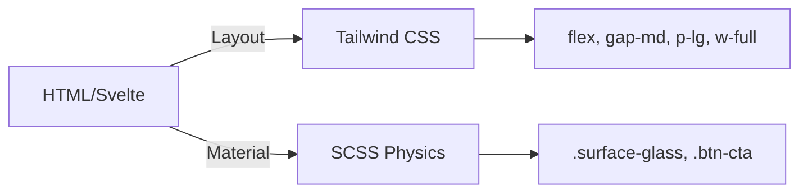
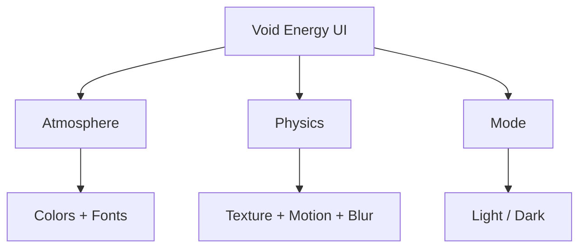

# 📘 Void Energy UI — Developer Cheat Sheet

> **Quick Reference Guide** for developers working with the Void Energy UI design system.

---

## Table of Contents

1. [Architectural Constitution](#1-architectural-constitution)
2. [The Triad (Context Engine)](#2-the-triad-context-engine)
3. [Responsive & Spacing (Density Engine)](#3-responsive--spacing-density-engine)
4. [Component Catalog](#4-component-catalog)
   - [Surfaces](#a-surfaces-the-skin)
   - [Composites](#b-composites-skin--bone)
   - [Overlays](#c-overlays-the-ether)
   - [Gestures](#d-gestures)
   - [Icons](#e-icons)
5. [Mixin Reference](#5-mixin-reference)
6. [Quick Patterns (Copy-Paste)](#6-quick-patterns-copy-paste)
7. [Svelte Actions](#7-svelte-actions)

---

## 1. Architectural Constitution

### The Hybrid Protocol (Separation of Concerns)

The Void Energy UI separates **Layout** (Geometry) from **Material** (Physics).


```mermaid
graph LR
    A[HTML/Svelte] -->|Layout| B[Tailwind CSS]
    A -->|Material| C[SCSS Physics]
    B --> D["flex, gap-md, p-lg, w-full"]
    C --> E[".surface-glass, .btn-cta"]
```

#### Rules

| Layer        | Technology | Responsibility            | Examples                                             |
| ------------ | ---------- | ------------------------- | ---------------------------------------------------- |
| **Layout**   | Tailwind   | Geometry, Spacing, Sizing | `flex`, `gap-md`, `p-lg`, `w-full`                   |
| **Material** | SCSS       | Visuals, Physics, States  | `.surface-glass`, `.btn-cta`, `@include glass-float` |

#### ✅ Correct Usage

```svelte
<!-- Layout = Tailwind, Material = SCSS -->
<div class="flex flex-col gap-md p-lg surface-glass">
  <h2 class="text-main">Title</h2>
</div>
```

#### ❌ Incorrect Usage

```scss
/* NEVER put layout rules in SCSS */
.surface-glass {
  width: 300px; /* ❌ Layout bleed */
  margin-bottom: 20px; /* ❌ Layout bleed */
  @include glass-float; /* ✅ OK */
}
```

```svelte
<!-- NEVER put physics rules in inline styles or Tailwind -->
<div style="box-shadow: 0 4px 12px rgba(0,0,0,0.5)">  <!-- ❌ Physics bleed -->
```

---

### The Token Law (No Magic Numbers)

All values must use semantic tokens from [design-tokens.ts](src/config/design-tokens.ts).

#### ✅ Correct Usage

```svelte
<div class="gap-md p-lg">
  <!-- Semantic spacing -->
  <p class="text-main">Content</p>
  <!-- Semantic color -->
</div>
```

```scss
.custom-component {
  padding: var(--space-lg);
  color: var(--text-main);
  border-radius: var(--radius-base);
}
```

#### ❌ Incorrect Usage

```svelte
<div class="gap-[20px] p-[32px]">  <!-- ❌ Magic numbers -->
```

```scss
.custom-component {
  padding: 32px; /* ❌ Magic number */
  color: #ffffff; /* ❌ Hardcoded color */
  border-radius: 8px; /* ❌ Magic number */
}
```

---

### The State Protocol (DOM-Driven State)

State lives in **attributes**, not classes. This ensures CSS transitions trigger correctly via the Physics Engine.

#### ✅ Correct Usage

```svelte
<button data-state="open" aria-pressed="true">Toggle</button>
```

```scss
.dropdown {
  opacity: 0;

  &[data-state='open'] {
    /* ✅ State via attribute */
    opacity: 1;
  }
}
```

#### ❌ Incorrect Usage

```svelte
<button class="active is-open">Toggle</button> <!-- ❌ State via class -->
```

```scss
.dropdown.show {
  /* ❌ State via class */
  opacity: 1;
}
```

---

## 2. The Triad (Context Engine)

The UI is a material that reacts to three environmental variables set on `<html>`.


```mermaid
graph TD
    A[Void Energy UI] --> B[Atmosphere]
    A --> C[Physics]
    A --> D[Mode]
    B --> E[Colors + Fonts]
    C --> F[Texture + Motion + Blur]
    D --> G[Light / Dark]
```

### 1. Atmosphere (The Soul) — `data-atmosphere`

Defines: **Color Palettes** and **Font Families**

| Atmosphere   | Mood                | Fonts          | Primary Color     |
| ------------ | ------------------- | -------------- | ----------------- |
| `void`       | Tech / Sci-Fi       | Hanken Grotesk | Cyan (#33e2e6)    |
| `onyx`       | Stealth / Cinema    | Inter          | White (#ffffff)   |
| `terminal`   | Retro / Hacker      | Courier Prime  | Amber (#f5c518)   |
| `crimson`    | Horror / Aggressive | Merriweather   | Red (#ff6b6b)     |
| `overgrowth` | Nature / Organic    | Lora           | Green (#39ff14)   |
| `velvet`     | Romance / Soft      | Caveat         | Pink (#ff80a0)    |
| `solar`      | Royal / Gold        | Cinzel         | Gold (#ffaa00)    |
| `nebula`     | Synthwave / Mystery | Exo 2          | Magenta (#d946ef) |
| `paper`      | Light / Print       | PT Serif       | Navy (#2c3e50)    |
| `laboratory` | Clinical / Science  | Open Sans      | Blue (#005bb5)    |
| `playground` | Fun / Kids          | Comic Neue     | Pink (#ff4081)    |
| `focus`      | Distraction Free    | Inter          | Black (#000000)   |

**Usage:**

```html
<html data-atmosphere="void"></html>
```

---

### 2. Physics (The Laws) — `data-physics`

Defines: **Motion**, **Blur**, **Texture**

| Physics | Blur | Borders   | Motion                      | Use Cases                |
| ------- | ---- | --------- | --------------------------- | ------------------------ |
| `glass` | 20px | 1px Glow  | Organic (0.3s cubic-bezier) | Premium UI, Modern Apps  |
| `flat`  | 0px  | 1px Solid | Clean (0.2s ease-out)       | Professional, Accessible |
| `retro` | 0px  | 2px Hard  | Instant (0s steps)          | Retro Games, Terminals   |

**Usage:**

```html
<html data-physics="glass"></html>
```

---

### 3. Mode (The Polarity) — `data-mode`

Defines: **Luminosity** and **Contrast** handling

| Mode    | Background  | Text       |
| ------- | ----------- | ---------- |
| `dark`  | Dark tones  | Light text |
| `light` | Light tones | Dark text  |

**Usage:**

```html
<html data-mode="dark"></html>
```

---

### ⚠️ The Law of Immutability (Physics Constraints)

The Void Engine enforces these rules to prevent broken UI states:

| Constraint                         | Correction              | Reason                                     |
| ---------------------------------- | ----------------------- | ------------------------------------------ |
| `physics="glass"` + `mode="light"` | Forces `physics="flat"` | Glass glows require darkness to be visible |
| `physics="retro"` + `mode="light"` | Forces `mode="dark"`    | CRT phosphor effects require black canvas  |

See [THEME-GUIDE.md](./THEME-GUIDE.md) for details.

---

### Browser Chrome Integration — `<meta name="theme-color">`

The browser's address bar and system chrome automatically tint to match the active atmosphere. Each theme's `canvas` color (its `bg-canvas` value) is stored in the auto-generated [void-registry.json](src/config/void-registry.json) and applied to `<meta name="theme-color">` on every theme switch.

**How it works:**
1. **SSR** — `Layout.astro` renders a static `<meta name="theme-color" content="#010020">` (the `void` default)
2. **Hydration** — The bootloader (`void-boot.js`) immediately updates the meta tag to match the resolved theme
3. **Runtime** — `VoidEngine.applyTheme()` updates the meta tag on every atmosphere switch

No manual intervention needed. Custom runtime themes that include a `bg-canvas` palette entry also get theme-color support automatically.

---

## 3. Responsive & Spacing (Density Engine)

### A. Breakpoints (Layout Only)

Mobile-first approach with 6 breakpoints.

| Prefix          | Min Width | Target Devices   |
| --------------- | --------- | ---------------- |
| `mobile`        | 0px       | Phones           |
| `tablet`        | 768px     | Tablets          |
| `small-desktop` | 1024px    | Laptops          |
| `large-desktop` | 1440px    | Desktops         |
| `full-hd`       | 1920px    | Full HD displays |
| `quad-hd`       | 2560px    | 4K displays      |

**Usage:**

```svelte
<div class="flex-col tablet:flex-row large-desktop:gap-xl">
  <!-- Stacks on mobile, rows on tablet+ -->
</div>
```

---

### B. Spacing Scale (Harmonic & Dense)

All spacing is dynamic and scales based on user density preference (0.75x - 1.25x).

| Token | Base Size (1x) | Formula | Use Cases                   |
| ----- | -------------- | ------- | --------------------------- |
| `xs`  | 8px            | 0.5rem  | Icon gaps, tight padding    |
| `sm`  | 16px           | 1rem    | Button padding, small gaps  |
| `md`  | 24px           | 1.5rem  | Card padding, standard gaps |
| `lg`  | 32px           | 2rem    | Section padding, large gaps |
| `xl`  | 48px           | 3rem    | Page margins, hero spacing  |
| `2xl` | 64px           | 4rem    | Section dividers            |
| `3xl` | 96px           | 6rem    | Layout spacing              |
| `4xl` | 128px          | 8rem    | Hero sections               |
| `5xl` | 160px          | 10rem   | Mega spacing                |

**Usage:**

```svelte
<div class="gap-md p-lg my-xl">
  <!-- Tailwind utilities -->
  <p>Content</p>
</div>
```

```scss
.custom {
  padding: var(--space-lg); /* SCSS variable */
  gap: var(--space-md);
}
```

---

### B.1. Spacing Philosophy & Mathematical Reasoning

#### Why 4px as the Base Unit?

The Void Energy UI uses **4px (0.25rem)** as the foundational unit for all spacing calculations.

**Technical Justification:**

1. **Pixel-Perfect Rendering**
   - All modern displays render in whole pixels
   - 4px aligns perfectly with pixel grids, preventing subpixel antialiasing artifacts
   - Ensures crisp edges on all components across all screen densities

2. **WCAG Compliance**
   - Minimum touch target size: 44px (WCAG 2.1 Level AAA)
   - 44px ÷ 4px = 11 (perfect divisibility, no fractional pixels)
   - All interactive elements built from this base meet accessibility standards

3. **Mathematical Harmony**
   - 4 = 2² (powers of 2 create natural visual rhythm)
   - Enables proportional scaling without rounding errors
   - Aligns with CSS rem system (1rem = 16px = 4 × 4px)

4. **Industry Standard**
   - Used by Material Design (8px grid, but often subdivides to 4px)
   - iOS Human Interface Guidelines (4pt base for spacing)
   - Tailwind CSS (0.25rem = 4px base unit)

---

#### The Dual-Speed Progression

Our spacing scale uses **two different progression strategies** for different use cases:

**🎯 Component Level (xs → lg): Tight Progression**

```
xs:   8px  (×2)  ← Minimal gap
sm:   16px (×4)  ← Doubles from xs
md:   24px (×6)  ← +8px step (optimal card padding)
lg:   32px (×8)  ← Doubles from sm (section padding)
```

**Why tight progression?**

- Fine-grained control for UI components (buttons, cards, inputs)
- Small 8px increments allow precise visual tuning
- Prevents "spacing jumps" that feel unnatural in compact layouts

**📐 Layout Level (xl → 5xl): Accelerated Progression**

```
lg:   32px  (×8)   ← Foundation
xl:   48px  (×12)  ← Golden Ratio jump (32 × 1.5)
2xl:  64px  (×16)  ← Double lg (visual "block")
3xl:  96px  (×24)  ← Triple lg (layout spacing)
4xl:  128px (×32)  ← Quadruple lg (hero sections)
5xl:  160px (×40)  ← Quintuple lg (mega spacing)
```

**Why accelerated progression?**

- Large whitespace areas benefit from dramatic jumps
- Creates clear visual hierarchy between sections
- Prevents too many similar spacing values (reduces decision fatigue)

---

#### The "Magic Numbers" Explained

Each spacing value was chosen for specific ergonomic and mathematical reasons:

| Token   | Value | Why This Exact Number?                                                                                                                                               |
| ------- | ----- | -------------------------------------------------------------------------------------------------------------------------------------------------------------------- |
| **xs**  | 8px   | **Minimum comfortable gap** - Smallest spacing that feels intentional, not cramped. Used for icon gaps, chip spacing, tight padding.                                 |
| **sm**  | 16px  | **Industry standard** - 1rem (default font-size). Universal button padding in Material Design, Bootstrap, Tailwind. Most familiar value to developers.               |
| **md**  | 24px  | **Optimal card padding** - 1.5rem. Most popular card padding value across all design systems (Material, Ant Design, Chakra UI). Balances density and breathing room. |
| **lg**  | 32px  | **Typographic baseline** - 2rem. Divisible by 16px (standard font-size). Creates strong visual sections. Foundation for larger spacing values.                       |
| **xl**  | 48px  | **Golden Ratio step** - 32 × 1.5 ≈ 48 (3rem). Classic "large step" in typography. Creates harmonious jump from lg without feeling too aggressive.                    |
| **2xl** | 64px  | **Visual block unit** - 32 × 2 (4rem). Natural doubling from lg. Perfect for section dividers, major layout boundaries.                                              |
| **3xl** | 96px  | **Layout rhythm** - 32 × 3 (6rem). Matches typographic modular scales. Used for separating distinct page sections.                                                   |
| **4xl** | 128px | **Hero spacing** - 32 × 4 (8rem). Dramatic spacing for landing pages, hero sections. Creates strong visual impact.                                                   |
| **5xl** | 160px | **Mega whitespace** - 32 × 5 (10rem). Largest spacing value for expansive hero areas, full-bleed sections.                                                           |

---

#### Density Engine: Dynamic Scaling

All spacing values **multiply by a density factor** to respect user preferences:

```scss
// Implementation in /src/styles/base/_reset.scss
:root {
  --unit: 0.25rem; // 4px base
  --density: 1; // Default (user-configurable: 0.75 / 1 / 1.25)

  // Example: md spacing
  --space-md: calc(6 * var(--unit) * var(--density, 1));
  //               ↑     ↑            ↑
  //            24px   4px         scaling factor
}
```

**Density Factors:**

| Setting                | Factor | md Example | Use Case                                         |
| ---------------------- | ------ | ---------- | ------------------------------------------------ |
| **High** (Compact)     | 0.75x  | 18px       | Power users, dense information displays          |
| **Standard** (Default) | 1x     | 24px       | Balanced spacing for most users                  |
| **Low** (Relaxed)      | 1.25x  | 30px       | Accessibility, motor disabilities, large screens |

**Accessibility Benefits:**

- ✅ **Motor disabilities**: Larger spacing = easier touch/click targets
- ✅ **Visual disabilities**: More breathing room improves scannability
- ✅ **Cognitive disabilities**: Consistent spacing reduces cognitive load

**Implementation:**

- User sets preference via UI (`voidEngine.setDensity('low')`)
- CSS variable `--density` updates globally
- All components automatically reflow (no code changes needed)
- Proportions remain consistent (ratio between xs/sm/md/lg stays identical)

---

### C. Safe Area Insets (Edge-to-Edge Viewport)

Modern devices with notches, dynamic islands, and gesture navigation bars render content behind system UI. The layout uses `viewport-fit=cover` and exposes browser-provided safe area insets as CSS custom properties.

**Source:** [src/styles/base/\_reset.scss](src/styles/base/_reset.scss) (`:root` block)

#### Tokens

| Token | Source | Fallback | Description |
| --- | --- | --- | --- |
| `--safe-top` | `env(safe-area-inset-top)` | `0px` | Status bar / Dynamic Island |
| `--safe-bottom` | `env(safe-area-inset-bottom)` | `0px` | Home indicator / gesture bar |
| `--safe-left` | `env(safe-area-inset-left)` | `0px` | Landscape notch (left) |
| `--safe-right` | `env(safe-area-inset-right)` | `0px` | Landscape notch (right) |

On non-notched devices, all values resolve to `0px` — zero visual impact.

#### Built-in Integration

These components already account for safe areas (no manual work needed):

| Component | Safe Area Handling |
| --- | --- |
| **Nav bar** (`.nav-bar`) | Extends glass surface under status bar via `--safe-top` |
| **Bottom nav** (`.bottom-nav`) | Offsets above home indicator via `--safe-bottom`; landscape-aware width via `--safe-left`/`--safe-right` |
| **Nav menu** (`.nav-menu`) | Padding respects `--safe-right` (and `--safe-left` on mobile) |
| **Toasts** (`.toast-region`) | Top offset includes `--safe-top`; width avoids landscape notch |
| **Full-size dialogs** (`dialog[data-size="full"]`) | Dimensions account for all four safe area insets |
| **Breadcrumbs** (`.breadcrumbs`) | Fixed below nav-bar; `top` includes `--safe-top`; hidden offset includes `--nav-height + --safe-top` |
| **Body** | `padding-top` includes `--safe-top` (+ `--breadcrumbs-height` when breadcrumbs present); `padding-bottom` uses `--bottom-nav-clearance` on mobile |

#### Usage in Custom Components

Use the safe area tokens when positioning fixed/absolute elements near screen edges:

```scss
.my-fixed-footer {
  position: fixed;
  bottom: calc(var(--space-sm) + var(--safe-bottom));
  // Use max() to pick the larger of design spacing vs safe area:
  padding-left: max(var(--space-lg), var(--safe-left));
  padding-right: max(var(--space-lg), var(--safe-right));
}
```

---

#### Alignment with Tailwind CSS

Our spacing scale is **100% compatible** with Tailwind CSS:

| Void Energy         | Tailwind          | Value | Notes                   |
| ------------------- | ----------------- | ----- | ----------------------- |
| `gap-xs` / `p-xs`   | `gap-2` / `p-2`   | 8px   | Tailwind's `2` = 0.5rem |
| `gap-sm` / `p-sm`   | `gap-4` / `p-4`   | 16px  | Tailwind's `4` = 1rem   |
| `gap-md` / `p-md`   | `gap-6` / `p-6`   | 24px  | Tailwind's `6` = 1.5rem |
| `gap-lg` / `p-lg`   | `gap-8` / `p-8`   | 32px  | Tailwind's `8` = 2rem   |
| `gap-xl` / `p-xl`   | `gap-12` / `p-12` | 48px  | Tailwind's `12` = 3rem  |
| `gap-2xl` / `p-2xl` | `gap-16` / `p-16` | 64px  | Tailwind's `16` = 4rem  |
| `gap-3xl` / `p-3xl` | `gap-24` / `p-24` | 96px  | Tailwind's `24` = 6rem  |

**Why this alignment matters:**

- ✅ Developers familiar with Tailwind can transfer knowledge instantly
- ✅ Easy integration with Tailwind utilities (we use Tailwind for layout)
- ✅ Large ecosystem of examples, tutorials, and best practices
- ✅ Reduces learning curve for new contributors

---

#### Quick Reference: When to Use Each Value

| Spacing          | Common Use Cases                                          | Visual Weight    |
| ---------------- | --------------------------------------------------------- | ---------------- |
| **xs** (8px)     | Icon gaps, chip spacing, tight list items, compact tables | Minimal          |
| **sm** (16px)    | Button padding, input padding, small card gaps            | Light            |
| **md** (24px)    | Card padding, modal padding, standard gaps                | Medium (Default) |
| **lg** (32px)    | Section padding, container padding, large gaps            | Strong           |
| **xl** (48px)    | Page margins, hero padding, dramatic gaps                 | Very Strong      |
| **2xl** (64px)   | Section dividers, major layout boundaries                 | Dramatic         |
| **3xl+** (96px+) | Hero sections, landing pages, full-bleed content          | Mega             |

---

#### Examples

**Compact Button (sm padding):**

```svelte
<button class="btn p-sm">Click Me</button>
<!-- 16px padding = comfortable but not wasteful -->
```

**Standard Card (md padding):**

```svelte
<div class="surface-glass p-md">
  <h3>Card Title</h3>
  <p>Card content with optimal 24px breathing room.</p>
</div>
```

**Hero Section (xl+ padding):**

```svelte
<section class="py-4xl px-xl">
  <h1>Welcome to Void Energy</h1>
  <!-- Vertical: 128px, Horizontal: 48px = Dramatic impact -->
</section>
```

---

**📚 Related Documentation:**

- **Implementation**: [/src/styles/base/\_reset.scss:9-79](../src/styles/base/_reset.scss) (Density Engine)
- **Token Definitions**: [/src/config/design-tokens.ts:20-66](../src/config/design-tokens.ts) (Spacing scale)
- **Tailwind Integration**: [/tailwind.config.mjs](../tailwind.config.mjs) (Spacing utilities)

---

## 4. Component Catalog

### A. Surfaces (The Skin)

Base surface classes for applying physics.

#### `.surface-glass`

**Description:** Static floating glass (Cards, containers)
**Physics:** Blur, subtle shadow, border glow
**Interactive:** No hover effects

**Usage:**

```svelte
<div class="surface-glass p-lg">
  <p>Static card content</p>
</div>
```

---

#### `.surface-glass-action`

**Description:** Interactive glass (Clickable cards, buttons)
**Physics:** Blur, shadow, border glow
**Interactive:** Lifts on hover, border brightens

**Usage:**

```svelte
<a href="/detail" class="surface-glass-action p-md">
  <h3>Click Me</h3>
</a>
```

---

#### `.surface-sunk`

**Description:** Recessed depth (Inputs, wells, sidebars)
**Physics:** Inset shadow, carved appearance
**Interactive:** Focus ring on `:focus-visible`

**Usage:**

```svelte
<input class="surface-sunk p-sm" type="text" />
```

---

#### `.surface-void`

**Description:** Opaque canvas (Modals, masking overlays)
**Physics:** Solid background, no blur
**Interactive:** None

**Usage:**

```svelte
<div class="surface-void">
  <p>Opaque background</p>
</div>
```

---

### B. Composites (Skin + Bone)

Preset components with built-in layout and physics.

#### Buttons

**Description:** Interactive buttons with physics-aware states, semantic variants, and composable modifiers.
**Source:** [src/styles/components/\_buttons.scss](src/styles/components/_buttons.scss)

**Variants:**

| Class | Description | Use Case |
| --- | --- | --- |
| `.btn` | Standard surface button (auto-applied to `<button>`) | Default actions |
| `.btn-cta` | Rotating gradient border (Gemini Laser), pill shape | Primary CTA |
| `.btn-premium` | Gold/orange semantic | Paid features, upgrades |
| `.btn-system` | Purple semantic | System/diagnostic actions |
| `.btn-success` | Green/success semantic | Confirmations, positive actions |
| `.btn-error` | Red/error semantic | Destructive actions, warnings |
| `.btn-ghost` | Text-only, no surface/border at rest | Secondary/tertiary actions |
| `.btn-void` | Complete style reset | Custom-styled buttons |
| `.btn-icon` | Circular icon-only | Toolbar actions, inline controls |

**Usage:**

```svelte
<!-- Standard -->
<button>Default Button</button>
<button class="btn-cta">Call to Action</button>

<!-- Semantic -->
<button class="btn-success">Confirm</button>
<button class="btn-error">Delete</button>
```

---

#### `.btn-ghost`

**Description:** Text-only action button with no background or border at rest. Inherits button-family typography (uppercase, semibold, small) for visual kinship with other `.btn` variants while staying visually lightweight.
**Use for:** Cancel, Dismiss, Skip, "Learn more", any secondary action paired with a primary button.

**Resting state:** Transparent background, `--text-dim` color
**Hover:** Subtle bg tint (`8%`) + `--energy-primary` color. No lift — ghost stays grounded.
**Physics:**

| Physics | Hover Treatment |
| --- | --- |
| Glass | Background tint only |
| Flat | Background tint only |
| Retro | Underline, no background |

**Semantic composition:** Combine with semantic classes for colored ghosts — the ghost surface treatment overrides the semantic background/border while preserving the semantic color.

**Usage:**

```svelte
<!-- Basic ghost -->
<button class="btn-ghost">Cancel</button>

<!-- Paired with primary (most common pattern) -->
<div class="flex gap-md">
  <button class="btn-ghost">Cancel</button>
  <button class="btn-success">Confirm</button>
</div>

<!-- Semantic ghost (destructive secondary) -->
<button class="btn-ghost btn-error">Delete Account</button>

<!-- Toggle state -->
<button class="btn-ghost" aria-pressed={showAdvanced}>
  Advanced Settings
</button>

<!-- Disabled -->
<button class="btn-ghost" disabled>Unavailable</button>
```

---

#### `<DropZone>` (File Upload)

**Description:** Drag-and-drop file upload with click-to-browse fallback
**Location:** [src/components/ui/DropZone.svelte](src/components/ui/DropZone.svelte)
**CSS Class:** `.dropzone` ([src/styles/components/\_inputs.scss](src/styles/components/_inputs.scss))

**Props:**

| Prop | Type | Default | Description |
| --- | --- | --- | --- |
| `accept` | `string` | `''` | File type filter (`.json,.csv`, `image/*`, `application/pdf`) |
| `maxSize` | `number` | `0` | Maximum file size in bytes (0 = no limit) |
| `multiple` | `boolean` | `false` | Allow multiple file selection |
| `disabled` | `boolean` | `false` | Disable all interaction |
| `onfiles` | `(files: File[]) => void` | — | Callback with validated files |
| `class` | `string` | `''` | Consumer classes on outer `.dropzone` div |

**States:** `idle` → `drag-active` → `has-files`

| State | Visual | Attribute |
| --- | --- | --- |
| **idle** | Dashed border, Upload icon, prompt text | — |
| **drag-active** | Energy-highlighted border/bg, "Release to upload" | `data-state="active"` |
| **has-files** | FileCheck icon, file count + names | — |

**Usage:**

```svelte
<script lang="ts">
  import DropZone from '@components/ui/DropZone.svelte';
  import { toast } from '@stores/toast.svelte';
</script>

<!-- Basic (any single file) -->
<DropZone
  onfiles={(files) => toast.show(`Uploaded: ${files[0].name}`, 'success')}
/>

<!-- Restricted (type + size) -->
<DropZone
  accept=".json,.csv"
  maxSize={2 * 1024 * 1024}
  onfiles={(files) => toast.show(`Valid: ${files[0].name}`, 'success')}
/>

<!-- Multiple files -->
<DropZone
  multiple
  onfiles={(files) => toast.show(`${files.length} files received`, 'info')}
/>

<!-- Disabled -->
<DropZone disabled />
```

**Architecture Notes:**

| Decision | Rationale |
| --- | --- |
| **Drag counter pattern** | `dragCounter` (number, not boolean) increments on `dragenter`, decrements on `dragleave`. Prevents flicker when dragging over child elements. `drop` resets to 0. |
| **Validation on drop** | Browsers don't enforce `accept` on drag-and-drop (only on file dialog). `validateFiles()` manually checks type and size on drop, reporting failures via toast. |
| **Input value reset** | `input.value = ''` after reading files so re-selecting the same file still triggers `onchange`. |
| **Keyboard access** | Outer `div` has `role="button"` + `tabindex={0}`. Enter/Space programmatically clicks the hidden `<input type="file">`. |
| **No new SCSS** | Reuses existing `.dropzone` physics from `_inputs.scss` — dashed `glass-sunk` border, spring transitions, energy-highlighted active state. |

**Physics:**

- **Glass:** Blur + glow border on drag-over, energy-primary glow
- **Flat:** Subtle shadow, solid border brightens
- **Retro:** Hard dashed border, instant state change

**Icons:** `Upload` (idle) → `FileCheck` (files selected), both from `@lucide/svelte` with `class="icon" data-size="xl"`.

---

#### `.chip`

**Description:** Data chips (Premium, System, Success variants)
**Variants:** `.chip-premium`, `.chip-system`, `.chip-success`

**Usage:**

```svelte
<span class="chip chip-premium">Premium</span>
<span class="chip chip-system">System</span>
<span class="chip chip-success">Active</span>
```

---

#### `<Toggle>` (Switch)

**Description:** Boolean on/off switch with optional icon indicators.
**Location:** [src/components/ui/Toggle.svelte](src/components/ui/Toggle.svelte)
**CSS Class:** `.toggle` ([src/styles/components/\_toggle.scss](src/styles/components/_toggle.scss))

**Props:**

| Prop | Type | Default | Description |
| --- | --- | --- | --- |
| `checked` | `boolean` | `$bindable(false)` | Toggle state (bindable) |
| `onchange` | `(checked?: boolean) => void` | — | Callback on state change |
| `label` | `string` | — | Accessible label text |
| `disabled` | `boolean` | `false` | Disables interaction |
| `size` | `string` | — | Size via `data-size` attribute |
| `iconOn` | `string \| Component` | — | ON state icon (optional) |
| `iconOff` | `string \| Component` | `Circle` | OFF state icon (default circle) |
| `hideIcons` | `boolean` | `false` | Hide icons entirely |

**Usage:**

```svelte
<Toggle bind:checked={enabled} />
<Toggle bind:checked={darkMode} iconOn={Moon} iconOff={Sun} label="Dark Mode" />
```

---

#### `<SearchField>`

**Description:** Input with animated search icon that rotates on focus.
**Location:** [src/components/ui/SearchField.svelte](src/components/ui/SearchField.svelte)
**CSS Class:** `.field` ([src/styles/components/\_fields.scss](src/styles/components/_fields.scss))

**Props:**

| Prop | Type | Default | Description |
| --- | --- | --- | --- |
| `value` | `string` | `$bindable('')` | Search text (bindable) |
| `placeholder` | `string` | `'Search...'` | Placeholder text |
| `zoom` | `'in' \| 'out'` | — | Search icon lens variant |
| `onsubmit` | `(value: string) => void` | — | Callback on Enter key |
| `oninput` | `(value: string) => void` | — | Callback on keystroke |
| `disabled` | `boolean` | `false` | Disables input |

**Usage:**

```svelte
<SearchField bind:value={query} onsubmit={handleSearch} zoom="in" />
```

---

#### `<Selector>` (Dropdown Select)

**Description:** Native `<select>` wrapper with label and placeholder.
**Location:** [src/components/ui/Selector.svelte](src/components/ui/Selector.svelte)

**Props:**

| Prop | Type | Default | Description |
| --- | --- | --- | --- |
| `options` | `Array<{ value: string, label: string }>` | *required* | Selection options |
| `value` | `string \| null` | `$bindable()` | Selected value (bindable) |
| `onchange` | `(value: string) => void` | — | Callback on selection |
| `label` | `string` | — | Label text above select |
| `placeholder` | `string` | — | Hidden first option text |
| `disabled` | `boolean` | `false` | Disables select |
| `align` | `'start' \| 'center' \| 'end'` | `'center'` | Flex alignment |

**Usage:**

```svelte
<Selector
  label="Font"
  options={[{ value: 'inter', label: 'Inter' }, { value: 'mono', label: 'Courier' }]}
  bind:value={font}
  placeholder="Select..."
/>
```

---

#### `<Switcher>` (Segmented Control)

**Description:** Radio-style segmented control with keyboard navigation (arrows, Home/End).
**Location:** [src/components/ui/Switcher.svelte](src/components/ui/Switcher.svelte)

**Props:**

| Prop | Type | Default | Description |
| --- | --- | --- | --- |
| `options` | `Array<{ value: string, label: string, icon?: Component }>` | *required* | Options with optional icons |
| `value` | `string` | `$bindable()` | Selected value (bindable) |
| `onchange` | `(value: string) => void` | — | Callback on selection |
| `label` | `string` | — | Label text |
| `disabled` | `boolean` | `false` | Disables all options |

**Usage:**

```svelte
<Switcher
  options={[
    { value: 'glass', label: 'Glass' },
    { value: 'flat', label: 'Flat' },
    { value: 'retro', label: 'Retro' }
  ]}
  bind:value={physics}
/>
```

---

#### `<EditField>`

**Description:** Readonly input that unlocks for editing with confirm/reset actions.
**Location:** [src/components/ui/EditField.svelte](src/components/ui/EditField.svelte)
**CSS Class:** `.field`

**Props:**

| Prop | Type | Default | Description |
| --- | --- | --- | --- |
| `value` | `string` | `$bindable('')` | Text value (bindable, updated on confirm) |
| `placeholder` | `string` | `''` | Placeholder text |
| `onconfirm` | `(value: string) => void` | — | Callback with new value on confirm |
| `disabled` | `boolean` | `false` | Disables all interaction |

**States:** idle (readonly + Edit icon) → editing (editable + Undo/Check icons). Enter confirms, Escape resets.

**Usage:**

```svelte
<EditField bind:value={name} placeholder="Agent name..." onconfirm={saveName} />
```

---

#### `<EditTextarea>`

**Description:** Readonly textarea that unlocks for editing with confirm/reset actions. Multi-line variant of EditField.
**Location:** [src/components/ui/EditTextarea.svelte](src/components/ui/EditTextarea.svelte)
**CSS Class:** `.field`

**Props:**

| Prop | Type | Default | Description |
| --- | --- | --- | --- |
| `value` | `string` | `$bindable('')` | Text content (bindable, updated on confirm) |
| `placeholder` | `string` | `''` | Placeholder text |
| `rows` | `number` | `3` | Visible text rows |
| `onconfirm` | `(value: string) => void` | — | Callback with new value on confirm |
| `disabled` | `boolean` | `false` | Disables all interaction |

**States:** idle (readonly + Edit icon at top-right) → editing (editable + Undo/Check at top-right). Ctrl/Cmd+Enter confirms, Escape resets.

**Usage:**

```svelte
<EditTextarea bind:value={notes} placeholder="Notes..." rows={4} onconfirm={save} />
```

---

#### `<PasswordField>`

**Description:** Password input with Eye toggle for show/hide visibility.
**Location:** [src/components/ui/PasswordField.svelte](src/components/ui/PasswordField.svelte)
**CSS Class:** `.field`

**Props:**

| Prop | Type | Default | Description |
| --- | --- | --- | --- |
| `value` | `string` | `$bindable('')` | Password text (bindable) |
| `placeholder` | `string` | `'Enter password...'` | Placeholder text |
| `disabled` | `boolean` | `false` | Disables input |

**Usage:**

```svelte
<PasswordField bind:value={password} />
```

---

#### `<CopyField>`

**Description:** Readonly text field with copy-to-clipboard button. Shows checkmark feedback on copy.
**Location:** [src/components/ui/CopyField.svelte](src/components/ui/CopyField.svelte)
**CSS Class:** `.field`

**Props:**

| Prop | Type | Default | Description |
| --- | --- | --- | --- |
| `value` | `string` | *required* | Text to display and copy |

**Usage:**

```svelte
<CopyField value="sk-1234-abcd-5678" />
```

---

#### `<MediaSlider>`

**Description:** Horizontal control bar with mute toggle, volume slider, optional playback (pause/play) toggle, and optional replay button.
**Location:** [src/components/ui/MediaSlider.svelte](src/components/ui/MediaSlider.svelte)
**CSS Class:** `.media-slider` ([src/styles/components/\_fields.scss](src/styles/components/_fields.scss))

**Props:**

| Prop | Type | Default | Description |
| --- | --- | --- | --- |
| `volume` | `number` | `$bindable(50)` | Volume level 0–100 (bindable) |
| `muted` | `boolean` | `$bindable(false)` | Mute state (bindable) |
| `icon` | `'voice' \| 'music'` | `'voice'` | Mute toggle icon |
| `playback` | `boolean` | `false` | Show pause/play toggle |
| `paused` | `boolean` | `$bindable(false)` | Pause state (bindable) |
| `replay` | `boolean` | `false` | Show replay button |
| `onchange` | `(volume: number) => void` | — | Callback on volume change |
| `onmute` | `(muted: boolean) => void` | — | Callback on mute toggle |
| `onpause` | `(paused: boolean) => void` | — | Callback on pause toggle |
| `onreplay` | `() => void` | — | Callback on replay click |
| `disabled` | `boolean` | `false` | Disables all controls |

**Usage:**

```svelte
<MediaSlider bind:volume bind:muted bind:paused icon="voice" playback replay onreplay={replay} />
<MediaSlider bind:volume bind:muted bind:paused icon="music" playback />
```

---

#### `<SliderField>`

**Description:** Range slider with optional preset snap points. When presets are provided, the slider locks to those values — like a visual `<select>`. Without presets, degrades to a plain labeled range input.
**Location:** [src/components/ui/SliderField.svelte](src/components/ui/SliderField.svelte)
**CSS Class:** `.slider-field` ([src/styles/components/\_fields.scss](src/styles/components/_fields.scss))

**Props:**

| Prop | Type | Default | Description |
| --- | --- | --- | --- |
| `value` | `number` | `$bindable(0)` | Slider value (bindable) |
| `presets` | `Preset[]` | `[]` | Snap points (`{ label: string, value: number }`); locks slider to preset values |
| `min` | `number` | `0` | Range minimum |
| `max` | `number` | `100` | Range maximum |
| `step` | `number` | `1` | Range step |
| `label` | `string` | — | Optional label above slider |
| `onchange` | `(value: number) => void` | — | Callback on value change |
| `disabled` | `boolean` | `false` | Disables slider and presets |

**States:**

| State | Attribute | Visual |
| --- | --- | --- |
| Active preset | `data-state="active"` + `aria-pressed="true"` | `--energy-primary` color on label |
| Disabled | `data-disabled` on wrapper | 50% opacity, no interaction |

**Usage:**

```svelte
<script lang="ts">
  import SliderField from '@components/ui/SliderField.svelte';

  let quality = $state(50);
  const presets = [
    { label: 'MIN', value: 0 },
    { label: 'STANDARD', value: 50 },
    { label: 'MAX', value: 100 },
  ];
</script>

<SliderField bind:value={quality} label="Quality" presets={presets} />
<SliderField bind:value={quality} label="Plain Slider" />
```

**Physics:**
- **Glass:** Active preset text-shadow glow with `--energy-primary`
- **Flat:** Color-only highlight on active preset
- **Retro:** Underline on active preset label

---

#### `<SettingsRow>`

**Description:** Layout wrapper pairing a label with controls. Responsive: stacked on mobile, side-by-side on desktop.
**Location:** [src/components/ui/SettingsRow.svelte](src/components/ui/SettingsRow.svelte)

**Props:**

| Prop | Type | Default | Description |
| --- | --- | --- | --- |
| `label` | `string` | *required* | Row label text |
| `children` | `Snippet` | *required* | Control elements |

**Usage:**

```svelte
<SettingsRow label="Theme">
  <Switcher options={themes} bind:value={selectedTheme} />
</SettingsRow>
```

---

#### `<FormField>` (Label + Input + Error/Hint)

**Description:** Wrapper component providing consistent label, error message, and hint text wiring around any form input. Manages ARIA associations (`for`, `aria-describedby`, `aria-invalid`) automatically via snippet props. Error messages include an icon and `aria-live="polite"` for screen reader announcements.
**Location:** [src/components/ui/FormField.svelte](src/components/ui/FormField.svelte)
**CSS:** `.form-field-label`, `.form-field-required`, `.form-field-hint`, `.form-field-error` ([src/styles/components/\_fields.scss](src/styles/components/_fields.scss))

**Props:**

| Prop | Type | Default | Description |
| --- | --- | --- | --- |
| `label` | `string?` | — | Label text (if absent, consumer must provide `aria-label` on input) |
| `error` | `string?` | — | Error message (triggers error state when non-empty) |
| `hint` | `string?` | — | Help text shown below input |
| `required` | `boolean` | `false` | Shows `*` indicator on label |
| `fieldId` | `string?` | auto-generated | Explicit ID override for the input |
| `children` | `Snippet<[{ fieldId, descriptionId, invalid }]>` | *required* | Input element(s) receiving ARIA wiring props |
| `class` | `string` | `''` | Additional CSS classes |

**Snippet Props (passed to children):**

| Prop | Type | Description |
| --- | --- | --- |
| `fieldId` | `string` | Use as `id` on the input element |
| `descriptionId` | `string \| undefined` | Use as `aria-describedby` (combines hint + error IDs) |
| `invalid` | `boolean` | Use as `aria-invalid` |

**States:**

| State | Attribute | Visual |
| --- | --- | --- |
| Error | `data-state="error"` | Red error text with CircleAlert icon, slide-in animation |
| Default | `data-state=""` | Standard label + optional hint text |

**Usage:**

```svelte
<FormField label="Email" error={emailError} required fieldId="email">
  {#snippet children({ fieldId, descriptionId, invalid })}
    <input
      type="email"
      id={fieldId}
      required
      aria-invalid={invalid}
      aria-describedby={descriptionId}
    />
  {/snippet}
</FormField>
```

**Physics:**
- **Glass:** Error text gets a subtle red glow (`text-shadow`)
- **Flat:** Standard error text, no glow
- **Retro:** No glow, no entry animation (instant)

---

#### `.tile` (Story Card)

**Description:** Story card with image background, gradient overlay, and metadata. Interactive floating surface with hover zoom.
**Source:** [src/styles/components/\_tiles.scss](src/styles/components/_tiles.scss)

**Variants:**

| Class | Description |
| --- | --- |
| `.tile` | Fixed-width story card with 2:3 aspect ratio, density-scaled |
| `.tile-fluid` | Grid-responsive variant (fills column, min-width: 0) |
| `.loading-tile` | Skeleton state with shimmer animation |
| `.tiles-collection` | Horizontal scroll container for tiles |

**Usage:**

```svelte
<!-- Horizontal scrolling tile strip -->
<div class="tiles-collection">
  <div class="tile">
    
    <h5>Story Title</h5>
  </div>
</div>

<!-- Grid layout -->
<div class="grid grid-cols-2 tablet:grid-cols-3 gap-md">
  <div class="tile tile-fluid">...</div>
</div>
```

---

#### `.link` (Laser Underline)

**Description:** Animated underline link with energy-primary color and hover-reveal laser line.
**Source:** [src/styles/components/\_anchors.scss](src/styles/components/_anchors.scss)

**Usage:**

```svelte
<a href="/docs" class="link">Read the docs</a>
```

---

#### Nav Menu Pattern (Burger Dropdown)

**Description:** Burger-triggered dropdown menu with scrim overlay, hover control, expandable sections, stagger animation, and Escape-to-close. Disabled in this showcase (only 2 pages) but fully documented inside `Navigation.svelte` as a 9-step recipe ready to uncomment.
**Location:** [src/components/Navigation.svelte](src/components/Navigation.svelte) (commented pattern block)
**CSS:** `.nav-menu`, `.nav-menu-scrim`, `.submenu`, `.subtab` ([src/styles/components/\_navigation.scss](src/styles/components/_navigation.scss))

**Architecture:**

| Class | Purpose |
| --- | --- |
| `.nav-menu` | Fixed overlay panel below navbar, full-width on mobile, min-width on tablet+ |
| `.nav-menu-scrim` | Full-viewport backdrop overlay (canvas-tinted dark, text-tinted light) |
| `.submenu` | Nested flex column for expandable groups, border-left accent |
| `.subtab` | Individual menu item — link or expandable parent |

**Features:**
- **Hover control** — Desktop: hover-open with 300ms close delay. Touch: tap-only (no hover interference)
- **Expandable sections** — Parent items toggle child groups; ChevronRight rotates on expand
- **Component slots** — `MenuItem` union type supports embedding arbitrary components (e.g., ThemesBtn)
- **Stagger animation** — CSS-based entry via `--item-index` custom property (50ms per item)
- **Keyboard** — Escape closes menu, focus returns to burger button

**States:**

| State | Attribute | Element | Visual |
| --- | --- | --- | --- |
| Menu open | `aria-expanded="true"` | Burger button | Burger → X animation |
| Active item | `data-state="active"` | `.subtab` | Energy-primary bg (leaf) or color (expandable) |
| Expanded group | `aria-expanded="true"` | `.subtab.expandable` | ChevronRight rotates 90deg |

**Physics:**
- **Glass:** Backdrop blur on `.nav-menu` panel
- **Flat:** Opaque surface, solid borders
- **Retro:** Same as flat (instant transitions, hard edges)

**How to enable:** Follow the 9-step recipe in `Navigation.svelte` (bottom of `<script>` block). Steps cover imports, types, data, state, functions, burger button markup, and the full dropdown template. All SCSS already exists — no style changes needed.

---

#### `<Breadcrumbs>` — Navigational breadcrumb trail

**Location:** [src/components/ui/Breadcrumbs.svelte](src/components/ui/Breadcrumbs.svelte)
**CSS:** `.breadcrumbs`, `.breadcrumbs-separator`, `.breadcrumbs-link`, `.breadcrumbs-current` ([src/styles/components/\_navigation.scss](src/styles/components/_navigation.scss))

**Props:**

| Prop | Type | Default | Description |
| --- | --- | --- | --- |
| `items` | `BreadcrumbItem[]` | *required* | Trail segments (see `BreadcrumbItem` in `void-ui.d.ts`) |
| `hidden` | `boolean` | `false` | Syncs with nav-bar hide-on-scroll via `data-hidden` |
| `class` | `string` | `''` | Consumer CSS classes |

**Types:**

```typescript
interface BreadcrumbItem {
  label: string;       // Display text
  href?: string;       // Navigation URL (omit for terminal page)
  active?: boolean;    // Marks active peer (switches separator to `/`)
}
```

**Modes:**

| Mode | Separator | Use Case |
| --- | --- | --- |
| Hierarchical (default) | `›` | Home › Section › Page |
| Peer (any item has `active`) | `/` | Users / Stories / Web3 |

**States:**

| State | Attribute | Visual |
| --- | --- | --- |
| Hidden (scroll) | `data-hidden="true"` | Slides off-screen in sync with nav-bar |

**Architecture:**

| Decision | Rationale |
| --- | --- |
| Fixed below nav-bar | `position: fixed; top: calc(--nav-height + --safe-top)` — visually unified with nav-bar |
| Body clearance via SSR | `Layout.astro` sets `data-has-breadcrumbs` on `<body>` at SSR time; CSS adds extra `padding-top` |
| `--breadcrumbs-height` token | Defined in `_reset.scss` as `calc(--space-md + --space-xs * 2)` — shared by body padding and scroll offsets |
| Auto-width on desktop | Full-width mobile, `width: auto` with rounded corner at `tablet+` |

**Usage:**

```svelte
<!-- Pass via Layout.astro (SSR breadcrumbs) -->
<Layout
  breadcrumbs={[
    { label: 'Home', href: '/' },
    { label: 'Components', href: '/components' },
    { label: 'Buttons' },
  ]}
>
  <slot />
</Layout>
```

```svelte
<!-- Peer mode (active item highlighted, `/` separators) -->
<Layout
  breadcrumbs={[
    { label: 'Users', href: '/admin/users' },
    { label: 'Stories', href: '/admin/stories', active: true },
    { label: 'Web3', href: '/admin/web3' },
  ]}
>
  <slot />
</Layout>
```

**Physics:**
- **Glass:** Backdrop blur via `glass-blur` mixin
- **Flat:** Opaque surface, solid bottom border
- **Retro:** Hard border, stepped transition (0.3s)
- **Light:** Floating shadow (`--shadow-float`)

---

#### `<Sidebar>` (Page Navigation / Table of Contents)

**Description:** Scroll-tracking table-of-contents navigation with grouped sections, IntersectionObserver-based active state, hash URL deep linking, scrim overlay, and a responsive layout (fixed dropdown below 1440px, fixed column at 1440px+). Keyboard-accessible (Escape closes mobile dropdown).
**Location:** [src/components/ui/Sidebar.svelte](src/components/ui/Sidebar.svelte)
**CSS:** `.docs-layout`, `.docs-main`, `.page-sidebar-header`, `.page-sidebar-toggle-bar`, `.page-sidebar`, `.page-sidebar-scrim`, `.page-sidebar-label`, `.page-sidebar-item` ([src/styles/components/\_page-sidebar.scss](src/styles/components/_page-sidebar.scss))

**Types:**

```typescript
interface SidebarItem {
  id: string;    // Matches the `id` attribute of the target section element
  label: string; // Display text in the nav
}

interface SidebarSection {
  label?: string;       // Optional uppercase group header
  items: SidebarItem[];
}
```

**Props:**

| Prop | Type | Default | Description |
| --- | --- | --- | --- |
| `sections` | `SidebarSection[]` | *required* | Navigation tree (grouped items) |
| `activeId` | `string` | `$bindable('')` | Currently active section ID (two-way bindable) |
| `open` | `boolean` | `$bindable(false)` | Mobile dropdown visibility (two-way bindable) |
| `trackScroll` | `boolean` | `true` | Enable IntersectionObserver scroll tracking |
| `onclose` | `() => void` | — | Called on Escape — use to return focus to toggle button |
| `class` | `string` | `''` | CSS passthrough to `.page-sidebar` nav element |

**States:**

| State | Attribute | Element | Visual |
| --- | --- | --- | --- |
| Active section | `data-state="active"` + `aria-current="location"` | `.page-sidebar-item` | Energy-primary left border + color + 8% tint bg |
| Dropdown open | `data-state="open"` | `.page-sidebar` | Slides down from toggle bar (mobile only) |
| Toggle open | `data-state="open"` + `aria-expanded="true"` | Toggle `<button>` | ChevronDown rotates 180deg |

**Architecture:**

| Class | Purpose |
| --- | --- |
| `.docs-layout` | `display: block` on mobile / `grid (15rem 1fr)` at `large-desktop+` |
| `.docs-main` | Content column — `min-width: 0` prevents grid blowout |
| `.page-sidebar-header` | Sticky wrapper grouping toggle bar + dropdown so they scroll together |
| `.page-sidebar-toggle-bar` | Mobile-only bar (hidden at `large-desktop+`) containing the toggle button |
| `.page-sidebar-scrim` | Full-viewport backdrop overlay (canvas-tinted dark, text-tinted light); hidden at `large-desktop+` |
| `.page-sidebar` | The `<nav>` — fixed dropdown on mobile, fixed column on desktop |
| `.page-sidebar-label` | Non-clickable section group header (uppercase, muted, caption size) |
| `.page-sidebar-item` | Clickable `<a>` — left border accent on active, energy-primary on hover |

**Use Cases:**
- Documentation pages with long-form content and section anchors (current usage: Component Library)
- API reference pages with endpoint or method sections
- Settings panels with multiple categories
- Tutorial or guide pages with step-by-step sections
- Any page where `scrollIntoView` navigation between `id`-anchored headings improves orientation

**Physics:**
- **Glass:** Mobile dropdown gets `glass-blur` when open; sunk background at rest; desktop scrollbar auto-hides (visible on hover with `--energy-secondary`). Scrim: 80% canvas overlay with `materialize`/`dematerialize` transitions
- **Flat/Light:** Mobile dropdown gets `box-shadow: var(--shadow-float)` in light mode; solid borders. Scrim: 50% text-main overlay
- **Retro:** `steps(8)` timing on transform transitions; hard borders

**Usage:**

```svelte
<script lang="ts">
  import { ChevronDown } from '@lucide/svelte';
  import Sidebar from '@components/ui/Sidebar.svelte';

  const sections = [
    {
      label: 'Getting Started',
      items: [
        { id: 'installation', label: 'Installation' },
        { id: 'configuration', label: 'Configuration' },
      ],
    },
    {
      label: 'Components',
      items: [
        { id: 'buttons', label: 'Buttons' },
        { id: 'inputs', label: 'Inputs' },
      ],
    },
  ];

  let activeId = $state('');
  let sidebarOpen = $state(false);
  let toggleBtnRef: HTMLButtonElement | undefined = $state();

  const activeLabel = $derived(
    sections
      .flatMap((s) => s.items)
      .find((item) => item.id === activeId)?.label ?? 'Sections',
  );

  function closeSidebar() {
    sidebarOpen = false;
    toggleBtnRef?.focus(); // Return focus to toggle on Escape
  }
</script>

<div class="docs-layout">
  <div class="page-sidebar-header">
    <!-- Mobile toggle bar (hidden on large-desktop) -->
    <div class="page-sidebar-toggle-bar">
      <button
        bind:this={toggleBtnRef}
        class="btn-ghost w-full"
        type="button"
        aria-expanded={sidebarOpen}
        aria-controls="page-sidebar-nav"
        aria-label={`Page sections: ${activeLabel}`}
        data-state={sidebarOpen ? 'open' : undefined}
        onclick={() => (sidebarOpen = !sidebarOpen)}
      >
        <span class="text-small font-semibold">{activeLabel}</span>
        <ChevronDown class="icon" data-size="sm" />
      </button>
    </div>

    <Sidebar
      {sections}
      bind:activeId
      bind:open={sidebarOpen}
      onclose={closeSidebar}
    />
  </div>

  <!-- Main content — section headings must have matching IDs -->
  <div class="docs-main">
    <div class="container py-2xl flex flex-col gap-2xl">
      <section id="installation">
        <h2>Installation</h2>
        <p>...</p>
      </section>
      <section id="configuration">
        <h2>Configuration</h2>
        <p>...</p>
      </section>
    </div>
  </div>
</div>
```

**Implementation Notes:**

| Decision | Rationale |
| --- | --- |
| Optimistic active state | `activeId` set immediately on click, before scroll completes, to prevent observer flicker |
| `isScrolling` guard | IntersectionObserver updates suppressed during programmatic scroll to avoid incorrect jumps |
| `scrollend` + timeout fallback | `scrollend` event clears the guard; 1200ms `setTimeout` covers Safari < 18 (no `scrollend` support) |
| Scroll abort controller | `scrollController` + `scrollTimeout` cancel any in-flight scroll tracking before starting a new navigation, preventing race conditions on rapid clicks |
| `rootMargin: '-20% 0px -70% 0px'` | Narrow viewport band — a section becomes active when it crosses ~20% from the top |
| Hash URL sync | `hashchange` listener keeps `activeId` in sync with browser back/forward navigation |
| `onclose` callback | Parent returns focus to toggle button after Escape or click — required for keyboard accessibility |
| Scrim overlay | `page-sidebar-scrim` covers viewport below mobile dropdown; click-to-dismiss; uses `materialize`/`dematerialize` transitions; hidden at `large-desktop+` |
| Shared `{#snippet}` | `sidebarItems()` snippet renders the item list once — no duplication between mobile/desktop |

---

#### `.chip` Variants (Extended)

The chip system includes additional semantic variants beyond the base:

| Class | Color | Use Case |
| --- | --- | --- |
| `.chip` | Energy secondary | Default/neutral chips |
| `.chip-premium` | Gold | Premium features |
| `.chip-system` | Purple | System indicators |
| `.chip-success` | Green | Positive states |
| `.chip-error` | Red | Error/warning states |

**Modifier:** `.chip-labeled` — Adds a floating label tab above the chip via `data-label` attribute.

```svelte
<span class="chip chip-premium chip-labeled" data-label="Tier">Gold</span>
```

---

#### `<details>` / `<summary>` (Native Disclosure)

**Description:** Collapsible disclosure widget. Uses the native `<details>` element with animated expand/collapse via `::details-content`. Sunk surface by default (`glass-sunk`); override with `.surface-glass` for standalone use.
**Source:** [src/styles/components/\_inputs.scss](src/styles/components/_inputs.scss) (section 10)

**Surface behavior:**

| Context | Class | Result |
| --- | --- | --- |
| Inside a container (default) | *(none)* | Sunk surface (`glass-sunk` baked in) |
| Standalone on page | `.surface-glass` | Floating glass surface (overrides sunk) |

**Typography:** `font-size: var(--font-size-small)` on `<details>`. `<p>` elements inside inherit this size automatically — no `text-small` class needed.

**States:**

| State | Attribute | Visual |
| --- | --- | --- |
| Open | `[open]` | Border turns `--energy-primary`, summary gets bottom divider, chevron rotates |
| Disabled | `summary[aria-disabled="true"]` | 50% opacity, pointer-events disabled |

**Accordion:** Use the native `name` attribute to create exclusive groups (only one open at a time).

**Usage:**

```svelte
<!-- Basic disclosure (sunk by default) -->
<details>
  <summary>Section Title</summary>
  <div class="p-md">Content here</div>
</details>

<!-- Standalone (glass override) -->
<details class="surface-glass">
  <summary>Expand</summary>
  <p class="p-md">Floating glass container</p>
</details>

<!-- Accordion group (exclusive) -->
<details name="my-group" open>
  <summary>Panel A</summary>
  <div class="p-md">...</div>
</details>
<details name="my-group">
  <summary>Panel B</summary>
  <div class="p-md">...</div>
</details>
```

**Physics:**
- **Glass:** Smooth `block-size` animation (0 → auto), spring easing, blur/glow on surface
- **Flat:** Same animation, opaque background, subtle shadow
- **Retro:** Instant open/close (transitions disabled), hard borders

---

### C. Overlays (The Ether)

Floating UI elements with special positioning.

#### `.void-tooltip`

**Description:** Headless floating capsule (Use with Floating UI)
**Physics:** Small surface, high z-index
**Positioning:** Managed by Floating UI library

**Usage:**

```svelte
<div class="void-tooltip" role="tooltip">Tooltip content</div>
```

See [tooltip.ts](src/actions/tooltip.ts) for Svelte action.

---

#### `.toast-message`

**Description:** Notification capsule (Success, Error, Info)
**Variants:** `.toast-success`, `.toast-error`, `.toast-info`
**Physics:** Slides in from edge, auto-dismisses

**Usage:**

```svelte
<div class="toast-message toast-success">
  <p>Success!</p>
</div>
```

See [toast.svelte.ts](src/stores/toast.svelte.ts) for state management.

---

#### `dialog[data-size="..."]`

**Description:** Native modal with materialize animation
**Sizes:** `sm`, `md`, `lg`, `xl`, `full`
**Physics:** Fade + scale animation

**Safe area:** The `full` size automatically respects all four safe area insets on notched devices, using `max(gutter, safe-area)` so content never renders behind system UI.

**Usage:**

```html
<dialog data-size="md" data-state="closed">
  <div class="flex flex-col gap-lg p-xl">
    <h2>Modal Title</h2>
    <p>Modal content</p>
    <button class="btn-cta">Confirm</button>
  </div>
</dialog>
```

See [modal-manager.svelte.ts](src/lib/modal-manager.svelte.ts) for programmatic control.

---

### D. Gestures

Touch and pointer-based interaction components.

#### `<PullRefresh>` (Pull-to-Refresh)

**Description:** Touch/wheel gesture to trigger data refresh
**Location:** [src/components/ui/PullRefresh.svelte](src/components/ui/PullRefresh.svelte)

**Props:**

| Prop        | Type                       | Default | Description                   |
| ----------- | -------------------------- | ------- | ----------------------------- |
| `children`  | `Snippet`                  | req     | Content to wrap               |
| `onrefresh` | `() => Promise<void>`      | req     | Async refresh callback        |
| `onerror`   | `(error: unknown) => void` | —       | Error handler                 |
| `threshold` | `number`                   | `48`    | Pull distance (px) to trigger |
| `disabled`  | `boolean`                  | `false` | Disable gesture               |

**States:** `idle` → `pulling` → `threshold` → `refreshing` → `done`/`error` → `idle`

**Usage:**

```svelte
<PullRefresh onrefresh={handleRefresh} onerror={handleError}>
  <main class="feed-container">
    <!-- Feed content -->
  </main>
</PullRefresh>
```

**Handler Example (Redis Cache Invalidation):**

```typescript
async function handleRefresh() {
  await api.getData({ refresh: true }); // Invalidates Redis cache
}
```

**Architecture Notes:**

| Decision                                 | Rationale                                                                                                   |
| ---------------------------------------- | ----------------------------------------------------------------------------------------------------------- |
| **Selective PTR**                        | Only on pages where "refresh" has semantic meaning (feeds, dashboards). No global fallback.                 |
| **Global `overscroll-behavior-y: none`** | Set on `html` in [\_reset.scss:107](src/styles/base/_reset.scss). Disables native browser PTR app-wide.     |
| **No reload fallback**                   | PTR = "invalidate cache + refetch." A generic page reload would dilute this semantic and destroy SPA state. |
| **Industry pattern**                     | Twitter, Instagram, Discord: PTR on feeds, nothing on settings/profile pages. Users adapt.                  |

**Interaction Model:**

- **Touch:** Pull down → release at threshold → triggers refresh
- **Wheel:** Scroll up at top → instant trigger when threshold crossed
- **Haptic:** Vibration pulse at threshold crossing (touch only)

**Physics:**

- Rubber-band resistance: `2.0` (pull distance / resistance)
- Activation threshold: `6px` (prevents accidental triggers)
- Cooldown: `500ms` between refreshes

---

### E. Icons

The icon system has two tiers:

- **Static icons** — sourced from [`@lucide/svelte`](https://lucide.dev/icons) (1500+ stroke-based icons, ISC license).
- **Interactive icons** — custom animated components in `src/components/icons/`.

#### Static Icons (Lucide)

Import directly from `@lucide/svelte`. Always apply `class="icon"`.

```svelte
<script lang="ts">
  import { Check, TriangleAlert, Sun, Moon } from '@lucide/svelte';
</script>

<!-- Basic -->
<Check class="icon" />

<!-- With size -->
<Sun class="icon" data-size="lg" />

<!-- With semantic color -->
<TriangleAlert class="icon text-error" />
```

Browse all available icons at [lucide.dev/icons](https://lucide.dev/icons). Never create custom static SVG icon components — use Lucide instead.

---

#### Interactive Icons (Custom)

Custom animated SVG components with state-driven CSS transitions, masks, and per-element animation. Located in `src/components/icons/`.

| Icon | Trigger | State Attribute |
| :--- | :--- | :--- |
| `Burger` | Click toggle | `data-state="active"` (lines → X) |
| `Copy` | Click (auto-reset) | `data-state="active"` (checkmark fade) |
| `Eye` | Click toggle | `data-muted="true"` (mask slide) |
| `Music` | Click toggle | `data-muted="true"` (mask slide) |
| `Voice` | Click toggle | `data-muted="true"` (mask slide) |
| `Search` | Hover | `data-state="active"` + `data-zoom="in\|out"` |
| `Fullscreen` | Click + hover | `data-fullscreen` + `data-state="active"` |
| `PlayPause` | Click toggle + hover | `data-paused="true"` + `data-state="active"` |
| `Edit` | Hover | `data-state="active"` |
| `Remove` | Hover | `data-state="active"` |
| `Contract` | Hover | `data-state="active"` |
| `DoorIn` | Hover | `data-state="active"` |
| `DoorOut` | Hover | `data-state="active"` |
| `Caret` | Hover | `data-state="active"` |
| `Quit` | Hover | `data-state="active"` |
| `Refresh` | Hover | `data-state="active"` |
| `Undo` | Hover | `data-state="active"` |
| `Restart` | Hover | `data-state="active"` |
| `Switch` | Hover | `data-state="active"` |
| `Sort` | Hover | `data-state="active"` |
| `ArrowBack` | Static | — |
| `Dream` | Static | — |
| `Profile` | Static | — |
| `Quill` | Static | — |

```svelte
<Burger data-state={isOpen ? 'active' : ''} data-size="2xl" />
<Eye data-muted={isMuted} data-size="lg" />
```

---

#### `<ActionBtn>` (Icon + Text Button)

**Description:** Generic button composing any interactive icon with optional text label. Button hover drives icon animation.
**Location:** [src/components/ui/ActionBtn.svelte](src/components/ui/ActionBtn.svelte)

**Props:**

| Prop | Type | Default | Description |
| --- | --- | --- | --- |
| `icon` | `Component` | *required* | Interactive icon from `@components/icons/` |
| `text` | `string` | `''` | Button label (omit for icon-only) |
| `size` | `string` | `'lg'` | Icon `data-size` |
| `disabled` | `boolean` | `false` | Disables interaction |
| `class` | `string` | `''` | Button class variants (`'btn-cta'`, `'btn-error'`, etc.) |

**Usage:**

```svelte
<ActionBtn icon={Play} text="Play" onclick={handlePlay} />
<ActionBtn icon={Remove} text="Delete" class="btn-error" onclick={handleDelete} />
<ActionBtn icon={DoorOut} text="Sign Out" onclick={handleSignOut} />
```

---

#### `<IconBtn>` (Circular Icon Button)

**Description:** Circular icon-only button for inline actions. Hover drives `data-state="active"` on the icon.
**Location:** [src/components/ui/IconBtn.svelte](src/components/ui/IconBtn.svelte)
**CSS Class:** `.btn-icon`

**Props:**

| Prop | Type | Default | Description |
| --- | --- | --- | --- |
| `icon` | `Component` | *required* | Interactive icon component |
| `size` | `string` | `'lg'` | Icon `data-size` |
| `iconProps` | `Record<string, any>` | `{}` | Extra attributes forwarded to icon |
| `disabled` | `boolean` | `false` | Disables interaction |
| `class` | `string` | `''` | Additional CSS classes |

**Usage:**

```svelte
<IconBtn icon={Undo} onclick={reset} aria-label="Reset" />
<IconBtn icon={Eye} iconProps={{ 'data-muted': hidden }} onclick={toggleVisibility} />
<IconBtn icon={Search} iconProps={{ 'data-zoom': 'in' }} />
```

---

#### Special Icons

| Icon | Type | Notes |
| :--- | :--- | :--- |
| `SpinLoader` | Animated (custom) | CSS `@keyframes rotate`, retro: `steps(8)` |
| `LogoDGRS` | Logo (custom) | Non-square viewBox, `data-render="logo"` |
| `LogoCoNexus` | Logo (custom) | Non-square viewBox, `data-render="logo"` |

---

#### Sizing via `data-size`

| Value | Font Size |
| :--- | :--- |
| `sm` | `--font-size-caption` |
| `md` | `--font-size-body` |
| `lg` | `--font-size-h5` |
| `xl` | `--font-size-h4` |
| `2xl` | `--font-size-h3` |
| `3xl` | `--font-size-h2` |
| `4xl` | `--font-size-h1` |

---

## 5. Mixin Reference

### Surface Mixins

#### `@include glass-float($interactive: false)`

**Purpose:** Floating surface physics (Cards, Modals)
**Context:** Positive Z-Index, floats above the void
**Parameter:** `$interactive` — Set to `true` for clickable elements (lifts on hover)

**Features:**

- Background with blur (if supported)
- Border with physics-driven color
- Box shadow (floats or lifts)
- Smooth transitions

**Usage:**

```scss
.my-card {
  @include glass-float(); // Static card
}

.my-button {
  @include glass-float(true); // Interactive (hover lift)
}
```

---

#### `@include glass-sunk`

**Purpose:** Recessed surface physics (Inputs, Wells)
**Context:** Negative Z-Index, carved into the canvas
**Auto-features:** Focus ring on `:focus-visible`

**Features:**

- Background with sink color
- Inset shadow
- Border color from theme
- Focus state with energy-primary

**Usage:**

```scss
.my-input {
  @include glass-sunk;
}
```

---

#### `@include glass-blur`

**Purpose:** Backdrop blur effect (frosted glass) with progressive enhancement.
**Context:** Falls back gracefully on unsupported browsers via `@supports`.

**Usage:**

```scss
.my-frosted-panel {
  @include glass-blur;
}
```

---

#### `@include shimmer`

**Purpose:** Loading skeleton animation with atmospheric gradient. Physics & mode-aware.
**Visual:** Animated horizontal gradient sweep. Retro mode uses a simplified scanning line pattern.

**Usage:**

```scss
.skeleton-card {
  @include shimmer;
  height: 200px;
  border-radius: var(--radius-base);
}
```

---

#### `@include entry-transition($duration, $delay)`

**Purpose:** Slide-up fade-in entry animation using `@starting-style`. Respects `prefers-reduced-motion`.
**Parameters:**
- `$duration` — Animation duration (default: `var(--speed-base)`)
- `$delay` — Animation delay (default: `0s`)

**Usage:**

```scss
.my-panel {
  @include entry-transition;
}

.my-staggered-item {
  @include entry-transition(var(--speed-fast), var(--delay-cascade));
}
```

---

#### `@include text-truncate($lines)`

**Purpose:** Clamp text to N lines with ellipsis
**Parameter:** `$lines` — Number of visible lines

**Usage:**

```scss
.card-description {
  @include text-truncate(3); // Max 3 lines
}
```

---

### State Mixins

#### `@include when-state($state) { ... }`

**Purpose:** Universal state selector mapping data attributes and ARIA states to CSS.

**Parameter:** `$state` — One of: `'active'`, `'open'`, `'loading'`, `'disabled'`, `'error'`

**Selectors by state:**

| State | Matches |
| --- | --- |
| `'active'` | `[aria-pressed='true']`, `[aria-selected='true']`, `[aria-checked='true']`, `[data-state='active']` |
| `'open'` | `[data-state='open']`, `[open]` |
| `'loading'` | `[aria-busy='true']`, `[data-status='loading']` |
| `'disabled'` | `:disabled`, `[aria-disabled='true']`, `[data-state='disabled']` |
| `'error'` | `[aria-invalid='true']`, `[data-state='error']` |

**Usage:**

```scss
.my-toggle {
  background: var(--bg-surface);

  @include when-state('active') {
    background: var(--energy-primary);
  }
}

.my-dropdown {
  opacity: 0;
  max-height: 0;

  @include when-state('open') {
    opacity: 1;
    max-height: 500px;
  }
}
```

---

### Typography Mixins

#### `@include typography('scale-name')`

**Scales:** `caption`, `small`, `body`, `h5`, `h4`, `h3`, `h2`, `h1`
**Auto-applies:** font-size (fluid with clamp), line-height, font-weight

**Usage:**

```scss
h2 {
  @include typography('h2');
}

.small-text {
  @include typography('caption');
}
```

---

### Utility Mixins

#### `@include btn-reset`

**Purpose:** Strip all native button styling while preserving accessibility. Use for custom-styled buttons.

**Usage:**

```scss
.my-custom-button {
  @include btn-reset;
  // Custom styles here
}
```

---

#### `@include btn-base`

**Purpose:** Structural button base — sizing, typography, and layout without physics, interaction states, or semantic variants. Use for CSS-only elements that need to look like a button but have no Svelte template for Tailwind classes. *(void-exception: layout properties in SCSS because consumers are CSS-only classes.)*

**Includes:** `inline-flex` layout, `--control-height` min-height, button padding, uppercase semibold typography, `--radius-base` border-radius, `cursor: pointer`, `user-select: none`.

**Does NOT include:** Background, border, color, transitions, hover/focus/active states, physics variants, semantic color variants.

**Usage:**

```scss
.btn-fake {
  @include btn-base;
  appearance: none;
  background: transparent;
  border: none;
  color: var(--energy-primary);
}
```

---

#### `@include laser-scrollbar`

**Purpose:** Themed scrollbar with energy colors. Cross-browser (WebKit + Firefox).

**Usage:**

```scss
.scrollable-container {
  @include laser-scrollbar;
  overflow-y: auto;
}
```

---

#### `@include text-wrap-force`

**Purpose:** Force word-break for hashes, API keys, and other long unbroken strings.

**Usage:**

```scss
.api-key-display {
  @include text-wrap-force;
}
```

---

### Physics & Mode Selectors

#### `@include when-physics($physics)` / `@include when-mode($mode)`

**Purpose:** Apply styles conditionally based on active physics preset or color mode.
**Parameters:**
- `$physics` — `'glass'`, `'flat'`, or `'retro'`
- `$mode` — `'light'` or `'dark'`
- Both accept optional `$low-specificity: true` for `:where()` wrapping

**Usage:**

```scss
.my-card {
  @include when-physics('retro') {
    border-width: var(--physics-border-width);
  }

  @include when-mode('light') {
    background: var(--bg-surface);
  }
}
```

---

#### Convenience Aliases

| Alias | Equivalent |
| --- | --- |
| `@include when-glass` | `@include when-physics('glass')` |
| `@include when-flat` | `@include when-physics('flat')` |
| `@include when-retro` | `@include when-physics('retro')` |
| `@include when-light` | `@include when-mode('light')` |
| `@include when-dark` | `@include when-mode('dark')` |

All accept optional `$low-specificity: true`.

---

#### `@include when-physics-mode($physics, $mode)`

**Purpose:** Combined physics + mode selector (use sparingly — prefer individual selectors).

**Usage:**

```scss
.my-element {
  @include when-physics-mode('glass', 'dark') {
    box-shadow: var(--shadow-lift);
  }
}
```

---

## 6. Quick Patterns (Copy-Paste)

### A. Standard Page Layout

```svelte
<div class="container flex flex-col gap-md">
  <h1>Page Title</h1>
  <p>Content...</p>
</div>
```

---

### B. Static Glass Card

```svelte
<div class="surface-glass flex flex-col gap-md p-lg">
  <h2 class="text-main">Card Title</h2>
  <p class="text-dim">Description text here.</p>
</div>
```

---

### C. Interactive Glass Card (Clickable)

```svelte
<a href="/detail" class="surface-glass-action flex flex-col gap-sm p-md">
  <h3 class="text-main">Click Me</h3>
  <span class="text-mute">Hover for lift effect</span>
</a>
```

---

### D. Form Input (Sunk Surface)

```svelte
<input
  type="text"
  class="w-full p-sm surface-sunk text-main"
  placeholder="Enter text..."
/>
```

---

### E. CTA Button with Laser Border

```svelte
<button class="btn-cta px-lg py-md">
  <span>Take Action</span>
</button>
```

---

### F. Modal Dialog

```html
<dialog data-size="md" data-state="closed">
  <div class="flex flex-col gap-lg p-xl">
    <h2>Modal Title</h2>
    <p>Content here</p>
    <div class="flex gap-md">
      <button class="btn-ghost">Cancel</button>
      <button class="btn-cta">Confirm</button>
    </div>
  </div>
</dialog>
```

---

### G. Truncated Text Card

```svelte
<div class="surface-glass p-md flex flex-col gap-sm">
  <h4 class="text-main">Article Title</h4>
  <p class="text-dim truncate-3-lines">
    Long description that will be clamped to 3 lines with an ellipsis at the
    end...
  </p>
</div>
```

```scss
.truncate-3-lines {
  @include text-truncate(3);
}
```

---

### H. Toast Notification (Programmatic)

```typescript
import { toast } from '@stores/toast.svelte';

// Basic toasts (auto-dismiss after 4s)
toast.show('Operation completed!', 'success');
toast.show('Something went wrong.', 'error');
toast.show('FYI: System update available.', 'info');
toast.show('Careful here!', 'warning');

// Loading toast with controller (persists until resolved)
const loader = toast.loading('Processing...');
loader.update('Step 2 of 3...'); // Update message
loader.success('Done!'); // Transition to success
// or: loader.error('Failed!');
// or: loader.close();                  // Close without transition

// Promise wrapper (automatic loading → success/error)
await toast.promise(fetchData(), {
  loading: 'Fetching data...',
  success: 'Data loaded!',
  error: 'Failed to load data',
});

// With dynamic messages
await toast.promise(saveItems(items), {
  loading: 'Saving...',
  success: (result) => `Saved ${result.count} items`,
  error: (err) => `Error: ${err.message}`,
});
```

---

### I. File Drop Zone

```svelte
<script lang="ts">
  import DropZone from '@components/ui/DropZone.svelte';
  import { toast } from '@stores/toast.svelte';
</script>

<!-- Basic single-file upload -->
<DropZone
  onfiles={(files) => toast.show(`Uploaded: ${files[0].name}`, 'success')}
/>

<!-- Restricted: JSON/CSV only, max 2 MB -->
<DropZone
  accept=".json,.csv"
  maxSize={2 * 1024 * 1024}
  onfiles={(files) => handleUpload(files)}
/>

<!-- Multiple files -->
<DropZone multiple onfiles={(files) => handleBatchUpload(files)} />
```

---

### J. Grid Layout with Responsive Columns

```svelte
<div
  class="grid grid-cols-1 tablet:grid-cols-2 large-desktop:grid-cols-3 gap-md"
>
  <div class="surface-glass p-md">Item 1</div>
  <div class="surface-glass p-md">Item 2</div>
  <div class="surface-glass p-md">Item 3</div>
</div>
```

---

### K. ActionBtn / IconBtn Composites

```svelte
<script lang="ts">
  import ActionBtn from '@components/ui/ActionBtn.svelte';
  import IconBtn from '@components/ui/IconBtn.svelte';
  import PlayPause from '@components/icons/PlayPause.svelte';
  import Undo from '@components/icons/Undo.svelte';
</script>

<!-- Icon + text button -->
<ActionBtn icon={PlayPause} text="Play" onclick={handlePlay} />

<!-- Circular icon-only button -->
<IconBtn icon={Undo} onclick={reset} aria-label="Reset" />
```

---

### L. Toggle Switch

```svelte
<script lang="ts">
  import Toggle from '@components/ui/Toggle.svelte';
  let enabled = $state(false);
</script>

<Toggle bind:checked={enabled} label="Enable feature" />
```

---

### M. Selector Dropdown

```svelte
<script lang="ts">
  import Selector from '@components/ui/Selector.svelte';
  let font = $state<string | null>(null);
</script>

<Selector
  label="Font"
  options={[
    { value: 'inter', label: 'Inter' },
    { value: 'mono', label: 'Courier Prime' }
  ]}
  bind:value={font}
  placeholder="Choose..."
/>
```

---

### N. Field Composites (Password, Copy, Edit, EditTextarea)

```svelte
<script lang="ts">
  import PasswordField from '@components/ui/PasswordField.svelte';
  import CopyField from '@components/ui/CopyField.svelte';
  import EditField from '@components/ui/EditField.svelte';
  import EditTextarea from '@components/ui/EditTextarea.svelte';
</script>

<PasswordField bind:value={password} />
<CopyField value="sk-1234-abcd-5678" />
<EditField bind:value={name} onconfirm={saveName} />
<EditTextarea bind:value={notes} rows={4} onconfirm={saveNotes} />
```

---

### N1. FormField (Label + Error + Hint Wrapper)

```svelte
<script lang="ts">
  import FormField from '@components/ui/FormField.svelte';
  let email = $state('');
  let emailError = $state('');

  function validate() {
    emailError = email.includes('@') ? '' : 'Please enter a valid email.';
  }
</script>

<!-- Basic with error -->
<FormField label="Email" error={emailError} required fieldId="signup-email">
  {#snippet children({ fieldId, descriptionId, invalid })}
    <input
      type="email"
      id={fieldId}
      required
      bind:value={email}
      onblur={validate}
      aria-invalid={invalid}
      aria-describedby={descriptionId}
    />
  {/snippet}
</FormField>

<!-- With hint text -->
<FormField label="API Key" hint="Found in your dashboard settings.">
  {#snippet children({ fieldId, descriptionId })}
    <input type="text" id={fieldId} aria-describedby={descriptionId} />
  {/snippet}
</FormField>
```

---

### O. Slider with Presets

```svelte
<script lang="ts">
  import SliderField from '@components/ui/SliderField.svelte';
  let quality = $state(50);
  const presets = [
    { label: 'MIN', value: 0 },
    { label: 'STANDARD', value: 50 },
    { label: 'MAX', value: 100 },
  ];
</script>

<SliderField bind:value={quality} label="Quality" presets={presets} />
```

---

### P. Switcher (Segmented Control)

```svelte
<script lang="ts">
  import Switcher from '@components/ui/Switcher.svelte';
  let view = $state('grid');
</script>

<Switcher
  options={[
    { value: 'grid', label: 'Grid' },
    { value: 'list', label: 'List' }
  ]}
  bind:value={view}
/>
```

---

### Q. Details & Accordion

```svelte
<!-- Sunk by default — no class needed -->
<details>
  <summary>Configuration</summary>
  <div class="p-md flex flex-col gap-sm">
    <p>Content inherits small font size automatically.</p>
  </div>
</details>

<!-- Standalone: glass override -->
<details class="surface-glass">
  <summary>Key Concepts</summary>
  <div class="p-md">...</div>
</details>

<!-- Exclusive accordion -->
<details name="settings" open>
  <summary>General</summary>
  <div class="p-md">...</div>
</details>
<details name="settings">
  <summary>Advanced</summary>
  <div class="p-md">...</div>
</details>
```

---

### R. Nav Menu (Burger Dropdown)

The full nav menu pattern is disabled in this showcase but documented as a commented recipe in `Navigation.svelte`. To enable, follow the 9-step guide at the bottom of the `<script>` block. Minimal example of the data structure:

```typescript
// Menu items support links, expandable groups, and embedded components
const menuItems: MenuItem[] = [
  {
    id: 'docs',
    label: 'Documentation',
    children: [
      { id: 'getting-started', label: 'Getting Started', href: '/docs/start' },
      { id: 'api', label: 'API Reference', href: '/docs/api' },
    ],
  },
  { id: 'about', label: 'About', href: '/about' },
  { id: 'theme', component: ThemesBtn, props: { class: 'btn-void subtab flex-row-reverse' } },
];
```

SCSS classes (`.nav-menu`, `.nav-menu-scrim`, `.submenu`, `.subtab`) are already in `_navigation.scss` — no style changes needed.

---

### S. Page Sidebar (Table of Contents)

Minimal integration — define sections, bind state, wrap in layout. Section heading `id` attributes must match `item.id` values exactly.

```svelte
<script lang="ts">
  import { ChevronDown } from '@lucide/svelte';
  import Sidebar from '@components/ui/Sidebar.svelte';

  const sections = [
    {
      label: 'Group A',
      items: [
        { id: 'section-one', label: 'Section One' },
        { id: 'section-two', label: 'Section Two' },
      ],
    },
    {
      // label is optional — omit for ungrouped items
      items: [{ id: 'section-three', label: 'Section Three' }],
    },
  ];

  let activeId = $state('');
  let sidebarOpen = $state(false);
  let toggleBtnRef: HTMLButtonElement | undefined = $state();

  const activeLabel = $derived(
    sections.flatMap((s) => s.items).find((i) => i.id === activeId)?.label ?? 'Sections',
  );
</script>

<div class="docs-layout">
  <div class="page-sidebar-header">
    <div class="page-sidebar-toggle-bar">
      <button
        bind:this={toggleBtnRef}
        class="btn-ghost w-full"
        type="button"
        aria-expanded={sidebarOpen}
        aria-controls="page-sidebar-nav"
        aria-label={`Page sections: ${activeLabel}`}
        data-state={sidebarOpen ? 'open' : undefined}
        onclick={() => (sidebarOpen = !sidebarOpen)}
      >
        <span class="text-small font-semibold">{activeLabel}</span>
        <ChevronDown class="icon" data-size="sm" />
      </button>
    </div>
    <Sidebar
      {sections}
      bind:activeId
      bind:open={sidebarOpen}
      onclose={() => { sidebarOpen = false; toggleBtnRef?.focus(); }}
    />
  </div>
  <div class="docs-main">
    <div class="container py-2xl flex flex-col gap-2xl">
      <section id="section-one"><h2>Section One</h2></section>
      <section id="section-two"><h2>Section Two</h2></section>
      <section id="section-three"><h2>Section Three</h2></section>
    </div>
  </div>
</div>
```

All SCSS (`.docs-layout`, `.page-sidebar`, `.page-sidebar-header`, `.page-sidebar-toggle-bar`, `.page-sidebar-scrim`, `.page-sidebar-item`, `.page-sidebar-label`) is already in `_page-sidebar.scss` — no style changes needed.

---

### T. Breadcrumbs (Hierarchical + Peer)

Pass `breadcrumbs` to `Layout.astro` — the layout handles body clearance, nav coordination, and SSR.

```svelte
---
import Layout from '../layouts/Layout.astro';
---

<!-- Hierarchical: Home › Docs › API -->
<Layout
  breadcrumbs={[
    { label: 'Home', href: '/' },
    { label: 'Docs', href: '/docs' },
    { label: 'API' },
  ]}
>
  <main>...</main>
</Layout>
```

```svelte
<!-- Peer: Users / Stories / Web3 (active highlights current) -->
<Layout
  breadcrumbs={[
    { label: 'Users', href: '/admin/users' },
    { label: 'Stories', href: '/admin/stories', active: true },
    { label: 'Web3', href: '/admin/web3' },
  ]}
>
  <main>...</main>
</Layout>
```

No manual body padding or scroll offset adjustments needed — `data-has-breadcrumbs` on `<body>` handles clearance automatically.

---

## 7. Svelte Actions

Reusable behaviors attached to elements via `use:action` directive.

### A. Size Morphing (`use:morph`)

**Purpose:** Automatically animate container dimensions when content changes
**Location:** [src/actions/morph.ts](src/actions/morph.ts)

#### When to Use

Use `use:morph` for any container with dynamic content that changes size:
- Chip containers (line wrapping)
- Toast messages (loading → success)
- Text that changes length
- Any element where content determines dimensions

#### Props

| Prop | Type | Default | Description |
|------|------|---------|-------------|
| `width` | `boolean` | `true` | Animate width changes |
| `height` | `boolean` | `true` | Animate height changes |
| `threshold` | `number` | `2` | Minimum px change to trigger animation |
| `onStart` | `() => void` | — | Callback when animation starts |
| `onComplete` | `() => void` | — | Callback when animation ends |

#### Physics Integration

- Reads `--speed-base` and `--ease-spring-gentle` from CSS
- **Glass**: Spring easing with standard duration
- **Flat**: Snappy easing
- **Retro**: Instant (0s, no animation)
- Respects `prefers-reduced-motion` preference

#### Dialog Integration

When used inside a `<dialog>` element, morph automatically:
- Waits for dialog CSS transition to complete before capturing dimensions
- Resets state on dialog open/close to prevent stale animations
- No configuration needed — detected via `node.closest('dialog')`

#### Constraints

- **No CSS width/height transitions**: Elements using `use:morph` should NOT have
  `transition: width` or `transition: height` in CSS (causes double-animation conflict)
- **Modal content**: Apply to inner containers, not the `<dialog>` element itself
- **Threshold tuning**: Increase `threshold` for elements with micro-fluctuations

#### Usage Examples

**Chip Container (height only):**

```svelte
<div use:morph={{ height: true, width: false }}>
  {#each chips as chip (chip.id)}
    <button class="chip" out:implode>{chip.label}</button>
  {/each}
</div>
```

**Toast Message (width only):**

```svelte
<button class="toast-message" use:morph={{ height: false }}>
  {#if loading}<SpinLoader />{:else}<Checkmark />{/if}
  <span>{message}</span>
</button>
```

**PullRefresh Indicator:**

```svelte
<p class="pull-message" use:morph={{ height: false }}>{stateMessage}</p>
```

---

### B. Tooltip (`use:tooltip`)

**Purpose:** Floating tooltip positioning via Floating UI
**Location:** [src/actions/tooltip.ts](src/actions/tooltip.ts)

**Usage:**

```svelte
<button use:tooltip={{ content: 'Click to save', placement: 'top' }}>
  Save
</button>
```

See [tooltip.ts](src/actions/tooltip.ts) for full API.

---

## 📚 Related Documentation

- **[THEME-GUIDE.md](./THEME-GUIDE.md)** — How to create custom themes
- **[CONTRIBUTING.md](./CONTRIBUTING.md)** — Contribution guidelines
- **[README.md](./README.md)** — Project overview and architecture

---

## 🛠️ Source Files

- **Tokens:** [src/config/design-tokens.ts](src/config/design-tokens.ts)
- **Global Styles:** [src/styles/global.scss](src/styles/global.scss)
- **Mixins:** [src/styles/abstracts/\_mixins.scss](src/styles/abstracts/_mixins.scss)
- **Components:** [src/styles/components/](src/styles/components/)
- **Actions:** [src/actions/](src/actions/)
