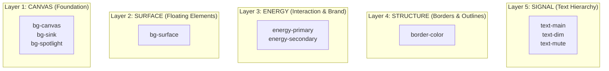
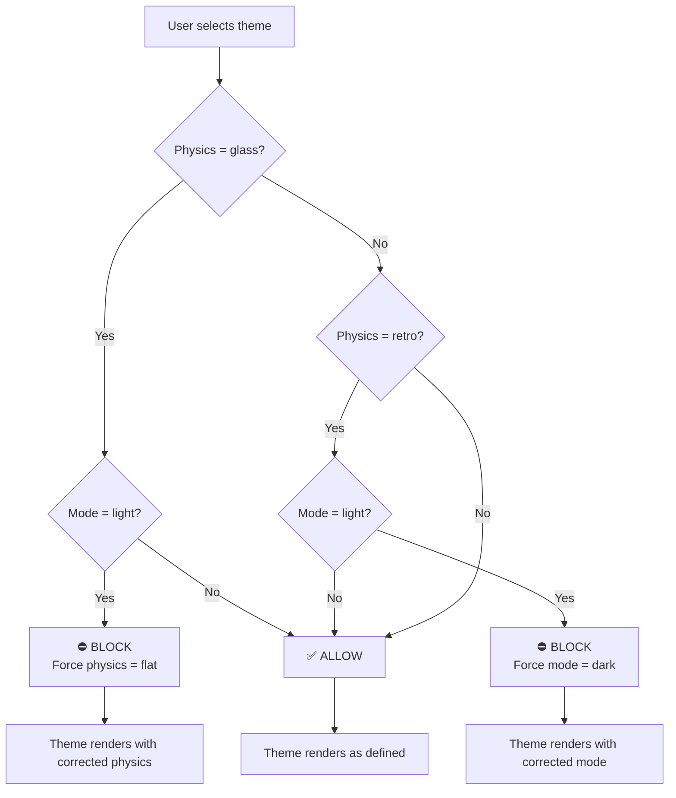

# 🎨 Void Energy UI — Theme Creation Guide

> **Step-by-step guide** for creating custom themes in the Void Energy UI design system.

---

## Table of Contents

1. [Quick Start (3-Step Process)](#1-quick-start-3-step-process)
2. [Understanding The Palette Contract](#2-understanding-the-palette-contract)
3. [Physics Constraints & The Law of Immutability](#3-physics-constraints--the-law-of-immutability)
4. [Complete Theme Example](#4-complete-theme-example)
5. [Testing Your Theme](#5-testing-your-theme)
6. [Troubleshooting](#6-troubleshooting)

---

## 1. Quick Start (3-Step Process)

### Step 1: Define Your Theme

Navigate to [src/config/design-tokens.ts](src/config/design-tokens.ts), and find the `VOID_TOKENS.themes` object (around line 512).

Copy an existing theme block (e.g., `void`) and rename it:

```typescript
export const VOID_TOKENS = {
  // ... other config (density, layers, responsive, etc.)

  themes: {
    void: { ... },      // Existing theme
    onyx: { ... },      // Existing theme
    terminal: { ... },  // Existing theme

    // 👇 Your new theme here
    'my-theme': {
      mode: 'dark',           // 'light' or 'dark'
      physics: 'glass',       // 'glass', 'flat', or 'retro'
      palette: {
        // Semantic colors (auto-generated variants)
        ...SEMANTIC_DARK,  // or SEMANTIC_LIGHT for light mode

        // Fonts (use .family to get the CSS font-family string)
        'font-atmos-heading': FONTS.tech.family,
        'font-atmos-body': FONTS.tech.family,

        // Layer 1: Canvas
        'bg-canvas': '#010020',
        'bg-spotlight': '#0a0c2b',
        'bg-surface': 'rgba(22, 30, 95, 0.4)',
        'bg-sink': 'rgba(0, 2, 41, 0.6)',

        // Layer 3: Energy
        'energy-primary': '#33e2e6',
        'energy-secondary': '#3875fa',

        // Layer 4: Structure
        'border-color': 'rgba(56, 117, 250, 0.2)',

        // Layer 5: Signal
        'text-main': '#ffffff',
        'text-dim': 'rgba(255, 255, 255, 0.85)',
        'text-mute': 'rgba(255, 255, 255, 0.6)',
      },
    },
  },
};
```

---

### Step 2: Hydrate (Build Tokens)

Run this command in your terminal:

```bash
npm run build:tokens
```

This compiles your theme into:

- **Theme SCSS** → `src/styles/config/_generated-themes.scss`
- **Font @font-face** → `src/styles/config/_fonts.scss` *(auto-generated)*
- **Font preload registry** → `src/config/font-registry.ts` *(auto-generated)*
- **JSON registry** → `src/config/void-registry.json`

> **Note:** The font files are auto-generated from the `FONTS` definition in `design-tokens.ts`. Never edit `_fonts.scss` or `font-registry.ts` directly.

---

### Step 3: Use Your Theme

Your theme is now available in the UI. Set it via the `data-atmosphere` attribute on the `<html>` element:

```html
<html data-atmosphere="my-theme" data-physics="glass" data-mode="dark"></html>
```

Or programmatically via the Void Engine adapter:

```typescript
import { voidEngine } from '@adapters/void-engine.svelte';

voidEngine.setAtmosphere('my-theme');
```

---

## 2. Understanding The Palette Contract

Your theme palette is organized into **5 semantic layers**, from deepest (Canvas) to highest (Signal).



---

### Layer 1: CANVAS (Z-Index 0 & -1)

The absolute foundation of your theme. Everything renders on top of this.

#### `bg-canvas`

- **Role:** The absolute floor (Page Background)
- **Context:** The deepest layer, like the paper in a painting
- **Example:** `#010020` (Deep blue-black for "void" theme)
- **Rule:** Must be the **darkest** tone in dark mode, **lightest** in light mode

#### `bg-sink`

- **Role:** Recessed areas (Inputs, Wells, Sidebars)
- **Context:** Appears "carved" into the canvas
- **Example:** `rgba(0, 2, 41, 0.6)` (Semi-transparent dark blue)
- **Rule:** Should be darker than `bg-surface` (dark mode) or lighter (light mode)

#### `bg-spotlight`

- **Role:** Ambient light source from the top
- **Context:** Used for gradients and highlights to create depth
- **Example:** `#0a0c2b` (Lighter blue than `bg-canvas`)
- **Rule:** Should be brighter than `bg-canvas` to create a "lit from above" effect

---

### Layer 2: SURFACE (Z-Index 1+)

Floating elements like cards, modals, and headers.

#### `bg-surface`

- **Role:** Floating elements (Cards, Modals, Headers)
- **Context:** Appears to "float" above the canvas
- **Example (Glass):** `rgba(22, 30, 95, 0.4)` (Semi-transparent for blur effect)
- **Example (Flat):** `#fdf6e3` (Opaque solid color)
- **Rule (Glass):** **Must use RGBA with opacity** (0.3-0.6) for blur to work
- **Rule (Flat):** Can be solid color

---

### Layer 3: ENERGY (Interaction & Brand)

Your brand colors and interactive states.

#### `energy-primary`

- **Role:** The Brand Color
- **Context:** Buttons, Links, Focus states, Glows, CTA elements
- **Example:** `#33e2e6` (Cyan for "void"), `#ff00ff` (Magenta for "cyberpunk")
- **Rule:** Must have **sufficient contrast** with `bg-surface` (WCAG AA: 3:1 minimum)

#### `energy-secondary`

- **Role:** Supporting accent
- **Context:** Borders, Scrollbars, Subtle indicators, Secondary buttons
- **Example:** `#3875fa` (Blue for "void")
- **Rule:** Should complement `energy-primary` (analogous or triadic color harmony)

---

### Layer 4: STRUCTURE (Borders & Outlines)

Unified border system for consistency.

#### `border-color`

- **Role:** Unified border color for surfaces and controls
- **Context:** Applied to cards, inputs, buttons, dividers
- **Example (Glass):** `rgba(56, 117, 250, 0.2)` (Semi-transparent energy-secondary)
- **Example (Flat):** `rgba(0, 91, 181, 0.35)` (Solid but muted)
- **Rule:** Should be subtle but visible. Use **20-35% opacity** for glass themes.

---

### Layer 5: SIGNAL (Text Hierarchy)

Three levels of text emphasis for information hierarchy.

#### `text-main`

- **Role:** High Emphasis (Headings, Active Data, Primary Content)
- **Example:** `#ffffff` (Pure white for dark mode), `#000000` (Pure black for light mode)
- **Rule:** Must have **highest contrast** with `bg-surface` (WCAG AA: 4.5:1 for body text)

#### `text-dim`

- **Role:** Medium Emphasis (Body copy, Labels, Descriptions)
- **Example:** `rgba(255, 255, 255, 0.85)` (85% opacity white)
- **Rule:** Should be readable but not as prominent as `text-main`

#### `text-mute`

- **Role:** Low Emphasis (Placeholders, Disabled states, Metadata)
- **Example:** `rgba(255, 255, 255, 0.6)` (60% opacity white)
- **Rule:** Lowest contrast, but still readable (WCAG AA: 3:1 minimum for large text)

---

### Semantic Colors (Auto-Generated Variants)

These colors are shared across all themes and provide consistent data signaling.

#### Base Colors

- `color-premium`: Gold/Orange — Premium features, paid content
- `color-system`: Purple — System notifications, AI features
- `color-success`: Green — Success states, confirmations
- `color-error`: Red — Error states, destructive actions

#### Auto-Generated Variants

The design system automatically generates light/dark/subtle variants using OKLCH color space:

- `color-premium-light`: Brighter version (1.2x lightness)
- `color-premium-dark`: Darker version (0.8x lightness)
- `color-premium-subtle`: Subtle background (15% opacity)

**How to use them:**

```typescript
palette: {
  ...SEMANTIC_DARK,  // For dark mode themes
  // or
  ...SEMANTIC_LIGHT, // For light mode themes
}
```

---

### Font Families

Define typography atmosphere with `font-atmos-heading` and `font-atmos-body`.

#### Available Fonts

The font system uses structured `FontDefinition` objects that contain the CSS family string, file mappings, and preload weights:

```typescript
const FONTS: Record<string, FontDefinition> = {
  tech: {
    family: "'Hanken Grotesk', sans-serif",  // Modern, Tech
    files: { 400: 'HankenGrotesk-Regular.woff2', 700: 'HankenGrotesk-Bold.woff2' },
    preloadWeights: [400, 700],
  },
  clean: {
    family: "'Inter', sans-serif",  // Clean, Professional
    files: { 400: 'Inter-Regular.woff2', 700: 'Inter-Bold.woff2' },
    preloadWeights: [400, 700],
  },
  // ... and more: code, horror, nature, hand, book, arcane, mystic, lab, fun
};
```

| Key      | Family              | Style                    |
|----------|---------------------|--------------------------|
| `tech`   | Hanken Grotesk      | Modern, Tech             |
| `clean`  | Inter               | Clean, Professional      |
| `code`   | Courier Prime       | Retro, Terminal          |
| `horror` | Merriweather        | Gothic, Dramatic         |
| `nature` | Lora                | Organic, Literary        |
| `hand`   | Caveat              | Handwritten, Personal    |
| `book`   | PT Serif Caption    | Classic, Readable        |
| `arcane` | Cinzel              | Elegant, Royal           |
| `mystic` | Exo 2               | Futuristic, Synthwave    |
| `lab`    | Open Sans           | Clinical, Scientific     |
| `fun`    | Comic Neue          | Playful, Kids            |

**Usage:**

```typescript
palette: {
  'font-atmos-heading': FONTS.tech.family,   // Use .family to get CSS string
  'font-atmos-body': FONTS.clean.family,
}
```

---

### Adding Custom Fonts

To add a new font to the system, follow these steps:

#### Step 1: Add Font Files

Place `.woff2` files in `/public/fonts/`. Use the naming convention `FontName-Weight.woff2`:

```
/public/fonts/
  MyNewFont-Regular.woff2
  MyNewFont-Bold.woff2
```

> **Important:** Google Fonts CDN links won't work—the system requires local files. Use [google-webfonts-helper](https://gwfh.mranftl.com/fonts) to download woff2 files from Google Fonts.

#### Step 2: Register Font in design-tokens.ts

Add your font to the `FONTS` object:

```typescript
export const FONTS: Record<string, FontDefinition> = {
  // ... existing fonts ...

  myNewFont: {
    family: "'My New Font', sans-serif",  // CSS font-family value
    files: {
      400: 'MyNewFont-Regular.woff2',      // Weight → filename
      700: 'MyNewFont-Bold.woff2',
    },
    preloadWeights: [400, 700],            // Weights to preload for performance
  },
};
```

#### Step 3: Use in Theme (Optional)

Reference in a theme palette:

```typescript
'myTheme': {
  mode: 'dark',
  physics: 'glass',
  palette: {
    'font-atmos-heading': FONTS.myNewFont.family,
    'font-atmos-body': FONTS.myNewFont.family,
    // ... other palette values
  },
}
```

#### Step 4: Generate Files

Run the token generator:

```bash
npm run build:tokens
```

This regenerates:
- `src/styles/config/_fonts.scss` — @font-face declarations
- `src/config/font-registry.ts` — preload mappings + user font map

Your font is now available for user selection in the theme picker.

---

## 3. Physics Constraints & The Law of Immutability

The Void Engine includes an **active guardrail system** that enforces physics compatibility to prevent broken UI states.



---

### The Guardrail System

| You Define                           | System Enforces          | Reason                                                                                             |
| ------------------------------------ | ------------------------ | -------------------------------------------------------------------------------------------------- |
| `physics: 'glass'` + `mode: 'light'` | Forces `physics: 'flat'` | **Glass glows require darkness to be visible.** Light backgrounds wash out blur effects and glows. |
| `physics: 'retro'` + `mode: 'light'` | Forces `mode: 'dark'`    | **CRT phosphor effects require a black canvas.** Retro terminals are historically dark.            |
| `physics: 'flat'` + `mode: 'light'`  | ✅ Allowed               | Flat physics work beautifully in light mode (e.g., "paper" theme).                                 |
| `physics: 'flat'` + `mode: 'dark'`   | ✅ Allowed               | Flat physics also work in dark mode (e.g., "laboratory" theme in dark variant).                    |

---

### Why These Rules Exist

**CoNexus is a narrative platform.** The visual rendering engine is part of the storytelling. Breaking the physics of a theme breaks the immersion of the story.

Examples:

- A "void" theme with `physics: 'glass'` in light mode would lose its sci-fi glowing aesthetic
- A "terminal" theme with `physics: 'retro'` in light mode would lose its CRT monitor authenticity

**The guardrail system protects your users from broken experiences.**

---

### How the Engine Corrects Violations

When you register a theme with an invalid combination, the Void Engine logs a warning and auto-corrects:

```typescript
// Your theme definition
'my-theme': {
  mode: 'light',      // ❌ Invalid for glass
  physics: 'glass',
  palette: { ... }
}

// Console output
⚠️ VOID ENGINE GUARDRAIL: Theme "my-theme" requested physics: glass + mode: light.
Glass glows require darkness. Forcing physics: flat.

// Result: Theme renders with physics: 'flat'
```

See [void-engine.svelte.ts](src/adapters/void-engine.svelte.ts) for implementation details.

---

## 4. Complete Theme Example

Here's a fully annotated theme to use as a template.

### Example: "Cyberpunk" Theme

```typescript
'cyberpunk': {
  mode: 'dark',              // Required for glass physics
  physics: 'glass',          // Enables blur, shadows, glows

  palette: {
    // 1. SEMANTIC COLORS (Auto-generated variants)
    ...SEMANTIC_DARK,

    // 2. FONTS (use .family to get CSS string)
    'font-atmos-heading': FONTS.mystic.family,  // Exo 2 (Futuristic)
    'font-atmos-body': FONTS.clean.family,      // Inter (Readable)

    // 3. LAYER 1: CANVAS (Foundation)
    'bg-canvas': '#0a0014',              // Deep purple-black
    'bg-spotlight': '#1a0028',           // Lighter purple for gradients (↑ from canvas)
    'bg-surface': 'rgba(30, 0, 50, 0.4)', // 40% opacity for glass blur effect
    'bg-sink': 'rgba(5, 0, 10, 0.8)',    // Very dark, recessed areas

    // 4. LAYER 3: ENERGY (Brand & Interaction)
    'energy-primary': '#ff00ff',         // Neon magenta (high contrast with bg-surface)
    'energy-secondary': '#00ffff',       // Neon cyan (complements magenta)

    // 5. LAYER 4: STRUCTURE (Borders)
    'border-color': 'rgba(255, 0, 255, 0.2)',  // 20% opacity magenta

    // 6. LAYER 5: SIGNAL (Text Hierarchy)
    'text-main': '#ffffff',                     // Pure white (highest contrast)
    'text-dim': 'rgba(255, 255, 255, 0.85)',   // 85% white (readable)
    'text-mute': 'rgba(255, 255, 255, 0.6)',   // 60% white (subtle)
  },
},
```

---

### Why These Values Were Chosen

| Key                | Value               | Reasoning                                             |
| ------------------ | ------------------- | ----------------------------------------------------- |
| `mode: 'dark'`     | Required            | Glass physics need darkness for glows to be visible   |
| `physics: 'glass'` | Chosen              | Cyberpunk aesthetic benefits from blur and neon glows |
| `bg-canvas`        | `#0a0014`           | Deep purple-black creates a "night city" feel         |
| `bg-spotlight`     | `#1a0028`           | Lighter than canvas to create depth perception        |
| `bg-surface`       | `rgba(30,0,50,0.4)` | 40% opacity allows backdrop blur to work              |
| `energy-primary`   | `#ff00ff`           | Neon magenta is iconic cyberpunk color                |
| `energy-secondary` | `#00ffff`           | Cyan complements magenta (analogous color scheme)     |
| `border-color`     | 20% opacity         | Subtle but visible, doesn't overpower glows           |
| `text-main`        | `#ffffff`           | Pure white ensures readability on dark surfaces       |

---

## 5. Testing Your Theme

### Visual Checklist

Before considering your theme complete, verify these criteria:

- [ ] **Text is readable on all surfaces**
  - Check contrast ratios (see Accessibility section below)
  - Test `text-main`, `text-dim`, and `text-mute` on `bg-surface`

- [ ] **Energy colors are visible and not overwhelming**
  - `energy-primary` should pop but not cause eye strain
  - Glows (for glass physics) should be subtle and atmospheric

- [ ] **Interactive elements have clear hover/focus states**
  - Buttons should lift/scale on hover
  - Inputs should show focus ring with `energy-primary`

- [ ] **Modals and overlays have sufficient contrast**
  - Dialog backgrounds should be distinct from canvas
  - Overlay masks should dim content appropriately

- [ ] **Works across all density settings**
  - Test with High (0.75x), Standard (1x), and Low (1.25x) density
  - Spacing should scale proportionally

---

### Accessibility

Use browser DevTools to check contrast ratios:

#### WCAG AA Standards

| Element                          | Minimum Contrast Ratio |
| -------------------------------- | ---------------------- |
| Body text (14-18px)              | **4.5:1**              |
| Large text (18px+ or 14px+ bold) | **3:1**                |
| UI components (buttons, inputs)  | **3:1**                |

#### How to Test

1. Open your theme in the browser
2. Right-click on text → Inspect
3. In DevTools Styles panel, find the color value
4. Click the color swatch → Contrast ratio appears
5. Ensure it meets WCAG AA standards

#### Motion Safety

Test with motion preferences:

```scss
@media (prefers-reduced-motion: reduce) {
  // Your theme should respect this
}
```

The Void Engine automatically disables animations when motion safety is enabled.

#### High Contrast Mode

Test in Windows High Contrast Mode or macOS Increase Contrast:

```scss
@media (prefers-contrast: high) {
  // Borders should become more prominent
}
```

See [\_reset.scss](src/styles/base/_reset.scss) for implementation.

---

### Browser Testing

Run the development server:

```bash
npm run dev
```

Navigate to the Theme Selector (if available in your demo) and switch to your new theme.

#### Test Matrix

| Browser | Version | Test                     |
| ------- | ------- | ------------------------ |
| Chrome  | Latest  | Blur effects, animations |
| Firefox | Latest  | OKLCH color rendering    |
| Safari  | Latest  | Backdrop filters         |
| Edge    | Latest  | General compatibility    |

---

## 6. Troubleshooting

### Theme doesn't appear in selector

**Possible causes:**

1. You didn't run `npm run build:tokens` after defining the theme
2. Theme name has a typo (must match key in `design-tokens.ts`)
3. Browser cache is stale

**Solutions:**

```bash
# Rebuild tokens
npm run build:tokens

# Clear cache and restart dev server
rm -rf .astro
npm run dev
```

---

### Colors look wrong

**Possible causes:**

1. `mode` doesn't match your color lightness values
2. RGBA opacity values are too high/low for glass surfaces
3. `bg-canvas` is brighter than `bg-surface` (for dark mode)

**Solutions:**

```typescript
// ❌ BAD: Light colors with dark mode
'bg-canvas': '#ffffff',  // Too bright for dark mode
'text-main': '#000000',  // Will be invisible

// ✅ GOOD: Dark colors with dark mode
'bg-canvas': '#010020',  // Dark blue-black
'text-main': '#ffffff',  // High contrast
```

```typescript
// ❌ BAD: Opaque surface with glass physics
'bg-surface': '#1e1e5f',  // Solid color

// ✅ GOOD: Transparent surface with glass physics
'bg-surface': 'rgba(30, 30, 95, 0.4)',  // 40% opacity
```

---

### Physics feels wrong

**Possible causes:**

1. Physics constraints violated (glass + light, retro + light)
2. Blur not working (browser doesn't support `backdrop-filter`)
3. Animations not playing (motion safety enabled)

**Solutions:**

Check console for guardrail warnings:

```
⚠️ VOID ENGINE GUARDRAIL: Theme "my-theme" requested physics: glass + mode: light.
```

Ensure `mode` and `physics` are compatible (see [Physics Constraints](#3-physics-constraints--the-law-of-immutability)).

Check browser support for backdrop filters:

```scss
@supports (backdrop-filter: blur(1px)) {
  // Blur will work
}
```

---

### Borders are invisible

**Possible causes:**

1. `border-color` opacity too low (< 15%)
2. `border-color` too similar to `bg-surface`

**Solutions:**

```typescript
// ❌ BAD: Too subtle
'border-color': 'rgba(56, 117, 250, 0.05)',  // Only 5% opacity

// ✅ GOOD: Visible but not overpowering
'border-color': 'rgba(56, 117, 250, 0.2)',   // 20% opacity
```

---

### Text is unreadable

**Possible causes:**

1. Insufficient contrast ratio (< 4.5:1 for body text)
2. `text-dim` or `text-mute` too faint

**Solutions:**

Use a contrast checker tool:

- [WebAIM Contrast Checker](https://webaim.org/resources/contrastchecker/)
- Browser DevTools (see [Accessibility](#accessibility) section)

Increase opacity or adjust base color:

```typescript
// ❌ BAD: Too faint
'text-dim': 'rgba(255, 255, 255, 0.4)',  // Only 40% opacity

// ✅ GOOD: Readable
'text-dim': 'rgba(255, 255, 255, 0.85)',  // 85% opacity
```

---

## 📚 Related Documentation

- **[CHEAT-SHEET.md](./CHEAT-SHEET.md)** — Quick reference for components and mixins
- **[CONTRIBUTING.md](./CONTRIBUTING.md)** — Contribution guidelines
- **[README.md](./README.md)** — Project overview and architecture

---

## 🛠️ Source Files

- **Design Tokens:** [src/config/design-tokens.ts](src/config/design-tokens.ts)
- **Void Engine (Guardrails):** [src/adapters/void-engine.svelte.ts](src/adapters/void-engine.svelte.ts)
- **Generated Themes (SCSS):** [src/styles/config/\_generated-themes.scss](src/styles/config/_generated-themes.scss)
- **Generated Fonts (SCSS):** [src/styles/config/\_fonts.scss](src/styles/config/_fonts.scss) *(auto-generated)*
- **Font Registry (TS):** [src/config/font-registry.ts](src/config/font-registry.ts) *(auto-generated)*
- **Theme Registry (JSON):** [src/config/void-registry.json](src/config/void-registry.json)

---

## 🎨 Inspiration Gallery

Here are the 12 built-in themes you can use as templates:

| Theme        | Mode  | Physics | Mood                |
| ------------ | ----- | ------- | ------------------- |
| `void`       | dark  | glass   | Tech / Sci-Fi       |
| `onyx`       | dark  | glass   | Stealth / Cinema    |
| `terminal`   | dark  | retro   | Retro / Hacker      |
| `crimson`    | dark  | glass   | Horror / Aggressive |
| `overgrowth` | dark  | glass   | Nature / Organic    |
| `velvet`     | dark  | glass   | Romance / Soft      |
| `solar`      | dark  | glass   | Royal / Gold        |
| `nebula`     | dark  | glass   | Synthwave / Mystery |
| `paper`      | light | flat    | Light / Print       |
| `laboratory` | light | flat    | Clinical / Science  |
| `playground` | light | flat    | Fun / Kids          |
| `focus`      | light | flat    | Distraction Free    |

Explore their definitions in [design-tokens.ts](src/config/design-tokens.ts) (search for `themes:`) for inspiration.

---

**Happy theme crafting! 🎨**
