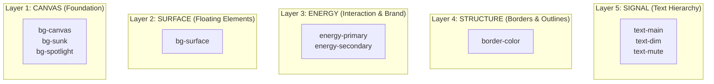
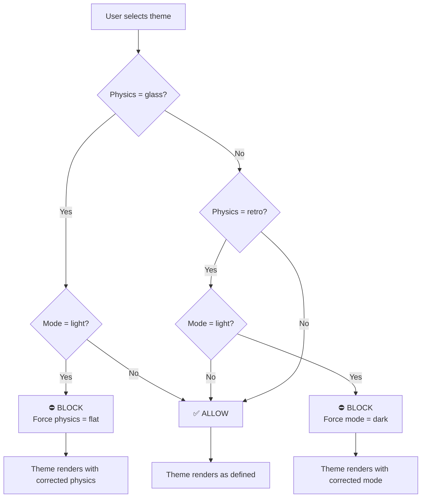

# 🎨 Void Energy UI — Theme Creation Guide

> **Step-by-step guide** for creating custom themes in the Void Energy UI design system.

---

## Table of Contents

1. [Quick Start (3-Step Process)](#1-quick-start-3-step-process)
2. [Understanding The Palette Contract](#2-understanding-the-palette-contract)
3. [Physics Constraints & The Law of Immutability](#3-physics-constraints--the-law-of-immutability)
4. [Complete Theme Example](#4-complete-theme-example)
5. [Testing Your Theme](#5-testing-your-theme)
6. [Troubleshooting](#6-troubleshooting)

---

## 1. Quick Start (3-Step Process)

### Step 1: Define Your Theme

Navigate to [src/config/design-tokens.ts](src/config/design-tokens.ts), and find the `VOID_TOKENS.themes` object (search for `themes:`).

Copy an existing theme block (e.g., `void`) and rename it:

```typescript
export const VOID_TOKENS = {
  // ... other config (density, layers, responsive, etc.)

  themes: {
    void: { ... },      // Existing theme
    onyx: { ... },      // Existing theme
    terminal: { ... },  // Existing theme

    // 👇 Your new theme here
    'my-theme': {
      mode: 'dark',           // 'light' or 'dark'
      physics: 'glass',       // 'glass', 'flat', or 'retro'
      tagline: 'My Theme / Custom',  // Short description for UI display
      palette: {
        // Semantic colors (auto-generated variants)
        ...SEMANTIC_DARK,  // or SEMANTIC_LIGHT for light mode

        // Fonts (use .family to get the CSS font-family string)
        'font-atmos-heading': FONTS.tech.family,
        'font-atmos-body': FONTS.tech.family,

        // Layer 1: Canvas
        'bg-canvas': '#010020',
        'bg-spotlight': '#0a0c2b',
        'bg-surface': 'rgba(22, 30, 95, 0.4)',
        'bg-sunk': 'rgba(0, 2, 41, 0.6)',

        // Layer 3: Energy
        'energy-primary': '#33e2e6',
        'energy-secondary': '#3875fa',

        // Layer 4: Structure
        'border-color': 'rgba(56, 117, 250, 0.2)',

        // Layer 5: Signal
        'text-main': '#ffffff',
        'text-dim': 'rgba(255, 255, 255, 0.85)',
        'text-mute': 'rgba(255, 255, 255, 0.6)',
      },
    },
  },
};
```

---

### Step 2: Hydrate (Build Tokens)

Run this command in your terminal:

```bash
npm run build:tokens
```

This compiles your theme into:

- **Theme SCSS** → `src/styles/config/_generated-themes.scss`
- **Font @font-face** → `src/styles/config/_fonts.scss` *(auto-generated)*
- **Font preload registry** → `src/config/font-registry.ts` *(auto-generated)*
- **JSON registry** → `src/config/void-registry.json`

> **Note:** The font files are auto-generated from the `FONTS` definition in `design-tokens.ts`. Never edit `_fonts.scss` or `font-registry.ts` directly.

---

### Step 3: Use Your Theme

Your theme is now available in the UI. Set it via the `data-atmosphere` attribute on the `<html>` element:

```html
<html data-atmosphere="my-theme" data-physics="glass" data-mode="dark"></html>
```

Or programmatically via the Void Engine adapter:

```typescript
import { voidEngine } from '@adapters/void-engine.svelte';

voidEngine.setAtmosphere('my-theme');
```

---

### Step 4 (Optional): Runtime-Registered Themes

For themes loaded at runtime without a build step (e.g., from an API or remote JSON), use VoidEngine directly:

```typescript
import { voidEngine } from '@adapters/void-engine.svelte';

// Register from an object (e.g., fetched from an API):
voidEngine.registerTheme('my-theme', {
  mode: 'dark',
  physics: 'glass',
  palette: { /* same Palette Contract as build-time themes */ }
});

// Or fetch and register from a remote URL:
await voidEngine.loadExternalTheme('https://example.com/my-theme.json');

// List only user-registered custom themes (excludes built-in and ephemeral):
const customThemes = voidEngine.customAtmospheres; // string[]

// Remove a custom theme (clears cache, falls back to default if active):
voidEngine.unregisterTheme('my-theme');
```

Runtime themes follow the same Palette Contract and physics constraints described below. The guardrail system auto-corrects invalid physics+mode combinations just like build-time themes. Custom themes appear in the Themes modal under a "Custom Atmospheres" section with a remove button.

---

## 2. Understanding The Palette Contract

Your theme palette is organized into **5 semantic layers**, from deepest (Canvas) to highest (Signal).


```mermaid
graph TB
    subgraph "Layer 5: SIGNAL (Text Hierarchy)"
        T["text-main<br/>text-dim<br/>text-mute"]
    end
    subgraph "Layer 4: STRUCTURE (Borders & Outlines)"
        B["border-color"]
    end
    subgraph "Layer 3: ENERGY (Interaction & Brand)"
        E["energy-primary<br/>energy-secondary"]
    end
    subgraph "Layer 2: SURFACE (Floating Elements)"
        S["bg-surface"]
    end
    subgraph "Layer 1: CANVAS (Foundation)"
        C["bg-canvas<br/>bg-sunk<br/>bg-spotlight"]
    end
```

---

### Layer 1: CANVAS (Z-Index 0 & -1)

The absolute foundation of your theme. Everything renders on top of this.

#### `bg-canvas`

- **Role:** The absolute floor (Page Background)
- **Context:** The deepest layer, like the paper in a painting
- **Example:** `#010020` (Deep blue-black for "void" theme)
- **Rule:** Must be the **darkest** tone in dark mode, **lightest** in light mode

#### `bg-sunk`

- **Role:** Recessed areas (Inputs, Wells, Sidebars)
- **Context:** Appears "carved" into the canvas
- **Example:** `rgba(0, 2, 41, 0.6)` (Semi-transparent dark blue)
- **Rule:** Should be darker than `bg-surface` (dark mode) or lighter (light mode)

#### `bg-spotlight`

- **Role:** Ambient light source from the top
- **Context:** Used for gradients and highlights to create depth
- **Example:** `#0a0c2b` (Lighter blue than `bg-canvas`)
- **Rule:** Should be brighter than `bg-canvas` to create a "lit from above" effect

---

### Layer 2: SURFACE (Z-Index 1+)

Floating elements like cards, modals, and headers.

#### `bg-surface`

- **Role:** Floating elements (Cards, Modals, Headers)
- **Context:** Appears to "float" above the canvas
- **Example (Glass):** `rgba(22, 30, 95, 0.4)` (Semi-transparent for blur effect)
- **Example (Flat):** `#fdf6e3` (Opaque solid color)
- **Rule (Glass):** **Must use RGBA with opacity** (0.3-0.6) for blur to work
- **Rule (Flat + Light):** Solid opaque hex color (e.g., `#ffffff`, `#fdf6e3`)
- **Rule (Flat + Dark):** Solid opaque hex color (e.g., `#1e1e1e`). **Never semi-transparent** — without blur compositing, rgba values on a dark canvas render ambiguously across browsers

---

### Layer 3: ENERGY (Interaction & Brand)

Your brand colors and interactive states.

#### `energy-primary`

- **Role:** The Brand Color
- **Context:** Buttons, Links, Focus states, Glows, CTA elements
- **Example:** `#33e2e6` (Cyan for "void"), `#ff00ff` (Magenta for "cyberpunk")
- **Rule:** Must have **sufficient contrast** with `bg-surface` (WCAG AA: 3:1 minimum)

#### `energy-secondary`

- **Role:** Supporting accent
- **Context:** Borders, Scrollbars, Subtle indicators, Secondary buttons
- **Example:** `#3875fa` (Blue for "void")
- **Rule:** Should complement `energy-primary` (analogous or triadic color harmony)

---

### Token Collision Rules

These rules prevent functional breakage in charts, secondary buttons, and semantic badges. They are easy to miss because each token looks correct in isolation.

#### Rule 1 — `energy-secondary` must not match text tokens

`energy-secondary` must not equal or be visually indistinguishable from `text-main`, `text-dim`, or `text-mute`. Charts render `energy-secondary` as a data series color — a collision makes chart series 2 look like ambient body text. Secondary buttons and badges are also affected.

```typescript
// ❌ BAD — collision: both #64748b
'energy-secondary': '#64748b',
'text-mute':        '#64748b',

// ✅ GOOD — distinct roles, distinct values
'energy-secondary': '#3d7ab5',  // Identifiable blue accent
'text-mute':        '#64748b',  // Neutral muted text
```

This collision is easy to introduce when darkening `text-mute` for accessibility — always check both after changing either.

#### Rule 2 — `energy-primary` / `energy-secondary` must not match `color-premium`

`SEMANTIC_DARK` sets `color-premium: '#ff8c00'` (gold/orange). If your energy tokens are in the **gold, amber, or orange family**, add a per-theme `color-premium` override. Without it, premium badges and primary buttons render in the same color.

```typescript
// Terminal — amber energy, cyan premium override
'energy-primary': '#f5c518',
'color-premium':  '#33e2e6',

// Solar — gold energy, sapphire premium override
'energy-primary': '#ffaa00',
'color-premium':  '#0284c7',
```

The override must avoid purple (`color-system`), red (`color-error`), and green (`color-success`).

#### Rule 3 — `energy-primary` / `energy-secondary` must not match `color-system`

`SEMANTIC_DARK` sets `color-system: '#a078ff'` (purple). If your energy tokens are in the **purple/violet family**, add a per-theme `color-system` override. Without it, system notifications and AI feature indicators are indistinguishable from primary interactive elements.

```typescript
// Nebula — purple secondary, sky blue system override
'energy-secondary': '#8b5cf6',
'color-system':     '#38bdf8',
```

The override must avoid gold/orange (`color-premium`), red (`color-error`), and green (`color-success`).

#### Why `color-success` and `color-error` are never overridden

Overgrowth's green energy overlaps with `color-success`, and Crimson's red energy overlaps with `color-error`. These are accepted tradeoffs — green must mean success and red must mean error. Unlike premium/system (arbitrary semantic assignments), these carry universal meaning that no alternative color can replace. The overlap is tolerable because success/error states appear momentarily with explicit text labels (toasts, validation), not persistently alongside energy colors in the same UI region.

---

### Layer 4: STRUCTURE (Borders & Outlines)

Unified border system for consistency.

#### `border-color`

- **Role:** Unified border color for surfaces and controls
- **Context:** Applied to cards, inputs, buttons, dividers
- **Example (Glass):** `rgba(56, 117, 250, 0.2)` (Semi-transparent energy-secondary)
- **Example (Flat):** `rgba(0, 91, 181, 0.35)` (Solid but muted)
- **Rule:** Should be subtle but visible. Use **20-35% opacity** for glass themes.

---

### Layer 5: SIGNAL (Text Hierarchy)

Three levels of text emphasis for information hierarchy.

#### `text-main`

- **Role:** High Emphasis (Headings, Active Data, Primary Content)
- **Example:** `#ffffff` (Pure white for dark mode), `#000000` (Pure black for light mode)
- **Rule:** Must have **highest contrast** with `bg-surface` (WCAG AA: 4.5:1 for body text)

#### `text-dim`

- **Role:** Medium Emphasis (Body copy, Labels, Descriptions)
- **Example:** `rgba(255, 255, 255, 0.85)` (85% opacity white)
- **Rule:** Should be readable but not as prominent as `text-main`

#### `text-mute`

- **Role:** Low Emphasis (Placeholders, Disabled states, Metadata)
- **Example:** `rgba(255, 255, 255, 0.6)` (60% opacity white)
- **Rule:** Lowest contrast, but still readable (WCAG AA: 3:1 minimum for large text)

---

### Semantic Colors (Auto-Generated Variants)

These colors are shared across all themes and provide consistent data signaling.

#### Base Colors

- `color-premium`: Gold/Orange — Premium features, paid content
- `color-system`: Purple — System notifications, AI features
- `color-success`: Green — Success states, confirmations
- `color-error`: Red — Error states, destructive actions

#### Auto-Generated Variants

The design system automatically generates light/dark/subtle variants using OKLCH color space:

- `color-premium-light`: Brighter version (1.2x lightness)
- `color-premium-dark`: Darker version (0.8x lightness)
- `color-premium-subtle`: Subtle background (15% opacity)

**How to use them:**

```typescript
palette: {
  ...SEMANTIC_DARK,  // For dark mode themes
  // or
  ...SEMANTIC_LIGHT, // For light mode themes
}
```

#### Usage Guide

| Color | When to Use |
|-------|-------------|
| **Success** (green) | Confirmation dialogs, form validation passed, upload complete, save success, positive status indicators |
| **Error** (red) | Destructive action prompts, form validation failed, operation errors, connection timeouts, alert badges |
| **Premium** (orange) | Credit cost indicators, upgrade prompts, paid feature badges, caution warnings, exclusive content markers |
| **System** (purple) | System notifications, AI-generated content markers, informational alerts, settings categories, metadata |

**Component mapping:** Buttons (`btn-success`, `btn-error`, `btn-premium`, `btn-system`), Chips (`chip`, `chip-system`, `chip-premium`), Toasts (all 4 types), Pull-to-refresh states, Input validation.

---

### Font Families

Define typography atmosphere with `font-atmos-heading` and `font-atmos-body`.

#### Available Fonts

The font system uses structured `FontDefinition` objects that contain the CSS family string, file mappings, and preload weights:

```typescript
const FONTS: Record<string, FontDefinition> = {
  tech: {
    family: "'Hanken Grotesk', sans-serif",  // Modern, Tech
    files: { 400: 'HankenGrotesk-Regular.woff2', 700: 'HankenGrotesk-Bold.woff2' },
    preloadWeights: [400, 700],
  },
  clean: {
    family: "'Inter', sans-serif",  // Clean, Professional
    files: { 400: 'Inter-Regular.woff2', 700: 'Inter-Bold.woff2' },
    preloadWeights: [400, 700],
  },
  // ... and more: code, horror, nature, hand, book, arcane, mystic, lab, fun
};
```

| Key      | Family              | Style                    |
|----------|---------------------|--------------------------|
| `tech`   | Hanken Grotesk      | Modern, Tech             |
| `clean`  | Inter               | Clean, Professional      |
| `code`   | Courier Prime       | Retro, Terminal          |
| `horror` | Merriweather        | Gothic, Dramatic         |
| `nature` | Lora                | Organic, Literary        |
| `hand`   | Caveat              | Handwritten, Personal    |
| `book`   | PT Serif Caption    | Classic, Readable        |
| `arcane` | Cinzel              | Elegant, Royal           |
| `mystic` | Exo 2               | Futuristic, Synthwave    |
| `lab`    | Open Sans           | Clinical, Scientific     |
| `fun`    | Comic Neue          | Playful, Kids            |

**Usage:**

```typescript
palette: {
  'font-atmos-heading': FONTS.tech.family,   // Use .family to get CSS string
  'font-atmos-body': FONTS.clean.family,
}
```

---

### Adding Custom Fonts

To add a new font to the system, follow these steps:

#### Step 1: Add Font Files

Place `.woff2` files in `/public/fonts/`. Use the naming convention `FontName-Weight.woff2`:

```
/public/fonts/
  MyNewFont-Regular.woff2
  MyNewFont-Bold.woff2
```

> **Important:** Google Fonts CDN links won't work—the system requires local files. Use [google-webfonts-helper](https://gwfh.mranftl.com/fonts) to download woff2 files from Google Fonts.

#### Step 2: Register Font in design-tokens.ts

Add your font to the `FONTS` object:

```typescript
export const FONTS: Record<string, FontDefinition> = {
  // ... existing fonts ...

  myNewFont: {
    family: "'My New Font', sans-serif",  // CSS font-family value
    files: {
      400: 'MyNewFont-Regular.woff2',      // Weight → filename
      700: 'MyNewFont-Bold.woff2',
    },
    preloadWeights: [400, 700],            // Weights to preload for performance
  },
};
```

#### Step 3: Use in Theme (Optional)

Reference in a theme palette:

```typescript
'myTheme': {
  mode: 'dark',
  physics: 'glass',
  palette: {
    'font-atmos-heading': FONTS.myNewFont.family,
    'font-atmos-body': FONTS.myNewFont.family,
    // ... other palette values
  },
}
```

#### Step 4: Generate Files

Run the token generator:

```bash
npm run build:tokens
```

This regenerates:
- `src/styles/config/_fonts.scss` — @font-face declarations
- `src/config/font-registry.ts` — preload mappings + user font map

Your font is now available for user selection in the theme picker.

---

## 3. Physics Constraints & The Law of Immutability

The Void Engine includes an **active guardrail system** that enforces physics compatibility to prevent broken UI states.


```mermaid
flowchart TD
    A[User selects theme] --> B{Physics = glass?}
    B -->|Yes| C{Mode = light?}
    C -->|Yes| D["⛔️ BLOCK<br/>Force physics = flat"]
    C -->|No| E["✅ ALLOW"]
    B -->|No| F{Physics = retro?}
    F -->|Yes| G{Mode = light?}
    G -->|Yes| H["⛔️ BLOCK<br/>Force mode = dark"]
    G -->|No| E
    F -->|No| E
    D --> I[Theme renders with corrected physics]
    H --> J[Theme renders with corrected mode]
    E --> K[Theme renders as defined]
```

---

### The Guardrail System

| You Define                           | System Enforces          | Reason                                                                                             |
| ------------------------------------ | ------------------------ | -------------------------------------------------------------------------------------------------- |
| `physics: 'glass'` + `mode: 'light'` | Forces `physics: 'flat'` | **Glass glows require darkness to be visible.** Light backgrounds wash out blur effects and glows. |
| `physics: 'retro'` + `mode: 'light'` | Forces `mode: 'dark'`    | **CRT phosphor effects require a black canvas.** Retro terminals are historically dark.            |
| `physics: 'flat'` + `mode: 'light'`  | ✅ Allowed               | Flat physics work beautifully in light mode (e.g., "paper" theme).                                 |
| `physics: 'flat'` + `mode: 'dark'`   | ✅ Allowed               | Flat physics also work in dark mode (e.g., "laboratory" theme in dark variant).                    |

---

### Why These Rules Exist

**CoNexus is a narrative platform.** The visual rendering engine is part of the storytelling. Breaking the physics of a theme breaks the immersion of the story.

Examples:

- A "void" theme with `physics: 'glass'` in light mode would lose its sci-fi glowing aesthetic
- A "terminal" theme with `physics: 'retro'` in light mode would lose its CRT monitor authenticity

**The guardrail system protects your users from broken experiences.**

---

### How the Engine Corrects Violations

When you register a theme with an invalid combination, the Void Engine logs a warning and auto-corrects:

```typescript
// Your theme definition
'my-theme': {
  mode: 'light',      // ❌ Invalid for glass
  physics: 'glass',
  palette: { ... }
}

// Console output
⚠️ VOID ENGINE GUARDRAIL: Theme "my-theme" requested physics: glass + mode: light.
Glass glows require darkness. Forcing physics: flat.

// Result: Theme renders with physics: 'flat'
```

See [void-engine.svelte.ts](src/adapters/void-engine.svelte.ts) for implementation details.

---

## 4. Complete Theme Example

Here's a fully annotated theme to use as a template.

### Example: "Cyberpunk" Theme

```typescript
'cyberpunk': {
  mode: 'dark',              // Required for glass physics
  physics: 'glass',          // Enables blur, shadows, glows
  tagline: 'Neon / Cyberpunk',  // Short description for UI display

  palette: {
    // 1. SEMANTIC COLORS (Auto-generated variants)
    ...SEMANTIC_DARK,

    // 2. FONTS (use .family to get CSS string)
    'font-atmos-heading': FONTS.mystic.family,  // Exo 2 (Futuristic)
    'font-atmos-body': FONTS.clean.family,      // Inter (Readable)

    // 3. LAYER 1: CANVAS (Foundation)
    'bg-canvas': '#0a0014',              // Deep purple-black
    'bg-spotlight': '#1a0028',           // Lighter purple for gradients (↑ from canvas)
    'bg-surface': 'rgba(30, 0, 50, 0.4)', // 40% opacity for glass blur effect
    'bg-sunk': 'rgba(5, 0, 10, 0.8)',    // Very dark, recessed areas

    // 4. LAYER 3: ENERGY (Brand & Interaction)
    'energy-primary': '#ff00ff',         // Neon magenta (high contrast with bg-surface)
    'energy-secondary': '#00ffff',       // Neon cyan (complements magenta)

    // 5. LAYER 4: STRUCTURE (Borders)
    'border-color': 'rgba(255, 0, 255, 0.2)',  // 20% opacity magenta

    // 6. LAYER 5: SIGNAL (Text Hierarchy)
    'text-main': '#ffffff',                     // Pure white (highest contrast)
    'text-dim': 'rgba(255, 255, 255, 0.85)',   // 85% white (readable)
    'text-mute': 'rgba(255, 255, 255, 0.6)',   // 60% white (subtle)
  },
},
```

---

### Why These Values Were Chosen

| Key                | Value               | Reasoning                                             |
| ------------------ | ------------------- | ----------------------------------------------------- |
| `mode: 'dark'`     | Required            | Glass physics need darkness for glows to be visible   |
| `physics: 'glass'` | Chosen              | Cyberpunk aesthetic benefits from blur and neon glows |
| `bg-canvas`        | `#0a0014`           | Deep purple-black creates a "night city" feel         |
| `bg-spotlight`     | `#1a0028`           | Lighter than canvas to create depth perception        |
| `bg-surface`       | `rgba(30,0,50,0.4)` | 40% opacity allows backdrop blur to work              |
| `energy-primary`   | `#ff00ff`           | Neon magenta is iconic cyberpunk color                |
| `energy-secondary` | `#00ffff`           | Cyan complements magenta (analogous color scheme)     |
| `border-color`     | 20% opacity         | Subtle but visible, doesn't overpower glows           |
| `text-main`        | `#ffffff`           | Pure white ensures readability on dark surfaces       |

---

## 5. Testing Your Theme

### Visual Checklist

Before considering your theme complete, verify these criteria:

- [ ] **Text is readable on all surfaces**
  - Check contrast ratios (see Accessibility section below)
  - Test `text-main`, `text-dim`, and `text-mute` on `bg-surface`

- [ ] **Energy colors are visible and not overwhelming**
  - `energy-primary` should pop but not cause eye strain
  - Glows (for glass physics) should be subtle and atmospheric

- [ ] **Interactive elements have clear hover/focus states**
  - Buttons should lift/scale on hover
  - Inputs should show focus ring with `energy-primary`

- [ ] **Modals and overlays have sufficient contrast**
  - Dialog backgrounds should be distinct from canvas
  - Overlay masks should dim content appropriately

- [ ] **Works across all density settings**
  - Test with High (0.75x), Standard (1x), and Low (1.25x) density
  - Spacing should scale proportionally

- [ ] **No raw values introduced**
  - Run `npm run scan` — advisory helper for common raw pixel values in SCSS/Svelte files
  - Your palette values in `design-tokens.ts` are exempt (they compile to CSS custom properties)

---

### Accessibility

Use browser DevTools to check contrast ratios:

#### WCAG AA Standards

| Element                          | Minimum Contrast Ratio |
| -------------------------------- | ---------------------- |
| Body text (14-18px)              | **4.5:1**              |
| Large text (18px+ or 14px+ bold) | **3:1**                |
| UI components (buttons, inputs)  | **3:1**                |

#### How to Test

1. Open your theme in the browser
2. Right-click on text → Inspect
3. In DevTools Styles panel, find the color value
4. Click the color swatch → Contrast ratio appears
5. Ensure it meets WCAG AA standards

#### Motion Safety

Test with motion preferences:

```scss
@media (prefers-reduced-motion: reduce) {
  // Your theme should respect this
}
```

The Void Engine automatically disables animations when motion safety is enabled.

#### High Contrast Mode

Test in Windows High Contrast Mode or macOS Increase Contrast:

```scss
@media (prefers-contrast: high) {
  // Borders should become more prominent
}
```

See [\_reset.scss](src/styles/base/_reset.scss) for implementation.

---

### Browser Testing

Run the development server:

```bash
npm run dev
```

Navigate to the Theme Selector (if available in your demo) and switch to your new theme.

**Quick switching tip:** Use `voidEngine.applyTemporaryTheme('my-theme', 'Testing my-theme')` in the browser console to preview your theme without committing it as the permanent selection. Call `voidEngine.restoreUserTheme()` to exit.

#### Test Matrix

| Browser | Version | Test                     |
| ------- | ------- | ------------------------ |
| Chrome  | Latest  | Blur effects, animations |
| Firefox | Latest  | OKLCH color rendering    |
| Safari  | Latest  | Backdrop filters         |
| Edge    | Latest  | General compatibility    |

---

## 6. Troubleshooting

### Theme doesn't appear in selector

**Possible causes:**

1. You didn't run `npm run build:tokens` after defining the theme
2. Theme name has a typo (must match key in `design-tokens.ts`)
3. Browser cache is stale

**Solutions:**

```bash
# Rebuild tokens
npm run build:tokens

# Clear cache and restart dev server
rm -rf .astro
npm run dev
```

---

### Colors look wrong

**Possible causes:**

1. `mode` doesn't match your color lightness values
2. RGBA opacity values are too high/low for glass surfaces
3. `bg-canvas` is brighter than `bg-surface` (for dark mode)

**Solutions:**

```typescript
// ❌ BAD: Light colors with dark mode
'bg-canvas': '#ffffff',  // Too bright for dark mode
'text-main': '#000000',  // Will be invisible

// ✅ GOOD: Dark colors with dark mode
'bg-canvas': '#010020',  // Dark blue-black
'text-main': '#ffffff',  // High contrast
```

```typescript
// ❌ BAD: Opaque surface with glass physics
'bg-surface': '#1e1e5f',  // Solid color

// ✅ GOOD: Transparent surface with glass physics
'bg-surface': 'rgba(30, 30, 95, 0.4)',  // 40% opacity
```

---

### Physics feels wrong

**Possible causes:**

1. Physics constraints violated (glass + light, retro + light)
2. Blur not working (browser doesn't support `backdrop-filter`)
3. Animations not playing (motion safety enabled)

**Solutions:**

Check console for guardrail warnings:

```
⚠️ VOID ENGINE GUARDRAIL: Theme "my-theme" requested physics: glass + mode: light.
```

Ensure `mode` and `physics` are compatible (see [Physics Constraints](#3-physics-constraints--the-law-of-immutability)).

Check browser support for backdrop filters:

```scss
@supports (backdrop-filter: blur(1px)) {
  // Blur will work
}
```

---

### Borders are invisible

**Possible causes:**

1. `border-color` opacity too low (< 15%)
2. `border-color` too similar to `bg-surface`

**Solutions:**

```typescript
// ❌ BAD: Too subtle
'border-color': 'rgba(56, 117, 250, 0.05)',  // Only 5% opacity

// ✅ GOOD: Visible but not overpowering
'border-color': 'rgba(56, 117, 250, 0.2)',   // 20% opacity
```

---

### Text is unreadable

**Possible causes:**

1. Insufficient contrast ratio (< 4.5:1 for body text)
2. `text-dim` or `text-mute` too faint

**Solutions:**

Use a contrast checker tool:

- [WebAIM Contrast Checker](https://webaim.org/resources/contrastchecker/)
- Browser DevTools (see [Accessibility](#accessibility) section)

Increase opacity or adjust base color:

```typescript
// ❌ BAD: Too faint
'text-dim': 'rgba(255, 255, 255, 0.4)',  // Only 40% opacity

// ✅ GOOD: Readable
'text-dim': 'rgba(255, 255, 255, 0.85)',  // 85% opacity
```

---

## 📚 Related Documentation

- **[CHEAT-SHEET.md](./CHEAT-SHEET.md)** — Quick reference for components and mixins
- **[CONTRIBUTING.md](./CONTRIBUTING.md)** — Contribution guidelines
- **[README.md](./README.md)** — Project overview and architecture

---

## 🛠️ Source Files

- **Design Tokens:** [src/config/design-tokens.ts](src/config/design-tokens.ts)
- **Void Engine (Guardrails):** [src/adapters/void-engine.svelte.ts](src/adapters/void-engine.svelte.ts)
- **Generated Themes (SCSS):** [src/styles/config/\_generated-themes.scss](src/styles/config/_generated-themes.scss)
- **Generated Fonts (SCSS):** [src/styles/config/\_fonts.scss](src/styles/config/_fonts.scss) *(auto-generated)*
- **Font Registry (TS):** [src/config/font-registry.ts](src/config/font-registry.ts) *(auto-generated)*
- **Theme Registry (JSON):** [src/config/void-registry.json](src/config/void-registry.json)

---

## 🎨 Built-in Atmospheres Reference

The 4 built-in themes demonstrate every valid physics/mode combination and cover the full range of design intents. Study them before creating a new theme — the patterns and decisions made here are intentional.

| Theme | Mode | Physics | Concept |
|---|---|---|---|
| `void` | dark | glass | Default / Cyber |
| `onyx` | dark | flat | Stealth / Cinema |
| `terminal` | dark | retro | Hacker / Retro |
| `nebula` | dark | glass | Synthwave / Cosmic |
| `solar` | dark | glass | Royal / Gold |
| `overgrowth` | dark | glass | Nature / Organic |
| `velvet` | dark | glass | Romance / Soft |
| `crimson` | dark | glass | Horror / Intense |
| `paper` | light | flat | Light / Print |
| `focus` | light | flat | Distraction Free |
| `laboratory` | light | flat | Science / Clinical |
| `playground` | light | flat | Playful / Vibrant |

---

### VOID — Default / Cyber
**Physics:** glass · dark

**Concept:** The system baseline — a sci-fi control interface scanning deep space. Every other atmosphere is measured as a departure from this one.

**Palette rationale:** Deep blue-black canvas (`#010020`) pushes the environment into near-void darkness. Cyan primary (`#33e2e6`) and blue secondary (`#3875fa`) are analogous cool colors — close on the color wheel but clearly distinct. In glass physics, analogous pairs create harmonic ambient bloom: the cyan and blue glows breathe together rather than competing. Text uses a pure white hierarchy (`#ffffff → #d9d9de → #9999a6`) with no color tint — keeping the interface clinical and the content front.

**Key decisions:** The cool analogous pairing is the canonical example of glass physics done correctly. If you're building a dark glass theme and unsure whether your primary/secondary work together, check them against this model.

---

### ONYX — Stealth / Cinema
**Physics:** flat · dark *(the only dark-flat built-in)*

**Concept:** Film noir editorial minimalism — a high-end cinema dashboard where the content is the only color. Restraint as a design philosophy.

**Palette rationale:** Pure black canvas, white primary (`#ffffff`), gray secondary (`#a3a3a3`). The deliberate monochrome is a "no personality" statement — the palette says nothing about itself, letting content lead. Glass physics was rejected because white and gray glows on black produce undefined halos that add visual noise rather than atmosphere. Flat physics gives sharp, precise edges matching the "editorial precision" concept. The border at 15% white opacity is the only visual softening in an otherwise hard-edged system.

**Key decisions:** This is the reference implementation for `physics: 'flat'` + `mode: 'dark'`. Note that `bg-surface: '#1e1e1e'` is a solid opaque hex — not rgba — because without blur compositing, semi-transparent dark surfaces render ambiguously. Also: `energy-secondary (#a3a3a3)` shares the value of `text-dim` — a known collision accepted here because the entire theme concept is "everything is gray."

---

### TERMINAL — Hacker / Retro
**Physics:** retro · dark

**Concept:** A 1980s amber phosphor CRT monitor — monochromatic, mechanical, historically faithful.

**Palette rationale:** Near-black canvas with a green-tinted `bg-surface` (`rgba(0,20,0,0.9)`) — the subtle green contamination simulates early green-screen phosphor bleeding behind the amber display. All three text tokens use amber (`#f5c518, #ad8b12, #7d650f`) because a real CRT has one phosphor color with no hue variation, only brightness. `text-main` equals `energy-primary` for the same reason — the text color *is* the energy color. The secondary was differentiated (`#c9a820`) from the primary specifically for chart series separation, while staying amber-family.

**Key decisions:** `color-premium` overridden to cyan (`#33e2e6`) — the only non-amber signal in the entire theme. This is necessary because the base `color-premium` (`#ff8c00`) is amber, which would be invisible in this amber environment. Retro physics means zero animation timing, step-based easing, 0px border-radius, and 2px borders — the complete CRT mechanical aesthetic is enforced by the physics preset, not by the palette.

---

### NEBULA — Synthwave / Cosmic
**Physics:** glass · dark

**Concept:** Looking up at a nebula from a synth-lit observation deck — cosmic, dreamy, drenched in electric color.

**Palette rationale:** Deep purple canvas (`#0a0014`) saturates every surface with cosmic hue. Even the text tokens carry color: `#fdf4ff` (near-white with purple), `#d0bde8` (lavender), `#8e7ea1` (muted violet) — nothing in this theme is truly neutral. Magenta primary (`#d946ef`) and purple secondary (`#8b5cf6`) sit approximately 45° apart on the color wheel — close enough for harmonic glass bloom, different enough for clear visual distinction. The secondary is deliberately darker than the primary, providing clear brightness hierarchy within the narrow hue range.

**Key decisions:** The "contaminated text" approach (tinting neutral text with the theme hue) creates the most atmospherically immersive effect of any dark theme. Use this technique when the concept requires the user to feel *inside* the environment, not just *looking at* it. `color-system` overridden to sky blue (`#38bdf8`). The base `color-system` (`#a078ff`) is purple — nearly indistinguishable from `energy-secondary` (`#8b5cf6`) in this purple-saturated palette. Sky blue provides clear separation from both the magenta primary and purple secondary while remaining cool-toned enough to feel at home in the cosmic palette.

---

### SOLAR — Royal / Gold
**Physics:** glass · dark

**Concept:** A royal archive chamber at midnight — ancient authority, ceremony, and gold as material rather than accent.

**Palette rationale:** Deep warm brown canvas (`#120a00`) — nearly black but with an amber undertone that makes the darkness feel warm rather than cold. Gold primary (`#ffaa00`) and dark gold secondary (`#b8860b`) are both in the gold family, differentiated by ~40% brightness rather than hue. This single-hue-family pairing creates a sense of material consistency — everything in Solar is made of the same stuff, just more or less refined. Cinzel (heading) paired with PT Serif (body) is the only theme using two serif typefaces — reinforcing the "ancient document" concept.

**Key decisions:** `color-premium` overridden to sapphire (`#0284c7`). The base `color-premium` (`#ff8c00`) is gold/orange — indistinguishable from the energy tokens in this theme. The sapphire override follows the Crown Jewels metaphor: gold is the ambient material of the throne room, the sapphire is what marks something as truly exceptional.

---

### OVERGROWTH — Nature / Organic
**Physics:** glass · dark

**Concept:** A bioluminescent forest at night — alive, growing, something ancient and electric beneath the canopy.

**Palette rationale:** Deep forest green canvas (`#051a0a`) with glass surface tint `rgba(0,40,10,0.5)` — the tint creates a pervasive atmospheric green wash. Everything rendered in this theme exists *inside* the forest, not in front of it. Neon green primary (`#39ff14`) is deliberately intense because bioluminescence is the only light source in the dark — it's not subtle, it's life asserting itself. The secondary was changed from acid yellow (`#ffd700`) to wheat gold (`#c8a84b`): the original felt like a neon arcade sign; the replacement feels like afternoon sunlight filtering through a leaf canopy.

**Key decisions:** The glass surface tint interacts visually with `energy-secondary` — the wheat gold picks up a slight green cast when rendered through the surface tint, which reinforces the organic feel. This is an intentional property of the tinting system, not a bug.

---

### VELVET — Romance / Soft
**Physics:** glass · dark

**Concept:** A candlelit rose garden at midnight — delicate, intimate, soft beauty with intensity underneath.

**Palette rationale:** Deep rose canvas (`#1a0510`) sets a warm, enclosed atmosphere. Primary (`#ff80a0`) is deliberately pastel — the "bloom" color, the ambient romance of the theme. Secondary (`#e91e8c`) is vivid magenta — more saturated and slightly darker than the primary. This is an intentional hierarchy inversion: the secondary is more visually intense than the primary. It serves the concept: the soft pink invites you in; the magenta reveals intensity when something demands real attention. Text hierarchy uses rose-tinted neutrals from near-white through soft rose, so even metadata carries warmth.

**Key decisions:** The secondary-more-vivid-than-primary inversion is unusual in the system. In button contexts the button variant styling (filled vs outlined) compensates for the raw color weight difference. The Caveat (handwritten) heading + PT Serif body pairing is the most typographically expressive combination in the set — intentional for a theme about personal intimacy.

---

### CRIMSON — Horror / Intense
**Physics:** glass · dark

**Concept:** A blood moon at its zenith — beauty through dread, intensity as aesthetic.

**Palette rationale:** Deep blood-red canvas (`#180808`) with glass surfaces tinted `rgba(60,0,0,0.6)` — the saturated red tint means the entire interface is bathed in red light. Coral-red primary (`#ff6b6b`) is bright enough for functional visibility. The secondary was changed from near-invisible dark red (`#8a0000`, ~1.1:1 contrast against the composited surface) to oxblood (`#c0392b`, ~3:1 contrast) — the original secondary was functionally invisible on glass surfaces. Merriweather is the only theme with a heavy gothic serif, adding physical weight that matches the thematic weight. Even "white" text (`#ffe5e5`) is blood-warm.

**Key decisions:** The red glass tint is the most aggressive surface tint in the built-in set — it leaves no neutral ground. Any element rendered in this theme is visually participating in the horror aesthetic, whether the designer intends it or not. Plan accordingly when building UI in Crimson.

---

### PAPER — Light / Print
**Physics:** flat · light

**Concept:** A quality broadsheet or well-worn paperback — warm, editorial, the quiet authority of print media.

**Palette rationale:** Three warm cream tones form the canvas family (`#faeed1 → #fff8e1 → #fdf6e3`) — natural variation like different paper stocks in the same publication. Dark blue-gray primary (`#2c3e50`) is "ink on parchment" — the authoritative editorial color. Warm brown secondary (`#8d6e63`) is "aged leather binding" — supporting structure without competing with ink. Border at 70% opacity (`rgba(141,110,99,0.7)`) is the boldest in the collection: intentional, simulating the defined margins of a printed page. PT Serif Caption for both heading and body is the only theme where both typefaces are identical — reinforcing total typographic unity.

**Key decisions:** The warm canvas trio (three distinct but close values) creates subtle depth without shadows or blur. This is flat physics used at its most sophisticated — visual hierarchy achieved entirely through color temperature and opacity.

---

### FOCUS — Distraction Free
**Physics:** flat · light

**Concept:** A blank page with a pen. Nothing should exist except what the user puts there.

**Palette rationale:** Pure white canvas, pure black for all accent tokens (primary, secondary, text-main). The total collapse of all color differentiation into black and white is a deliberate design statement — this theme is not trying to be a good design, it is trying to be *invisible*. Inter is correct: maximum legibility, zero personality. The border-color was softened from solid black to `rgba(0,0,0,0.15)` as the single concession to visual comfort — sharp black borders on white felt more like a spreadsheet than a writing environment.

**Key decisions:** `energy-primary === energy-secondary === #000000`. Chart series are indistinguishable. This is an accepted tradeoff — a distraction-free tool shouldn't need competing visual data layers. If you need chart functionality in a minimal light theme, use Laboratory instead.

---

### LABORATORY — Science / Clinical
**Physics:** flat · light

**Concept:** A clean research environment — precision instruments, sterile surfaces, confident scientific authority.

**Palette rationale:** Cool slate-gray canvas (`#f1f5f9`) establishes a clinical environment slightly cooler than pure white — the difference between a hospital corridor and a blank page. Medical blue primary (`#005bb5`) and medium blue secondary (`#3d7ab5`) form a brightness-differentiated pair within the same hue family: deep blue for primary authority, lighter blue for supporting data. The entire palette is cool/neutral — no warm tones by design. Open Sans was chosen specifically for readability at small sizes: lab interfaces render dense data in tight spaces. `text-mute` was darkened from `#94a3b8` to `#64748b` for accessibility — a clinical environment must have legible fine print.

**Key decisions:** When fixing `text-mute` for accessibility, the darkened value matched the existing `energy-secondary`. This would create a collision — chart series 2 looking like muted body text. `energy-secondary` was shifted to `#3d7ab5` (medium blue) to maintain distinctness. Always check both tokens after changing either.

---

### PLAYGROUND — Playful / Vibrant
**Physics:** flat · light

**Concept:** A children's art studio where every color is welcome and energy is the goal.

**Palette rationale:** Light cyan canvas (`#e0f7fa`) — the only non-white, non-neutral canvas in the light theme set, signaling immediately that this is a different kind of light theme. Hot pink primary (`#ff4081`) and deep cyan secondary (`#0088a8`) are near-complementary — positioned on opposite sides of the color wheel — intentionally creating maximum visual tension and energy. The secondary was deepened from the original cyan (`#00bcd4`) to ensure genuine separation from the border color in chart contexts. The text hierarchy (`#003040 → #1a4a55 → #4a7a85`) corrects an original inversion where `text-mute` was brighter than `text-dim` — all three now properly descend in contrast.

**Key decisions:** Comic Neue is the only font choice that could mean only one thing. The near-complementary energy pair is the most visually aggressive combination in the light theme set — appropriate for the concept, but potentially tiring in long-use interfaces. Consider this a showcase theme rather than a primary productivity environment.

---

Explore the full definitions in [design-tokens.ts](src/config/design-tokens.ts) (search for `themes:`).

---

**Happy theme crafting! 🎨**
